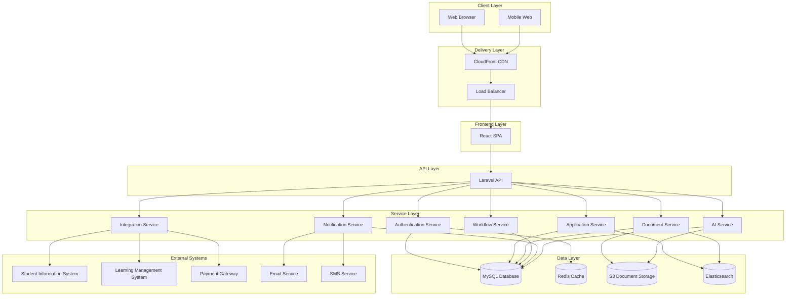

# Student Admissions Enrollment Platform

A comprehensive digital solution designed to streamline and enhance the entire student admissions lifecycle. This centralized hub transforms how educational institutions manage prospective and enrolled students by digitizing and automating critical admissions processes.

## Project Overview

The Student Admissions Enrollment Platform is built using a modern technology stack consisting of Laravel (backend), MySQL (database), React (frontend), and Redis (caching and session management) to ensure scalability, security, and optimal performance.

Primary system capabilities include:
- Comprehensive application management
- Automated admissions workflows with WYSIWYG editor
- Personalized student dashboards
- Integrated communication tools
- AI-driven guidance and support
- Financial aid and payment processing
- Document upload and verification system
- Integration with Student Information Systems (SIS) and Learning Management Systems (LMS)

## System Architecture


The architecture follows a modular approach with clear separation of concerns between frontend and backend components, utilizing RESTful APIs for communication and Redis for performance optimization. For detailed architecture information, see [Architecture Overview](docs/architecture/overview.md).

## Technology Stack
### Backend
- **PHP 8.2+**: Core programming language
- **Laravel 10.x**: PHP framework for robust API development
- **MySQL 8.0+**: Relational database for structured data
- **Redis 7.0+**: Caching, session management, and queues
- **Laravel Sanctum**: API authentication
- **Laravel Horizon**: Queue monitoring and management
- **Laravel Echo**: WebSockets for real-time features

### Frontend
- **React 18.x**: JavaScript library for UI development
- **TypeScript 4.9+**: Type-safe JavaScript
- **Redux Toolkit**: State management
- **React Router 6.x**: Client-side routing
- **Material-UI 5.x**: UI component library
- **React Query**: Data fetching and caching
- **React Flow**: Interactive workflow editor

### Infrastructure
- **Docker**: Containerization
- **AWS/Cloud Services**: Deployment infrastructure
- **S3**: Document storage
- **Elasticsearch**: Search functionality
- **CI/CD Pipeline**: Automated testing and deployment

## Repository Structure
```
/
├── src/
│   ├── backend/         # Laravel backend API
│   └── web/            # React frontend application
├── docs/              # Comprehensive documentation
│   ├── architecture/  # Architecture documentation
│   ├── api/           # API documentation
│   ├── development/   # Development guides
│   └── user-guides/   # End-user documentation
├── infrastructure/    # Infrastructure as code
│   ├── terraform/     # Terraform configurations
│   ├── kubernetes/    # Kubernetes manifests
│   ├── docker/        # Docker configurations
│   ├── scripts/       # Deployment scripts
│   └── monitoring/    # Monitoring configurations
└── scripts/          # Utility scripts
```

## Getting Started
### Prerequisites
- PHP 8.2+
- Composer 2.x
- Node.js 16.x+
- npm 8.x+
- MySQL 8.0+
- Redis 7.0+
- Docker and Docker Compose (optional, for containerized development)

### Local Development Setup

#### Backend Setup
1. Navigate to the backend directory
   ```bash
   cd src/backend
   ```

2. Install dependencies
   ```bash
   composer install
   ```

3. Configure environment
   ```bash
   cp .env.example .env
   php artisan key:generate
   ```

4. Configure database and Redis in `.env`

5. Run migrations and seeders
   ```bash
   php artisan migrate --seed
   ```

6. Start the development server
   ```bash
   php artisan serve
   ```

#### Frontend Setup
1. Navigate to the frontend directory
   ```bash
   cd src/web
   ```

2. Install dependencies
   ```bash
   npm ci
   ```

3. Configure environment
   ```bash
   cp .env.development.example .env.development.local
   ```

4. Start the development server
   ```bash
   npm start
   ```

### Docker Setup

For a containerized development environment:

1. Build and start the containers
   ```bash
   docker-compose up -d
   ```

2. Access the application at http://localhost:3000

For detailed setup instructions, see [Backend README](src/backend/README.md) and [Frontend README](src/web/README.md).

## Documentation
Comprehensive documentation is available in the `docs` directory:

- **Architecture Documentation**: [docs/architecture/](docs/architecture/)
- **API Documentation**: [docs/api/](docs/api/)
- **Development Guides**: [docs/development/](docs/development/)
- **User Guides**: [docs/user-guides/](docs/user-guides/)

Key documentation files:
- [Architecture Overview](docs/architecture/overview.md)
- [Backend Architecture](docs/architecture/backend.md)
- [Frontend Architecture](docs/architecture/frontend.md)
- [Database Schema](docs/architecture/database-schema.md)
- [Integration Points](docs/architecture/integration-points.md)
- [API Overview](docs/api/overview.md)

## Testing
### Backend Testing

```bash
cd src/backend
php artisan test
```

### Frontend Testing

```bash
cd src/web
npm test
```

### End-to-End Testing

```bash
cd src/web
npm run cypress:open
```

## Deployment
Deployment is managed through CI/CD pipelines defined in `.github/workflows/`.

### Production Deployment Checklist

1. Ensure all tests pass
2. Build production assets
3. Configure production environment variables
4. Deploy using the deployment scripts in `scripts/deployment/`

For detailed deployment instructions, see [Deployment Guide](docs/development/deployment.md).

## Contributing
1. Create a feature branch from `main`
2. Make your changes
3. Ensure tests pass
4. Submit a pull request

Please follow the coding standards and include appropriate tests for new features.

## License
This project is proprietary and confidential. Unauthorized copying, distribution, or use is strictly prohibited.