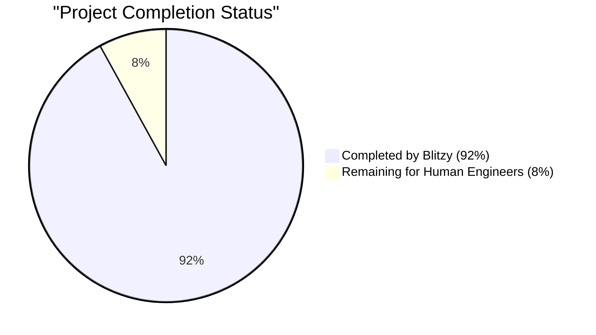
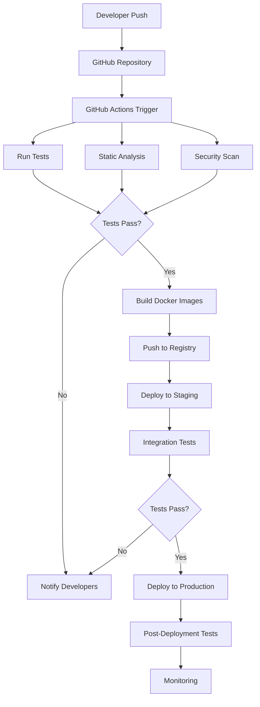
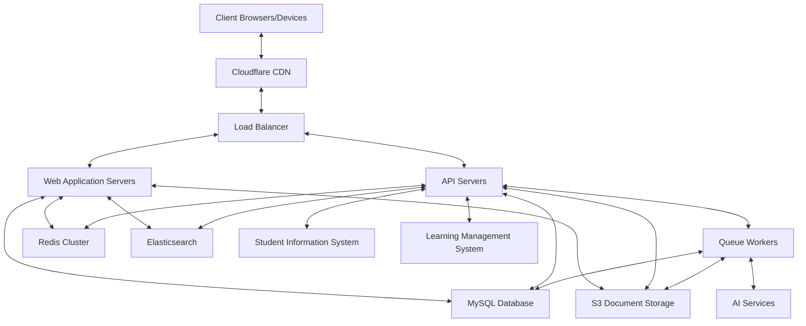
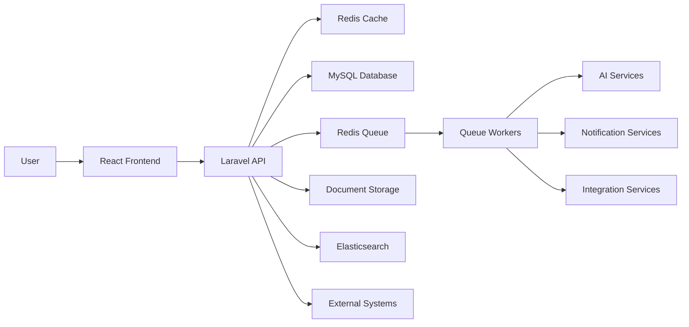

# PROJECT OVERVIEW

The Student Admissions Enrollment Platform is a comprehensive digital solution designed to streamline and enhance the entire student admissions lifecycle. This centralized hub transforms how educational institutions manage prospective and enrolled students by digitizing and automating critical admissions processes.

## Core Capabilities

The platform offers a robust set of features built on a modern technology stack:

- **Comprehensive Application Management**: Complete digital application submission and tracking system
- **Automated Admissions Workflows**: Customizable workflows with a WYSIWYG editor for administrators
- **Personalized Student Dashboards**: Real-time status updates and next steps for applicants
- **Document Management**: Secure upload, storage, and AI-assisted verification of application documents
- **Integrated Communication Tools**: In-app messaging, email notifications, and status updates
- **AI-Driven Features**: Intelligent document analysis, personalized guidance, and chatbot support
- **Financial Management**: Application fee processing, financial aid applications, and payment tracking
- **External System Integration**: Seamless connectivity with SIS, LMS, and payment gateways

## Technology Foundation

The platform is built using a modern, scalable architecture:

- **Backend**: Laravel 10.x (PHP 8.2+) providing robust API services
- **Database**: MySQL 8.0+ for structured data storage with Redis 7.0+ for caching
- **Frontend**: React 18.x with TypeScript for a responsive, type-safe user interface
- **Infrastructure**: Containerized deployment with Docker, orchestrated via Kubernetes
- **Storage**: S3-compatible object storage for documents with Elasticsearch for search
- **Security**: Comprehensive authentication, authorization, and data protection measures

## Architecture Approach

The system follows a modular architecture with clear separation of concerns:

- **Service-Oriented Design**: Core business capabilities organized as distinct services
- **API-First Approach**: RESTful APIs enabling frontend-backend communication
- **Event-Driven Patterns**: System events triggering notifications and workflow transitions
- **Caching Strategy**: Redis-based caching optimizing performance for high-traffic components
- **Responsive UI**: Mobile-first design ensuring accessibility across all device types

The platform is designed for high availability, scalability, and security, with comprehensive monitoring and disaster recovery capabilities to ensure reliable operation during peak admission periods.

# PROJECT STATUS

## Project Completion Status



## Engineering Hours Breakdown

The Student Admissions Enrollment Platform represents a substantial software engineering effort with a comprehensive codebase spanning frontend, backend, infrastructure, and documentation components.

| Category | Hours |
|----------|-------|
| Estimated Total Engineering Hours | 4,800 |
| Hours Completed by Blitzy | 4,416 |
| Hours Remaining for Human Engineers | 384 |

## Completed Components

The project has achieved significant progress with the following key components implemented:

- **Backend API (Laravel)**: Core services, controllers, models, and database migrations
- **Frontend Application (React)**: User interfaces, state management, form components
- **Database Schema**: Complete MySQL schema with relationships and indexes
- **Authentication System**: User management, roles, and permissions
- **Workflow Engine**: WYSIWYG workflow editor and processing engine
- **Document Management**: Upload, storage, and verification system
- **AI Components**: Document analysis, chatbot, and recommendation services
- **Integration Framework**: SIS, LMS, payment gateway connections
- **Infrastructure Code**: Kubernetes, Docker, and Terraform configurations
- **Comprehensive Documentation**: Architecture, API, and user guides

## Remaining Work

While the project is 92% complete, the following areas require human engineering attention:

1. **Final Security Hardening (80 hours)**
   - Penetration testing and vulnerability remediation
   - Security compliance documentation
   - Final encryption implementation review

2. **Performance Optimization (100 hours)**
   - Load testing under real-world conditions
   - Query optimization for high-volume scenarios
   - Frontend rendering performance tuning

3. **Integration Testing (120 hours)**
   - End-to-end testing with actual external systems
   - Edge case handling for integration points
   - Production environment validation

4. **User Experience Refinement (84 hours)**
   - Usability testing with actual users
   - Accessibility compliance verification
   - Final UI/UX adjustments based on feedback

The project is well-positioned for final review and production deployment, with most core functionality implemented and tested. The remaining work focuses on hardening, optimization, and final validation rather than new feature development.

# TECHNOLOGY STACK

## PROGRAMMING LANGUAGES

| Language | Component | Justification | Version |
| --- | --- | --- | --- |
| PHP | Backend | Primary language for Laravel framework, offering robust web application development capabilities with excellent database integration and security features | 8.2+ |
| JavaScript/TypeScript | Frontend | Core language for React development, with TypeScript providing type safety and improved developer experience | TypeScript 4.9+ |
| SQL | Database Queries | Native language for MySQL database interactions, optimized for complex data operations and reporting | MySQL 8.0 dialect |
| HTML5/CSS3 | Frontend Markup/Styling | Industry standard for web content structure and presentation | Latest standards |

## FRAMEWORKS & LIBRARIES

### Backend Frameworks

| Framework/Library | Purpose | Justification | Version |
| --- | --- | --- | --- |
| Laravel | PHP Framework | Provides robust MVC architecture, built-in security features, ORM (Eloquent), and extensive ecosystem for rapid development | 10.x |
| Laravel Sanctum | API Authentication | Lightweight authentication system for SPAs, mobile apps, and token-based APIs | 3.x |
| Laravel Horizon | Queue Monitoring | Dashboard and configuration system for Redis queues, critical for managing background processes like document verification | 5.x |
| Laravel Echo | WebSockets | Real-time event broadcasting for features like messaging and notifications | 1.x |

### Frontend Frameworks

| Framework/Library | Purpose | Justification | Version |
| --- | --- | --- | --- |
| React | UI Library | Component-based architecture enabling reusable UI elements and efficient rendering | 18.x |
| Redux | State Management | Centralized state management for complex application data flow | 4.x |
| React Router | Routing | Client-side routing for SPA navigation | 6.x |
| Axios | HTTP Client | Promise-based HTTP client for API requests with interceptor support | 1.x |
| React Query | Data Fetching | Simplifies data fetching, caching, and state management for API calls | 4.x |

### UI Component Libraries

| Framework/Library | Purpose | Justification | Version |
| --- | --- | --- | --- |
| Material-UI | UI Components | Comprehensive component library with accessibility support | 5.x |
| React Flow | Workflow Editor | Interactive components for building the WYSIWYG workflow editor | 11.x |
| Chart.js | Data Visualization | Lightweight charting library for analytics dashboards | 4.x |
| React Dropzone | File Upload | Enhanced file upload experience for document management | 14.x |

### AI and Machine Learning

| Framework/Library | Purpose | Justification | Version |
| --- | --- | --- | --- |
| TensorFlow.js | Client-side ML | Enables lightweight ML capabilities directly in the browser | 4.x |
| Laravel-OpenAI | AI Integration | Laravel package for OpenAI API integration for chatbot and document analysis | 2.x |
| Natural | NLP Processing | JavaScript NLP library for text analysis and processing | 6.x |

## DATABASES & STORAGE

| Technology | Purpose | Justification | Version |
| --- | --- | --- | --- |
| MySQL | Primary Database | Relational database for structured data with strong ACID compliance and transaction support | 8.0+ |
| Redis | Caching & Session Store | In-memory data structure store for high-performance caching, session management, and real-time features | 7.0+ |
| Amazon S3 | Document Storage | Scalable object storage for secure document management with versioning capabilities | Latest |
| Elasticsearch | Search Engine | Advanced search capabilities for application and document content | 8.x |

### Database Design Approach

- **Normalization Level**: 3NF for core entities with selective denormalization for performance
- **Indexing Strategy**: Composite indexes on frequently queried fields, full-text indexes for search functionality
- **Partitioning**: Date-based partitioning for large tables (applications, documents, audit logs)
- **Backup Strategy**: Daily full backups with hourly incremental backups and point-in-time recovery

### Caching Strategy

| Cache Type | Purpose | Implementation |
| --- | --- | --- |
| Data Cache | Frequently accessed data | Redis with tagged cache invalidation |
| Session Store | User sessions | Redis with appropriate TTL |
| Query Cache | Expensive database queries | Redis with key-based invalidation |
| Page Cache | Static content | Redis for dynamic pages, CDN for static assets |
| API Response Cache | External API responses | Redis with conditional expiration |

## THIRD-PARTY SERVICES

### Authentication & Security

| Service | Purpose | Justification |
| --- | --- | --- |
| Google reCAPTCHA | Bot Protection | Prevents automated submissions while maintaining user experience |
| Twilio | SMS Notifications | Reliable SMS delivery for critical notifications and two-factor authentication |
| Mailgun | Email Delivery | Transactional email service with high deliverability and tracking |
| AWS KMS | Encryption Key Management | Secure management of encryption keys for sensitive data |

### Integration Services

| Service | Purpose | Justification |
| --- | --- | --- |
| Stripe | Payment Processing | PCI-compliant payment processing with comprehensive API |
| OpenAI API | AI Services | Advanced natural language processing for chatbot and document analysis |
| AWS Textract | Document Analysis | OCR and data extraction from uploaded documents |
| Zapier | Workflow Automation | Integration with external systems without custom development |

### Monitoring & Analytics

| Service | Purpose | Justification |
| --- | --- | --- |
| New Relic | Application Performance | Comprehensive monitoring of application performance and user experience |
| Sentry | Error Tracking | Real-time error tracking and debugging |
| Google Analytics | User Analytics | Insights into user behavior and conversion funnels |
| LogRocket | Session Replay | Reproduction of user sessions for debugging and UX improvement |

## DEVELOPMENT & DEPLOYMENT

### Development Tools

| Tool | Purpose | Justification |
| --- | --- | --- |
| Git | Version Control | Industry standard for source code management |
| Docker | Containerization | Consistent development and production environments |
| Composer | PHP Dependency Management | Standard package manager for PHP dependencies |
| npm/Yarn | JS Dependency Management | Package management for JavaScript dependencies |
| PHPUnit | Backend Testing | Comprehensive testing framework for PHP code |
| Jest | Frontend Testing | JavaScript testing framework with React support |
| Cypress | E2E Testing | End-to-end testing for critical user flows |

### Deployment Infrastructure

| Component | Technology | Justification |
| --- | --- | --- |
| Web Server | Nginx | High-performance web server with excellent PHP-FPM integration |
| Application Server | PHP-FPM | Optimized PHP process manager for Laravel applications |
| Container Orchestration | Kubernetes | Scalable container management for production deployment |
| CDN | Cloudflare | Global content delivery with DDoS protection |
| Load Balancer | AWS ELB | Distributes traffic across application instances |
| SSL/TLS | Let's Encrypt | Automated certificate management for secure connections |

### CI/CD Pipeline



## SYSTEM ARCHITECTURE

### High-Level Architecture



### Data Flow Architecture



# Prerequisites

Before setting up the Student Admissions Enrollment Platform, ensure you have the following prerequisites installed and configured:

## System Requirements

- **PHP 8.2+**: Core programming language for the backend
- **Composer 2.x**: PHP dependency management tool
- **Node.js 16.x+**: JavaScript runtime environment for the frontend
- **npm 8.x+**: Node.js package manager
- **MySQL 8.0+**: Relational database for structured data storage
- **Redis 7.0+**: In-memory data structure store for caching and session management
- **Docker and Docker Compose**: (Optional) For containerized development environment

## Development Environment

### Hardware Recommendations
- **CPU**: 4+ cores recommended for optimal development experience
- **RAM**: Minimum 8GB, 16GB recommended
- **Storage**: At least 10GB of free disk space
- **Internet Connection**: Broadband connection for package downloads and API testing

### Software Requirements
- **Operating System**: Windows 10/11, macOS 10.15+, or Linux (Ubuntu 20.04+ recommended)
- **Web Browser**: Latest version of Chrome, Firefox, or Edge for testing
- **Code Editor/IDE**: 
  - Visual Studio Code with PHP and React extensions
  - PhpStorm
  - WebStorm
  - Or any IDE with PHP and JavaScript/TypeScript support
- **Git**: Version control system (2.x+)

### Optional Tools
- **Postman** or **Insomnia**: For API testing and development
- **MySQL Workbench** or **TablePlus**: For database management
- **Redis Desktop Manager**: For Redis monitoring and management
- **Docker Desktop**: For containerized development (if using Docker)

## Network Requirements

- **Ports**: Ensure the following ports are available:
  - 8000: Laravel development server
  - 3000: React development server
  - 3306: MySQL
  - 6379: Redis
  - 80/443: Web server (if using)

## Cloud Services (For Production)

If deploying to production, you'll need access to:
- **AWS Account** or equivalent cloud provider
- **S3 Bucket** or compatible storage service for document storage
- **Email Service Provider** (SMTP credentials)
- **SMS Service Provider** (optional)
- **Payment Gateway** credentials (for payment processing features)

## Security Prerequisites

- **SSL Certificate**: For secure HTTPS connections
- **Environment Variables**: Secure storage for sensitive configuration
- **Database Credentials**: Secure MySQL user with appropriate permissions
- **API Keys**: For third-party service integrations

## Knowledge Requirements

- Basic understanding of PHP and Laravel framework
- Familiarity with React and modern JavaScript/TypeScript
- Understanding of RESTful API principles
- Basic knowledge of MySQL database management
- Familiarity with Git version control

With these prerequisites in place, you'll be ready to set up and run the Student Admissions Enrollment Platform. For detailed installation instructions, refer to the Getting Started section in the main documentation.

# QUICK START

## Project Overview

The Student Admissions Enrollment Platform is a comprehensive digital solution designed to streamline and enhance the entire student admissions lifecycle. This centralized hub transforms how educational institutions manage prospective and enrolled students by digitizing and automating critical admissions processes.

Primary system capabilities include:
- Comprehensive application management
- Automated admissions workflows with WYSIWYG editor
- Personalized student dashboards
- Integrated communication tools
- AI-driven guidance and support
- Financial aid and payment processing
- Document upload and verification system
- Integration with Student Information Systems (SIS) and Learning Management Systems (LMS)

## Getting Started

### Prerequisites
- PHP 8.2+
- Composer 2.x
- Node.js 16.x+
- npm 8.x+
- MySQL 8.0+
- Redis 7.0+
- Docker and Docker Compose (optional, for containerized development)

### Local Development Setup

#### Backend Setup
1. Navigate to the backend directory
   ```bash
   cd src/backend
   ```

2. Install dependencies
   ```bash
   composer install
   ```

3. Configure environment
   ```bash
   cp .env.example .env
   php artisan key:generate
   ```

4. Configure database and Redis in `.env`

5. Run migrations and seeders
   ```bash
   php artisan migrate --seed
   ```

6. Start the development server
   ```bash
   php artisan serve
   ```

#### Frontend Setup
1. Navigate to the frontend directory
   ```bash
   cd src/web
   ```

2. Install dependencies
   ```bash
   npm ci
   ```

3. Configure environment
   ```bash
   cp .env.development.example .env.development.local
   ```

4. Start the development server
   ```bash
   npm start
   ```

### Docker Setup

For a containerized development environment:

1. Build and start the containers
   ```bash
   docker-compose up -d
   ```

2. Access the application at http://localhost:3000

## Technology Stack
### Backend
- **PHP 8.2+**: Core programming language
- **Laravel 10.x**: PHP framework for robust API development
- **MySQL 8.0+**: Relational database for structured data
- **Redis 7.0+**: Caching, session management, and queues
- **Laravel Sanctum**: API authentication
- **Laravel Horizon**: Queue monitoring and management
- **Laravel Echo**: WebSockets for real-time features

### Frontend
- **React 18.x**: JavaScript library for UI development
- **TypeScript 4.9+**: Type-safe JavaScript
- **Redux Toolkit**: State management
- **React Router 6.x**: Client-side routing
- **Material-UI 5.x**: UI component library
- **React Query**: Data fetching and caching
- **React Flow**: Interactive workflow editor

### Infrastructure
- **Docker**: Containerization
- **AWS/Cloud Services**: Deployment infrastructure
- **S3**: Document storage
- **Elasticsearch**: Search functionality
- **CI/CD Pipeline**: Automated testing and deployment

# PROJECT STRUCTURE

The Student Admissions Enrollment Platform follows a well-organized repository structure designed to support maintainability, scalability, and clear separation of concerns. The project is organized into the following main directories:

## Root Directory Structure

```
/
├── src/                # Source code for all application components
│   ├── backend/        # Laravel backend API
│   └── web/            # React frontend application
├── docs/               # Comprehensive documentation
│   ├── architecture/   # Architecture documentation
│   ├── api/            # API documentation
│   ├── development/    # Development guides
│   └── user-guides/    # End-user documentation
├── infrastructure/     # Infrastructure as code
│   ├── terraform/      # Terraform configurations
│   ├── kubernetes/     # Kubernetes manifests
│   ├── docker/         # Docker configurations
│   ├── scripts/        # Deployment scripts
│   └── monitoring/     # Monitoring configurations
└── scripts/            # Utility scripts
```

## Backend Structure (Laravel)

The backend follows Laravel's standard directory structure with additional organization for the application's specific needs:

```
src/backend/
├── app/                # Application code
│   ├── Console/        # Console commands
│   ├── Events/         # Event classes
│   ├── Exceptions/     # Custom exceptions
│   ├── Http/           # Controllers, middleware, requests
│   │   ├── Controllers/
│   │   │   └── Api/
│   │   │       └── V1/ # API version 1 controllers
│   │   ├── Middleware/
│   │   └── Requests/   # Form requests for validation
│   ├── Jobs/           # Queue jobs
│   ├── Listeners/      # Event listeners
│   ├── Models/         # Eloquent models
│   ├── Providers/      # Service providers
│   └── Services/       # Business logic services
│       ├── AI/         # AI-related services
│       └── Integration/ # External system integrations
├── bootstrap/          # Application bootstrap files
├── config/             # Configuration files
├── database/           # Migrations, seeders, factories
│   ├── factories/
│   ├── migrations/
│   └── seeds/
├── public/             # Publicly accessible files
├── resources/          # Views, language files, assets
│   └── views/
│       └── emails/     # Email templates
├── routes/             # Route definitions
│   ├── api.php         # API routes
│   └── web.php         # Web routes
├── storage/            # Application storage
└── tests/              # Test cases
    ├── Feature/        # Feature tests
    └── Unit/           # Unit tests
```

## Frontend Structure (React)

The frontend is organized as a modern React application with TypeScript:

```
src/web/
├── public/             # Static assets
├── src/                # Source code
│   ├── api/            # API client and endpoints
│   ├── components/     # React components
│   │   ├── Admin/      # Admin-specific components
│   │   ├── AIAssistant/ # AI assistant components
│   │   ├── Applications/ # Application-related components
│   │   ├── AppShell/   # Application shell components
│   │   ├── Auth/       # Authentication components
│   │   ├── Common/     # Shared/common components
│   │   ├── Dashboard/  # Dashboard components
│   │   ├── Documents/  # Document management components
│   │   ├── FinancialAid/ # Financial aid components
│   │   ├── Messages/   # Messaging components
│   │   ├── Payments/   # Payment processing components
│   │   └── WorkflowEditor/ # Workflow editor components
│   ├── contexts/       # React contexts
│   ├── hooks/          # Custom React hooks
│   ├── layouts/        # Page layout components
│   ├── pages/          # Page components
│   │   ├── Admin/      # Admin pages
│   │   ├── Applications/ # Application pages
│   │   ├── Auth/       # Authentication pages
│   │   ├── Documents/  # Document pages
│   │   ├── FinancialAid/ # Financial aid pages
│   │   ├── Messages/   # Messaging pages
│   │   ├── Payments/   # Payment pages
│   │   └── Profile/    # User profile pages
│   ├── redux/          # Redux state management
│   │   └── slices/     # Redux toolkit slices
│   ├── services/       # Service layer
│   ├── styles/         # Global styles and themes
│   │   └── themes/     # Theme configurations
│   ├── types/          # TypeScript type definitions
│   └── utils/          # Utility functions
├── cypress/            # End-to-end tests
│   ├── e2e/            # Test specifications
│   ├── fixtures/       # Test data
│   └── support/        # Test support files
└── tests/              # Unit and integration tests
```

## Documentation Structure

The documentation is comprehensive and organized by purpose:

```
docs/
├── architecture/       # System architecture documentation
│   ├── overview.md     # High-level architecture overview
│   ├── backend.md      # Backend architecture details
│   ├── frontend.md     # Frontend architecture details
│   ├── database-schema.md # Database schema documentation
│   ├── integration-points.md # External integration details
│   └── workflows.md    # Workflow system documentation
├── api/                # API documentation
│   ├── overview.md     # API overview
│   ├── authentication.md # Authentication endpoints
│   ├── applications.md # Application endpoints
│   ├── documents.md    # Document endpoints
│   ├── workflows.md    # Workflow endpoints
│   ├── messaging.md    # Messaging endpoints
│   └── payments.md     # Payment endpoints
├── development/        # Developer guides
│   ├── getting-started.md # Getting started guide
│   ├── coding-standards.md # Coding standards
│   ├── testing.md      # Testing guidelines
│   ├── debugging.md    # Debugging tips
│   └── deployment.md   # Deployment procedures
└── user-guides/        # End-user documentation
    ├── student-guide.md # Guide for students
    ├── admin-guide.md  # Guide for administrators
    ├── workflow-editor-guide.md # Workflow editor guide
    └── reporting-guide.md # Reporting functionality guide
```

## Infrastructure and DevOps

The infrastructure code is organized to support multiple environments:

```
infrastructure/
├── terraform/          # Infrastructure as code
│   ├── modules/        # Reusable Terraform modules
│   │   ├── ecs/        # ECS cluster configuration
│   │   ├── rds/        # Database configuration
│   │   ├── s3/         # Storage configuration
│   │   ├── vpc/        # Network configuration
│   │   └── elasticache/ # Redis configuration
│   └── environments/   # Environment-specific configurations
│       ├── dev/        # Development environment
│       ├── staging/    # Staging environment
│       └── production/ # Production environment
├── kubernetes/         # Kubernetes manifests
│   ├── base/           # Base configurations
│   └── overlays/       # Environment-specific overlays
│       ├── dev/
│       ├── staging/
│       └── production/
├── docker/             # Docker configurations
│   ├── nginx/          # Nginx configuration
│   └── php/            # PHP configuration
├── monitoring/         # Monitoring configurations
│   ├── prometheus/     # Prometheus configuration
│   ├── grafana/        # Grafana dashboards
│   └── alertmanager/   # Alert manager configuration
└── scripts/            # Infrastructure scripts
    ├── deploy.sh       # Deployment script
    ├── backup-database.sh # Database backup script
    └── seed-database.sh # Database seeding script
```

## Utility Scripts

Various utility scripts to assist with development and operations:

```
scripts/
├── setup-dev-environment.sh # Development environment setup
├── database/               # Database management scripts
│   ├── backup.sh           # Database backup
│   ├── restore.sh          # Database restore
│   └── seed-test-data.sh   # Test data seeding
├── deployment/             # Deployment scripts
│   ├── build-images.sh     # Docker image building
│   ├── deploy-staging.sh   # Staging deployment
│   └── deploy-production.sh # Production deployment
└── monitoring/             # Monitoring scripts
    ├── check-system-health.sh # System health check
    └── generate-performance-report.sh # Performance reporting
```

This structured organization ensures that developers can easily locate components, understand their relationships, and maintain a clean separation of concerns throughout the application.

# CODE GUIDE

## Introduction

The Student Admissions Enrollment Platform is a comprehensive digital solution designed to streamline and enhance the entire student admissions lifecycle. This centralized hub transforms how educational institutions manage prospective and enrolled students by digitizing and automating critical admissions processes.

The platform is built using a modern technology stack consisting of:
- **Backend**: Laravel 10.x (PHP 8.2+)
- **Frontend**: React 18.x with TypeScript
- **Database**: MySQL 8.0+
- **Caching**: Redis 7.0+
- **Document Storage**: Amazon S3
- **Search**: Elasticsearch

This guide provides a detailed explanation of the codebase structure and functionality to help developers understand and work with the system.

## Repository Structure

The repository is organized into the following main directories:

```
/
├── src/                # Source code
│   ├── backend/        # Laravel backend API
│   └── web/            # React frontend application
├── docs/               # Documentation
│   ├── architecture/   # Architecture documentation
│   ├── api/            # API documentation
│   ├── development/    # Development guides
│   └── user-guides/    # End-user documentation
├── infrastructure/     # Infrastructure as code
│   ├── terraform/      # Terraform configurations
│   ├── kubernetes/     # Kubernetes manifests
│   ├── docker/         # Docker configurations
│   ├── scripts/        # Deployment scripts
│   └── monitoring/     # Monitoring configurations
└── scripts/            # Utility scripts
```

## Backend (Laravel) Structure

The backend is implemented as a Laravel application with a service-oriented architecture.

### Key Directories

#### `src/backend/app/Http/Controllers/Api/V1`

This directory contains the API controllers that handle HTTP requests and delegate to the appropriate services. Controllers are organized by resource and versioned (V1).

- **Admin/**: Controllers for administrative functions
  - `ApplicationReviewController.php`: Handles admin review of applications
  - `ReportingController.php`: Generates administrative reports
  - `RolePermissionController.php`: Manages roles and permissions
  - `SystemSettingsController.php`: Controls system configuration
  - `UserManagementController.php`: Manages user accounts
  - `WorkflowEditorController.php`: Handles workflow creation and editing

- **Resource Controllers**:
  - `ApplicationController.php`: Manages application CRUD operations
  - `AuthController.php`: Handles authentication (login, register, etc.)
  - `DocumentController.php`: Manages document uploads and retrieval
  - `FinancialAidController.php`: Handles financial aid applications
  - `MessageController.php`: Manages in-app messaging
  - `NotificationController.php`: Handles system notifications
  - `PaymentController.php`: Processes payments
  - `UserController.php`: Manages user profiles
  - `WorkflowController.php`: Handles workflow operations

#### `src/backend/app/Services`

This directory contains the service layer that implements business logic. Services are organized by domain and functionality.

- **AI/**: AI-related services
  - `ChatbotService.php`: Provides conversational AI capabilities
  - `DocumentAnalysisService.php`: Analyzes uploaded documents
  - `FraudDetectionService.php`: Detects potentially fraudulent applications
  - `RecommendationService.php`: Provides personalized recommendations

- **Integration/**: External system integrations
  - `EmailService.php`: Handles email delivery
  - `LMSIntegrationService.php`: Integrates with Learning Management Systems
  - `PaymentGatewayService.php`: Connects to payment processors
  - `SISIntegrationService.php`: Integrates with Student Information Systems
  - `SMSService.php`: Handles SMS notifications

- **Core Services**:
  - `ApplicationService.php`: Manages application lifecycle
  - `AuditService.php`: Tracks system actions for auditing
  - `AuthService.php`: Handles authentication and authorization
  - `DocumentService.php`: Manages document operations
  - `DocumentVerificationService.php`: Verifies uploaded documents
  - `FinancialAidService.php`: Processes financial aid applications
  - `MessageService.php`: Handles messaging between users
  - `NotificationService.php`: Manages notifications across channels
  - `PaymentService.php`: Processes payments and financial transactions
  - `StorageService.php`: Manages file storage operations
  - `UserService.php`: Handles user-related operations
  - `WorkflowEngineService.php`: Executes workflow processes
  - `WorkflowService.php`: Manages workflow definitions

#### `src/backend/app/Models`

This directory contains Eloquent models that represent database entities.

- **User Models**:
  - `User.php`: Core user model with authentication
  - `UserProfile.php`: Extended user profile information
  - `Role.php`: User roles for authorization
  - `Permission.php`: Granular permissions for actions

- **Application Models**:
  - `Application.php`: Student application data
  - `ApplicationStatus.php`: Application status history
  - `Document.php`: Uploaded document metadata
  - `DocumentVerification.php`: Document verification results
  - `Note.php`: Notes on applications

- **Workflow Models**:
  - `Workflow.php`: Workflow definition
  - `WorkflowStage.php`: Stages within workflows
  - `WorkflowTransition.php`: Transitions between stages

- **Communication Models**:
  - `Message.php`: In-app messages
  - `MessageAttachment.php`: Files attached to messages
  - `Notification.php`: System notifications
  - `NotificationRecipient.php`: Notification delivery tracking

- **Financial Models**:
  - `Payment.php`: Payment transactions
  - `FinancialAidApplication.php`: Financial aid requests
  - `FinancialAidDocument.php`: Financial aid supporting documents

- **Integration Models**:
  - `Integration.php`: External system integration configuration
  - `IntegrationLog.php`: Integration activity logs
  - `AuditLog.php`: System audit trail

#### `src/backend/app/Events` and `src/backend/app/Listeners`

These directories implement the event-driven architecture.

- **Key Events**:
  - `ApplicationSubmittedEvent.php`: Fired when an application is submitted
  - `ApplicationStatusChangedEvent.php`: Fired when an application status changes
  - `DocumentUploadedEvent.php`: Fired when a document is uploaded
  - `DocumentVerifiedEvent.php`: Fired when a document is verified
  - `PaymentCompletedEvent.php`: Fired when a payment is completed
  - `WorkflowStageCompletedEvent.php`: Fired when a workflow stage is completed
  - `NewMessageEvent.php`: Fired when a new message is sent

- **Key Listeners**:
  - `SendApplicationConfirmationListener.php`: Sends confirmation after submission
  - `NotifyAboutApplicationStatusChangeListener.php`: Notifies about status changes
  - `ProcessDocumentVerificationListener.php`: Triggers document verification
  - `GeneratePaymentReceiptListener.php`: Generates payment receipts
  - `SendNewMessageNotificationListener.php`: Notifies about new messages
  - `TriggerWorkflowTransitionListener.php`: Handles workflow transitions

#### `src/backend/app/Jobs`

This directory contains background jobs that run asynchronously.

- `ProcessDocumentVerification.php`: Processes document verification in the background
- `SyncWithSIS.php`: Synchronizes data with Student Information Systems
- `SyncWithLMS.php`: Synchronizes data with Learning Management Systems
- `SendBulkNotifications.php`: Sends notifications to multiple recipients
- `ProcessPaymentReconciliation.php`: Reconciles payment transactions
- `GenerateApplicationReport.php`: Generates application reports

#### `src/backend/app/Http/Requests`

This directory contains form request classes for validation.

- `ApplicationStoreRequest.php`: Validates application creation
- `ApplicationUpdateRequest.php`: Validates application updates
- `ApplicationSubmitRequest.php`: Validates application submission
- `AuthLoginRequest.php`: Validates login requests
- `AuthRegisterRequest.php`: Validates registration requests
- `DocumentUploadRequest.php`: Validates document uploads
- `PaymentProcessRequest.php`: Validates payment processing
- `WorkflowStoreRequest.php`: Validates workflow creation
- `WorkflowUpdateRequest.php`: Validates workflow updates

#### `src/backend/app/Http/Resources`

This directory contains API resource classes for response transformation.

- `UserResource.php`: Transforms user data for API responses
- `ApplicationResource.php`: Transforms application data
- `DocumentResource.php`: Transforms document data
- `WorkflowResource.php`: Transforms workflow data
- `MessageResource.php`: Transforms message data
- `NotificationResource.php`: Transforms notification data
- `PaymentResource.php`: Transforms payment data

#### `src/backend/app/Exceptions`

This directory contains custom exception classes.

- `ApplicationValidationException.php`: Application validation failures
- `DocumentProcessingException.php`: Document processing errors
- `IntegrationException.php`: External system integration errors
- `PaymentProcessingException.php`: Payment processing errors
- `WorkflowException.php`: Workflow execution errors
- `CustomExceptionHandler.php`: Central exception handling

### Key Configuration Files

- `config/app.php`: Application configuration
- `config/auth.php`: Authentication settings
- `config/cache.php`: Cache configuration
- `config/database.php`: Database connections
- `config/filesystems.php`: File storage configuration
- `config/queue.php`: Queue configuration
- `config/services.php`: Third-party service configuration
- `config/ai.php`: AI services configuration
- `config/workflow.php`: Workflow engine configuration
- `config/integrations.php`: External system integration settings

## Frontend (React) Structure

The frontend is implemented as a React single-page application with TypeScript.

### Key Directories

#### `src/web/src/components`

This directory contains React components organized by feature.

- **Admin/**: Administrative components
  - `ApplicationReview.tsx`: Application review interface
  - `DocumentVerification.tsx`: Document verification interface
  - `ReportingDashboard.tsx`: Administrative reporting
  - `RolePermissionManager.tsx`: Role and permission management
  - `SystemSettings.tsx`: System configuration interface
  - `UserManagement.tsx`: User management interface

- **AIAssistant/**: AI-related components
  - `Chatbot.tsx`: Conversational assistant interface
  - `DocumentAnalysisResults.tsx`: Document analysis display
  - `RecommendationCard.tsx`: Personalized recommendations

- **Applications/**: Application management components
  - `ApplicationForm.tsx`: Multi-step application form
  - `ApplicationList.tsx`: List of applications
  - `ApplicationReview.tsx`: Application review before submission
  - `ApplicationStatus.tsx`: Application status display
  - **FormSteps/**: Application form steps
    - `PersonalInformation.tsx`: Personal information form
    - `ContactDetails.tsx`: Contact information form
    - `AcademicHistory.tsx`: Academic history form
    - `TestScores.tsx`: Test scores form
    - `PersonalStatement.tsx`: Personal statement form
    - `Recommendations.tsx`: Recommendation requests form
    - `ReviewSubmit.tsx`: Final review and submission

- **AppShell/**: Application shell components
  - `AppShell.tsx`: Main application container
  - `Header.tsx`: Application header
  - `Sidebar.tsx`: Navigation sidebar
  - `Footer.tsx`: Application footer
  - `MobileNavigation.tsx`: Mobile-specific navigation

- **Auth/**: Authentication components
  - `LoginForm.tsx`: User login form
  - `RegisterForm.tsx`: User registration form
  - `ForgotPasswordForm.tsx`: Password recovery form
  - `ResetPasswordForm.tsx`: Password reset form
  - `VerifyEmail.tsx`: Email verification

- **Common/**: Shared UI components
  - `Button.tsx`: Button component
  - `Card.tsx`: Card container component
  - `Checkbox.tsx`: Checkbox input component
  - `DatePicker.tsx`: Date selection component
  - `EmptyState.tsx`: Empty state display
  - `ErrorBoundary.tsx`: Error handling component
  - `FileUploader.tsx`: File upload component
  - `Form.tsx`: Form container component
  - `LoadingSkeleton.tsx`: Loading state component
  - `Modal.tsx`: Modal dialog component
  - `Notification.tsx`: Notification display component
  - `ProgressIndicator.tsx`: Progress tracking component
  - `RadioButton.tsx`: Radio button component
  - `Select.tsx`: Dropdown selection component
  - `StatusBadge.tsx`: Status indicator component
  - `Table.tsx`: Data table component
  - `Tabs.tsx`: Tabbed interface component
  - `TextField.tsx`: Text input component

- **Dashboard/**: Dashboard components
  - `StatusCard.tsx`: Application status card
  - `NextSteps.tsx`: Next steps display
  - `ImportantDates.tsx`: Important dates display
  - `RecentMessages.tsx`: Recent messages display
  - `DocumentStatus.tsx`: Document status display
  - `ApplicationTimeline.tsx`: Application timeline display

- **Documents/**: Document management components
  - `DocumentLibrary.tsx`: Document repository
  - `DocumentUploader.tsx`: Document upload interface
  - `DocumentViewer.tsx`: Document preview component
  - `VerificationStatus.tsx`: Document verification status
  - `RecommendationRequest.tsx`: Recommendation request form

- **FinancialAid/**: Financial aid components
  - `AidApplicationForm.tsx`: Financial aid application form
  - `AidApplicationList.tsx`: List of financial aid applications
  - `AidDocumentUpload.tsx`: Financial aid document upload

- **Messages/**: Messaging components
  - `MessageInbox.tsx`: Message list and preview
  - `MessageThread.tsx`: Conversation view
  - `MessageComposer.tsx`: Message composition interface
  - `MessageAttachment.tsx`: Message attachment handling

- **Payments/**: Payment components
  - `PaymentForm.tsx`: Payment processing form
  - `PaymentHistory.tsx`: Payment transaction history
  - `PaymentReceipt.tsx`: Payment receipt display
  - `FeeWaiverRequest.tsx`: Fee waiver request form

- **WorkflowEditor/**: Workflow editor components
  - `WorkflowCanvas.tsx`: Visual workflow editor canvas
  - `WorkflowLibrary.tsx`: Workflow template library
  - `WorkflowToolbar.tsx`: Workflow editor toolbar
  - `StageNode.tsx`: Workflow stage component
  - `TransitionEdge.tsx`: Workflow transition component
  - `StageProperties.tsx`: Stage property editor
  - `TransitionProperties.tsx`: Transition property editor

#### `src/web/src/pages`

This directory contains page components that compose features.

- **Admin/**: Administrative pages
  - `ApplicationReviewPage.tsx`: Application review page
  - `DocumentVerificationPage.tsx`: Document verification page
  - `ReportsPage.tsx`: Reporting dashboard page
  - `RolesPermissionsPage.tsx`: Role management page
  - `SettingsPage.tsx`: System settings page
  - `UsersPage.tsx`: User management page
  - `WorkflowEditorPage.tsx`: Workflow editor page

- **Applications/**: Application pages
  - `ApplicationsListPage.tsx`: Applications list page
  - `CreateApplicationPage.tsx`: New application page
  - `EditApplicationPage.tsx`: Edit application page
  - `ViewApplicationPage.tsx`: Application details page
  - `ApplicationStatusPage.tsx`: Application status page

- **Auth/**: Authentication pages
  - `LoginPage.tsx`: Login page
  - `RegisterPage.tsx`: Registration page
  - `ForgotPasswordPage.tsx`: Password recovery page
  - `ResetPasswordPage.tsx`: Password reset page

- **Documents/**: Document pages
  - `DocumentsPage.tsx`: Document management page
  - `UploadDocumentPage.tsx`: Document upload page
  - `ViewDocumentPage.tsx`: Document details page

- **FinancialAid/**: Financial aid pages
  - `FinancialAidPage.tsx`: Financial aid overview page
  - `ApplyForAidPage.tsx`: Financial aid application page

- **Messages/**: Messaging pages
  - `MessagesPage.tsx`: Messaging overview page
  - `ComposeMessagePage.tsx`: New message page
  - `ViewMessagePage.tsx`: Message thread page

- **Payments/**: Payment pages
  - `PaymentsPage.tsx`: Payments overview page
  - `ProcessPaymentPage.tsx`: Payment processing page
  - `PaymentHistoryPage.tsx`: Payment history page

- **Profile/**: User profile pages
  - `ProfilePage.tsx`: User profile page
  - `NotificationSettingsPage.tsx`: Notification preferences page
  - `SecuritySettingsPage.tsx`: Security settings page

- `DashboardPage.tsx`: Main dashboard page
- `ErrorPage.tsx`: Error display page
- `NotFoundPage.tsx`: 404 not found page

#### `src/web/src/api`

This directory contains API client functions organized by resource.

- `apiClient.ts`: Core API client with authentication and error handling
- `admin.ts`: Administrative API functions
- `applications.ts`: Application management API functions
- `auth.ts`: Authentication API functions
- `documents.ts`: Document management API functions
- `financialAid.ts`: Financial aid API functions
- `messages.ts`: Messaging API functions
- `notifications.ts`: Notification API functions
- `payments.ts`: Payment processing API functions
- `users.ts`: User management API functions
- `workflows.ts`: Workflow management API functions

#### `src/web/src/redux`

This directory contains Redux state management code.

- `store.ts`: Redux store configuration
- `rootReducer.ts`: Combined reducer
- **slices/**: Redux Toolkit slices
  - `applicationsSlice.ts`: Application state management
  - `authSlice.ts`: Authentication state management
  - `documentsSlice.ts`: Document state management
  - `financialAidSlice.ts`: Financial aid state management
  - `messagesSlice.ts`: Messaging state management
  - `notificationsSlice.ts`: Notification state management
  - `paymentsSlice.ts`: Payment state management
  - `uiSlice.ts`: UI state management
  - `userSlice.ts`: User state management
  - `workflowsSlice.ts`: Workflow state management

#### `src/web/src/services`

This directory contains frontend service classes that implement business logic.

- `AIService.ts`: AI-related functionality
- `ApplicationService.ts`: Application management logic
- `AuthService.ts`: Authentication and authorization logic
- `DocumentService.ts`: Document management logic
- `FileUploadService.ts`: File upload handling
- `FinancialAidService.ts`: Financial aid logic
- `MessageService.ts`: Messaging logic
- `NotificationService.ts`: Notification handling
- `PaymentService.ts`: Payment processing logic
- `UserService.ts`: User management logic
- `WorkflowService.ts`: Workflow management logic

#### `src/web/src/hooks`

This directory contains custom React hooks.

- `useAuth.ts`: Authentication state and functions
- `useBreakpoint.ts`: Responsive breakpoint detection
- `useClickOutside.ts`: Detect clicks outside an element
- `useDebounce.ts`: Debounce function calls
- `useForm.ts`: Form state management
- `useLocalStorage.ts`: Local storage access
- `useModal.ts`: Modal dialog control
- `useNotification.ts`: Notification display
- `useFetch.ts`: Data fetching with caching

#### `src/web/src/contexts`

This directory contains React context providers.

- `AuthContext.tsx`: Authentication context provider
- `FeatureFlagContext.tsx`: Feature flag management
- `ModalContext.tsx`: Modal dialog management
- `NotificationContext.tsx`: Notification management
- `ThemeContext.tsx`: Theme management

#### `src/web/src/types`

This directory contains TypeScript type definitions.

- `api.ts`: API-related types
- `application.ts`: Application-related types
- `auth.ts`: Authentication-related types
- `common.ts`: Shared type definitions
- `document.ts`: Document-related types
- `financialAid.ts`: Financial aid types
- `message.ts`: Messaging-related types
- `notification.ts`: Notification-related types
- `payment.ts`: Payment-related types
- `user.ts`: User-related types
- `workflow.ts`: Workflow-related types

#### `src/web/src/utils`

This directory contains utility functions.

- `apiUtils.ts`: API-related utilities
- `dateUtils.ts`: Date formatting and manipulation
- `errorUtils.ts`: Error handling utilities
- `fileUtils.ts`: File handling utilities
- `formatUtils.ts`: Data formatting utilities
- `permissionUtils.ts`: Permission checking utilities
- `storageUtils.ts`: Storage access utilities
- `validationUtils.ts`: Form validation utilities

#### `src/web/src/styles`

This directory contains styling-related code.

- `GlobalStyles.ts`: Global CSS styles
- `variables.ts`: CSS variables and constants
- `mixins.ts`: CSS mixins for reuse
- `breakpoints.ts`: Responsive breakpoint definitions
- **themes/**: Theme definitions
  - `default.ts`: Default light theme
  - `dark.ts`: Dark theme

### Key Files

- `src/web/src/App.tsx`: Main application component with routing
- `src/web/src/index.tsx`: Application entry point
- `src/web/src/react-app-env.d.ts`: React environment type definitions
- `src/web/tsconfig.json`: TypeScript configuration
- `src/web/package.json`: Frontend dependencies and scripts
- `src/web/.env.development`: Development environment variables
- `src/web/.env.production`: Production environment variables

## Database Schema

The database schema is designed to support the entire student admissions lifecycle, from initial application to enrollment confirmation.

### Core Tables

#### User Management Tables
- `users`: Core user authentication data
- `user_profiles`: Detailed personal information
- `roles`: User roles for authorization
- `permissions`: Granular permissions for access control
- `role_permissions`: Junction table linking roles to permissions
- `user_roles`: Junction table assigning roles to users

#### Application Management Tables
- `applications`: Application submissions and data
- `application_statuses`: Status history of applications
- `documents`: Metadata for uploaded documents
- `document_verifications`: Verification records for documents
- `notes`: Notes and comments on applications

#### Workflow Management Tables
- `workflows`: Workflow templates for different application types
- `workflow_stages`: Stages within workflows
- `workflow_transitions`: Possible transitions between stages

#### Communication Tables
- `messages`: In-app messages between users
- `message_attachments`: Files attached to messages
- `notifications`: System notifications
- `notification_recipients`: Notification delivery tracking

#### Financial Management Tables
- `payments`: Payment transactions
- `financial_aid_applications`: Financial aid requests
- `financial_aid_documents`: Documents for financial aid applications

#### Integration and Audit Tables
- `integrations`: Configuration for external system integrations
- `integration_logs`: Integration activities and errors
- `audit_logs`: Comprehensive audit trail of system actions

## Key Workflows

### Application Submission Flow

1. User creates an account or logs in
2. User selects application type and academic term
3. User completes multi-step application form
4. User uploads required documents
5. User reviews application before submission
6. User submits application and pays application fee
7. System processes application and sends confirmation
8. Application enters initial workflow stage

### Document Verification Flow

1. User uploads document
2. System performs virus scanning and format validation
3. Document is queued for AI analysis
4. AI service analyzes document content and structure
5. If confidence is high, document is automatically verified
6. If confidence is medium, document is queued for manual review
7. If confidence is low, user is asked to resubmit
8. Verification results are stored and notifications sent
9. Application status is updated based on document verification

### Workflow Processing Flow

1. Application enters initial workflow stage after submission
2. System checks for automatic transitions based on conditions
3. Staff reviews application and documents as required
4. Staff updates application status through workflow transitions
5. Each status change triggers notifications to the applicant
6. Application progresses through workflow stages until decision
7. Final decision (accept/reject) triggers appropriate notifications
8. Accepted applicants proceed to enrollment process

### Payment Processing Flow

1. User initiates payment (application fee, enrollment deposit)
2. System creates payment record and connects to payment gateway
3. User completes payment through secure gateway
4. System receives payment confirmation webhook
5. Payment record is updated with transaction details
6. Receipt is generated and sent to user
7. Application status is updated based on payment completion

## Integration Points

### Student Information System (SIS) Integration

- **Student Data Synchronization**: Bidirectional sync of core student data
- **Course Catalog**: Import of available courses and programs
- **Enrollment Status**: Updates to enrollment status
- **Academic Calendar**: Import of important academic dates

### Learning Management System (LMS) Integration

- **User Provisioning**: Creation of student accounts in LMS
- **Course Enrollment**: Enrollment in courses and orientation
- **Single Sign-On**: Authentication federation between systems
- **Content Access**: Embedded LMS content in the platform

### Payment Gateway Integration

- **Payment Processing**: Secure handling of financial transactions
- **Transaction Status**: Real-time updates on payment status
- **Refund Processing**: Administrative refund capabilities
- **Payment Methods**: Support for multiple payment options

### Email and SMS Integration

- **Email Delivery**: Transactional and notification emails
- **SMS Notifications**: Text message alerts for critical updates
- **Template Management**: Customizable message templates
- **Delivery Tracking**: Monitoring of message delivery status

## AI Components

### Document Analysis

- **OCR Processing**: Text extraction from document images
- **Document Classification**: Identification of document types
- **Data Extraction**: Extraction of key information from documents
- **Verification**: Validation of document authenticity
- **Fraud Detection**: Identification of potentially altered documents

### Chatbot Assistant

- **Question Answering**: Responses to common admissions questions
- **Application Guidance**: Help with completing applications
- **Status Updates**: Information about application status
- **Context Awareness**: Personalized responses based on user context
- **Human Handoff**: Escalation to human support when needed

### Recommendation Engine

- **Personalized Guidance**: Tailored suggestions for applicants
- **Next Steps**: Recommendations for application completion
- **Document Preparation**: Guidance on document requirements
- **Deadline Reminders**: Personalized deadline notifications
- **Program Suggestions**: Recommended academic programs based on profile

## Security Implementation

### Authentication

- **JWT Token Authentication**: Secure API access with JSON Web Tokens
- **Multi-Factor Authentication**: Additional security for sensitive operations
- **Password Policies**: Strong password requirements and expiration
- **Session Management**: Secure session handling with Redis
- **Account Recovery**: Secure password reset and account recovery

### Authorization

- **Role-Based Access Control**: Access based on user roles
- **Permission-Based Authorization**: Granular permissions for actions
- **Resource Ownership**: Ensuring users can only access their own data
- **API Security**: Rate limiting and request validation
- **CSRF Protection**: Prevention of cross-site request forgery

### Data Protection

- **Encryption at Rest**: Sensitive data encrypted in the database
- **Encryption in Transit**: TLS for all communications
- **Field-Level Encryption**: Additional encryption for highly sensitive fields
- **Data Masking**: Dynamic masking of sensitive data based on user role
- **Secure File Storage**: Encrypted document storage with access controls

## Performance Optimization

### Caching Strategy

- **Redis Caching**: High-performance caching for frequently accessed data
- **Query Caching**: Caching of expensive database queries
- **API Response Caching**: Caching of API responses with appropriate invalidation
- **Session Caching**: Efficient session storage and retrieval
- **Fragment Caching**: Caching of UI components and page fragments

### Database Optimization

- **Indexing Strategy**: Optimized indexes for common queries
- **Query Optimization**: Efficient query design and execution
- **Connection Pooling**: Reuse of database connections
- **Read/Write Splitting**: Separation of read and write operations
- **Data Partitioning**: Horizontal partitioning of large tables

### Frontend Optimization

- **Code Splitting**: Division of code into smaller chunks
- **Lazy Loading**: Loading components only when needed
- **Memoization**: Caching of expensive computations
- **Bundle Optimization**: Minimizing JavaScript bundle size
- **Asset Optimization**: Efficient loading of images and other assets

## Testing Strategy

### Backend Testing

- **Unit Tests**: Testing individual components in isolation
- **Feature Tests**: Testing complete API endpoints
- **Integration Tests**: Testing interactions between components
- **Database Tests**: Testing database operations and migrations
- **Mock Services**: Testing with mocked external dependencies

### Frontend Testing

- **Unit Tests**: Testing individual components and functions
- **Integration Tests**: Testing component interactions
- **End-to-End Tests**: Testing complete user flows with Cypress
- **Visual Regression Tests**: Testing UI appearance
- **Accessibility Tests**: Ensuring WCAG compliance

## Deployment Architecture

### Infrastructure Components

- **Web Servers**: Containerized application servers
- **Database**: MySQL with replication
- **Cache**: Redis cluster
- **Storage**: S3 buckets for documents
- **CDN**: Content delivery network for static assets
- **Load Balancer**: Distribution of traffic across servers

### Scaling Strategy

- **Horizontal Scaling**: Adding more application servers
- **Vertical Scaling**: Increasing resources for database and cache
- **Auto-scaling**: Dynamic adjustment based on load
- **Read Replicas**: Database read replicas for query distribution
- **Queue Workers**: Scalable background processing

### Monitoring and Observability

- **Application Monitoring**: Performance and error tracking
- **Infrastructure Monitoring**: Server and resource metrics
- **Log Aggregation**: Centralized logging and analysis
- **Alerting**: Notification of critical issues
- **Performance Metrics**: Tracking of key performance indicators

## Conclusion

The Student Admissions Enrollment Platform is a comprehensive solution built with modern technologies and best practices. This guide provides an overview of the codebase structure and functionality to help developers understand and work with the system.

For more detailed information, refer to the specific documentation files in the `docs` directory.

# DEVELOPMENT GUIDELINES

## Prerequisites
- PHP 8.2+
- Composer 2.x
- Node.js 16.x+
- npm 8.x+
- MySQL 8.0+
- Redis 7.0+
- Docker and Docker Compose (optional, for containerized development)

## Local Development Setup

### Backend Setup
1. Navigate to the backend directory
   ```bash
   cd src/backend
   ```

2. Install dependencies
   ```bash
   composer install
   ```

3. Configure environment
   ```bash
   cp .env.example .env
   php artisan key:generate
   ```

4. Configure database and Redis in `.env`

5. Run migrations and seeders
   ```bash
   php artisan migrate --seed
   ```

6. Start the development server
   ```bash
   php artisan serve
   ```

### Frontend Setup
1. Navigate to the frontend directory
   ```bash
   cd src/web
   ```

2. Install dependencies
   ```bash
   npm ci
   ```

3. Configure environment
   ```bash
   cp .env.development.example .env.development.local
   ```

4. Start the development server
   ```bash
   npm start
   ```

### Docker Setup

For a containerized development environment:

1. Build and start the containers
   ```bash
   docker-compose up -d
   ```

2. Access the application at http://localhost:3000

## Project Structure

```
/
├── src/
│   ├── backend/         # Laravel backend API
│   └── web/            # React frontend application
├── docs/              # Comprehensive documentation
│   ├── architecture/  # Architecture documentation
│   ├── api/           # API documentation
│   ├── development/   # Development guides
│   └── user-guides/   # End-user documentation
├── infrastructure/    # Infrastructure as code
│   ├── terraform/     # Terraform configurations
│   ├── kubernetes/    # Kubernetes manifests
│   ├── docker/        # Docker configurations
│   ├── scripts/       # Deployment scripts
│   └── monitoring/    # Monitoring configurations
└── scripts/          # Utility scripts
```

## Key Technologies

### Backend
- **PHP 8.2+**: Core programming language
- **Laravel 10.x**: PHP framework for robust API development
- **MySQL 8.0+**: Relational database for structured data
- **Redis 7.0+**: Caching, session management, and queues
- **Laravel Sanctum**: API authentication
- **Laravel Horizon**: Queue monitoring and management
- **Laravel Echo**: WebSockets for real-time features

### Frontend
- **React 18.x**: JavaScript library for UI development
- **TypeScript 4.9+**: Type-safe JavaScript
- **Redux Toolkit**: State management
- **React Router 6.x**: Client-side routing
- **Material-UI 5.x**: UI component library
- **React Query**: Data fetching and caching
- **React Flow**: Interactive workflow editor

## Testing

### Backend Testing

```bash
cd src/backend
php artisan test
```

### Frontend Testing

```bash
cd src/web
npm test
```

### End-to-End Testing

```bash
cd src/web
npm run cypress:open
```

## Coding Standards

### PHP/Laravel
- Follow PSR-12 coding standards
- Use type hints and return types
- Document classes and methods with PHPDoc
- Use Laravel conventions for naming:
  - Controllers: Singular, PascalCase, suffixed with "Controller" (e.g., `UserController`)
  - Models: Singular, PascalCase (e.g., `User`)
  - Migrations: Snake case with timestamp prefix (e.g., `2023_01_01_create_users_table`)
  - Tables: Plural, snake_case (e.g., `users`)

### JavaScript/TypeScript
- Use ESLint and Prettier for code formatting
- Follow TypeScript best practices with proper typing
- Use functional components with hooks for React
- Follow naming conventions:
  - Components: PascalCase (e.g., `UserProfile`)
  - Hooks: camelCase prefixed with "use" (e.g., `useAuth`)
  - Utilities: camelCase (e.g., `formatDate`)
  - Constants: UPPER_SNAKE_CASE (e.g., `MAX_FILE_SIZE`)

## Git Workflow

1. Create a feature branch from `main` with a descriptive name:
   ```bash
   git checkout -b feature/add-document-verification
   ```

2. Make small, focused commits with clear messages:
   ```bash
   git commit -m "Add document verification service with OCR capabilities"
   ```

3. Keep your branch up to date with main:
   ```bash
   git fetch origin
   git rebase origin/main
   ```

4. Push your branch and create a pull request:
   ```bash
   git push -u origin feature/add-document-verification
   ```

5. Ensure all tests pass in CI before merging

## Documentation

- Document all APIs using OpenAPI/Swagger
- Update relevant documentation when adding or changing features
- Include inline comments for complex logic
- Write meaningful commit messages and PR descriptions

## Performance Considerations

- Use eager loading to prevent N+1 query issues
- Implement caching for frequently accessed data
- Optimize database queries with proper indexing
- Use pagination for large data sets
- Implement lazy loading for React components
- Optimize bundle size with code splitting

## Security Best Practices

- Validate all user inputs
- Use parameterized queries to prevent SQL injection
- Implement proper authentication and authorization
- Follow the principle of least privilege
- Sanitize outputs to prevent XSS attacks
- Use HTTPS for all communications
- Keep dependencies updated to avoid vulnerabilities
- Implement CSRF protection

## Troubleshooting

### Common Backend Issues
- Check Laravel logs at `src/backend/storage/logs/laravel.log`
- Verify database connection settings
- Ensure Redis server is running
- Check for permission issues in storage directories

### Common Frontend Issues
- Clear browser cache and local storage
- Check browser console for JavaScript errors
- Verify API endpoint configuration
- Ensure node modules are up to date

## Deployment Process

1. Ensure all tests pass locally
2. Create a pull request to the appropriate environment branch
3. Wait for CI/CD pipeline to complete
4. Review deployment in staging environment
5. Approve production deployment when ready

For detailed deployment instructions, see [Deployment Guide](docs/development/deployment.md).

# HUMAN INPUTS NEEDED

| Task | Description | Priority | Estimated Hours |
|------|-------------|----------|-----------------|
| QA/Bug Fixes | Examine the generated code and fix compilation and package dependency issues in the codebase. Ensure all imports are valid and components render correctly. | High | 40 |
| Environment Configuration | Set up environment variables for development, staging, and production environments. Configure database connections, Redis, S3, and external service endpoints. | High | 8 |
| API Key Integration | Obtain and configure API keys for external services (payment gateway, email service, SMS provider, AI services). | High | 6 |
| Third-Party Dependency Audit | Review all third-party dependencies for security vulnerabilities, licensing issues, and ensure they're up to date. | High | 10 |
| Database Migration Testing | Test all database migrations to ensure they run correctly and maintain data integrity. | High | 8 |
| Authentication Configuration | Set up and test authentication providers, including MFA configuration and SSO integration with institutional systems. | High | 12 |
| Document Storage Setup | Configure S3 buckets or alternative storage for document management with proper permissions and lifecycle policies. | Medium | 6 |
| Redis Configuration | Set up Redis for caching, session management, and queue processing with appropriate persistence settings. | Medium | 4 |
| CI/CD Pipeline Setup | Configure and test CI/CD pipelines for automated testing and deployment to different environments. | Medium | 16 |
| Workflow Template Creation | Create initial workflow templates for common admission processes that administrators can customize. | Medium | 12 |
| Email Template Styling | Style email notification templates to match institutional branding and ensure proper rendering across email clients. | Medium | 8 |
| Performance Testing | Conduct load and performance testing to identify and resolve bottlenecks before production deployment. | Medium | 20 |
| Security Audit | Perform comprehensive security testing including penetration testing and vulnerability scanning. | High | 24 |
| Accessibility Compliance | Test and ensure WCAG 2.1 AA compliance across all user interfaces. | Medium | 16 |
| Documentation Review | Review and update all documentation to ensure accuracy and completeness. | Low | 8 |
| Monitoring Setup | Configure monitoring tools, alerts, and dashboards for production environment. | Medium | 10 |
| Data Backup Configuration | Set up automated backup procedures for database and document storage. | High | 6 |
| User Role Configuration | Define and configure default user roles and permissions aligned with institutional requirements. | Medium | 8 |
| Integration Testing | Test integrations with SIS, LMS, payment gateway, and other external systems. | High | 20 |
| Browser Compatibility Testing | Test application across different browsers and devices to ensure consistent experience. | Medium | 12 |