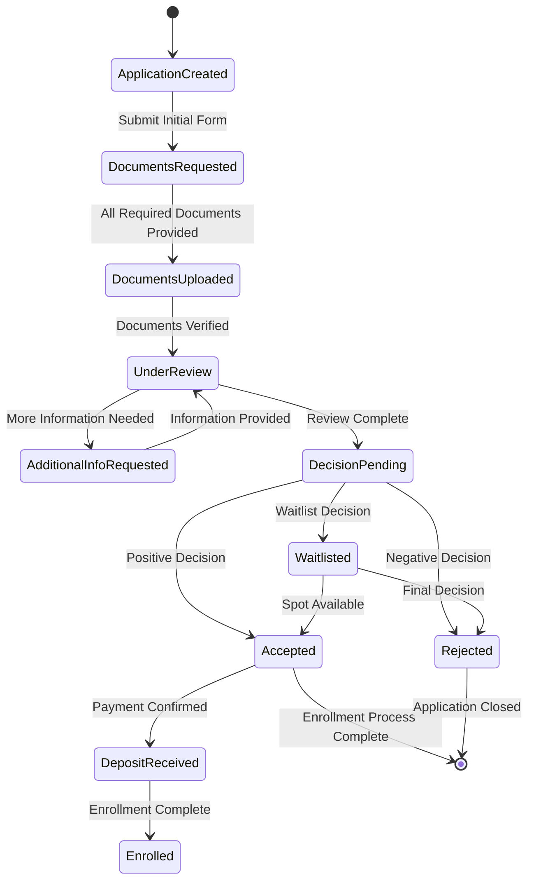

# Technical Specifications

## 1. INTRODUCTION

### EXECUTIVE SUMMARY

The Student Admissions Enrollment Platform is a comprehensive digital solution designed to streamline and enhance the entire student admissions lifecycle. This centralized hub will transform how educational institutions manage prospective and enrolled students by digitizing and automating critical admissions processes.

| Business Problem | Solution Approach | Value Proposition |
| --- | --- | --- |
| Fragmented admissions processes | Centralized platform with integrated workflows | Improved efficiency and reduced administrative overhead |
| Manual document handling | Digital document uploads with automated verification | Faster processing and reduced errors |
| Limited visibility into application status | Real-time tracking and personalized dashboards | Enhanced student experience and satisfaction |
| Inefficient communication channels | Integrated messaging and notification system | Timely updates and responsive support |

**Key Stakeholders and Users:**
- Prospective students and applicants
- Admissions and enrollment staff
- Academic departments and faculty
- Financial aid officers
- IT administrators and support staff
- Institutional leadership and decision-makers

### SYSTEM OVERVIEW

#### Project Context

The Student Admissions Enrollment Platform positions itself as a modern solution in the educational technology landscape, addressing the growing demand for digital transformation in higher education admissions processes.

| Business Context | Current Limitations | Enterprise Integration |
| --- | --- | --- |
| Increasing competition for student enrollment | Paper-based processes and siloed systems | Integration with Student Information Systems (SIS) |
| Rising student expectations for digital experiences | Limited self-service capabilities | Connection with Learning Management Systems (LMS) |
| Need for data-driven decision making | Inefficient reporting and analytics | Compatibility with financial systems |
| Compliance with educational regulations | Manual verification processes | Integration with existing authentication systems |

#### High-Level Description

The platform will be built using a modern technology stack consisting of Laravel (backend), MySQL (database), React (frontend), and Redis (caching and session management) to ensure scalability, security, and optimal performance.

Primary system capabilities include:
- Comprehensive application management
- Automated admissions workflows
- Personalized student dashboards
- Integrated communication tools
- AI-driven guidance and support
- Financial aid and payment processing
- Administrative WYSIWYG workflow editor

The architecture follows a modular approach with clear separation of concerns between frontend and backend components, utilizing RESTful APIs for communication and Redis for performance optimization.

#### Success Criteria

| Objective | Success Factors | Key Performance Indicators |
| --- | --- | --- |
| Streamline admissions process | Reduction in processing time | 50% decrease in application processing time |
| Enhance student experience | Improved satisfaction ratings | 30% increase in applicant satisfaction scores |
| Reduce administrative workload | Staff time savings | 40% reduction in manual data entry |
| Increase enrollment yield | Higher conversion rates | 25% improvement in application-to-enrollment ratio |

### SCOPE

#### In-Scope

**Core Features and Functionalities:**
- Online application submission and management
- Document upload and verification system
- Application status tracking and notifications
- Personalized student dashboards
- Integration with SIS and LMS
- In-app messaging and communication tools
- AI-driven guidance and recommendations
- Financial aid processing and payment handling
- Administrative workflow management with WYSIWYG editor
- Redis-based caching and session management

**Implementation Boundaries:**
- User Groups: Prospective students, enrolled students, admissions staff, administrative users
- System Coverage: Full admissions lifecycle from initial inquiry to enrollment
- Data Domains: Student profiles, applications, documents, communications, financial information

#### Out-of-Scope

- Course registration and academic planning (handled by LMS)
- Alumni management and engagement
- Curriculum development and management
- Faculty hiring and management
- Facilities management and room scheduling
- Advanced analytics and institutional research
- Mobile application (potential future phase)
- Integration with non-essential third-party systems
- Multi-language support (initial release)
- Legacy system data migration (separate project)

## 2. PRODUCT REQUIREMENTS

### 2.1 FEATURE CATALOG

#### Application Management

| Feature Metadata | Details |
| --- | --- |
| Unique ID | F-001 |
| Feature Name | Online Application Submission |
| Feature Category | Application Management |
| Priority Level | Critical |
| Status | Proposed |

**Description:**
- **Overview:** Allow prospective students to complete and submit applications online through an intuitive interface.
- **Business Value:** Reduces paper-based processes and administrative overhead while increasing application completion rates.
- **User Benefits:** Convenient 24/7 access, ability to save progress, and immediate submission confirmation.
- **Technical Context:** Form validation using React with backend processing in Laravel and data storage in MySQL.

**Dependencies:**
- **Prerequisite Features:** User registration and authentication (F-010)
- **System Dependencies:** Form builder component, document storage system
- **External Dependencies:** Email service for confirmation notifications
- **Integration Requirements:** Student Information System (SIS) for applicant data synchronization

| Feature Metadata | Details |
| --- | --- |
| Unique ID | F-002 |
| Feature Name | Document Upload and Management |
| Feature Category | Application Management |
| Priority Level | Critical |
| Status | Proposed |

**Description:**
- **Overview:** System for uploading, storing, and managing required application documents (transcripts, recommendation letters, etc.).
- **Business Value:** Centralizes document collection, reduces manual handling, and improves verification efficiency.
- **User Benefits:** Simple upload interface, status tracking, and document requirement notifications.
- **Technical Context:** Secure file storage with format validation, virus scanning, and metadata tagging.

**Dependencies:**
- **Prerequisite Features:** Online Application Submission (F-001)
- **System Dependencies:** File storage system, document processing service
- **External Dependencies:** Virus scanning service
- **Integration Requirements:** Document verification workflow

| Feature Metadata | Details |
| --- | --- |
| Unique ID | F-003 |
| Feature Name | Application Status Tracking |
| Feature Category | Application Management |
| Priority Level | High |
| Status | Proposed |

**Description:**
- **Overview:** Real-time tracking of application status through various stages of the admissions process.
- **Business Value:** Reduces status inquiry calls/emails and improves transparency of the admissions process.
- **User Benefits:** Clear visibility into application progress, upcoming requirements, and decision timeline.
- **Technical Context:** Status updates via Redis for real-time notifications and status changes.

**Dependencies:**
- **Prerequisite Features:** Online Application Submission (F-001)
- **System Dependencies:** Notification system, workflow engine
- **External Dependencies:** None
- **Integration Requirements:** Admissions workflow system

#### Automated Admissions Workflow

| Feature Metadata | Details |
| --- | --- |
| Unique ID | F-004 |
| Feature Name | Workflow Engine with WYSIWYG Editor |
| Feature Category | Automated Admissions Workflow |
| Priority Level | Critical |
| Status | Proposed |

**Description:**
- **Overview:** Administrative interface for creating, editing, and managing admissions workflows with a WYSIWYG editor.
- **Business Value:** Enables customization of workflows without developer intervention, reducing IT dependency.
- **User Benefits:** Administrators can visually design and modify workflows based on changing requirements.
- **Technical Context:** React-based workflow editor with Laravel backend for workflow execution.

**Dependencies:**
- **Prerequisite Features:** User role management (F-011)
- **System Dependencies:** Workflow state management system
- **External Dependencies:** None
- **Integration Requirements:** Notification system, document verification system

| Feature Metadata | Details |
| --- | --- |
| Unique ID | F-005 |
| Feature Name | Automated Decision Notifications |
| Feature Category | Automated Admissions Workflow |
| Priority Level | High |
| Status | Proposed |

**Description:**
- **Overview:** Automated generation and delivery of admission decisions based on workflow rules.
- **Business Value:** Ensures timely communication of decisions and reduces manual notification efforts.
- **User Benefits:** Applicants receive prompt notifications about their admission status.
- **Technical Context:** Template-based notification system with personalization variables.

**Dependencies:**
- **Prerequisite Features:** Workflow Engine (F-004), Communication Tools (F-008)
- **System Dependencies:** Notification templates, decision rules engine
- **External Dependencies:** Email/SMS service providers
- **Integration Requirements:** Student Information System for decision recording

| Feature Metadata | Details |
| --- | --- |
| Unique ID | F-006 |
| Feature Name | Document Verification System |
| Feature Category | Automated Admissions Workflow |
| Priority Level | High |
| Status | Proposed |

**Description:**
- **Overview:** Automated and manual verification processes for submitted documents with status tracking.
- **Business Value:** Accelerates document verification, reduces fraud, and improves compliance.
- **User Benefits:** Faster processing times and clear feedback on document acceptance.
- **Technical Context:** AI-assisted document verification with human review workflow.

**Dependencies:**
- **Prerequisite Features:** Document Upload (F-002)
- **System Dependencies:** Document processing queue, verification rules engine
- **External Dependencies:** External verification services (optional)
- **Integration Requirements:** AI document analysis service

#### Personalized Student Dashboard

| Feature Metadata | Details |
| --- | --- |
| Unique ID | F-007 |
| Feature Name | Student Dashboard |
| Feature Category | Personalized Student Dashboard |
| Priority Level | Critical |
| Status | Proposed |

**Description:**
- **Overview:** Personalized dashboard displaying application progress, tasks, deadlines, and communications.
- **Business Value:** Improves student engagement and reduces support inquiries through self-service.
- **User Benefits:** Centralized view of all relevant information and actions required.
- **Technical Context:** React-based dashboard with Redis caching for performance optimization.

**Dependencies:**
- **Prerequisite Features:** User authentication (F-010), Application Status Tracking (F-003)
- **System Dependencies:** Dashboard component library, data aggregation service
- **External Dependencies:** None
- **Integration Requirements:** All student-facing features

#### Communication Tools

| Feature Metadata | Details |
| --- | --- |
| Unique ID | F-008 |
| Feature Name | In-app Messaging System |
| Feature Category | Communication Tools |
| Priority Level | High |
| Status | Proposed |

**Description:**
- **Overview:** Secure messaging system for communication between applicants and admissions staff.
- **Business Value:** Creates an auditable communication trail and reduces email volume.
- **User Benefits:** Contextual communication with history and attachment capabilities.
- **Technical Context:** Real-time messaging using WebSockets with Redis for message queuing.

**Dependencies:**
- **Prerequisite Features:** User authentication (F-010)
- **System Dependencies:** Message storage and retrieval system
- **External Dependencies:** None
- **Integration Requirements:** Notification system

| Feature Metadata | Details |
| --- | --- |
| Unique ID | F-009 |
| Feature Name | Notification System |
| Feature Category | Communication Tools |
| Priority Level | High |
| Status | Proposed |

**Description:**
- **Overview:** Multi-channel notification system (in-app, email, SMS) for important updates and reminders.
- **Business Value:** Improves timely responses and reduces missed deadlines.
- **User Benefits:** Configurable notification preferences and important alerts.
- **Technical Context:** Template-based notification system with delivery tracking.

**Dependencies:**
- **Prerequisite Features:** User profile management (F-012)
- **System Dependencies:** Notification queue, template engine
- **External Dependencies:** Email service, SMS gateway
- **Integration Requirements:** User preference system

#### User Management

| Feature Metadata | Details |
| --- | --- |
| Unique ID | F-010 |
| Feature Name | User Authentication and Security |
| Feature Category | User Management |
| Priority Level | Critical |
| Status | Proposed |

**Description:**
- **Overview:** Secure authentication system with role-based access control and security features.
- **Business Value:** Ensures data security, compliance, and appropriate access controls.
- **User Benefits:** Secure access to personal information with password recovery options.
- **Technical Context:** Laravel authentication with JWT tokens and Redis session management.

**Dependencies:**
- **Prerequisite Features:** None
- **System Dependencies:** Authentication service, session management
- **External Dependencies:** Optional SSO integration
- **Integration Requirements:** All secured features

| Feature Metadata | Details |
| --- | --- |
| Unique ID | F-011 |
| Feature Name | Role and Permission Management |
| Feature Category | User Management |
| Priority Level | High |
| Status | Proposed |

**Description:**
- **Overview:** System for managing user roles, permissions, and access controls.
- **Business Value:** Ensures appropriate access to system features based on user responsibilities.
- **User Benefits:** Access to required functionality without unnecessary complexity.
- **Technical Context:** Role-based access control system with granular permissions.

**Dependencies:**
- **Prerequisite Features:** User Authentication (F-010)
- **System Dependencies:** Permission enforcement system
- **External Dependencies:** None
- **Integration Requirements:** All secured features

| Feature Metadata | Details |
| --- | --- |
| Unique ID | F-012 |
| Feature Name | User Profile Management |
| Feature Category | User Management |
| Priority Level | Medium |
| Status | Proposed |

**Description:**
- **Overview:** Self-service profile management for users to update personal information and preferences.
- **Business Value:** Reduces administrative overhead for user data management.
- **User Benefits:** Control over personal information and communication preferences.
- **Technical Context:** Profile data validation and change history tracking.

**Dependencies:**
- **Prerequisite Features:** User Authentication (F-010)
- **System Dependencies:** Profile data storage
- **External Dependencies:** None
- **Integration Requirements:** Notification preferences, SIS integration

#### AI-Driven Features

| Feature Metadata | Details |
| --- | --- |
| Unique ID | F-013 |
| Feature Name | AI-Driven Application Guidance |
| Feature Category | AI-Driven Features |
| Priority Level | Medium |
| Status | Proposed |

**Description:**
- **Overview:** Personalized recommendations and guidance for completing application requirements.
- **Business Value:** Increases application completion rates and reduces support inquiries.
- **User Benefits:** Contextual help and suggestions based on application progress.
- **Technical Context:** AI recommendation engine with personalization algorithms.

**Dependencies:**
- **Prerequisite Features:** Application Status Tracking (F-003)
- **System Dependencies:** AI recommendation service
- **External Dependencies:** None
- **Integration Requirements:** Student dashboard

| Feature Metadata | Details |
| --- | --- |
| Unique ID | F-014 |
| Feature Name | AI Document Analysis |
| Feature Category | AI-Driven Features |
| Priority Level | Medium |
| Status | Proposed |

**Description:**
- **Overview:** AI-powered analysis of uploaded documents for verification and data extraction.
- **Business Value:** Accelerates document processing and reduces manual review requirements.
- **User Benefits:** Faster document verification and reduced errors.
- **Technical Context:** Machine learning models for document classification and data extraction.

**Dependencies:**
- **Prerequisite Features:** Document Upload (F-002)
- **System Dependencies:** AI document processing service
- **External Dependencies:** AI/ML service provider (if using external service)
- **Integration Requirements:** Document verification workflow

| Feature Metadata | Details |
| --- | --- |
| Unique ID | F-015 |
| Feature Name | Chatbot Support Assistant |
| Feature Category | AI-Driven Features |
| Priority Level | Low |
| Status | Proposed |

**Description:**
- **Overview:** AI-powered chatbot for answering common questions and guiding users through processes.
- **Business Value:** Reduces support staff workload and provides 24/7 assistance.
- **User Benefits:** Immediate responses to common questions and guided problem-solving.
- **Technical Context:** Natural language processing with context-aware responses.

**Dependencies:**
- **Prerequisite Features:** User Authentication (F-010)
- **System Dependencies:** Chatbot engine, knowledge base
- **External Dependencies:** NLP service provider (if using external service)
- **Integration Requirements:** User interface, knowledge management system

#### Financial Management

| Feature Metadata | Details |
| --- | --- |
| Unique ID | F-016 |
| Feature Name | Financial Aid Application |
| Feature Category | Financial Management |
| Priority Level | High |
| Status | Proposed |

**Description:**
- **Overview:** Online application system for financial aid and scholarship opportunities.
- **Business Value:** Streamlines financial aid processing and improves award accuracy.
- **User Benefits:** Simplified application process with status tracking and award notifications.
- **Technical Context:** Form-based application with document upload capabilities.

**Dependencies:**
- **Prerequisite Features:** Online Application Submission (F-001), Document Upload (F-002)
- **System Dependencies:** Financial aid workflow engine
- **External Dependencies:** Financial aid verification services
- **Integration Requirements:** SIS financial modules

| Feature Metadata | Details |
| --- | --- |
| Unique ID | F-017 |
| Feature Name | Payment Processing |
| Feature Category | Financial Management |
| Priority Level | High |
| Status | Proposed |

**Description:**
- **Overview:** Secure payment processing for application fees, deposits, and tuition payments.
- **Business Value:** Accelerates payment collection and reduces payment processing costs.
- **User Benefits:** Convenient online payment options with receipt confirmation.
- **Technical Context:** Integration with payment gateways and financial systems.

**Dependencies:**
- **Prerequisite Features:** User Authentication (F-010)
- **System Dependencies:** Payment processing service
- **External Dependencies:** Payment gateway providers
- **Integration Requirements:** Financial systems, accounting software

#### System Integration

| Feature Metadata | Details |
| --- | --- |
| Unique ID | F-018 |
| Feature Name | SIS Integration |
| Feature Category | System Integration |
| Priority Level | Critical |
| Status | Proposed |

**Description:**
- **Overview:** Bidirectional data synchronization with Student Information Systems.
- **Business Value:** Eliminates duplicate data entry and ensures data consistency.
- **User Benefits:** Seamless transition from applicant to enrolled student status.
- **Technical Context:** API-based integration with data mapping and transformation.

**Dependencies:**
- **Prerequisite Features:** User Authentication (F-010), Application Management (F-001)
- **System Dependencies:** Integration middleware
- **External Dependencies:** SIS API access
- **Integration Requirements:** Data mapping configurations

| Feature Metadata | Details |
| --- | --- |
| Unique ID | F-019 |
| Feature Name | LMS Integration |
| Feature Category | System Integration |
| Priority Level | Medium |
| Status | Proposed |

**Description:**
- **Overview:** Integration with Learning Management Systems for course registration and onboarding.
- **Business Value:** Streamlines the transition from admission to course enrollment.
- **User Benefits:** Simplified access to course materials and registration.
- **Technical Context:** API-based integration with single sign-on capabilities.

**Dependencies:**
- **Prerequisite Features:** User Authentication (F-010), SIS Integration (F-018)
- **System Dependencies:** Integration middleware
- **External Dependencies:** LMS API access
- **Integration Requirements:** Authentication federation, data mapping

### 2.2 FUNCTIONAL REQUIREMENTS TABLE

#### Application Management Requirements

| Requirement ID | Description | Acceptance Criteria | Priority |
| --- | --- | --- | --- |
| F-001-RQ-001 | System shall provide a multi-step application form with progress saving | Users can save incomplete applications and resume later; Progress indicator shows completion percentage | Must-Have |
| F-001-RQ-002 | System shall support multiple application types (undergraduate, graduate, transfer) | Different application forms available based on application type; Form fields appropriate to each type | Must-Have |
| F-001-RQ-003 | System shall validate application data before submission | Required fields validated; Format validation for emails, phone numbers, etc.; Error messages displayed for invalid data | Must-Have |
| F-002-RQ-001 | System shall allow document uploads in multiple formats (PDF, JPEG, PNG) | Specified formats accepted; File size limits enforced; Preview capability for uploaded documents | Must-Have |
| F-002-RQ-002 | System shall scan uploaded documents for viruses and malware | All uploads scanned before storage; Infected files rejected with notification | Must-Have |
| F-002-RQ-003 | System shall maintain document version history | Previous versions accessible; Upload date/time tracked; Document replacement capability | Should-Have |
| F-003-RQ-001 | System shall display current application status with timestamp | Status updates shown in real-time; History of status changes available | Must-Have |
| F-003-RQ-002 | System shall provide estimated timeline for application processing | Visual timeline with estimated completion dates; Notifications for timeline changes | Should-Have |

#### Automated Admissions Workflow Requirements

| Requirement ID | Description | Acceptance Criteria | Priority |
| --- | --- | --- | --- |
| F-004-RQ-001 | System shall provide WYSIWYG workflow editor for administrators | Visual workflow creation interface; Drag-and-drop components; Conditional logic support | Must-Have |
| F-004-RQ-002 | System shall support custom workflow stages and transitions | Configurable stages; Conditional transitions; Role-based task assignments | Must-Have |
| F-004-RQ-003 | System shall allow workflow templates to be saved and reused | Template library; Version control; Import/export capability | Should-Have |
| F-005-RQ-001 | System shall generate automated decision notifications based on workflow rules | Template-based notifications; Personalization variables; Delivery tracking | Must-Have |
| F-005-RQ-002 | System shall support multiple notification channels (email, SMS, in-app) | Channel selection based on importance; Delivery confirmation; Fallback options | Should-Have |
| F-006-RQ-001 | System shall support AI-assisted document verification | Automated data extraction; Authenticity verification; Flagging of suspicious documents | Should-Have |
| F-006-RQ-002 | System shall provide manual verification interface for staff | Document review queue; Verification status tracking; Comment and annotation tools | Must-Have |

#### Personalized Student Dashboard Requirements

| Requirement ID | Description | Acceptance Criteria | Priority |
| --- | --- | --- | --- |
| F-007-RQ-001 | System shall display personalized dashboard with application status | Real-time status updates; Visual progress indicators; Next steps highlighted | Must-Have |
| F-007-RQ-002 | System shall show upcoming deadlines and required actions | Calendar view of deadlines; Task prioritization; Completion tracking | Must-Have |
| F-007-RQ-003 | System shall provide document checklist with status indicators | Required vs. optional documents; Verification status; Upload prompts | Must-Have |
| F-007-RQ-004 | System shall display communication history and notifications | Chronological message history; Unread message indicators; Quick reply options | Should-Have |

#### Communication Tools Requirements

| Requirement ID | Description | Acceptance Criteria | Priority |
| --- | --- | --- | --- |
| F-008-RQ-001 | System shall provide secure messaging between applicants and staff | Thread-based conversations; File attachment support; Read receipts | Must-Have |
| F-008-RQ-002 | System shall maintain complete message history | Searchable message archive; Conversation context preservation; Message timestamps | Must-Have |
| F-009-RQ-001 | System shall deliver multi-channel notifications for important events | Channel selection based on urgency; Delivery confirmation; Notification preferences | Must-Have |
| F-009-RQ-002 | System shall allow users to configure notification preferences | Channel selection per notification type; Frequency controls; Opt-out options (except critical) | Should-Have |

#### User Management Requirements

| Requirement ID | Description | Acceptance Criteria | Priority |
| --- | --- | --- | --- |
| F-010-RQ-001 | System shall provide secure authentication with password policies | Strong password requirements; MFA support; Account lockout after failed attempts | Must-Have |
| F-010-RQ-002 | System shall support password reset and account recovery | Self-service password reset; Secure recovery verification; Notification of password changes | Must-Have |
| F-011-RQ-001 | System shall enforce role-based access control | Predefined role templates; Custom role creation; Permission inheritance | Must-Have |
| F-011-RQ-002 | System shall log all permission changes and security events | Audit trail of permission changes; Security event logging; Admin alerts for suspicious activity | Must-Have |
| F-012-RQ-001 | System shall allow users to update profile information | Self-service profile updates; Field validation; Change history tracking | Should-Have |
| F-012-RQ-002 | System shall support preference management | Communication preferences; UI customization; Language settings | Could-Have |

#### AI-Driven Features Requirements

| Requirement ID | Description | Acceptance Criteria | Priority |
| --- | --- | --- | --- |
| F-013-RQ-001 | System shall provide personalized application guidance | Context-aware recommendations; Progress-based suggestions; Help resources | Should-Have |
| F-013-RQ-002 | System shall learn from user behavior to improve recommendations | Recommendation effectiveness tracking; Feedback collection; Model improvement over time | Could-Have |
| F-014-RQ-001 | System shall extract key data from uploaded documents | Automated data extraction; Accuracy validation; Manual override capability | Should-Have |
| F-014-RQ-002 | System shall detect potentially fraudulent documents | Authenticity verification; Anomaly detection; Flagging for human review | Should-Have |
| F-015-RQ-001 | System shall provide AI chatbot for common questions | 24/7 availability; Natural language understanding; Contextual responses | Could-Have |
| F-015-RQ-002 | System shall escalate complex issues to human support | Automatic handoff triggers; Context preservation; Queue prioritization | Could-Have |

#### Financial Management Requirements

| Requirement ID | Description | Acceptance Criteria | Priority |
| --- | --- | --- | --- |
| F-016-RQ-001 | System shall provide financial aid application forms | Need-based and merit-based options; Document upload capability; Eligibility checking | Must-Have |
| F-016-RQ-002 | System shall track financial aid application status | Real-time status updates; Award notification; Appeal process support | Must-Have |
| F-017-RQ-001 | System shall process secure online payments | Multiple payment methods; Transaction receipts; Payment confirmation | Must-Have |
| F-017-RQ-002 | System shall maintain payment history and financial records | Transaction history; Payment reconciliation; Financial reporting | Must-Have |

#### System Integration Requirements

| Requirement ID | Description | Acceptance Criteria | Priority |
| --- | --- | --- | --- |
| F-018-RQ-001 | System shall synchronize data with SIS | Bidirectional data flow; Field mapping configuration; Synchronization logging | Must-Have |
| F-018-RQ-002 | System shall handle data conflicts and exceptions | Conflict resolution rules; Exception handling; Manual override capability | Must-Have |
| F-019-RQ-001 | System shall integrate with LMS for course access | Single sign-on capability; Course enrollment data transfer; User account provisioning | Should-Have |
| F-019-RQ-002 | System shall support onboarding activities via LMS | Orientation course enrollment; Pre-enrollment activities; Learning resource access | Should-Have |

### 2.3 FEATURE RELATIONSHIPS

#### Feature Dependencies Map


#### Integration Points

| Primary Feature | Integration Point | Secondary Feature | Integration Type |
| --- | --- | --- | --- |
| Online Application (F-001) | Application Data | SIS Integration (F-018) | Bidirectional API |
| Document Upload (F-002) | Document Processing | AI Document Analysis (F-014) | Internal Service |
| Workflow Engine (F-004) | Status Updates | Notification System (F-009) | Event-driven |
| User Authentication (F-010) | Identity Management | SIS/LMS Integration (F-018/F-019) | SSO/Federation |
| Financial Aid (F-016) | Payment Information | Payment Processing (F-017) | Internal Service |
| Student Dashboard (F-007) | Status Display | Application Status (F-003) | Real-time Data |
| Messaging System (F-008) | Notifications | Notification System (F-009) | Event Subscription |

#### Shared Components

| Component | Used By Features | Purpose |
| --- | --- | --- |
| Authentication Service | F-001, F-007, F-008, F-010, F-011, F-012, F-017 | User identity and access control |
| Notification Engine | F-003, F-005, F-008, F-009, F-016 | Multi-channel communications |
| Document Storage | F-002, F-006, F-014, F-016 | Secure file management |
| Workflow Engine | F-003, F-004, F-005, F-006, F-016 | Process automation |
| Redis Cache | F-003, F-007, F-008, F-009 | Performance optimization |
| API Gateway | F-018, F-019 | External system integration |

#### Common Services

| Service | Features Served | Functionality |
| --- | --- | --- |
| User Management | F-010, F-011, F-012 | Identity, roles, profiles |
| Document Processing | F-002, F-006, F-014 | Upload, storage, analysis |
| Communication | F-008, F-009, F-015 | Messaging, notifications, chat |
| Workflow | F-003, F-004, F-005, F-006 | Process automation, status tracking |
| Financial | F-016, F-017 | Aid applications, payments |
| Integration | F-018, F-019 | External system connectivity |
| AI Services | F-013, F-014, F-015 | Intelligent assistance |

### 2.4 IMPLEMENTATION CONSIDERATIONS

#### Technical Constraints

| Feature | Constraint | Impact | Mitigation |
| --- | --- | --- | --- |
| Document Upload (F-002) | File size limitations | Large transcripts or portfolios may exceed limits | Compression, chunked uploads, cloud storage |
| AI Document Analysis (F-014) | Processing time for complex documents | User waiting time, processing queue backlog | Background processing, status notifications |
| Real-time Messaging (F-008) | Concurrent connection limits | Performance degradation under high load | Connection pooling, message queuing |
| Workflow Engine (F-004) | Complexity of custom workflows | Potential for logic errors or inefficient processes | Workflow validation, templates, best practices |
| SIS Integration (F-018) | Legacy system compatibility | Data format mismatches, API limitations | Middleware adapters, transformation services |

#### Performance Requirements

| Feature | Metric | Requirement | Approach |
| --- | --- | --- | --- |
| Application Submission (F-001) | Response Time | < 2 seconds for form submissions | Form optimization, progressive loading |
| Student Dashboard (F-007) | Load Time | < 1 second initial load | Redis caching, component lazy loading |
| Document Upload (F-002) | Upload Speed | Support for 10MB/s minimum | Chunked uploads, progress indicators |
| Status Tracking (F-003) | Update Latency | < 5 seconds for status changes | Redis pub/sub, WebSockets |
| Search Functionality | Query Response | < 1 second for typical queries | Indexed search, query optimization |
| Overall System | Concurrent Users | Support 1000+ simultaneous users | Load balancing, horizontal scaling |

#### Scalability Considerations

| Feature | Scaling Factor | Consideration | Approach |
| --- | --- | --- | --- |
| Application Processing | Seasonal peaks | 10x normal volume during admission periods | Auto-scaling, queue management |
| Document Storage | Growth over time | Increasing storage requirements | Cloud storage, tiered archiving |
| Messaging System | User base growth | Message volume increases with user count | Sharded databases, message partitioning |
| Workflow Engine | Workflow complexity | Processing overhead for complex workflows | Optimized execution, parallel processing |
| AI Services | Processing demand | Resource intensive operations | Dedicated processing nodes, prioritization |

#### Security Implications

| Feature | Security Concern | Requirement | Implementation |
| --- | --- | --- | --- |
| User Authentication (F-010) | Unauthorized access | Multi-factor authentication | TOTP, email verification |
| Document Storage | Data protection | Encryption at rest and in transit | AES-256 encryption, TLS |
| Payment Processing (F-017) | Financial data security | PCI DSS compliance | Tokenization, secure payment gateway |
| Personal Information | Privacy | GDPR/FERPA compliance | Data minimization, consent management |
| API Access | Service protection | Rate limiting, authentication | JWT tokens, API keys, throttling |

#### Maintenance Requirements

| Feature | Maintenance Need | Frequency | Approach |
| --- | --- | --- | --- |
| Workflow Engine (F-004) | Workflow updates | Seasonal/as needed | Version control, testing environment |
| AI Models (F-013, F-014, F-015) | Model retraining | Quarterly | Performance monitoring, feedback loop |
| Integration Points (F-018, F-019) | API compatibility | With external system updates | Versioned APIs, compatibility testing |
| Security Components | Vulnerability patching | Monthly/as needed | Automated scanning, update process |
| Content/Templates | Information updates | Seasonal/as needed | Content management system |

## 3. TECHNOLOGY STACK

### 3.1 PROGRAMMING LANGUAGES

| Language | Component | Justification | Version |
| --- | --- | --- | --- |
| PHP | Backend | Primary language for Laravel framework, offering robust web application development capabilities with excellent database integration and security features | 8.2+ |
| JavaScript/TypeScript | Frontend | Core language for React development, with TypeScript providing type safety and improved developer experience | TypeScript 4.9+ |
| SQL | Database Queries | Native language for MySQL database interactions, optimized for complex data operations and reporting | MySQL 8.0 dialect |
| HTML5/CSS3 | Frontend Markup/Styling | Industry standard for web content structure and presentation | Latest standards |

### 3.2 FRAMEWORKS & LIBRARIES

#### Backend Frameworks

| Framework/Library | Purpose | Justification | Version |
| --- | --- | --- | --- |
| Laravel | PHP Framework | Provides robust MVC architecture, built-in security features, ORM (Eloquent), and extensive ecosystem for rapid development | 10.x |
| Laravel Sanctum | API Authentication | Lightweight authentication system for SPAs, mobile apps, and token-based APIs | 3.x |
| Laravel Horizon | Queue Monitoring | Dashboard and configuration system for Redis queues, critical for managing background processes like document verification | 5.x |
| Laravel Echo | WebSockets | Real-time event broadcasting for features like messaging and notifications | 1.x |

#### Frontend Frameworks

| Framework/Library | Purpose | Justification | Version |
| --- | --- | --- | --- |
| React | UI Library | Component-based architecture enabling reusable UI elements and efficient rendering | 18.x |
| Redux | State Management | Centralized state management for complex application data flow | 4.x |
| React Router | Routing | Client-side routing for SPA navigation | 6.x |
| Axios | HTTP Client | Promise-based HTTP client for API requests with interceptor support | 1.x |
| React Query | Data Fetching | Simplifies data fetching, caching, and state management for API calls | 4.x |

#### UI Component Libraries

| Framework/Library | Purpose | Justification | Version |
| --- | --- | --- | --- |
| Material-UI | UI Components | Comprehensive component library with accessibility support | 5.x |
| React Flow | Workflow Editor | Interactive components for building the WYSIWYG workflow editor | 11.x |
| Chart.js | Data Visualization | Lightweight charting library for analytics dashboards | 4.x |
| React Dropzone | File Upload | Enhanced file upload experience for document management | 14.x |

#### AI and Machine Learning

| Framework/Library | Purpose | Justification | Version |
| --- | --- | --- | --- |
| TensorFlow.js | Client-side ML | Enables lightweight ML capabilities directly in the browser | 4.x |
| Laravel-OpenAI | AI Integration | Laravel package for OpenAI API integration for chatbot and document analysis | 2.x |
| Natural | NLP Processing | JavaScript NLP library for text analysis and processing | 6.x |

### 3.3 DATABASES & STORAGE

| Technology | Purpose | Justification | Version |
| --- | --- | --- | --- |
| MySQL | Primary Database | Relational database for structured data with strong ACID compliance and transaction support | 8.0+ |
| Redis | Caching & Session Store | In-memory data structure store for high-performance caching, session management, and real-time features | 7.0+ |
| Amazon S3 | Document Storage | Scalable object storage for secure document management with versioning capabilities | Latest |
| Elasticsearch | Search Engine | Advanced search capabilities for application and document content | 8.x |

#### Database Design Approach

- **Normalization Level**: 3NF for core entities with selective denormalization for performance
- **Indexing Strategy**: Composite indexes on frequently queried fields, full-text indexes for search functionality
- **Partitioning**: Date-based partitioning for large tables (applications, documents, audit logs)
- **Backup Strategy**: Daily full backups with hourly incremental backups and point-in-time recovery

#### Caching Strategy

| Cache Type | Purpose | Implementation |
| --- | --- | --- |
| Data Cache | Frequently accessed data | Redis with tagged cache invalidation |
| Session Store | User sessions | Redis with appropriate TTL |
| Query Cache | Expensive database queries | Redis with key-based invalidation |
| Page Cache | Static content | Redis for dynamic pages, CDN for static assets |
| API Response Cache | External API responses | Redis with conditional expiration |

### 3.4 THIRD-PARTY SERVICES

#### Authentication & Security

| Service | Purpose | Justification |
| --- | --- | --- |
| Google reCAPTCHA | Bot Protection | Prevents automated submissions while maintaining user experience |
| Twilio | SMS Notifications | Reliable SMS delivery for critical notifications and two-factor authentication |
| Mailgun | Email Delivery | Transactional email service with high deliverability and tracking |
| AWS KMS | Encryption Key Management | Secure management of encryption keys for sensitive data |

#### Integration Services

| Service | Purpose | Justification |
| --- | --- | --- |
| Stripe | Payment Processing | PCI-compliant payment processing with comprehensive API |
| OpenAI API | AI Services | Advanced natural language processing for chatbot and document analysis |
| AWS Textract | Document Analysis | OCR and data extraction from uploaded documents |
| Zapier | Workflow Automation | Integration with external systems without custom development |

#### Monitoring & Analytics

| Service | Purpose | Justification |
| --- | --- | --- |
| New Relic | Application Performance | Comprehensive monitoring of application performance and user experience |
| Sentry | Error Tracking | Real-time error tracking and debugging |
| Google Analytics | User Analytics | Insights into user behavior and conversion funnels |
| LogRocket | Session Replay | Reproduction of user sessions for debugging and UX improvement |

### 3.5 DEVELOPMENT & DEPLOYMENT

#### Development Tools

| Tool | Purpose | Justification |
| --- | --- | --- |
| Git | Version Control | Industry standard for source code management |
| Docker | Containerization | Consistent development and production environments |
| Composer | PHP Dependency Management | Standard package manager for PHP dependencies |
| npm/Yarn | JS Dependency Management | Package management for JavaScript dependencies |
| PHPUnit | Backend Testing | Comprehensive testing framework for PHP code |
| Jest | Frontend Testing | JavaScript testing framework with React support |
| Cypress | E2E Testing | End-to-end testing for critical user flows |

#### Deployment Infrastructure

| Component | Technology | Justification |
| --- | --- | --- |
| Web Server | Nginx | High-performance web server with excellent PHP-FPM integration |
| Application Server | PHP-FPM | Optimized PHP process manager for Laravel applications |
| Container Orchestration | Kubernetes | Scalable container management for production deployment |
| CDN | Cloudflare | Global content delivery with DDoS protection |
| Load Balancer | AWS ELB | Distributes traffic across application instances |
| SSL/TLS | Let's Encrypt | Automated certificate management for secure connections |

#### CI/CD Pipeline


### 3.6 SYSTEM ARCHITECTURE

#### High-Level Architecture


#### Data Flow Architecture


## 4. PROCESS FLOWCHART

### 4.1 SYSTEM WORKFLOWS

#### 4.1.1 Core Business Processes

##### Application Submission and Processing Workflow


##### Document Upload and Verification Workflow


##### Admissions Decision Workflow


##### Enrollment Confirmation Workflow


#### 4.1.2 Integration Workflows

##### SIS Integration Data Flow


##### LMS Integration Workflow


##### Payment Processing Workflow


##### Document Verification Integration


### 4.2 FLOWCHART REQUIREMENTS

#### 4.2.1 Application Status Transition Diagram


#### 4.2.2 Workflow Editor Process Flow


#### 4.2.3 Error Handling Flowchart


### 4.3 TECHNICAL IMPLEMENTATION

#### 4.3.1 State Management Diagram


#### 4.3.2 Transaction Boundaries and Data Persistence


#### 4.3.3 Retry Mechanism for Integration Points


### 4.4 VALIDATION RULES

#### 4.4.1 Application Validation Rules

| Validation Point | Rules | Error Handling |
| --- | --- | --- |
| Personal Information | - Required: name, DOB, contact information<br>- Email format validation<br>- Phone number format validation<br>- Age verification (minimum age requirements) | - Inline field validation<br>- Error summary at submission<br>- Highlight invalid fields |
| Academic History | - Required: previous institutions, dates attended<br>- Graduation date validation<br>- GPA format validation<br>- Transcript requirement check | - Progressive disclosure of requirements<br>- Conditional validation based on application type |
| Document Uploads | - File type restrictions (PDF, JPEG, PNG)<br>- Maximum file size (10MB)<br>- Minimum resolution for images<br>- Document completeness check | - Pre-upload validation<br>- Upload progress indicator<br>- Clear error messaging for rejected files |
| Application Submission | - All required sections completed<br>- All required documents uploaded<br>- Application fee payment confirmed<br>- Attestation/signature provided | - Section completion indicators<br>- Pre-submission checklist<br>- Guided correction process |

#### 4.4.2 Authorization Checkpoints

| Process | Authorization Rules | Implementation |
| --- | --- | --- |
| Application Access | - Only the applicant and authorized staff can view an application<br>- Applicants can only view their own applications<br>- Staff access based on assigned roles | - JWT token validation<br>- Role-based access control<br>- Application ownership verification |
| Document Management | - Applicants can upload and view their documents<br>- Only authorized staff can verify documents<br>- Document deletion requires elevated privileges | - Document ownership checks<br>- Action-based permission validation<br>- Audit logging for sensitive operations |
| Admissions Decisions | - Only admissions officers can enter evaluations<br>- Final decisions require appropriate authority level<br>- Decision changes require approval and documentation | - Multi-level authorization checks<br>- Workflow state validation<br>- Digital signature for official decisions |
| Financial Information | - Strict access controls for financial data<br>- Payment processing limited to authorized systems<br>- Financial aid reviews require specific roles | - Encrypted data transmission<br>- PCI compliance checks<br>- Segregation of financial duties |

#### 4.4.3 Regulatory Compliance Checks

| Compliance Area | Validation Requirements | Implementation |
| --- | --- | --- |
| Data Privacy (GDPR/FERPA) | - Consent verification for data collection<br>- Purpose limitation checks<br>- Data minimization enforcement<br>- Right to access/erasure support | - Consent tracking database<br>- Purpose-tagged data fields<br>- Data retention policies<br>- Subject access request workflow |
| Accessibility (WCAG) | - Content accessibility validation<br>- Interface element accessibility<br>- Alternative format availability<br>- Assistive technology compatibility | - Automated WCAG compliance checks<br>- Accessibility testing in CI/CD<br>- Alternative format generators |
| Security Compliance | - Authentication strength validation<br>- Authorization appropriateness<br>- Data encryption verification<br>- Audit trail completeness | - Security policy enforcement<br>- Encryption verification<br>- Comprehensive audit logging |
| Geographic Restrictions | - Location-based access controls<br>- Regional data storage compliance<br>- Export control regulations | - IP-based geolocation<br>- Data residency enforcement<br>- Regulatory rule engine |

### 4.5 HIGH-LEVEL SYSTEM WORKFLOW


## 5. SYSTEM ARCHITECTURE

### 5.1 HIGH-LEVEL ARCHITECTURE

#### System Overview

The Student Admissions Enrollment Platform follows a modern, layered architecture based on a microservices-inspired approach while maintaining the benefits of a monolithic deployment for simplicity and development efficiency. The architecture employs:

- **Service-Oriented Design**: Core business capabilities are organized as distinct services with well-defined boundaries while sharing the same deployment unit.
- **API-First Approach**: All interactions between frontend and backend components occur through RESTful APIs, enabling future extensibility.
- **Event-Driven Patterns**: Critical system events (application submissions, status changes, document verifications) trigger notifications and workflow transitions.
- **CQRS-Inspired Model**: Separation of read and write operations for high-traffic components, with Redis caching optimizing read performance.

The system boundaries encompass the entire student admissions lifecycle, from initial inquiry through application processing to enrollment confirmation. Major interfaces include:
- Student-facing web portal (React SPA)
- Administrative dashboard for staff
- Integration APIs for SIS and LMS connectivity
- Payment processing gateway interfaces
- Document storage and retrieval services

#### Core Components Table

| Component Name | Primary Responsibility | Key Dependencies | Critical Considerations |
| --- | --- | --- | --- |
| React Frontend | Deliver responsive UI for all user types | Redux, Material-UI, React Router | Accessibility, mobile responsiveness, offline capabilities |
| Laravel API Layer | Process requests, enforce business rules | PHP 8.2+, Laravel 10.x | API versioning, rate limiting, comprehensive documentation |
| Authentication Service | Manage user identity and access | Laravel Sanctum, Redis | Security, session management, role-based permissions |
| Application Service | Handle application submission and processing | MySQL, Document Service | Data validation, workflow integration, audit logging |
| Document Service | Manage document uploads and verification | S3/Cloud Storage, AI Service | File security, virus scanning, format validation |
| Workflow Engine | Orchestrate admissions processes | Redis, Notification Service | Configurability, state management, transaction integrity |
| Notification Service | Deliver multi-channel communications | Email/SMS providers, Redis | Delivery guarantees, template management, preferences |
| Integration Service | Connect with external systems | API Gateways, Message Queue | Error handling, retry logic, data transformation |
| AI Service | Provide intelligent assistance and automation | ML models, Document Service | Model accuracy, training data, fallback mechanisms |
| Payment Service | Process financial transactions | Payment Gateway, MySQL | PCI compliance, reconciliation, security |

#### Data Flow Description

The system's data flows follow established patterns to ensure reliability and maintainability:

1. **User Interactions**: All user requests from the React frontend are directed to the Laravel API Layer through RESTful endpoints. Authentication tokens are validated on each request using Redis for session verification.

2. **Command Processing**: Write operations (e.g., application submissions, document uploads) are processed through dedicated service methods that enforce business rules, perform validations, and persist data to MySQL.

3. **Query Handling**: Read operations leverage Redis caching for frequently accessed data (application status, user profiles, document lists) with cache invalidation triggered by relevant write operations.

4. **Event Propagation**: Key business events generate notifications through an event bus, triggering workflow transitions, status updates, and communication delivery.

5. **External Integrations**: Data exchange with SIS and LMS systems occurs through the Integration Service, which handles transformation, validation, and error recovery using a combination of synchronous API calls and asynchronous message queues.

6. **Document Processing**: Uploaded documents flow through virus scanning, format validation, and AI-assisted verification before storage in the document repository, with metadata stored in MySQL.

7. **AI Processing**: Document analysis, chatbot interactions, and recommendation generation leverage the AI Service, which processes requests asynchronously and updates the relevant services with results.

Key data stores include MySQL for relational data, Redis for caching and session management, S3/Cloud Storage for document files, and Elasticsearch for search capabilities.

#### External Integration Points

| System Name | Integration Type | Data Exchange Pattern | Protocol/Format | SLA Requirements |
| --- | --- | --- | --- | --- |
| Student Information System | Bidirectional API | Synchronous/Asynchronous | REST/JSON | 99.5% uptime, <2s response |
| Learning Management System | Bidirectional API | Synchronous | REST/JSON, LTI | 99% uptime, <3s response |
| Payment Gateway | Service API | Synchronous | REST/JSON, PCI-DSS | 99.9% uptime, <1.5s response |
| Email Service Provider | Service API | Asynchronous | SMTP, REST/JSON | 99% delivery rate, <5min delivery |
| SMS Provider | Service API | Asynchronous | REST/JSON | 98% delivery rate, <2min delivery |
| Document Verification Services | Service API | Asynchronous | REST/JSON | 95% accuracy, <1hr processing |
| AI/ML Services | Service API | Asynchronous | REST/JSON | <5s for real-time, <1hr for batch |

### 5.2 COMPONENT DETAILS

#### React Frontend

**Purpose and Responsibilities:**
- Deliver responsive, accessible user interfaces for applicants, students, and staff
- Manage client-side state and UI rendering
- Handle form validation and user input
- Provide real-time feedback and notifications
- Support offline capabilities for partial application completion

**Technologies and Frameworks:**
- React 18+ for component-based UI development
- Redux for state management with Redux Toolkit
- React Router for client-side routing
- Material-UI for consistent design components
- React Query for data fetching and cache management
- Jest and React Testing Library for unit/integration testing

**Key Interfaces:**
- RESTful API endpoints for data retrieval and submission
- WebSocket connections for real-time notifications
- Local storage for offline data persistence
- File system access for document uploads

**Scaling Considerations:**
- Code splitting for optimized bundle sizes
- Progressive loading of application sections
- Memoization of expensive computations
- Service worker implementation for caching and offline support

#### Laravel API Layer

**Purpose and Responsibilities:**
- Process incoming API requests from frontend clients
- Enforce authentication and authorization rules
- Route requests to appropriate service components
- Handle API versioning and backward compatibility
- Implement rate limiting and request validation

**Technologies and Frameworks:**
- Laravel 10+ as the primary PHP framework
- Laravel Sanctum for API authentication
- Laravel Horizon for queue monitoring
- PHPUnit for automated testing
- Swagger/OpenAPI for API documentation

**Key Interfaces:**
- RESTful endpoints for all client operations
- WebSocket server for real-time communications
- Service interfaces for internal component interaction
- Database connection management

**Data Persistence Requirements:**
- Minimal direct data access, delegated to services
- Transaction management across service boundaries
- Query optimization and monitoring

**Scaling Considerations:**
- Horizontal scaling behind load balancer
- API gateway pattern for request routing
- Rate limiting and throttling for abuse prevention
- Caching of frequently requested resources

#### Application Service

**Purpose and Responsibilities:**
- Manage the complete application lifecycle
- Process application submissions and updates
- Track application status and progress
- Coordinate with other services for document management and workflow
- Generate application analytics and reports

**Technologies and Frameworks:**
- Laravel service classes and repositories
- MySQL for relational data storage
- Redis for caching and real-time updates
- Elasticsearch for advanced search capabilities

**Key Interfaces:**
- Internal service methods for application operations
- Event dispatching for status changes
- Repository pattern for data access
- Integration points with Workflow Engine

**Data Persistence Requirements:**
- Normalized application data in MySQL
- Document metadata with references to storage
- Application history and audit trail
- Status tracking and timestamps

**Scaling Considerations:**
- Read/write splitting for high-volume periods
- Batch processing for reporting and analytics
- Partitioning strategies for historical data
- Caching of active applications and statuses

#### Document Service

**Purpose and Responsibilities:**
- Handle secure document uploads and storage
- Manage document metadata and categorization
- Coordinate document verification processes
- Provide document retrieval and access control
- Implement document version control

**Technologies and Frameworks:**
- Laravel file storage abstractions
- S3/Cloud Storage for document files
- Virus scanning integration
- Image processing libraries for previews

**Key Interfaces:**
- Upload API with chunked file support
- Secure download/view endpoints
- Verification status tracking
- Integration with AI services for document analysis

**Data Persistence Requirements:**
- Document metadata in MySQL
- File storage in S3/Cloud Storage
- Verification results and history
- Access logs and audit trail

**Scaling Considerations:**
- Content Delivery Network for frequent downloads
- Asynchronous processing of uploads
- Tiered storage for different document types
- Compression and optimization for storage efficiency

#### Workflow Engine

**Purpose and Responsibilities:**
- Orchestrate the admissions process flow
- Manage state transitions and business rules
- Provide WYSIWYG editor for workflow configuration
- Track progress and generate notifications
- Enforce role-based task assignments

**Technologies and Frameworks:**
- Custom state machine implementation
- Redis for state caching and distributed locks
- React Flow for workflow editor visualization
- Event sourcing for workflow history

**Key Interfaces:**
- Workflow definition API
- State transition methods
- Event listeners for external triggers
- Integration with notification service

**Data Persistence Requirements:**
- Workflow definitions in MySQL
- Current state in Redis for performance
- Complete state transition history
- Task assignments and deadlines

**Scaling Considerations:**
- Distributed locking for concurrent transitions
- Partitioning of workflow instances
- Caching of workflow definitions
- Asynchronous processing of complex transitions



#### Notification Service

**Purpose and Responsibilities:**
- Deliver multi-channel notifications (in-app, email, SMS)
- Manage notification templates and personalization
- Track delivery status and engagement
- Handle user notification preferences
- Support scheduled and triggered notifications

**Technologies and Frameworks:**
- Laravel notifications system
- Redis for notification queuing
- Email service provider integration
- SMS gateway integration
- WebSockets for real-time delivery

**Key Interfaces:**
- Notification dispatch API
- Template management
- Delivery status tracking
- Preference management

**Data Persistence Requirements:**
- Notification templates in MySQL
- Delivery history and status
- User preferences and opt-outs
- Scheduled notifications queue

**Scaling Considerations:**
- Prioritized notification queues
- Batch processing for bulk notifications
- Rate limiting for external providers
- Fallback mechanisms for delivery failures

#### AI Service

**Purpose and Responsibilities:**
- Provide document analysis and data extraction
- Power chatbot interactions and support
- Generate personalized recommendations
- Assist in application evaluation
- Detect potential fraud or inconsistencies

**Technologies and Frameworks:**
- TensorFlow/PyTorch for ML models
- Natural language processing libraries
- OpenAI API integration
- Custom trained models for document analysis
- Recommendation algorithms

**Key Interfaces:**
- Document analysis API
- Chatbot conversation API
- Recommendation generation
- Fraud detection hooks

**Data Persistence Requirements:**
- Model parameters and configurations
- Analysis results and confidence scores
- Conversation history and context
- Training data and feedback

**Scaling Considerations:**
- Asynchronous processing for non-real-time tasks
- Model serving infrastructure
- Batch processing for training and updates
- Fallback to rule-based systems when needed

```mermaid
sequenceDiagram
    participant User
    participant Frontend
    participant API
    participant DocService
    participant AIService
    participant Storage
    
    User->>Frontend: Upload Transcript
    Frontend->>API: POST /documents/upload
    API->>DocService: processUpload(file)
    DocService->>Storage: storeDocument(file)
    Storage-->>DocService: documentId
    DocService->>AIService: analyzeDocument(documentId, "transcript")
    AIService->>Storage: retrieveDocument(documentId)
    Storage-->>AIService: documentContent
    AIService->>AIService: extractData(documentContent)
    AIService-->>DocService: analysisResults
    DocService->>API: updateDocumentMetadata(documentId, results)
    API-->>Frontend: Upload & Analysis Complete
    Frontend-->>User: Display Extracted Information
```

#### Integration Service

**Purpose and Responsibilities:**
- Manage bidirectional data exchange with external systems
- Handle data transformation and mapping
- Implement retry logic and error recovery
- Monitor integration health and performance
- Provide transaction integrity across systems

**Technologies and Frameworks:**
- Laravel HTTP client for API integration
- Message queues for asynchronous processing
- Adapter pattern for system-specific implementations
- Circuit breaker pattern for fault tolerance

**Key Interfaces:**
- System-specific adapters
- Transformation and mapping services
- Synchronization scheduling
- Error handling and reporting

**Data Persistence Requirements:**
- Integration configurations
- Synchronization logs and history
- Error records and resolution status
- External system identifiers and mappings

**Scaling Considerations:**
- Throttling for external API rate limits
- Batching of operations where supported
- Prioritization of critical integrations
- Caching of frequently accessed external data

### 5.3 TECHNICAL DECISIONS

#### Architecture Style Decisions

| Decision Area | Selected Approach | Alternatives Considered | Rationale |
| --- | --- | --- | --- |
| Overall Architecture | Modular Monolith with Service Orientation | Microservices, Traditional Monolith | Balances development velocity with system organization; avoids distributed system complexity while maintaining service boundaries |
| Frontend Architecture | Single Page Application | Server-rendered, Multi-page | Provides rich interactive experience; leverages client-side processing; enables offline capabilities |
| API Design | RESTful with Resource Orientation | GraphQL, RPC | Industry standard with broad tooling support; simplifies integration; clear resource boundaries |
| Persistence Strategy | Polyglot Persistence | Single Database Solution | Optimizes storage for different data types; MySQL for relational data, Redis for caching, S3 for documents |

#### Communication Pattern Choices

| Pattern | Use Cases | Benefits | Considerations |
| --- | --- | --- | --- |
| Synchronous REST | User-initiated actions, CRUD operations | Immediate feedback, simplicity | Potential for increased latency, tight coupling |
| WebSockets | Real-time notifications, status updates | Low latency, bidirectional | Connection management overhead, fallback needs |
| Event-Driven | Status changes, workflow transitions | Loose coupling, scalability | Eventual consistency, complexity in tracking |
| Message Queues | Document processing, integrations | Reliability, backpressure handling | Additional infrastructure, monitoring needs |

#### Data Storage Solution Rationale

| Data Type | Selected Solution | Justification |
| --- | --- | --- |
| Relational Data | MySQL 8.0+ | Strong ACID compliance; mature ecosystem; excellent for structured data with relationships; supports transactions across multiple tables |
| Session Data | Redis | High performance; automatic expiration; supports distributed sessions; enables horizontal scaling of web tier |
| Document Files | S3/Cloud Storage | Unlimited scalability; high durability; cost-effective; specialized for binary data storage; CDN integration |
| Search Indexes | Elasticsearch | Advanced full-text search; faceted search capabilities; high performance for complex queries; scales horizontally |

#### Caching Strategy Justification

| Cache Type | Implementation | Purpose | Invalidation Strategy |
| --- | --- | --- | --- |
| Data Cache | Redis | Reduce database load for frequent reads | Tag-based invalidation on writes |
| Page Cache | Redis + CDN | Accelerate content delivery | Time-based expiration + explicit purge |
| API Response Cache | Redis | Reduce computation for common requests | Resource-based invalidation |
| Session Cache | Redis | Enable stateless application servers | Time-based expiration + logout events |

```mermaid
graph TD
    A[Client Request] --> B{Cache Hit?}
    B -->|Yes| C[Return Cached Response]
    B -->|No| D[Process Request]
    D --> E[Database Query]
    E --> F[Transform Data]
    F --> G[Cache Result]
    G --> H[Return Response]
    
    I[Write Operation] --> J[Update Database]
    J --> K[Invalidate Related Cache]
    K --> L[Publish Change Event]
    L --> M[Notify Subscribers]
```

#### Security Mechanism Selection

| Security Concern | Selected Mechanism | Justification |
| --- | --- | --- |
| Authentication | Laravel Sanctum + JWT | Stateless API authentication; supports multiple guard types; secure token management |
| Authorization | Role-Based Access Control | Granular permission management; hierarchical roles; simplifies access management |
| Data Protection | Encryption at Rest and in Transit | Protects sensitive data; meets regulatory requirements; industry best practice |
| API Security | Rate Limiting + CSRF Protection | Prevents abuse; protects against common attacks; ensures API stability |

### 5.4 CROSS-CUTTING CONCERNS

#### Monitoring and Observability Approach

The system implements a comprehensive monitoring strategy to ensure reliability and performance:

- **Application Performance Monitoring**: New Relic integration for real-time performance tracking, transaction tracing, and bottleneck identification.
- **Infrastructure Monitoring**: Server metrics (CPU, memory, disk, network) collected via Prometheus and visualized in Grafana dashboards.
- **User Experience Monitoring**: Real User Monitoring (RUM) to track client-side performance, page load times, and interaction metrics.
- **Business Metrics**: Custom dashboards for application submission rates, conversion funnels, and enrollment statistics.
- **Alerting**: Multi-channel alerts (email, SMS, Slack) based on predefined thresholds and anomaly detection.

Key metrics include:
- API response times (95th percentile < 500ms)
- Error rates (< 0.1% of requests)
- User session duration and engagement
- Document processing times
- Integration success rates

#### Logging and Tracing Strategy

| Log Type | Content | Storage | Retention |
| --- | --- | --- | --- |
| Application Logs | Errors, warnings, info events | Centralized ELK stack | 30 days |
| Access Logs | API requests, authentication events | Centralized ELK stack | 90 days |
| Audit Logs | Security events, data changes | Secure database + archives | 7 years |
| Integration Logs | External system interactions | Centralized ELK stack | 60 days |

The logging implementation includes:
- Structured JSON logging format for machine parseability
- Correlation IDs across service boundaries for request tracing
- PII redaction in logs to ensure privacy compliance
- Log level configuration by environment
- Real-time log streaming for development environments

#### Error Handling Patterns

```mermaid
flowchart TD
    A[Error Detected] --> B{Error Type}
    B -->|Validation| C[Return Validation Errors]
    B -->|Authentication| D[Return 401/403 Response]
    B -->|Integration| E{Retryable?}
    B -->|System| F[Log Error]
    
    E -->|Yes| G[Queue for Retry]
    E -->|No| H[Alert Operations]
    
    C --> I[Log Validation Attempt]
    D --> J[Log Security Event]
    G --> K[Implement Backoff Strategy]
    F --> L{Critical?}
    
    L -->|Yes| M[Trigger Incident Response]
    L -->|No| N[Monitor Error Rate]
    
    H --> O[Create Incident Ticket]
    K --> P{Max Retries Reached?}
    
    P -->|Yes| Q[Fallback to Manual Process]
    P -->|No| R[Continue Retry Cycle]
    
    I --> S[Return User-Friendly Message]
    J --> S
    M --> T[Execute Recovery Procedure]
    N --> U[Update Error Dashboard]
    O --> V[Notify Integration Team]
    Q --> W[Notify Business Owner]
```

The system implements a multi-layered error handling strategy:

1. **Client-Facing Errors**: User-friendly messages with actionable guidance, appropriate HTTP status codes, and unique error references for support.

2. **Application Errors**: Structured error objects with type, message, and context; centralized error handling middleware; automatic logging with stack traces.

3. **Integration Errors**: Retry mechanisms with exponential backoff; circuit breakers to prevent cascading failures; fallback procedures for critical operations.

4. **Database Errors**: Transaction management with rollback capabilities; connection pooling with health checks; query timeout handling.

5. **Asynchronous Processing Errors**: Dead letter queues for failed jobs; administrative interfaces for retry/cancel operations; notification of persistent failures.

#### Authentication and Authorization Framework

The authentication and authorization system is built on these principles:

- **Multi-Factor Authentication**: Optional for all users, required for administrative access
- **Role-Based Access Control**: Hierarchical roles with granular permissions
- **JWT Token Authentication**: Stateless API authentication with appropriate expiration
- **Session Management**: Redis-backed sessions with secure cookie configuration
- **Password Policies**: Enforced complexity, rotation requirements, and breach detection
- **Login Monitoring**: Detection of suspicious login patterns and location changes
- **API Authorization**: Resource-level permissions with ownership validation

Implementation details:
- Laravel Sanctum for API token management
- Custom permission middleware for endpoint protection
- Database-stored permissions with Redis caching
- Comprehensive audit logging of permission changes

#### Performance Requirements and SLAs

| Metric | Target | Measurement Method |
| --- | --- | --- |
| Page Load Time | < 2 seconds | Real User Monitoring |
| API Response Time | < 500ms (95th percentile) | Server-side metrics |
| Availability | 99.9% uptime | External monitoring |
| Maximum Users | 5,000 concurrent | Load testing |
| Document Upload | < 5 seconds for 10MB | User journey testing |
| Document Processing | < 2 minutes | Processing queue metrics |

Performance optimization strategies include:
- Redis caching for frequently accessed data
- CDN for static assets and documents
- Database query optimization and indexing
- Asynchronous processing for long-running tasks
- Frontend code splitting and lazy loading
- Image and document optimization

#### Disaster Recovery Procedures

The disaster recovery plan addresses various failure scenarios:

1. **Database Failure**:
   - Automated failover to replica database
   - Point-in-time recovery from backups
   - Transaction log replay for minimal data loss

2. **Application Server Failure**:
   - Load balancer health checks for automatic removal
   - Auto-scaling to replace failed instances
   - Stateless design to minimize impact

3. **Complete Region Failure**:
   - Cross-region database replication
   - Geo-distributed application deployment
   - DNS failover to secondary region

4. **Data Corruption**:
   - Daily database backups with 30-day retention
   - Incremental backups every hour
   - Isolated restoration environment for validation

Recovery Time Objectives (RTO):
- Critical functions: < 1 hour
- Non-critical functions: < 4 hours

Recovery Point Objectives (RPO):
- Database: < 5 minutes
- Document storage: < 15 minutes

## 6. SYSTEM COMPONENTS DESIGN

### 6.1 DATABASE SCHEMA

#### 6.1.1 Entity Relationship Diagram

```mermaid
erDiagram
    USERS ||--o{ APPLICATIONS : submits
    USERS ||--o{ DOCUMENTS : uploads
    USERS ||--o{ MESSAGES : sends
    USERS }|--|| USER_PROFILES : has
    USERS }o--o{ ROLES : has
    ROLES }o--o{ PERMISSIONS : contains
    
    APPLICATIONS ||--o{ DOCUMENTS : requires
    APPLICATIONS ||--o{ APPLICATION_STATUSES : tracks
    APPLICATIONS ||--o{ NOTES : contains
    APPLICATIONS ||--o{ PAYMENTS : requires
    APPLICATIONS ||--o{ FINANCIAL_AID_APPLICATIONS : may_have
    
    WORKFLOWS ||--o{ WORKFLOW_STAGES : contains
    WORKFLOW_STAGES ||--o{ WORKFLOW_TRANSITIONS : connects
    WORKFLOW_STAGES ||--o{ APPLICATION_STATUSES : defines
    
    DOCUMENTS ||--o{ DOCUMENT_VERIFICATIONS : undergoes
    
    MESSAGES ||--o{ MESSAGE_ATTACHMENTS : contains
    
    NOTIFICATIONS ||--o{ NOTIFICATION_RECIPIENTS : sent_to
    
    FINANCIAL_AID_APPLICATIONS ||--o{ FINANCIAL_AID_DOCUMENTS : requires
    
    INTEGRATIONS ||--o{ INTEGRATION_LOGS : records
    
    USERS {
        bigint id PK
        string email
        string password_hash
        string remember_token
        timestamp email_verified_at
        boolean is_active
        timestamp created_at
        timestamp updated_at
        timestamp last_login_at
        string mfa_secret
    }
    
    USER_PROFILES {
        bigint id PK
        bigint user_id FK
        string first_name
        string last_name
        date date_of_birth
        string phone_number
        string address_line1
        string address_line2
        string city
        string state
        string postal_code
        string country
        json notification_preferences
        timestamp created_at
        timestamp updated_at
    }
    
    ROLES {
        bigint id PK
        string name
        string description
        boolean is_system_role
        timestamp created_at
        timestamp updated_at
    }
    
    PERMISSIONS {
        bigint id PK
        string name
        string description
        string resource
        string action
        timestamp created_at
        timestamp updated_at
    }
    
    ROLE_PERMISSIONS {
        bigint role_id FK
        bigint permission_id FK
        timestamp created_at
        timestamp updated_at
    }
    
    USER_ROLES {
        bigint user_id FK
        bigint role_id FK
        timestamp created_at
        timestamp updated_at
    }
    
    APPLICATIONS {
        bigint id PK
        bigint user_id FK
        string application_type
        string academic_term
        string academic_year
        bigint current_status_id FK
        json application_data
        boolean is_submitted
        timestamp submitted_at
        timestamp created_at
        timestamp updated_at
    }
    
    APPLICATION_STATUSES {
        bigint id PK
        bigint application_id FK
        bigint workflow_stage_id FK
        string status
        text notes
        bigint created_by_user_id FK
        timestamp created_at
    }
    
    DOCUMENTS {
        bigint id PK
        bigint user_id FK
        bigint application_id FK
        string document_type
        string file_name
        string file_path
        string mime_type
        bigint file_size
        boolean is_verified
        timestamp verified_at
        bigint verified_by_user_id FK
        timestamp created_at
        timestamp updated_at
    }
    
    DOCUMENT_VERIFICATIONS {
        bigint id PK
        bigint document_id FK
        string verification_method
        string verification_status
        json verification_data
        float confidence_score
        text notes
        bigint verified_by_user_id FK
        timestamp created_at
    }
    
    WORKFLOWS {
        bigint id PK
        string name
        string description
        string application_type
        boolean is_active
        bigint created_by_user_id FK
        timestamp created_at
        timestamp updated_at
    }
    
    WORKFLOW_STAGES {
        bigint id PK
        bigint workflow_id FK
        string name
        string description
        int sequence
        json required_documents
        json required_actions
        json notification_triggers
        bigint assigned_role_id FK
        timestamp created_at
        timestamp updated_at
    }
    
    WORKFLOW_TRANSITIONS {
        bigint id PK
        bigint source_stage_id FK
        bigint target_stage_id FK
        string name
        string description
        json transition_conditions
        json required_permissions
        boolean is_automatic
        timestamp created_at
        timestamp updated_at
    }
    
    MESSAGES {
        bigint id PK
        bigint sender_user_id FK
        bigint recipient_user_id FK
        bigint application_id FK
        string subject
        text message_body
        boolean is_read
        timestamp read_at
        timestamp created_at
        timestamp updated_at
    }
    
    MESSAGE_ATTACHMENTS {
        bigint id PK
        bigint message_id FK
        string file_name
        string file_path
        string mime_type
        bigint file_size
        timestamp created_at
    }
    
    NOTIFICATIONS {
        bigint id PK
        string type
        string channel
        string subject
        text content
        json data
        timestamp created_at
    }
    
    NOTIFICATION_RECIPIENTS {
        bigint id PK
        bigint notification_id FK
        bigint user_id FK
        boolean is_sent
        boolean is_read
        timestamp sent_at
        timestamp read_at
        timestamp created_at
    }
    
    NOTES {
        bigint id PK
        bigint application_id FK
        bigint user_id FK
        text content
        boolean is_internal
        timestamp created_at
        timestamp updated_at
    }
    
    PAYMENTS {
        bigint id PK
        bigint user_id FK
        bigint application_id FK
        string payment_type
        decimal amount
        string currency
        string payment_method
        string transaction_id
        string status
        json payment_data
        timestamp paid_at
        timestamp created_at
        timestamp updated_at
    }
    
    FINANCIAL_AID_APPLICATIONS {
        bigint id PK
        bigint user_id FK
        bigint application_id FK
        string aid_type
        json financial_data
        string status
        timestamp submitted_at
        timestamp reviewed_at
        bigint reviewed_by_user_id FK
        timestamp created_at
        timestamp updated_at
    }
    
    FINANCIAL_AID_DOCUMENTS {
        bigint id PK
        bigint financial_aid_application_id FK
        string document_type
        string file_name
        string file_path
        string mime_type
        bigint file_size
        boolean is_verified
        timestamp verified_at
        timestamp created_at
        timestamp updated_at
    }
    
    INTEGRATIONS {
        bigint id PK
        string system_name
        string integration_type
        json configuration
        boolean is_active
        timestamp last_sync_at
        timestamp created_at
        timestamp updated_at
    }
    
    INTEGRATION_LOGS {
        bigint id PK
        bigint integration_id FK
        string operation
        string status
        json request_data
        json response_data
        text error_message
        timestamp created_at
    }
    
    AUDIT_LOGS {
        bigint id PK
        bigint user_id FK
        string action
        string resource_type
        bigint resource_id
        json old_values
        json new_values
        string ip_address
        string user_agent
        timestamp created_at
    }
```

#### 6.1.2 Table Descriptions

##### Core User Management Tables

| Table Name | Description | Primary Key | Foreign Keys | Indexes |
| --- | --- | --- | --- | --- |
| users | Stores user authentication information | id | - | email, created_at, last_login_at |
| user_profiles | Contains personal information for users | id | user_id  users.id | user_id |
| roles | Defines system roles for authorization | id | - | name |
| permissions | Defines granular permissions for actions | id | - | resource, action |
| role_permissions | Junction table linking roles to permissions | (role_id, permission_id) | role_id  roles.id, permission_id  permissions.id | role_id, permission_id |
| user_roles | Junction table assigning roles to users | (user_id, role_id) | user_id  users.id, role_id  roles.id | user_id, role_id |

##### Application Management Tables

| Table Name | Description | Primary Key | Foreign Keys | Indexes |
| --- | --- | --- | --- | --- |
| applications | Stores application submissions and data | id | user_id  users.id, current_status_id  application_statuses.id | user_id, application_type, academic_term, academic_year, is_submitted, submitted_at |
| application_statuses | Tracks status history of applications | id | application_id  applications.id, workflow_stage_id  workflow_stages.id, created_by_user_id  users.id | application_id, workflow_stage_id, created_at |
| documents | Manages uploaded documents | id | user_id  users.id, application_id  applications.id, verified_by_user_id  users.id | user_id, application_id, document_type, is_verified |
| document_verifications | Records verification attempts and results | id | document_id  documents.id, verified_by_user_id  users.id | document_id, verification_status, created_at |
| notes | Stores notes and comments on applications | id | application_id  applications.id, user_id  users.id | application_id, user_id, is_internal |

##### Workflow Management Tables

| Table Name | Description | Primary Key | Foreign Keys | Indexes |
| --- | --- | --- | --- | --- |
| workflows | Defines admissions workflow templates | id | created_by_user_id  users.id | application_type, is_active |
| workflow_stages | Defines stages within workflows | id | workflow_id  workflows.id, assigned_role_id  roles.id | workflow_id, sequence |
| workflow_transitions | Defines possible transitions between stages | id | source_stage_id  workflow_stages.id, target_stage_id  workflow_stages.id | source_stage_id, target_stage_id |

##### Communication Tables

| Table Name | Description | Primary Key | Foreign Keys | Indexes |
| --- | --- | --- | --- | --- |
| messages | Stores in-app messages between users | id | sender_user_id  users.id, recipient_user_id  users.id, application_id  applications.id | sender_user_id, recipient_user_id, application_id, is_read |
| message_attachments | Manages files attached to messages | id | message_id  messages.id | message_id |
| notifications | Stores system notifications | id | - | type, channel, created_at |
| notification_recipients | Links notifications to recipients | id | notification_id  notifications.id, user_id  users.id | notification_id, user_id, is_sent, is_read |

##### Financial Tables

| Table Name | Description | Primary Key | Foreign Keys | Indexes |
| --- | --- | --- | --- | --- |
| payments | Records payment transactions | id | user_id  users.id, application_id  applications.id | user_id, application_id, payment_type, status, paid_at |
| financial_aid_applications | Manages financial aid requests | id | user_id  users.id, application_id  applications.id, reviewed_by_user_id  users.id | user_id, application_id, aid_type, status |
| financial_aid_documents | Tracks documents for financial aid | id | financial_aid_application_id  financial_aid_applications.id | financial_aid_application_id, document_type |

##### Integration and Audit Tables

| Table Name | Description | Primary Key | Foreign Keys | Indexes |
| --- | --- | --- | --- | --- |
| integrations | Stores external system integration configs | id | - | system_name, integration_type, is_active |
| integration_logs | Records integration activities | id | integration_id  integrations.id | integration_id, operation, status, created_at |
| audit_logs | Comprehensive audit trail of system actions | id | user_id  users.id | user_id, action, resource_type, resource_id, created_at |

#### 6.1.3 Key Database Design Considerations

##### Normalization Strategy

The database schema follows Third Normal Form (3NF) principles with strategic denormalization:

- **Normalized Core Entities**: Users, applications, documents, and workflows are fully normalized to minimize redundancy and ensure data integrity.
- **JSON Data Storage**: Application-specific data, workflow conditions, and notification preferences use JSON columns for flexibility while maintaining a structured schema for core fields.
- **Audit Trail**: Changes to critical entities are tracked in the audit_logs table, preserving historical data without cluttering primary tables.

##### Indexing Strategy

| Index Type | Purpose | Implementation |
| --- | --- | --- |
| Primary Keys | Unique record identification | Auto-incrementing bigint IDs for all tables |
| Foreign Keys | Referential integrity | Indexed for efficient joins |
| Composite Indexes | Optimize common queries | Created on frequently filtered/sorted column combinations |
| Full-Text Indexes | Enable text search | Applied to message content and application data |
| Temporal Indexes | Optimize date-based queries | Created on timestamp columns used in reporting |

##### Data Partitioning

For tables expected to grow significantly:

- **application_statuses**: Partitioned by month to optimize historical status queries
- **documents**: Partitioned by application_id to improve document retrieval performance
- **audit_logs**: Partitioned by month for efficient log retention and querying
- **integration_logs**: Partitioned by integration_id and month for targeted troubleshooting

##### Data Integrity Constraints

- **Foreign Key Constraints**: Enforced for all relationships to maintain referential integrity
- **Check Constraints**: Applied to status fields, payment amounts, and other bounded values
- **Unique Constraints**: Implemented for email addresses, role names, and other unique identifiers
- **Default Values**: Provided for boolean flags, timestamps, and status fields

### 6.2 API DESIGN

#### 6.2.1 API Architecture Overview

The API follows RESTful principles with resource-oriented endpoints, consistent naming conventions, and appropriate HTTP methods. Key architectural decisions include:

- **Versioned API**: All endpoints prefixed with `/api/v1/` to support future versioning
- **Resource-Based Structure**: Endpoints organized around core resources (applications, documents, users)
- **Authentication**: JWT-based authentication using Laravel Sanctum
- **Rate Limiting**: Tiered rate limits based on user roles and endpoint sensitivity
- **Response Formats**: Consistent JSON structure with standardized error handling
- **Documentation**: OpenAPI/Swagger specification for all endpoints

#### 6.2.2 Core API Endpoints

##### Authentication Endpoints

| Endpoint | Method | Description | Request Parameters | Response |
| --- | --- | --- | --- | --- |
| /api/v1/auth/register | POST | Register a new user | email, password, name, etc. | User object, JWT token |
| /api/v1/auth/login | POST | Authenticate user | email, password | JWT token, user details |
| /api/v1/auth/logout | POST | Invalidate token | - | Success message |
| /api/v1/auth/refresh | POST | Refresh JWT token | - | New JWT token |
| /api/v1/auth/me | GET | Get current user | - | User profile details |
| /api/v1/auth/verify-email/{id}/{hash} | GET | Verify email address | id, hash in URL | Success message |
| /api/v1/auth/forgot-password | POST | Request password reset | email | Success message |
| /api/v1/auth/reset-password | POST | Reset password | token, email, password | Success message |

##### Application Management Endpoints

| Endpoint | Method | Description | Request Parameters | Response |
| --- | --- | --- | --- | --- |
| /api/v1/applications | GET | List user applications | filters, pagination | Array of applications |
| /api/v1/applications | POST | Create new application | application_type, term, year, etc. | New application object |
| /api/v1/applications/{id} | GET | Get application details | id in URL | Application details |
| /api/v1/applications/{id} | PUT | Update application | id in URL, application fields | Updated application |
| /api/v1/applications/{id}/submit | POST | Submit application | id in URL | Submission confirmation |
| /api/v1/applications/{id}/status | GET | Get status history | id in URL | Array of status changes |
| /api/v1/applications/{id}/notes | GET | Get application notes | id in URL, filters | Array of notes |
| /api/v1/applications/{id}/notes | POST | Add application note | id in URL, content, is_internal | New note object |

##### Document Management Endpoints

| Endpoint | Method | Description | Request Parameters | Response |
| --- | --- | --- | --- | --- |
| /api/v1/documents | GET | List user documents | filters, pagination | Array of documents |
| /api/v1/documents/upload | POST | Upload document | file, document_type, application_id | Document object |
| /api/v1/documents/{id} | GET | Get document details | id in URL | Document details |
| /api/v1/documents/{id} | DELETE | Delete document | id in URL | Success message |
| /api/v1/documents/{id}/download | GET | Download document | id in URL | File stream |
| /api/v1/documents/{id}/verify | POST | Verify document | id in URL, verification_data | Verification result |

##### Workflow Management Endpoints

| Endpoint | Method | Description | Request Parameters | Response |
| --- | --- | --- | --- | --- |
| /api/v1/workflows | GET | List workflows | filters, pagination | Array of workflows |
| /api/v1/workflows | POST | Create workflow | name, description, stages, etc. | New workflow object |
| /api/v1/workflows/{id} | GET | Get workflow details | id in URL | Workflow with stages |
| /api/v1/workflows/{id} | PUT | Update workflow | id in URL, workflow fields | Updated workflow |
| /api/v1/workflows/{id}/activate | POST | Activate workflow | id in URL | Activation confirmation |
| /api/v1/workflows/{id}/stages | GET | List workflow stages | id in URL | Array of stages |
| /api/v1/workflows/{id}/transitions | GET | List transitions | id in URL | Array of transitions |

##### Messaging and Notification Endpoints

| Endpoint | Method | Description | Request Parameters | Response |
| --- | --- | --- | --- | --- |
| /api/v1/messages | GET | List user messages | filters, pagination | Array of messages |
| /api/v1/messages | POST | Send message | recipient_id, subject, body, etc. | New message object |
| /api/v1/messages/{id} | GET | Get message details | id in URL | Message with attachments |
| /api/v1/messages/{id}/read | POST | Mark message as read | id in URL | Updated message |
| /api/v1/messages/{id}/attachments | POST | Add attachment | id in URL, file | Attachment object |
| /api/v1/notifications | GET | List notifications | filters, pagination | Array of notifications |
| /api/v1/notifications/preferences | GET | Get notification preferences | - | Preference settings |
| /api/v1/notifications/preferences | PUT | Update preferences | channel preferences | Updated preferences |

##### Financial Management Endpoints

| Endpoint | Method | Description | Request Parameters | Response |
| --- | --- | --- | --- | --- |
| /api/v1/payments | GET | List user payments | filters, pagination | Array of payments |
| /api/v1/payments/process | POST | Process payment | amount, payment_method, application_id | Payment confirmation |
| /api/v1/financial-aid | GET | List aid applications | filters, pagination | Array of applications |
| /api/v1/financial-aid | POST | Apply for financial aid | application_id, aid_type, financial_data | New aid application |
| /api/v1/financial-aid/{id}/documents | GET | List aid documents | id in URL | Array of documents |
| /api/v1/financial-aid/{id}/documents | POST | Upload aid document | id in URL, file, document_type | Document object |

##### Administrative Endpoints

| Endpoint | Method | Description | Request Parameters | Response |
| --- | --- | --- | --- | --- |
| /api/v1/admin/users | GET | List all users | filters, pagination | Array of users |
| /api/v1/admin/users/{id} | GET | Get user details | id in URL | User details |
| /api/v1/admin/users/{id} | PUT | Update user | id in URL, user fields | Updated user |
| /api/v1/admin/applications | GET | List all applications | filters, pagination | Array of applications |
| /api/v1/admin/applications/{id}/status | PUT | Update application status | id in URL, status, notes | Updated status |
| /api/v1/admin/roles | GET | List all roles | - | Array of roles |
| /api/v1/admin/permissions | GET | List all permissions | - | Array of permissions |
| /api/v1/admin/audit-logs | GET | View audit logs | filters, pagination | Array of audit logs |

#### 6.2.3 API Response Format

All API responses follow a consistent structure:

```json
{
  "success": true,
  "data": {
    // Resource data or collection
  },
  "meta": {
    "pagination": {
      "total": 100,
      "per_page": 15,
      "current_page": 1,
      "last_page": 7,
      "from": 1,
      "to": 15
    }
  },
  "message": "Optional success message"
}
```

Error responses:

```json
{
  "success": false,
  "error": {
    "code": "ERROR_CODE",
    "message": "Human-readable error message",
    "details": {
      // Optional detailed error information
      "field_name": ["Validation error message"]
    }
  }
}
```

#### 6.2.4 API Authentication Flow

```mermaid
sequenceDiagram
    participant Client
    participant API
    participant Auth
    participant Redis
    participant DB
    
    Client->>API: POST /api/v1/auth/login (credentials)
    API->>Auth: Validate credentials
    Auth->>DB: Check user credentials
    DB-->>Auth: User exists, credentials valid
    Auth->>Redis: Store token data
    Auth-->>API: Generate JWT token
    API-->>Client: Return token + user data
    
    Client->>API: Request with Authorization header
    API->>Auth: Validate token
    Auth->>Redis: Check token validity
    Redis-->>Auth: Token valid
    Auth->>DB: Get user permissions
    DB-->>Auth: User permissions
    Auth-->>API: User authenticated with permissions
    API-->>Client: Protected resource response
```

#### 6.2.5 API Security Measures

| Security Measure | Implementation | Purpose |
| --- | --- | --- |
| Authentication | JWT tokens with Redis storage | Secure user identification |
| Authorization | Role-based access control | Appropriate resource access |
| Rate Limiting | Tiered limits by endpoint and user | Prevent abuse and DoS |
| CORS Policy | Restricted origins | Prevent cross-site attacks |
| Request Validation | Input validation middleware | Prevent injection attacks |
| HTTPS Enforcement | Redirect and HSTS headers | Secure data transmission |
| API Tokens | Scoped tokens for integrations | Secure system-to-system access |
| Audit Logging | Comprehensive request logging | Security monitoring |

### 6.3 FRONTEND ARCHITECTURE

#### 6.3.1 Component Structure

The React frontend follows a modular component architecture organized by feature domains:

```mermaid
graph TD
    App[App Container] --> Router[React Router]
    Router --> Auth[Authentication Module]
    Router --> Dashboard[Dashboard Module]
    Router --> Applications[Applications Module]
    Router --> Documents[Documents Module]
    Router --> Messages[Messaging Module]
    Router --> Admin[Admin Module]
    Router --> Settings[Settings Module]
    
    subgraph "Shared Components"
        UI[UI Components]
        Forms[Form Components]
        Layout[Layout Components]
        Hooks[Custom Hooks]
        Utils[Utility Functions]
    end
    
    Auth --> Login[Login Page]
    Auth --> Register[Registration Page]
    Auth --> Reset[Password Reset]
    Auth --> Profile[User Profile]
    
    Dashboard --> Overview[Overview Page]
    Dashboard --> Timeline[Application Timeline]
    Dashboard --> Tasks[Task List]
    Dashboard --> Notifications[Notifications Panel]
    
    Applications --> List[Applications List]
    Applications --> Create[New Application]
    Applications --> Edit[Edit Application]
    Applications --> View[View Application]
    Applications --> Status[Status Tracking]
    
    Documents --> Upload[Document Upload]
    Documents --> Library[Document Library]
    Documents --> Verification[Verification Status]
    
    Messages --> Inbox[Message Inbox]
    Messages --> Compose[Compose Message]
    Messages --> Thread[Message Thread]
    
    Admin --> Users[User Management]
    Admin --> WorkflowEditor[Workflow Editor]
    Admin --> Reports[Reporting Dashboard]
    Admin --> Settings[System Settings]
```

#### 6.3.2 State Management

The application uses Redux for global state management with a structured approach:

```mermaid
graph TD
    subgraph "Redux Store"
        Auth[Auth State]
        User[User Data]
        Applications[Applications Data]
        Documents[Documents Data]
        Messages[Messages Data]
        Notifications[Notifications Data]
        UI[UI State]
    end
    
    subgraph "Redux Slices"
        AuthSlice[Auth Slice]
        UserSlice[User Slice]
        ApplicationsSlice[Applications Slice]
        DocumentsSlice[Documents Slice]
        MessagesSlice[Messages Slice]
        NotificationsSlice[Notifications Slice]
        UISlice[UI Slice]
    end
    
    subgraph "API Services"
        AuthAPI[Auth API]
        UserAPI[User API]
        ApplicationsAPI[Applications API]
        DocumentsAPI[Documents API]
        MessagesAPI[Messages API]
        NotificationsAPI[Notifications API]
    end
    
    AuthSlice --> Auth
    UserSlice --> User
    ApplicationsSlice --> Applications
    DocumentsSlice --> Documents
    MessagesSlice --> Messages
    NotificationsSlice --> Notifications
    UISlice --> UI
    
    AuthAPI --> AuthSlice
    UserAPI --> UserSlice
    ApplicationsAPI --> ApplicationsSlice
    DocumentsAPI --> DocumentsSlice
    MessagesAPI --> MessagesSlice
    NotificationsAPI --> NotificationsSlice
    
    Components[React Components] --> Redux[Redux Store]
    Components --> ReactQuery[React Query]
    ReactQuery --> APILayer[API Layer]
```

Key state management patterns:

- **Redux**: Global application state (authentication, user data, UI state)
- **React Query**: Server state management (data fetching, caching, synchronization)
- **Context API**: Theme settings, feature flags, and localization
- **Local Component State**: Form inputs, UI interactions, and component-specific state

#### 6.3.3 Key Frontend Components

##### Dashboard Components

| Component | Purpose | Key Features |
| --- | --- | --- |
| ApplicationDashboard | Main student dashboard | Status summary, action items, recent activity |
| ApplicationTimeline | Visual application progress | Interactive timeline with status history |
| TaskList | Required action items | Priority sorting, completion tracking, due dates |
| StatusCard | Application status display | Visual status indicators, next steps, estimated timeline |
| NotificationCenter | User notifications | Filterable notifications, read/unread status, actions |

##### Application Management Components

| Component | Purpose | Key Features |
| --- | --- | --- |
| ApplicationForm | Multi-step application form | Progress saving, validation, conditional fields |
| DocumentUploader | File upload interface | Drag-and-drop, progress tracking, file validation |
| ApplicationReview | Pre-submission review | Section summaries, validation status, edit links |
| StatusTracker | Application status tracking | Current status, history, estimated completion |
| RequirementChecklist | Document requirements | Required vs. optional, status indicators, upload links |

##### Workflow Editor Components

| Component | Purpose | Key Features |
| --- | --- | --- |
| WorkflowCanvas | WYSIWYG workflow editor | Drag-and-drop stages, connection lines, properties panel |
| StageEditor | Configure workflow stages | Required documents, actions, notifications, assignments |
| TransitionEditor | Configure stage transitions | Conditions, permissions, automatic vs. manual |
| WorkflowSimulator | Test workflow configurations | Step-through simulation, validation checking |
| WorkflowLibrary | Manage workflow templates | Versioning, duplication, import/export |

```mermaid
graph TD
    subgraph "Workflow Editor"
        Canvas[Workflow Canvas]
        Toolbar[Editor Toolbar]
        Properties[Properties Panel]
        Library[Template Library]
    end
    
    Canvas --> Stage1[Stage Component]
    Canvas --> Stage2[Stage Component]
    Canvas --> Stage3[Stage Component]
    Canvas --> Transition1[Transition Arrow]
    Canvas --> Transition2[Transition Arrow]
    
    Stage1 --> StageProps[Stage Properties]
    Transition1 --> TransProps[Transition Properties]
    
    StageProps --> Documents[Required Documents]
    StageProps --> Actions[Required Actions]
    StageProps --> Notifications[Notifications]
    StageProps --> Assignments[Role Assignments]
    
    TransProps --> Conditions[Transition Conditions]
    TransProps --> Permissions[Required Permissions]
    TransProps --> Automation[Automation Settings]
```

##### Messaging Components

| Component | Purpose | Key Features |
| --- | --- | --- |
| MessageInbox | Message list and preview | Unread indicators, sorting, filtering, search |
| MessageComposer | Create new messages | Rich text editor, attachments, recipient selection |
| MessageThread | Conversation view | Message history, reply interface, attachment preview |
| ChatInterface | Real-time messaging | Typing indicators, read receipts, emoji support |
| AIAssistant | Chatbot interface | Contextual help, suggested responses, handoff to human |

##### Document Management Components

| Component | Purpose | Key Features |
| --- | --- | --- |
| DocumentLibrary | Document repository | Categorized view, search, filter, bulk actions |
| DocumentUploader | File upload interface | Multi-file upload, progress tracking, validation |
| DocumentViewer | Preview documents | In-browser viewing, annotation, download options |
| VerificationStatus | Document verification | Status indicators, verification history, requirements |
| AIDocumentAnalysis | Document analysis results | Extracted data, confidence scores, verification status |

#### 6.3.4 Responsive Design Approach

The frontend implements a mobile-first responsive design strategy:

- **Breakpoint System**: Consistent breakpoints for mobile, tablet, and desktop views
- **Fluid Layouts**: Flexbox and Grid layouts that adapt to screen sizes
- **Component Adaptability**: Components that transform based on available space
- **Touch Optimization**: Touch-friendly controls with appropriate sizing and spacing
- **Progressive Enhancement**: Core functionality available on all devices with enhanced features on larger screens

| Breakpoint | Screen Width | Layout Adjustments |
| --- | --- | --- |
| xs | < 576px | Single column, stacked components, simplified navigation |
| sm |  576px | Limited two-column layouts, expanded navigation |
| md |  768px | Multi-column layouts, side navigation, expanded features |
| lg |  992px | Full desktop experience, side panels, advanced interactions |
| xl |  1200px | Optimized for large screens, multiple panels visible |

#### 6.3.5 Frontend Performance Optimization

| Optimization Technique | Implementation | Benefit |
| --- | --- | --- |
| Code Splitting | Route-based and component-based splitting | Reduced initial load time |
| Lazy Loading | Defer loading of non-critical components | Faster initial rendering |
| Memoization | React.memo and useMemo for expensive components | Reduced re-renders |
| Virtual Lists | Virtualized rendering for long lists | Improved scrolling performance |
| Image Optimization | Responsive images, WebP format, lazy loading | Reduced bandwidth usage |
| Bundle Optimization | Tree shaking, minification, compression | Smaller download size |
| Caching Strategy | Service workers, HTTP caching headers | Faster subsequent visits |
| Prefetching | Route prefetching for common navigation paths | Improved perceived performance |

### 6.4 AI COMPONENTS DESIGN

#### 6.4.1 AI Architecture Overview

The AI components are designed as modular services that integrate with the core application to provide intelligent assistance, automation, and insights:

```mermaid
graph TD
    subgraph "AI Service Layer"
        DocumentAI[Document Analysis AI]
        ChatbotAI[Conversational AI]
        RecommendationAI[Recommendation Engine]
        FraudDetectionAI[Fraud Detection AI]
        PredictiveAI[Predictive Analytics]
    end
    
    subgraph "Core Application"
        DocumentService[Document Service]
        MessagingService[Messaging Service]
        ApplicationService[Application Service]
        VerificationService[Verification Service]
        AnalyticsService[Analytics Service]
    end
    
    DocumentService <--> DocumentAI
    MessagingService <--> ChatbotAI
    ApplicationService <--> RecommendationAI
    VerificationService <--> FraudDetectionAI
    AnalyticsService <--> PredictiveAI
    
    subgraph "AI Infrastructure"
        Models[ML Models]
        Training[Training Pipeline]
        Evaluation[Model Evaluation]
        Deployment[Model Deployment]
        Monitoring[Model Monitoring]
    end
    
    DocumentAI --> Models
    ChatbotAI --> Models
    RecommendationAI --> Models
    FraudDetectionAI --> Models
    PredictiveAI --> Models
    
    Models --> Training
    Training --> Evaluation
    Evaluation --> Deployment
    Deployment --> Monitoring
    Monitoring --> Training
```

#### 6.4.2 Document Analysis AI

**Purpose**: Automate the extraction, verification, and classification of uploaded documents.

**Key Capabilities**:
- Optical Character Recognition (OCR) for text extraction
- Document classification by type (transcript, ID, recommendation letter, etc.)
- Data extraction from structured documents (forms, transcripts)
- Authenticity verification and tampering detection
- Information validation against application data

**Implementation Approach**:

| Component | Technology | Function |
| --- | --- | --- |
| Document Preprocessor | OpenCV, PIL | Image normalization, enhancement, and preparation |
| OCR Engine | Tesseract, AWS Textract | Text extraction from document images |
| Classification Model | TensorFlow CNN | Document type identification |
| Data Extraction | Named Entity Recognition | Extract relevant fields from documents |
| Verification Engine | Rule-based + ML | Validate extracted data against expected values |

**Processing Flow**:

```mermaid
sequenceDiagram
    participant User
    participant App as Application
    participant DocService as Document Service
    participant AI as Document AI
    participant DB as Database
    
    User->>App: Upload document
    App->>DocService: Process document
    DocService->>AI: Analyze document
    
    AI->>AI: Preprocess image
    AI->>AI: Classify document type
    AI->>AI: Extract text (OCR)
    AI->>AI: Extract structured data
    AI->>DB: Retrieve expected values
    AI->>AI: Validate extracted data
    
    AI-->>DocService: Return analysis results
    DocService->>DB: Store document metadata
    DocService-->>App: Update document status
    App-->>User: Display verification results
```

**Confidence Scoring**:

The system implements a multi-factor confidence scoring mechanism:

| Factor | Weight | Evaluation Method |
| --- | --- | --- |
| Image Quality | 20% | Resolution, contrast, noise assessment |
| OCR Confidence | 25% | Character recognition confidence scores |
| Data Completeness | 20% | Percentage of expected fields found |
| Data Consistency | 25% | Match with application data and expected values |
| Format Compliance | 10% | Adherence to expected document structure |

Documents with low confidence scores are flagged for manual review, with specific areas of concern highlighted for staff attention.

#### 6.4.3 Conversational AI Assistant

**Purpose**: Provide intelligent, context-aware assistance to applicants and staff through natural language interactions.

**Key Capabilities**:
- Answer common questions about application process
- Guide users through application completion
- Provide personalized status updates and next steps
- Assist with troubleshooting common issues
- Escalate complex issues to human support staff

**Implementation Approach**:

| Component | Technology | Function |
| --- | --- | --- |
| Intent Recognition | NLP with BERT/GPT | Identify user intent from natural language |
| Context Management | State machine + memory | Maintain conversation context and history |
| Knowledge Base | Vector database | Store and retrieve relevant information |
| Response Generation | Template + LLM | Generate natural language responses |
| Sentiment Analysis | BERT-based classifier | Detect user frustration or confusion |

**Conversation Flow**:

```mermaid
sequenceDiagram
    participant User
    participant UI as Chat Interface
    participant NLP as NLP Engine
    participant KB as Knowledge Base
    participant Context as Context Manager
    participant Human as Human Support
    
    User->>UI: Ask question
    UI->>NLP: Process query
    NLP->>Context: Get conversation context
    Context-->>NLP: Current context
    NLP->>NLP: Identify intent
    NLP->>KB: Query knowledge base
    KB-->>NLP: Relevant information
    
    alt Simple Question
        NLP->>UI: Generate direct response
        UI-->>User: Display answer
    else Complex Question
        NLP->>UI: Generate response with follow-up
        UI-->>User: Display answer + follow-up
        User->>UI: Provide additional details
        UI->>NLP: Process follow-up
    else Needs Human Support
        NLP->>Human: Escalate with context
        NLP->>UI: Inform of escalation
        UI-->>User: Transfer to human support
        Human->>UI: Human response
        UI-->>User: Display human response
    end
    
    NLP->>Context: Update conversation context
```

**Training and Improvement**:

The chatbot continuously improves through:
- Supervised learning from human-reviewed conversations
- Feedback collection after interactions
- Regular updates to the knowledge base
- Analysis of escalation patterns
- A/B testing of response strategies

#### 6.4.4 Recommendation Engine

**Purpose**: Provide personalized guidance and recommendations to applicants throughout the admissions process.

**Key Capabilities**:
- Suggest next steps based on application status
- Recommend relevant documents to prepare
- Provide personalized deadline reminders
- Suggest relevant financial aid opportunities
- Recommend academic programs based on profile

**Implementation Approach**:

| Component | Technology | Function |
| --- | --- | --- |
| User Profiling | Collaborative filtering | Build applicant profiles based on attributes and behaviors |
| Action Prediction | Decision trees / Random forest | Predict most beneficial next actions |
| Content Recommendation | Content-based filtering | Match resources to user needs |
| Opportunity Matching | Similarity algorithms | Match applicants to relevant opportunities |
| Timing Optimization | Time-series analysis | Determine optimal timing for recommendations |

**Recommendation Flow**:

```mermaid
graph TD
    Data[User Data Collection] --> Profile[User Profile Creation]
    Profile --> Context[Context Evaluation]
    Context --> Candidates[Generate Recommendation Candidates]
    Candidates --> Ranking[Rank Recommendations]
    Ranking --> Delivery[Deliver Recommendations]
    Delivery --> Feedback[Collect Feedback]
    Feedback --> Refinement[Model Refinement]
    Refinement --> Profile
    
    subgraph "Data Sources"
        App[Application Data]
        Behavior[User Behavior]
        Demographics[Demographics]
        Progress[Application Progress]
        History[Historical Patterns]
    end
    
    App --> Data
    Behavior --> Data
    Demographics --> Data
    Progress --> Data
    History --> Data
```

**Recommendation Types and Triggers**:

| Recommendation Type | Trigger Conditions | Delivery Method |
| --- | --- | --- |
| Next Step Guidance | Status change, approaching deadline | Dashboard card, notification |
| Document Preparation | New requirement, upcoming stage | Email, dashboard checklist |
| Financial Aid Options | Profile update, deadline approach | Dashboard alert, email |
| Program Suggestions | Academic interests, qualifications | Application form, email |
| Resource Recommendations | Detected challenges, browsing behavior | In-context suggestions, email |

#### 6.4.5 Fraud Detection AI

**Purpose**: Identify potentially fraudulent applications or documents to maintain admissions integrity.

**Key Capabilities**:
- Detect inconsistencies in application data
- Identify potentially altered or falsified documents
- Flag unusual application patterns or behaviors
- Detect identity misrepresentation
- Provide risk scoring for manual review prioritization

**Implementation Approach**:

| Component | Technology | Function |
| --- | --- | --- |
| Anomaly Detection | Isolation Forest, Autoencoders | Identify unusual patterns in application data |
| Document Forensics | Image analysis, metadata extraction | Detect document tampering or manipulation |
| Consistency Checking | Rule-based validation | Verify consistency across application components |
| Behavioral Analysis | User activity monitoring | Identify suspicious user behaviors |
| Risk Scoring | Ensemble model | Calculate overall fraud risk score |

**Detection Process**:

```mermaid
flowchart TD
    A[Application/Document Submission] --> B[Initial Screening]
    B --> C{Risk Indicators Present?}
    C -->|No| D[Normal Processing]
    C -->|Yes| E[Enhanced Verification]
    E --> F[Document Forensics]
    E --> G[Data Consistency Check]
    E --> H[External Verification]
    F --> I[Compile Evidence]
    G --> I
    H --> I
    I --> J{Confirmed Issue?}
    J -->|No| K[Clear Flag, Continue Processing]
    J -->|Yes| L[Flag for Review]
    L --> M[Assign to Verification Specialist]
    M --> N[Manual Investigation]
    N --> O{Decision}
    O -->|Legitimate| K
    O -->|Fraudulent| P[Rejection Process]
```

**Risk Indicators and Weights**:

| Risk Factor | Weight | Detection Method |
| --- | --- | --- |
| Document Manipulation | High | Image forensics, metadata analysis |
| Data Inconsistencies | Medium | Cross-reference validation |
| Unusual Access Patterns | Low | IP analysis, time patterns |
| Identity Discrepancies | High | Verification against official sources |
| Application Anomalies | Medium | Statistical deviation from norms |

#### 6.4.6 Predictive Analytics

**Purpose**: Provide data-driven insights for applicants and administrators to optimize the admissions process.

**Key Capabilities**:
- Predict application completion likelihood
- Forecast enrollment yield from applicant pool
- Identify at-risk applicants who may need support
- Optimize admissions workflow efficiency
- Project resource needs based on application volume

**Implementation Approach**:

| Component | Technology | Function |
| --- | --- | --- |
| Predictive Models | Gradient Boosting, Neural Networks | Generate predictions from historical data |
| Time Series Analysis | ARIMA, Prophet | Forecast trends and seasonal patterns |
| Segmentation | K-means, Hierarchical Clustering | Group similar applicants for targeted strategies |
| Feature Importance | SHAP values, Permutation Importance | Identify key factors influencing outcomes |
| Visualization | D3.js, Chart.js | Present insights in actionable format |

**Analytics Dashboard Components**:

| Component | Purpose | Key Metrics |
| --- | --- | --- |
| Enrollment Forecasting | Project yield and enrollment | Predicted yield %, enrollment by program |
| Applicant Pipeline | Track funnel progression | Conversion rates between stages |
| At-Risk Identification | Flag applicants needing support | Completion probability, engagement score |
| Efficiency Analysis | Optimize workflow processes | Processing time, bottleneck identification |
| Resource Planning | Allocate staff and resources | Projected volume by department |

```mermaid
graph TD
    subgraph "Data Sources"
        Historical[Historical Data]
        Current[Current Applications]
        External[External Factors]
        Behavioral[User Behavior Data]
    end
    
    subgraph "Processing Pipeline"
        ETL[Data Extraction & Transformation]
        Features[Feature Engineering]
        Training[Model Training]
        Validation[Model Validation]
        Prediction[Prediction Generation]
    end
    
    subgraph "Output Dashboards"
        Admin[Administrative Dashboard]
        Staff[Staff Workload Dashboard]
        Applicant[Applicant Insights]
        Executive[Executive Summary]
    end
    
    Historical --> ETL
    Current --> ETL
    External --> ETL
    Behavioral --> ETL
    
    ETL --> Features
    Features --> Training
    Training --> Validation
    Validation --> Prediction
    
    Prediction --> Admin
    Prediction --> Staff
    Prediction --> Applicant
    Prediction --> Executive
```

### 6.5 INTEGRATION COMPONENTS

#### 6.5.1 Student Information System (SIS) Integration

**Purpose**: Synchronize student data between the admissions platform and the institution's SIS to ensure data consistency and streamline the transition from applicant to enrolled student.

**Integration Points**:

| Data Category | Direction | Frequency | Trigger |
| --- | --- | --- | --- |
| Student Profiles | Bidirectional | Real-time / Daily | Creation, significant updates |
| Application Status | Admissions  SIS | Real-time | Status changes |
| Enrollment Data | SIS  Admissions | Daily | Enrollment changes |
| Academic Programs | SIS  Admissions | Weekly | Program updates |
| Course Catalog | SIS  Admissions | Weekly | Catalog changes |

**Integration Architecture**:

```mermaid
sequenceDiagram
    participant AP as Admissions Platform
    participant IM as Integration Middleware
    participant Queue as Message Queue
    participant SIS as Student Information System
    
    Note over AP,SIS: Student Creation Flow
    AP->>IM: New admitted student
    IM->>Queue: Queue student creation
    Queue->>IM: Process student record
    IM->>IM: Transform to SIS format
    IM->>SIS: Create student API call
    SIS-->>IM: Return student ID
    IM->>AP: Update with SIS ID
    
    Note over AP,SIS: Data Synchronization
    SIS->>IM: Student data change
    IM->>Queue: Queue data sync
    Queue->>IM: Process sync request
    IM->>AP: Update student record
    
    AP->>IM: Profile update
    IM->>Queue: Queue SIS update
    Queue->>IM: Process update
    IM->>SIS: Update student record
    SIS-->>IM: Confirmation
    IM->>AP: Update sync status
```

**Implementation Details**:

| Component | Technology | Function |
| --- | --- | --- |
| Integration Service | Laravel service | Manage integration logic and workflows |
| Data Mapper | Custom mapping library | Transform data between systems |
| Message Queue | Redis Queue | Handle asynchronous processing |
| API Client | Guzzle HTTP client | Communicate with SIS API |
| Sync Monitor | Laravel scheduler | Monitor and report on sync status |

**Error Handling and Recovery**:

| Error Scenario | Handling Approach | Recovery Method |
| --- | --- | --- |
| API Unavailable | Exponential backoff retry | Queue for later processing |
| Data Validation Failure | Log error, flag for review | Manual resolution interface |
| Partial Sync Failure | Continue with successful records | Targeted retry of failed items |
| Duplicate Records | Reconciliation logic | Merge or link duplicate records |
| Schema Changes | Version detection, adaptation | Schema migration tools |

#### 6.5.2 Learning Management System (LMS) Integration

**Purpose**: Connect admitted students with the institution's learning environment for orientation, pre-enrollment activities, and course access.

**Integration Points**:

| Function | Direction | Implementation | Trigger |
| --- | --- | --- | --- |
| User Provisioning | Admissions  LMS | API-based account creation | Enrollment confirmation |
| Course Enrollment | Admissions  LMS | API-based enrollment | Program selection, orientation |
| Single Sign-On | Bidirectional | SAML or OAuth | User authentication |
| Content Access | LMS  Admissions | LTI or embedded content | Relevant application stages |
| Completion Tracking | LMS  Admissions | Event-based notifications | Activity completion |

**Integration Architecture**:

```mermaid
graph TD
    subgraph "Admissions Platform"
        EnrollmentService[Enrollment Service]
        AuthService[Authentication Service]
        IntegrationService[Integration Service]
    end
    
    subgraph "Integration Layer"
        APIAdapter[API Adapter]
        SSO[SSO Provider]
        EventHandler[Event Handler]
    end
    
    subgraph "Learning Management System"
        UserAPI[User API]
        EnrollmentAPI[Enrollment API]
        AuthAPI[Authentication API]
        ContentAPI[Content API]
    end
    
    EnrollmentService --> APIAdapter
    AuthService --> SSO
    IntegrationService --> EventHandler
    
    APIAdapter --> UserAPI
    APIAdapter --> EnrollmentAPI
    SSO --> AuthAPI
    EventHandler --> ContentAPI
    
    UserAPI --> LMSDatabase[(LMS Database)]
    EnrollmentAPI --> LMSDatabase
    AuthAPI --> LMSDatabase
    ContentAPI --> LMSDatabase
```

**User Provisioning Flow**:

```mermaid
sequenceDiagram
    participant Student
    participant AP as Admissions Platform
    participant IS as Integration Service
    participant LMS as Learning Management System
    
    Student->>AP: Confirm enrollment
    AP->>IS: Trigger LMS provisioning
    IS->>IS: Prepare user data
    IS->>LMS: Create user account
    LMS-->>IS: Return LMS user ID
    IS->>AP: Store LMS user ID
    AP->>IS: Request course enrollment
    IS->>LMS: Enroll in orientation course
    LMS-->>IS: Enrollment confirmation
    IS->>AP: Update enrollment status
    AP->>Student: Provide LMS access instructions
    Student->>LMS: Access orientation materials
```

**Single Sign-On Implementation**:

| Component | Technology | Function |
| --- | --- | --- |
| Identity Provider | Laravel Passport / OAuth 2.0 | Authentication service |
| Service Provider | LMS OAuth client | Resource access |
| Token Exchange | JWT / SAML | Secure identity assertion |
| Session Management | Redis | Maintain authentication state |
| Permission Mapping | Role mapping service | Translate permissions between systems |

#### 6.5.3 Payment Gateway Integration

**Purpose**: Enable secure processing of application fees, enrollment deposits, and other financial transactions.

**Integration Points**:

| Transaction Type | Implementation | Security Measures |
| --- | --- | --- |
| Application Fees | Direct API integration | PCI-DSS compliance, tokenization |
| Enrollment Deposits | Hosted payment page | SSL/TLS encryption, 3D Secure |
| Financial Aid | Webhook notifications | Signature verification, IP whitelisting |
| Refunds | Admin-initiated API calls | Role-based authorization, audit logging |

**Payment Processing Flow**:

```mermaid
sequenceDiagram
    participant User
    participant AP as Admissions Platform
    participant PS as Payment Service
    participant PG as Payment Gateway
    participant Bank as Banking System
    
    User->>AP: Initiate payment
    AP->>PS: Create payment intent
    PS->>PG: Initialize transaction
    PG-->>PS: Return payment session
    PS-->>AP: Return payment form/token
    AP-->>User: Display payment interface
    
    User->>PG: Submit payment details
    PG->>Bank: Process payment
    Bank-->>PG: Payment result
    
    alt Payment Successful
        PG-->>PS: Success notification
        PS->>AP: Confirm payment
        AP->>AP: Update application status
        AP-->>User: Display success confirmation
    else Payment Failed
        PG-->>PS: Failure notification
        PS->>AP: Report payment failure
        AP-->>User: Display error message
    end
    
    PS->>PS: Record transaction details
```

**Security and Compliance Measures**:

| Requirement | Implementation | Verification |
| --- | --- | --- |
| PCI Compliance | Tokenization, no card storage | PCI-DSS certification |
| Data Protection | End-to-end encryption | Security audit |
| Fraud Prevention | Address verification, CVV | Transaction monitoring |
| Transaction Integrity | Idempotency keys, reconciliation | Daily settlement verification |
| Audit Trail | Comprehensive logging | Regular audit review |

#### 6.5.4 Email and SMS Integration

**Purpose**: Deliver timely notifications, updates, and communications to applicants and staff through multiple channels.

**Integration Components**:

| Channel | Service Provider | Implementation |
| --- | --- | --- |
| Email | Mailgun / SendGrid | API-based delivery, templating |
| SMS | Twilio / Nexmo | API-based messaging |
| Push Notifications | Firebase Cloud Messaging | Mobile and web push |
| In-App Notifications | WebSockets / Redis | Real-time delivery |

**Notification Delivery Flow**:

```mermaid
graph TD
    Event[System Event] --> NE[Notification Engine]
    NE --> TP[Template Processor]
    TP --> ChannelRouter[Channel Router]
    
    ChannelRouter --> Email[Email Service]
    ChannelRouter --> SMS[SMS Service]
    ChannelRouter --> Push[Push Notification Service]
    ChannelRouter --> InApp[In-App Notification]
    
    Email --> EmailProvider[Email Provider API]
    SMS --> SMSProvider[SMS Provider API]
    Push --> FCM[Firebase Cloud Messaging]
    InApp --> WebSocket[WebSocket Server]
    
    EmailProvider --> EmailDelivery[Email Delivery]
    SMSProvider --> SMSDelivery[SMS Delivery]
    FCM --> PushDelivery[Push Delivery]
    WebSocket --> InAppDelivery[In-App Delivery]
    
    EmailDelivery --> Tracking[Delivery Tracking]
    SMSDelivery --> Tracking
    PushDelivery --> Tracking
    InAppDelivery --> Tracking
```

**Template Management System**:

| Feature | Implementation | Benefit |
| --- | --- | --- |
| Dynamic Content | Blade templates with variables | Personalized messaging |
| Localization | Multi-language support | International accessibility |
| Responsive Design | Mobile-friendly templates | Consistent experience across devices |
| A/B Testing | Template variants with tracking | Optimization of communication effectiveness |
| Approval Workflow | Draft, review, publish cycle | Quality control for communications |

**Delivery Optimization**:

| Strategy | Implementation | Purpose |
| --- | --- | --- |
| Send-time Optimization | ML-based timing prediction | Maximize open/response rates |
| Channel Preference | User-defined preferences | Respect user communication choices |
| Frequency Management | Notification bundling | Prevent notification fatigue |
| Fallback Channels | Escalation for critical messages | Ensure delivery of important information |
| Delivery Confirmation | Read receipts, click tracking | Verify message receipt |

#### 6.5.5 Document Verification Services Integration

**Purpose**: Enhance the AI document verification system with specialized third-party verification services for specific document types.

**Integration Points**:

| Document Type | Verification Service | Integration Method |
| --- | --- | --- |
| Academic Transcripts | Credential evaluation services | API-based verification |
| Government IDs | Identity verification services | Secure API integration |
| Financial Documents | Financial verification services | Batch processing API |
| International Credentials | Educational credential evaluators | API + manual verification |

**Verification Process Flow**:

```mermaid
sequenceDiagram
    participant User
    participant AP as Admissions Platform
    participant DV as Document Verification Service
    participant AI as Internal AI Service
    participant EV as External Verification Service
    
    User->>AP: Upload document
    AP->>DV: Process document
    DV->>AI: Initial analysis
    
    alt Standard Document
        AI->>AI: Perform verification
        AI-->>DV: Verification results
    else Specialized Document
        AI->>DV: Recommend external verification
        DV->>EV: Submit for verification
        EV-->>DV: Verification results
    end
    
    DV->>AP: Update verification status
    AP-->>User: Display verification result
```

**Security and Data Handling**:

| Concern | Mitigation Strategy | Implementation |
| --- | --- | --- |
| Data Privacy | Minimal data sharing | Only necessary document data transmitted |
| Secure Transmission | Encrypted connections | TLS 1.3, API keys, JWT authentication |
| Document Storage | Temporary access | Time-limited access tokens, automatic expiration |
| Audit Trail | Comprehensive logging | Record of all verification requests and results |
| Vendor Management | Security assessments | Regular vendor security reviews |

### 6.6 CACHING AND PERFORMANCE

#### 6.6.1 Redis Caching Strategy

**Purpose**: Optimize application performance, reduce database load, and enable real-time features through strategic caching.

**Cache Types and Implementation**:

| Cache Type | Data Cached | Invalidation Strategy | TTL |
| --- | --- | --- | --- |
| Page Cache | Rendered HTML fragments | Tag-based invalidation | 1 hour |
| Query Cache | Frequent database queries | Key-based invalidation | 15 minutes |
| Session Cache | User session data | Expiration-based | 2 hours |
| API Response Cache | External API responses | Time + event-based | Varies by endpoint |
| Application State | Status information, counters | Event-driven invalidation | No expiration |

**Caching Architecture**:

```mermaid
graph TD
    Client[Client Request] --> Router[Application Router]
    Router --> CacheCheck{Cache Available?}
    
    CacheCheck -->|Yes| CacheHit[Serve from Cache]
    CacheCheck -->|No| CacheMiss[Process Request]
    
    CacheMiss --> DB[(Database)]
    CacheMiss --> ExternalAPI[External APIs]
    CacheMiss --> Computation[Application Logic]
    
    DB --> ResultProcessing[Process Results]
    ExternalAPI --> ResultProcessing
    Computation --> ResultProcessing
    
    ResultProcessing --> CacheStorage[Store in Cache]
    CacheStorage --> ResponseGeneration[Generate Response]
    CacheHit --> ResponseGeneration
    
    ResponseGeneration --> Client
    
    WriteOperation[Write Operation] --> DB
    WriteOperation --> CacheInvalidation[Invalidate Related Cache]
    CacheInvalidation --> TagInvalidation[Tag-based Invalidation]
    CacheInvalidation --> KeyInvalidation[Key-based Invalidation]
```

**Key Cache Implementations**:

| Feature | Cache Implementation | Performance Benefit |
| --- | --- | --- |
| Application Dashboard | User-specific dashboard data | 80% reduction in load time |
| Document Library | Document metadata and listings | 70% reduction in query time |
| Application Status | Real-time status information | Near-instant status updates |
| Workflow Definitions | Active workflow configurations | Consistent workflow processing |
| User Permissions | Role and permission data | Faster authorization checks |

**Redis Data Structures Usage**:

| Redis Feature | Application Use Case | Implementation |
| --- | --- | --- |
| Strings | Simple key-value caching | API responses, rendered fragments |
| Hashes | Structured data caching | User profiles, application metadata |
| Lists | Ordered data collections | Recent activities, notifications |
| Sets | Unique collections | User roles, completed tasks |
| Sorted Sets | Ranked data | Leaderboards, priority queues |
| Pub/Sub | Real-time messaging | Notifications, status updates |
| Streams | Event processing | Activity logs, integration events |

#### 6.6.2 Session Management

**Purpose**: Provide secure, scalable user session management across the application.

**Session Architecture**:

```mermaid
graph TD
    Login[User Login] --> Auth[Authentication]
    Auth --> SessionCreate[Create Session]
    SessionCreate --> Redis[(Redis Session Store)]
    SessionCreate --> Cookie[Set Session Cookie]
    
    Request[User Request] --> CookieRead[Read Session Cookie]
    CookieRead --> SessionLookup[Lookup Session]
    SessionLookup --> Redis
    Redis --> Validation[Validate Session]
    
    Validation -->|Valid| Authorization[Authorize Request]
    Validation -->|Invalid| Redirect[Redirect to Login]
    
    Authorization --> ProcessRequest[Process Request]
    ProcessRequest --> SessionUpdate[Update Session Data]
    SessionUpdate --> Redis
    
    Logout[User Logout] --> SessionDestroy[Destroy Session]
    SessionDestroy --> Redis
    SessionDestroy --> ClearCookie[Clear Session Cookie]
```

**Session Data Management**:

| Data Category | Storage Approach | Security Measures |
| --- | --- | --- |
| Authentication Tokens | Encrypted Redis storage | Secure, HTTP-only cookies |
| User Preferences | Redis hash structure | User-specific encryption |
| Application State | Serialized JSON in Redis | Session-bound access |
| Shopping Cart / Temporary Data | Redis with expiration | Automatic cleanup |
| Security Context | Redis with frequent refresh | Short TTL, rotation |

**Scaling Considerations**:

| Challenge | Solution | Implementation |
| --- | --- | --- |
| High Concurrency | Redis cluster | Distributed session storage |
| Session Persistence | Redis persistence | AOF + RDB backup strategy |
| Failover | Redis Sentinel | Automatic primary/replica failover |
| Cross-Server Sessions | Centralized session store | Load-balanced access |
| Session Size Management | Selective serialization | Store only essential data |

#### 6.6.3 Real-time Updates

**Purpose**: Deliver instant updates and notifications to users for a responsive application experience.

**Real-time Architecture**:

```mermaid
graph TD
    Event[System Event] --> EventBus[Event Bus]
    
    EventBus --> RedisPS[Redis Pub/Sub]
    EventBus --> Queue[Message Queue]
    
    RedisPS --> WebSocket[WebSocket Server]
    Queue --> Processor[Event Processor]
    
    WebSocket --> Clients[Connected Clients]
    Processor --> Notification[Notification Service]
    
    Notification --> Email[Email Service]
    Notification --> SMS[SMS Service]
    Notification --> Push[Push Notification]
    Notification --> InApp[In-App Alert]
```

**Implementation Details**:

| Component | Technology | Function |
| --- | --- | --- |
| Event Bus | Laravel Events | Trigger and broadcast system events |
| Message Queue | Redis Queue | Process events asynchronously |
| WebSocket Server | Laravel Echo Server | Real-time client communication |
| Client Library | Laravel Echo | Browser WebSocket client |
| Fallback Mechanism | Long polling | Compatibility for older browsers |

**Real-time Features**:

| Feature | Implementation | User Experience |
| --- | --- | --- |
| Status Updates | WebSocket events | Instant status changes without refresh |
| Notifications | Push + WebSocket | Immediate alerts for important events |
| Chat Messages | WebSocket + presence | Real-time messaging with typing indicators |
| Document Status | WebSocket events | Live document processing updates |
| Application Timeline | Event-driven updates | Dynamic timeline without page reload |

#### 6.6.4 Performance Optimization Techniques

**Server-Side Optimizations**:

## 6.1 CORE SERVICES ARCHITECTURE

While the Student Admissions Enrollment Platform is not designed as a full microservices architecture, it employs a modular service-oriented approach within a monolithic deployment model. This hybrid approach provides the benefits of service separation while avoiding the complexity of a distributed system.

### SERVICE COMPONENTS

The system is organized into distinct service boundaries with clear responsibilities:

| Service | Primary Responsibility | Key Dependencies |
| --- | --- | --- |
| Authentication Service | User identity and access control | Redis, MySQL |
| Application Service | Manage application lifecycle | Document Service, Workflow Service |
| Document Service | Handle document processing | Storage Service, AI Service |
| Workflow Service | Orchestrate admissions processes | Notification Service, Redis |
| Notification Service | Manage communications | Redis, External Providers |
| Integration Service | Connect with external systems | SIS, LMS, Payment Gateways |
| AI Service | Provide intelligent features | Document Service, Application Service |

#### Inter-service Communication Patterns

```mermaid
graph TD
    subgraph "Service Communication"
        Auth[Authentication Service]
        App[Application Service]
        Doc[Document Service]
        Work[Workflow Service]
        Notif[Notification Service]
        Integ[Integration Service]
        AI[AI Service]
        
        Auth --> App
        Auth --> Doc
        Auth --> Work
        
        App --> Doc
        App --> Work
        App --> Notif
        App --> AI
        
        Doc --> AI
        Doc --> Notif
        
        Work --> Notif
        Work --> App
        
        Integ --> App
        Integ --> Work
        
        AI --> App
        AI --> Doc
        AI --> Notif
    end
```

The services communicate through:

1. **Direct Method Calls**: As a monolithic application, services can call each other's methods directly
2. **Event Broadcasting**: Laravel event system for asynchronous communication
3. **Redis Pub/Sub**: For real-time updates and notifications
4. **Queue-based Processing**: Redis queues for background tasks and asynchronous operations

#### Service Discovery and Load Balancing

Since the application follows a modular monolith approach rather than distributed microservices:

- **Service Discovery**: Not required as services are deployed together
- **Load Balancing**: Implemented at the application level rather than service level
  - Nginx/Apache load balancer for web traffic distribution
  - Redis-based session affinity for consistent user experience
  - Database connection pooling for optimized resource utilization

#### Circuit Breaker and Resilience Patterns

| Pattern | Implementation | Application |
| --- | --- | --- |
| Circuit Breaker | Laravel HTTP client wrappers | External API calls (SIS, LMS, Payment) |
| Retry Mechanism | Exponential backoff | Integration points, document processing |
| Fallback Strategy | Graceful degradation | AI services, non-critical features |
| Bulkhead Pattern | Separate queue workers | Isolate resource-intensive operations |

### SCALABILITY DESIGN

The system employs a hybrid scaling approach to handle varying loads efficiently:

```mermaid
graph TD
    subgraph "Scalability Architecture"
        LB[Load Balancer]
        
        subgraph "Web Tier"
            Web1[Web Server 1]
            Web2[Web Server 2]
            WebN[Web Server N]
        end
        
        subgraph "Queue Workers"
            QW1[Queue Worker 1]
            QW2[Queue Worker 2]
            QWN[Queue Worker N]
        end
        
        subgraph "Redis Cluster"
            RC1[Redis Node 1]
            RC2[Redis Node 2]
            RC3[Redis Node 3]
        end
        
        subgraph "Database Tier"
            DB[Primary DB]
            DBR1[Read Replica 1]
            DBR2[Read Replica 2]
        end
        
        LB --> Web1
        LB --> Web2
        LB --> WebN
        
        Web1 --> RC1
        Web2 --> RC1
        WebN --> RC1
        
        Web1 --> DB
        Web2 --> DB
        WebN --> DB
        
        Web1 --> DBR1
        Web2 --> DBR2
        WebN --> DBR1
        
        RC1 <--> RC2
        RC1 <--> RC3
        RC2 <--> RC3
        
        RC1 --> QW1
        RC1 --> QW2
        RC1 --> QWN
        
        QW1 --> DB
        QW2 --> DB
        QWN --> DB
    end
```

#### Scaling Approach

| Component | Scaling Strategy | Implementation |
| --- | --- | --- |
| Web Tier | Horizontal | Multiple identical application servers behind load balancer |
| Queue Workers | Horizontal | Independent workers processing specific queue types |
| Database | Read/Write Split | Primary for writes, replicas for read operations |
| Redis | Clustered | Sharded data across multiple Redis nodes |

#### Auto-scaling Triggers

| Metric | Threshold | Scaling Action |
| --- | --- | --- |
| CPU Utilization | >70% for 5 minutes | Add web server instance |
| Memory Usage | >80% for 5 minutes | Add web server instance |
| Queue Depth | >1000 jobs for 2 minutes | Add queue worker |
| Response Time | >500ms for 5 minutes | Add web server instance |

#### Performance Optimization Techniques

1. **Caching Strategy**:
   - Page fragment caching for common UI components
   - Query result caching for expensive database operations
   - Application state caching for frequently accessed data
   - Session data caching for improved user experience

2. **Database Optimization**:
   - Read/write splitting for query distribution
   - Indexing strategy based on access patterns
   - Query optimization and monitoring
   - Batch processing for bulk operations

3. **Resource Management**:
   - Lazy loading of application components
   - Asynchronous processing of non-critical operations
   - Resource pooling for database connections
   - Scheduled tasks for maintenance operations

### RESILIENCE PATTERNS

The system implements multiple layers of resilience to ensure high availability and data integrity:

```mermaid
flowchart TD
    subgraph "Resilience Implementation"
        A[System Event] --> B{Error Type}
        
        B -->|Transient| C[Retry with Backoff]
        B -->|Resource| D[Circuit Breaker]
        B -->|Data| E[Data Recovery]
        B -->|System| F[Failover]
        
        C --> G{Retry Successful?}
        G -->|Yes| H[Resume Operation]
        G -->|No| I[Fallback Mechanism]
        
        D --> J[Open Circuit]
        J --> K[Periodic Health Check]
        K --> L{System Recovered?}
        L -->|Yes| M[Close Circuit]
        L -->|No| J
        
        E --> N[Data Redundancy]
        E --> O[Point-in-time Recovery]
        
        F --> P[Activate Standby]
        F --> Q[Redirect Traffic]
    end
```

#### Fault Tolerance Mechanisms

| Failure Scenario | Resilience Mechanism | Recovery Approach |
| --- | --- | --- |
| Temporary API Failure | Retry with exponential backoff | Automatic retry up to configured limit |
| External Service Outage | Circuit breaker pattern | Fallback to cached data or alternative flow |
| Database Connection Issues | Connection pooling with health checks | Automatic reconnection and query retry |
| Queue Processing Failures | Dead letter queues | Failed job inspection and reprocessing |

#### Disaster Recovery Procedures

| Scenario | Recovery Procedure | RTO/RPO |
| --- | --- | --- |
| Database Failure | Automatic failover to replica | RTO: <5 min, RPO: <1 min |
| Application Server Failure | Load balancer health checks and rerouting | RTO: <1 min, RPO: 0 |
| Redis Cluster Failure | Sentinel-managed failover | RTO: <1 min, RPO: Varies by data type |
| Complete Region Failure | Cross-region replication and DNS failover | RTO: <30 min, RPO: <15 min |

#### Data Redundancy Approach

1. **Database Redundancy**:
   - Primary-replica architecture with automatic failover
   - Point-in-time recovery through transaction logs
   - Regular backups with 30-day retention

2. **Document Storage Redundancy**:
   - Cloud storage with built-in redundancy
   - Metadata stored in database for recovery
   - Versioning enabled for critical documents

3. **Cache Data Resilience**:
   - Redis persistence with AOF and RDB
   - Redis cluster with data sharding
   - Graceful degradation when cache unavailable

#### Service Degradation Policies

| Service | Degradation Level | User Experience |
| --- | --- | --- |
| AI Features | Non-critical | Fallback to rule-based alternatives |
| Real-time Updates | Enhanced | Fallback to polling-based updates |
| Document Processing | Core | Queue for delayed processing |
| Authentication | Critical | No degradation permitted |

The system is designed to maintain core functionality even during partial outages, with clear priorities for service restoration based on business impact.

## 6.2 DATABASE DESIGN

### 6.2.1 SCHEMA DESIGN

#### Entity Relationships

The database schema follows a normalized design approach with strategic denormalization for performance optimization. The core entities and their relationships are structured to support the entire student admissions lifecycle.

```mermaid
erDiagram
    USERS ||--o{ APPLICATIONS : submits
    USERS ||--o{ DOCUMENTS : uploads
    USERS ||--o{ MESSAGES : sends
    USERS }|--|| USER_PROFILES : has
    USERS }o--o{ ROLES : has
    
    APPLICATIONS ||--o{ DOCUMENTS : requires
    APPLICATIONS ||--o{ APPLICATION_STATUSES : tracks
    APPLICATIONS ||--o{ PAYMENTS : requires
    APPLICATIONS ||--o{ FINANCIAL_AID_APPLICATIONS : may_have
    
    WORKFLOWS ||--o{ WORKFLOW_STAGES : contains
    WORKFLOW_STAGES ||--o{ WORKFLOW_TRANSITIONS : connects
    WORKFLOW_STAGES ||--o{ APPLICATION_STATUSES : defines
    
    DOCUMENTS ||--o{ DOCUMENT_VERIFICATIONS : undergoes
    
    MESSAGES ||--o{ MESSAGE_ATTACHMENTS : contains
    
    NOTIFICATIONS ||--o{ NOTIFICATION_RECIPIENTS : sent_to
```

#### Data Models and Structures

| Entity Group | Key Tables | Purpose |
| --- | --- | --- |
| User Management | users, user_profiles, roles, permissions | Store user identity, authentication, and authorization data |
| Application Processing | applications, application_statuses, documents | Manage the core application submission and tracking |
| Workflow Management | workflows, workflow_stages, workflow_transitions | Support the WYSIWYG workflow editor and process automation |
| Communication | messages, notifications, notification_recipients | Enable in-app messaging and multi-channel notifications |
| Financial | payments, financial_aid_applications | Handle payment processing and financial aid requests |

#### Indexing Strategy

The database employs a comprehensive indexing strategy to optimize query performance:

| Index Type | Purpose | Implementation |
| --- | --- | --- |
| Primary Keys | Unique record identification | Auto-incrementing bigint IDs for all tables |
| Foreign Keys | Referential integrity | Indexed for efficient joins and lookups |
| Composite Indexes | Optimize common queries | Created on frequently filtered column combinations |
| Full-Text Indexes | Enable text search | Applied to message content and application data |

Key indexes include:

```sql
-- Application performance indexes
CREATE INDEX idx_applications_user_id ON applications(user_id);
CREATE INDEX idx_applications_status_term ON applications(current_status_id, academic_term, academic_year);
CREATE INDEX idx_applications_submitted_at ON applications(is_submitted, submitted_at);

-- Document management indexes
CREATE INDEX idx_documents_application_id ON documents(application_id);
CREATE INDEX idx_documents_type_verified ON documents(document_type, is_verified);

-- Workflow indexes
CREATE INDEX idx_workflow_stages_workflow_id ON workflow_stages(workflow_id, sequence);
CREATE INDEX idx_workflow_transitions_stages ON workflow_transitions(source_stage_id, target_stage_id);

-- Communication indexes
CREATE INDEX idx_messages_users ON messages(sender_user_id, recipient_user_id);
CREATE INDEX idx_messages_application ON messages(application_id);
CREATE FULLTEXT INDEX idx_messages_content ON messages(subject, message_body);
```

#### Partitioning Approach

For tables expected to grow significantly, horizontal partitioning is implemented:

| Table | Partitioning Strategy | Benefit |
| --- | --- | --- |
| application_statuses | Range partitioning by created_at | Optimize historical status queries |
| documents | List partitioning by document_type | Improve document retrieval by type |
| audit_logs | Range partitioning by month | Efficient log retention and querying |
| messages | Range partitioning by created_at | Faster access to recent communications |

Example partitioning implementation:

```sql
-- Partition application_statuses by quarter
CREATE TABLE application_statuses (
    id BIGINT AUTO_INCREMENT,
    application_id BIGINT,
    workflow_stage_id BIGINT,
    status VARCHAR(50),
    notes TEXT,
    created_by_user_id BIGINT,
    created_at TIMESTAMP,
    PRIMARY KEY(id, created_at)
) 
PARTITION BY RANGE (UNIX_TIMESTAMP(created_at)) (
    PARTITION p_2023_q1 VALUES LESS THAN (UNIX_TIMESTAMP('2023-04-01')),
    PARTITION p_2023_q2 VALUES LESS THAN (UNIX_TIMESTAMP('2023-07-01')),
    PARTITION p_2023_q3 VALUES LESS THAN (UNIX_TIMESTAMP('2023-10-01')),
    PARTITION p_2023_q4 VALUES LESS THAN (UNIX_TIMESTAMP('2024-01-01')),
    PARTITION p_future VALUES LESS THAN MAXVALUE
);
```

#### Replication Configuration

The database employs a primary-replica architecture to ensure high availability and read scalability:

```mermaid
graph TD
    Primary[Primary Database] -->|Synchronous Replication| Replica1[Read Replica 1]
    Primary -->|Synchronous Replication| Replica2[Read Replica 2]
    Primary -->|Asynchronous Replication| DR[Disaster Recovery Replica]
    
    subgraph "Primary Data Center"
        Primary
        Replica1
        Replica2
    end
    
    subgraph "Secondary Data Center"
        DR
    end
    
    Application -->|Writes| Primary
    Application -->|Reads| LoadBalancer[Database Load Balancer]
    LoadBalancer -->|Distribute Reads| Replica1
    LoadBalancer -->|Distribute Reads| Replica2
```

Replication configuration details:

| Aspect | Configuration | Purpose |
| --- | --- | --- |
| Replication Mode | Semi-synchronous | Balance between performance and data safety |
| Read Distribution | 80% to replicas, 20% to primary | Optimize read performance while testing replica health |
| Failover Strategy | Automated with manual confirmation | Prevent unnecessary failovers while ensuring availability |
| Replica Lag Monitoring | Alert if >10 seconds | Ensure replicas remain current for read operations |

#### Backup Architecture

The backup strategy employs multiple layers to ensure comprehensive data protection:

```mermaid
graph TD
    DB[(Primary Database)] -->|Daily Full Backup| S3Full[S3 Full Backups]
    DB -->|Hourly Incremental| S3Inc[S3 Incremental Backups]
    DB -->|Continuous| BinLog[Binary Logs]
    
    S3Full -->|30-day Retention| LongTerm[Long-term Storage]
    S3Inc -->|7-day Retention| ShortTerm[Short-term Storage]
    BinLog -->|3-day Retention| VeryShort[Very Short-term Storage]
    
    S3Full -->|Monthly| OffSite[Off-site Backup]
    
    BinLog -->|Point-in-time Recovery| PITR[PITR System]
    S3Full -->|Disaster Recovery| DR[DR System]
    S3Inc -->|Disaster Recovery| DR
```

Backup implementation details:

| Backup Type | Frequency | Retention | Storage |
| --- | --- | --- | --- |
| Full Database | Daily at 1 AM | 30 days | S3 with versioning |
| Incremental | Hourly | 7 days | S3 with versioning |
| Binary Logs | Continuous | 3 days | Local + S3 |
| Schema Snapshots | Weekly | 1 year | Version-controlled repository |

### 6.2.2 DATA MANAGEMENT

#### Migration Procedures

Database migrations follow a structured approach to ensure consistency and reliability:

| Migration Type | Tool | Process |
| --- | --- | --- |
| Schema Changes | Laravel Migrations | Version-controlled, incremental schema updates |
| Data Migrations | Custom Laravel Commands | Scripted data transformations with validation |
| Large-scale Changes | Blue-Green Deployment | Parallel database instances with switchover |

Migration workflow:

1. Development migrations created and tested in isolated environments
2. Migrations reviewed and approved through pull request process
3. Automated testing validates migration integrity
4. Migrations applied to staging environment for verification
5. Production migrations scheduled during maintenance windows
6. Automated rollback procedures prepared for each migration
7. Post-migration validation ensures data integrity

#### Versioning Strategy

The database schema employs semantic versioning to track changes:

| Version Component | Meaning | Example |
| --- | --- | --- |
| Major Version | Incompatible schema changes | v3.0.0 - Complete restructuring |
| Minor Version | Backward-compatible additions | v2.1.0 - New tables added |
| Patch Version | Bug fixes, small changes | v2.0.1 - Index optimization |

Version tracking implementation:

```sql
CREATE TABLE schema_versions (
    id INT AUTO_INCREMENT PRIMARY KEY,
    version VARCHAR(20) NOT NULL,
    applied_at TIMESTAMP DEFAULT CURRENT_TIMESTAMP,
    description TEXT,
    applied_by VARCHAR(100),
    migration_script VARCHAR(255)
);
```

#### Archival Policies

Data archival follows a tiered approach based on data type and usage patterns:

| Data Category | Active Retention | Archive Trigger | Archive Storage |
| --- | --- | --- | --- |
| Completed Applications | Current + 1 year | Application cycle end | Compressed table partitions |
| Messages & Communications | 1 year | Age-based | Separate archive database |
| System Logs | 30 days | Age-based | S3 with Glacier transition |
| Financial Records | 7 years | Fiscal year close | Immutable storage with encryption |

Archival process:

1. Data identified for archival through scheduled jobs
2. Verification of data completeness before archival
3. Data compressed and moved to archive storage
4. Reference metadata maintained in primary database
5. Archive access provided through dedicated interfaces

#### Data Storage and Retrieval Mechanisms

The system employs specialized storage mechanisms for different data types:

| Data Type | Storage Mechanism | Retrieval Approach |
| --- | --- | --- |
| Structured Application Data | MySQL tables | ORM-based access with query optimization |
| Document Files | S3 object storage | Signed URLs with metadata in database |
| Large Text Content | Compressed MySQL columns | Lazy loading with pagination |
| Binary Data | S3 with content-type metadata | Direct streaming with caching |

```mermaid
graph TD
    Client[Client Request] --> API[API Layer]
    API --> DataService[Data Service Layer]
    
    DataService --> Cache[Redis Cache]
    Cache -->|Cache Hit| DataService
    
    DataService -->|Cache Miss| DB[(MySQL Database)]
    DataService -->|Document Request| S3[S3 Document Storage]
    
    DB -->|Query Result| DataService
    S3 -->|Document Data| DataService
    
    DataService --> API
    API --> Client
```

#### Caching Policies

The system implements a multi-level caching strategy using Redis:

| Cache Level | Data Cached | Invalidation Strategy | TTL |
| --- | --- | --- | --- |
| Application Data | User profiles, application status | Event-based invalidation | 30 minutes |
| Query Results | Frequently accessed queries | Key-based invalidation | 15 minutes |
| Session Data | User session information | Session activity or timeout | 2 hours |
| Document Metadata | Document listings and status | Event-based invalidation | 10 minutes |

Cache implementation details:

```php
// Example of Laravel cache implementation with tags
$userApplications = Cache::tags(['user:'.$userId, 'applications'])
    ->remember('user_applications:'.$userId, 900, function () use ($userId) {
        return Application::where('user_id', $userId)
            ->with(['currentStatus', 'documents'])
            ->get();
    });

// Cache invalidation on update
public function updateApplication(Application $application)
{
    DB::transaction(function () use ($application) {
        $application->save();
        
        // Invalidate relevant caches
        Cache::tags(['applications', 'user:'.$application->user_id])->flush();
    });
}
```

### 6.2.3 COMPLIANCE CONSIDERATIONS

#### Data Retention Rules

The system implements data retention policies aligned with educational regulations:

| Data Category | Retention Period | Regulatory Basis | Implementation |
| --- | --- | --- | --- |
| Student Records | Permanent | FERPA | Immutable storage with access controls |
| Application Data | 5 years after graduation | Institutional policy | Time-based archival with encryption |
| Financial Information | 7 years | Tax regulations | Secure archive with limited access |
| Communication Records | 3 years | Institutional policy | Compressed archive with search capability |

Retention enforcement:

1. Automated classification of data during creation
2. Metadata tagging with retention requirements
3. Scheduled jobs to identify retention-expired data
4. Secure deletion or anonymization processes
5. Retention exception handling for legal holds

#### Backup and Fault Tolerance Policies

The system implements comprehensive backup and fault tolerance measures:

| Aspect | Policy | Implementation |
| --- | --- | --- |
| Recovery Point Objective | <15 minutes | Binary log shipping, incremental backups |
| Recovery Time Objective | <1 hour | Automated recovery procedures, standby instances |
| Backup Verification | Weekly | Automated restore testing to isolated environment |
| Fault Detection | Real-time | Monitoring with alerting for database health |

Fault tolerance implementation:

1. Primary-replica architecture with automated failover
2. Geographic distribution of database instances
3. Continuous monitoring of replication lag and database health
4. Automated recovery procedures with manual verification
5. Regular disaster recovery testing and documentation

#### Privacy Controls

The database implements privacy controls to protect sensitive student information:

| Privacy Measure | Implementation | Purpose |
| --- | --- | --- |
| Data Encryption | AES-256 for sensitive fields | Protect PII at rest |
| Data Masking | Dynamic masking for non-authorized users | Limit exposure of sensitive data |
| Anonymization | Irreversible transformation for analytics | Enable analysis while protecting privacy |
| Consent Tracking | Consent records with timestamps | Document user privacy choices |

Example of data encryption implementation:

```php
// Model with encrypted attributes
class UserProfile extends Model
{
    protected $fillable = [
        'user_id', 'first_name', 'last_name', 'date_of_birth',
        'ssn_encrypted', 'address_line1', 'address_line2',
        'city', 'state', 'postal_code', 'country'
    ];
    
    protected $encrypted = [
        'ssn_encrypted'
    ];
    
    // Accessor and mutator for encrypted field
    public function setSsnAttribute($value)
    {
        $this->attributes['ssn_encrypted'] = encrypt($value);
    }
    
    public function getSsnAttribute()
    {
        if (!$this->attributes['ssn_encrypted']) {
            return null;
        }
        
        return decrypt($this->attributes['ssn_encrypted']);
    }
}
```

#### Audit Mechanisms

The database implements comprehensive audit logging for compliance and security:

| Audit Category | Events Logged | Retention | Access |
| --- | --- | --- | --- |
| Data Modifications | CRUD operations on sensitive data | 3 years | Security team only |
| Authentication Events | Login attempts, password changes | 1 year | Security and support teams |
| Authorization Events | Permission changes, access attempts | 2 years | Security team only |
| Administrative Actions | Schema changes, user management | 7 years | Database administrators only |

Audit implementation:

```sql
CREATE TABLE audit_logs (
    id BIGINT AUTO_INCREMENT PRIMARY KEY,
    user_id BIGINT,
    action VARCHAR(50) NOT NULL,
    entity_type VARCHAR(50) NOT NULL,
    entity_id BIGINT NOT NULL,
    old_values JSON,
    new_values JSON,
    ip_address VARCHAR(45),
    user_agent TEXT,
    created_at TIMESTAMP DEFAULT CURRENT_TIMESTAMP,
    INDEX idx_audit_entity (entity_type, entity_id),
    INDEX idx_audit_user (user_id),
    INDEX idx_audit_action (action),
    INDEX idx_audit_created (created_at)
) PARTITION BY RANGE (UNIX_TIMESTAMP(created_at)) (
    PARTITION p0 VALUES LESS THAN (UNIX_TIMESTAMP('2023-01-01')),
    PARTITION p1 VALUES LESS THAN (UNIX_TIMESTAMP('2023-04-01')),
    PARTITION p2 VALUES LESS THAN (UNIX_TIMESTAMP('2023-07-01')),
    PARTITION p3 VALUES LESS THAN (UNIX_TIMESTAMP('2023-10-01')),
    PARTITION p4 VALUES LESS THAN (UNIX_TIMESTAMP('2024-01-01')),
    PARTITION p_future VALUES LESS THAN MAXVALUE
);
```

#### Access Controls

The database implements a layered approach to access control:

| Access Layer | Implementation | Purpose |
| --- | --- | --- |
| Network Level | VPC, security groups, IP restrictions | Limit database connectivity |
| Authentication | Strong password policies, MFA for admin | Verify identity |
| Authorization | Role-based access control, row-level security | Limit data access |
| Application Level | Parameterized queries, ORM abstraction | Prevent SQL injection |

Database user roles:

| Role | Permissions | Purpose |
| --- | --- | --- |
| app_read_write | SELECT, INSERT, UPDATE, DELETE | Normal application operations |
| app_read_only | SELECT | Reporting and read-only functions |
| admin_user | ALL PRIVILEGES with GRANT OPTION | Database administration |
| backup_user | SELECT, LOCK TABLES, RELOAD | Backup operations only |

### 6.2.4 PERFORMANCE OPTIMIZATION

#### Query Optimization Patterns

The database employs several query optimization techniques:

| Technique | Implementation | Benefit |
| --- | --- | --- |
| Query Analysis | Regular EXPLAIN plan review | Identify inefficient queries |
| Index Optimization | Covering indexes for common queries | Reduce disk I/O |
| Denormalization | Strategic redundancy for read-heavy data | Reduce join complexity |
| Query Rewriting | Optimize complex queries | Improve execution plans |

Example of query optimization:

```php
// Before optimization
$applications = Application::with(['user', 'documents', 'statuses'])
    ->where('academic_year', $year)
    ->where('is_submitted', true)
    ->get();

// After optimization with covering index and specific selects
$applications = Application::select(['id', 'user_id', 'academic_year', 'submitted_at', 'current_status_id'])
    ->with(['user:id,name,email', 'currentStatus:id,status,updated_at'])
    ->where('academic_year', $year)
    ->where('is_submitted', true)
    ->whereHas('documents', function($query) {
        $query->where('is_verified', true);
    })
    ->get();
```

#### Caching Strategy

The database leverages Redis for a multi-tiered caching approach:

| Cache Type | Implementation | Invalidation Strategy |
| --- | --- | --- |
| Query Cache | Cache frequent query results | Time-based + explicit on write |
| Object Cache | Cache hydrated model instances | Key-based on object update |
| Aggregate Cache | Cache computed values | Event-based on related changes |
| Metadata Cache | Cache schema and configuration | Admin action-based |

```mermaid
graph TD
    Query[Database Query] --> CacheCheck{Cache Available?}
    CacheCheck -->|Yes| ReturnCache[Return Cached Result]
    CacheCheck -->|No| ExecuteQuery[Execute Database Query]
    ExecuteQuery --> StoreCache[Store in Cache]
    StoreCache --> ReturnResult[Return Result]
    
    Update[Data Update] --> InvalidateCache[Invalidate Related Cache]
    InvalidateCache --> UpdateDB[Update Database]
    
    subgraph "Cache Layers"
        L1[L1: Object Cache]
        L2[L2: Query Cache]
        L3[L3: Aggregate Cache]
    end
    
    InvalidateCache --> L1
    InvalidateCache --> L2
    InvalidateCache --> L3
```

#### Connection Pooling

The system implements database connection pooling to optimize resource usage:

| Aspect | Configuration | Purpose |
| --- | --- | --- |
| Pool Size | Min: 10, Max: 50 | Balance between resource usage and availability |
| Connection Lifetime | 1 hour | Prevent connection leaks |
| Idle Timeout | 10 minutes | Release unused connections |
| Connection Validation | Before use | Ensure connections are valid |

Connection pooling implementation:

```php
// Laravel database configuration
'mysql' => [
    'driver' => 'mysql',
    'host' => env('DB_HOST', '127.0.0.1'),
    'port' => env('DB_PORT', '3306'),
    'database' => env('DB_DATABASE', 'forge'),
    'username' => env('DB_USERNAME', 'forge'),
    'password' => env('DB_PASSWORD', ''),
    'unix_socket' => env('DB_SOCKET', ''),
    'charset' => 'utf8mb4',
    'collation' => 'utf8mb4_unicode_ci',
    'prefix' => '',
    'strict' => true,
    'engine' => null,
    'options' => extension_loaded('pdo_mysql') ? array_filter([
        PDO::ATTR_PERSISTENT => true, // Enable persistent connections
        PDO::ATTR_EMULATE_PREPARES => true,
        PDO::ATTR_TIMEOUT => 60, // Connection timeout
        PDO::MYSQL_ATTR_USE_BUFFERED_QUERY => true,
    ]) : [],
]
```

#### Read/Write Splitting

The system implements read/write splitting to optimize database performance:

| Operation Type | Database Target | Implementation |
| --- | --- | --- |
| Write Operations | Primary Database | Direct all writes to ensure consistency |
| Read-only Queries | Read Replicas | Load-balanced across replicas |
| Transaction Reads | Primary Database | Ensure consistency within transactions |
| Report Generation | Dedicated Replica | Isolate resource-intensive reporting |

Read/write splitting implementation:

```php
// Laravel database configuration with read/write splitting
'mysql' => [
    'read' => [
        'host' => [
            env('DB_READ_HOST1', '127.0.0.1'),
            env('DB_READ_HOST2', '127.0.0.1'),
        ],
    ],
    'write' => [
        'host' => env('DB_WRITE_HOST', '127.0.0.1'),
    ],
    'sticky' => true,
    'driver' => 'mysql',
    // Other configuration options...
]
```

#### Batch Processing Approach

The system implements batch processing for high-volume operations:

| Operation Type | Batch Strategy | Implementation |
| --- | --- | --- |
| Bulk Imports | Chunked processing | Process records in configurable chunks |
| Mass Updates | Queued background jobs | Distribute updates across queue workers |
| Report Generation | Incremental processing | Generate large reports in segments |
| Data Exports | Streaming responses | Stream results directly to output |

Batch processing implementation:

```php
// Example of chunked processing in Laravel
public function importApplications($file)
{
    Excel::filter('chunk')
        ->load($file)
        ->chunk(1000, function($results) {
            foreach ($results as $row) {
                ProcessApplicationRow::dispatch($row);
            }
        });
}

// Example of queued batch processing
public function updateApplicationStatuses($statusId, $applicationIds)
{
    // Split into chunks of 500
    foreach (array_chunk($applicationIds, 500) as $chunk) {
        UpdateApplicationStatusBatch::dispatch($statusId, $chunk);
    }
}
```

### 6.2.5 DETAILED TABLE SCHEMAS

#### Core User Management Tables

```sql
CREATE TABLE users (
    id BIGINT UNSIGNED AUTO_INCREMENT PRIMARY KEY,
    email VARCHAR(255) NOT NULL UNIQUE,
    password VARCHAR(255) NOT NULL,
    remember_token VARCHAR(100) NULL,
    email_verified_at TIMESTAMP NULL,
    is_active BOOLEAN DEFAULT TRUE,
    created_at TIMESTAMP DEFAULT CURRENT_TIMESTAMP,
    updated_at TIMESTAMP NULL ON UPDATE CURRENT_TIMESTAMP,
    last_login_at TIMESTAMP NULL,
    mfa_secret VARCHAR(100) NULL,
    INDEX idx_users_email (email),
    INDEX idx_users_status (is_active)
);

CREATE TABLE user_profiles (
    id BIGINT UNSIGNED AUTO_INCREMENT PRIMARY KEY,
    user_id BIGINT UNSIGNED NOT NULL,
    first_name VARCHAR(100) NOT NULL,
    last_name VARCHAR(100) NOT NULL,
    date_of_birth DATE NULL,
    phone_number VARCHAR(20) NULL,
    address_line1 VARCHAR(255) NULL,
    address_line2 VARCHAR(255) NULL,
    city VARCHAR(100) NULL,
    state VARCHAR(100) NULL,
    postal_code VARCHAR(20) NULL,
    country VARCHAR(100) NULL,
    notification_preferences JSON NULL,
    created_at TIMESTAMP DEFAULT CURRENT_TIMESTAMP,
    updated_at TIMESTAMP NULL ON UPDATE CURRENT_TIMESTAMP,
    FOREIGN KEY (user_id) REFERENCES users(id) ON DELETE CASCADE,
    INDEX idx_profiles_user (user_id),
    INDEX idx_profiles_name (last_name, first_name)
);

CREATE TABLE roles (
    id BIGINT UNSIGNED AUTO_INCREMENT PRIMARY KEY,
    name VARCHAR(100) NOT NULL UNIQUE,
    description TEXT NULL,
    is_system_role BOOLEAN DEFAULT FALSE,
    created_at TIMESTAMP DEFAULT CURRENT_TIMESTAMP,
    updated_at TIMESTAMP NULL ON UPDATE CURRENT_TIMESTAMP,
    INDEX idx_roles_system (is_system_role)
);

CREATE TABLE permissions (
    id BIGINT UNSIGNED AUTO_INCREMENT PRIMARY KEY,
    name VARCHAR(100) NOT NULL UNIQUE,
    description TEXT NULL,
    resource VARCHAR(100) NOT NULL,
    action VARCHAR(100) NOT NULL,
    created_at TIMESTAMP DEFAULT CURRENT_TIMESTAMP,
    updated_at TIMESTAMP NULL ON UPDATE CURRENT_TIMESTAMP,
    INDEX idx_permissions_resource_action (resource, action)
);

CREATE TABLE role_permissions (
    role_id BIGINT UNSIGNED NOT NULL,
    permission_id BIGINT UNSIGNED NOT NULL,
    created_at TIMESTAMP DEFAULT CURRENT_TIMESTAMP,
    updated_at TIMESTAMP NULL ON UPDATE CURRENT_TIMESTAMP,
    PRIMARY KEY (role_id, permission_id),
    FOREIGN KEY (role_id) REFERENCES roles(id) ON DELETE CASCADE,
    FOREIGN KEY (permission_id) REFERENCES permissions(id) ON DELETE CASCADE
);

CREATE TABLE user_roles (
    user_id BIGINT UNSIGNED NOT NULL,
    role_id BIGINT UNSIGNED NOT NULL,
    created_at TIMESTAMP DEFAULT CURRENT_TIMESTAMP,
    updated_at TIMESTAMP NULL ON UPDATE CURRENT_TIMESTAMP,
    PRIMARY KEY (user_id, role_id),
    FOREIGN KEY (user_id) REFERENCES users(id) ON DELETE CASCADE,
    FOREIGN KEY (role_id) REFERENCES roles(id) ON DELETE CASCADE,
    INDEX idx_user_roles_user (user_id)
);
```

#### Application Management Tables

```sql
CREATE TABLE applications (
    id BIGINT UNSIGNED AUTO_INCREMENT PRIMARY KEY,
    user_id BIGINT UNSIGNED NOT NULL,
    application_type VARCHAR(50) NOT NULL,
    academic_term VARCHAR(50) NOT NULL,
    academic_year VARCHAR(9) NOT NULL,
    current_status_id BIGINT UNSIGNED NULL,
    application_data JSON NOT NULL,
    is_submitted BOOLEAN DEFAULT FALSE,
    submitted_at TIMESTAMP NULL,
    created_at TIMESTAMP DEFAULT CURRENT_TIMESTAMP,
    updated_at TIMESTAMP NULL ON UPDATE CURRENT_TIMESTAMP,
    FOREIGN KEY (user_id) REFERENCES users(id),
    INDEX idx_applications_user (user_id),
    INDEX idx_applications_type_term (application_type, academic_term, academic_year),
    INDEX idx_applications_status (current_status_id),
    INDEX idx_applications_submitted (is_submitted, submitted_at)
);

CREATE TABLE application_statuses (
    id BIGINT UNSIGNED AUTO_INCREMENT PRIMARY KEY,
    application_id BIGINT UNSIGNED NOT NULL,
    workflow_stage_id BIGINT UNSIGNED NULL,
    status VARCHAR(50) NOT NULL,
    notes TEXT NULL,
    created_by_user_id BIGINT UNSIGNED NOT NULL,
    created_at TIMESTAMP DEFAULT CURRENT_TIMESTAMP,
    FOREIGN KEY (application_id) REFERENCES applications(id) ON DELETE CASCADE,
    FOREIGN KEY (created_by_user_id) REFERENCES users(id),
    INDEX idx_app_statuses_application (application_id),
    INDEX idx_app_statuses_workflow (workflow_stage_id),
    INDEX idx_app_statuses_created (created_at)
) PARTITION BY RANGE (UNIX_TIMESTAMP(created_at)) (
    PARTITION p0 VALUES LESS THAN (UNIX_TIMESTAMP('2023-01-01')),
    PARTITION p1 VALUES LESS THAN (UNIX_TIMESTAMP('2023-07-01')),
    PARTITION p2 VALUES LESS THAN (UNIX_TIMESTAMP('2024-01-01')),
    PARTITION p_future VALUES LESS THAN MAXVALUE
);

CREATE TABLE documents (
    id BIGINT UNSIGNED AUTO_INCREMENT PRIMARY KEY,
    user_id BIGINT UNSIGNED NOT NULL,
    application_id BIGINT UNSIGNED NOT NULL,
    document_type VARCHAR(50) NOT NULL,
    file_name VARCHAR(255) NOT NULL,
    file_path VARCHAR(255) NOT NULL,
    mime_type VARCHAR(100) NOT NULL,
    file_size BIGINT UNSIGNED NOT NULL,
    is_verified BOOLEAN DEFAULT FALSE,
    verified_at TIMESTAMP NULL,
    verified_by_user_id BIGINT UNSIGNED NULL,
    created_at TIMESTAMP DEFAULT CURRENT_TIMESTAMP,
    updated_at TIMESTAMP NULL ON UPDATE CURRENT_TIMESTAMP,
    FOREIGN KEY (user_id) REFERENCES users(id),
    FOREIGN KEY (application_id) REFERENCES applications(id) ON DELETE CASCADE,
    FOREIGN KEY (verified_by_user_id) REFERENCES users(id),
    INDEX idx_documents_user (user_id),
    INDEX idx_documents_application (application_id),
    INDEX idx_documents_type (document_type),
    INDEX idx_documents_verified (is_verified)
) PARTITION BY LIST (document_type) (
    PARTITION p_transcripts VALUES IN ('transcript', 'academic_record'),
    PARTITION p_identification VALUES IN ('passport', 'drivers_license', 'id_card'),
    PARTITION p_financial VALUES IN ('financial_statement', 'tax_return', 'scholarship'),
    PARTITION p_other VALUES IN ('recommendation', 'personal_statement', 'resume', 'other')
);

CREATE TABLE document_verifications (
    id BIGINT UNSIGNED AUTO_INCREMENT PRIMARY KEY,
    document_id BIGINT UNSIGNED NOT NULL,
    verification_method VARCHAR(50) NOT NULL,
    verification_status VARCHAR(50) NOT NULL,
    verification_data JSON NULL,
    confidence_score FLOAT NULL,
    notes TEXT NULL,
    verified_by_user_id BIGINT UNSIGNED NULL,
    created_at TIMESTAMP DEFAULT CURRENT_TIMESTAMP,
    FOREIGN KEY (document_id) REFERENCES documents(id) ON DELETE CASCADE,
    FOREIGN KEY (verified_by_user_id) REFERENCES users(id),
    INDEX idx_verifications_document (document_id),
    INDEX idx_verifications_status (verification_status),
    INDEX idx_verifications_method (verification_method)
);
```

#### Workflow Management Tables

```sql
CREATE TABLE workflows (
    id BIGINT UNSIGNED AUTO_INCREMENT PRIMARY KEY,
    name VARCHAR(100) NOT NULL,
    description TEXT NULL,
    application_type VARCHAR(50) NOT NULL,
    is_active BOOLEAN DEFAULT FALSE,
    created_by_user_id BIGINT UNSIGNED NOT NULL,
    created_at TIMESTAMP DEFAULT CURRENT_TIMESTAMP,
    updated_at TIMESTAMP NULL ON UPDATE CURRENT_TIMESTAMP,
    FOREIGN KEY (created_by_user_id) REFERENCES users(id),
    INDEX idx_workflows_type_active (application_type, is_active),
    INDEX idx_workflows_created_by (created_by_user_id)
);

CREATE TABLE workflow_stages (
    id BIGINT UNSIGNED AUTO_INCREMENT PRIMARY KEY,
    workflow_id BIGINT UNSIGNED NOT NULL,
    name VARCHAR(100) NOT NULL,
    description TEXT NULL,
    sequence INT NOT NULL,
    required_documents JSON NULL,
    required_actions JSON NULL,
    notification_triggers JSON NULL,
    assigned_role_id BIGINT UNSIGNED NULL,
    created_at TIMESTAMP DEFAULT CURRENT_TIMESTAMP,
    updated_at TIMESTAMP NULL ON UPDATE CURRENT_TIMESTAMP,
    FOREIGN KEY (workflow_id) REFERENCES workflows(id) ON DELETE CASCADE,
    FOREIGN KEY (assigned_role_id) REFERENCES roles(id),
    INDEX idx_stages_workflow (workflow_id),
    INDEX idx_stages_sequence (workflow_id, sequence),
    INDEX idx_stages_role (assigned_role_id)
);

CREATE TABLE workflow_transitions (
    id BIGINT UNSIGNED AUTO_INCREMENT PRIMARY KEY,
    source_stage_id BIGINT UNSIGNED NOT NULL,
    target_stage_id BIGINT UNSIGNED NOT NULL,
    name VARCHAR(100) NOT NULL,
    description TEXT NULL,
    transition_conditions JSON NULL,
    required_permissions JSON NULL,
    is_automatic BOOLEAN DEFAULT FALSE,
    created_at TIMESTAMP DEFAULT CURRENT_TIMESTAMP,
    updated_at TIMESTAMP NULL ON UPDATE CURRENT_TIMESTAMP,
    FOREIGN KEY (source_stage_id) REFERENCES workflow_stages(id) ON DELETE CASCADE,
    FOREIGN KEY (target_stage_id) REFERENCES workflow_stages(id) ON DELETE CASCADE,
    INDEX idx_transitions_source (source_stage_id),
    INDEX idx_transitions_target (target_stage_id),
    INDEX idx_transitions_automatic (is_automatic)
);
```

#### Communication Tables

```sql
CREATE TABLE messages (
    id BIGINT UNSIGNED AUTO_INCREMENT PRIMARY KEY,
    sender_user_id BIGINT UNSIGNED NOT NULL,
    recipient_user_id BIGINT UNSIGNED NOT NULL,
    application_id BIGINT UNSIGNED NULL,
    subject VARCHAR(255) NOT NULL,
    message_body TEXT NOT NULL,
    is_read BOOLEAN DEFAULT FALSE,
    read_at TIMESTAMP NULL,
    created_at TIMESTAMP DEFAULT CURRENT_TIMESTAMP,
    updated_at TIMESTAMP NULL ON UPDATE CURRENT_TIMESTAMP,
    FOREIGN KEY (sender_user_id) REFERENCES users(id),
    FOREIGN KEY (recipient_user_id) REFERENCES users(id),
    FOREIGN KEY (application_id) REFERENCES applications(id) ON DELETE SET NULL,
    INDEX idx_messages_sender (sender_user_id),
    INDEX idx_messages_recipient (recipient_user_id),
    INDEX idx_messages_application (application_id),
    INDEX idx_messages_read (is_read),
    FULLTEXT INDEX idx_messages_content (subject, message_body)
) PARTITION BY RANGE (UNIX_TIMESTAMP(created_at)) (
    PARTITION p0 VALUES LESS THAN (UNIX_TIMESTAMP('2023-01-01')),
    PARTITION p1 VALUES LESS THAN (UNIX_TIMESTAMP('2023-04-01')),
    PARTITION p2 VALUES LESS THAN (UNIX_TIMESTAMP('2023-07-01')),
    PARTITION p3 VALUES LESS THAN (UNIX_TIMESTAMP('2023-10-01')),
    PARTITION p4 VALUES LESS THAN (UNIX_TIMESTAMP('2024-01-01')),
    PARTITION p_future VALUES LESS THAN MAXVALUE
);

CREATE TABLE message_attachments (
    id BIGINT UNSIGNED AUTO_INCREMENT PRIMARY KEY,
    message_id BIGINT UNSIGNED NOT NULL,
    file_name VARCHAR(255) NOT NULL,
    file_path VARCHAR(255) NOT NULL,
    mime_type VARCHAR(100) NOT NULL,
    file_size BIGINT UNSIGNED NOT NULL,
    created_at TIMESTAMP DEFAULT CURRENT_TIMESTAMP,
    FOREIGN KEY (message_id) REFERENCES messages(id) ON DELETE CASCADE,
    INDEX idx_attachments_message (message_id)
);

CREATE TABLE notifications (
    id BIGINT UNSIGNED AUTO_INCREMENT PRIMARY KEY,
    type VARCHAR(50) NOT NULL,
    channel VARCHAR(50) NOT NULL,
    subject VARCHAR(255) NOT NULL,
    content TEXT NOT NULL,
    data JSON NULL,
    created_at TIMESTAMP DEFAULT CURRENT_TIMESTAMP,
    INDEX idx_notifications_type (type),
    INDEX idx_notifications_channel (channel),
    INDEX idx_notifications_created (created_at)
);

CREATE TABLE notification_recipients (
    id BIGINT UNSIGNED AUTO_INCREMENT PRIMARY KEY,
    notification_id BIGINT UNSIGNED NOT NULL,
    user_id BIGINT UNSIGNED NOT NULL,
    is_sent BOOLEAN DEFAULT FALSE,
    is_read BOOLEAN DEFAULT FALSE,
    sent_at TIMESTAMP NULL,
    read_at TIMESTAMP NULL,
    created_at TIMESTAMP DEFAULT CURRENT_TIMESTAMP,
    FOREIGN KEY (notification_id) REFERENCES notifications(id) ON DELETE CASCADE,
    FOREIGN KEY (user_id) REFERENCES users(id) ON DELETE CASCADE,
    INDEX idx_notification_recipients_user (user_id),
    INDEX idx_notification_recipients_notification (notification_id),
    INDEX idx_notification_recipients_sent (is_sent),
    INDEX idx_notification_recipients_read (is_read)
);
```

#### Financial Management Tables

```sql
CREATE TABLE payments (
    id BIGINT UNSIGNED AUTO_INCREMENT PRIMARY KEY,
    user_id BIGINT UNSIGNED NOT NULL,
    application_id BIGINT UNSIGNED NULL,
    payment_type VARCHAR(50) NOT NULL,
    amount DECIMAL(10, 2) NOT NULL,
    currency VARCHAR(3) NOT NULL DEFAULT 'USD',
    payment_method VARCHAR(50) NOT NULL,
    transaction_id VARCHAR(100) NULL,
    status VARCHAR(50) NOT NULL,
    payment_data JSON NULL,
    paid_at TIMESTAMP NULL,
    created_at TIMESTAMP DEFAULT CURRENT_TIMESTAMP,
    updated_at TIMESTAMP NULL ON UPDATE CURRENT_TIMESTAMP,
    FOREIGN KEY (user_id) REFERENCES users(id),
    FOREIGN KEY (application_id) REFERENCES applications(id) ON DELETE SET NULL,
    INDEX idx_payments_user (user_id),
    INDEX idx_payments_application (application_id),
    INDEX idx_payments_type (payment_type),
    INDEX idx_payments_status (status),
    INDEX idx_payments_paid (paid_at)
);

CREATE TABLE financial_aid_applications (
    id BIGINT UNSIGNED AUTO_INCREMENT PRIMARY KEY,
    user_id BIGINT UNSIGNED NOT NULL,
    application_id BIGINT UNSIGNED NOT NULL,
    aid_type VARCHAR(50) NOT NULL,
    financial_data JSON NOT NULL,
    status VARCHAR(50) NOT NULL DEFAULT 'submitted',
    submitted_at TIMESTAMP NULL,
    reviewed_at TIMESTAMP NULL,
    reviewed_by_user_id BIGINT UNSIGNED NULL,
    created_at TIMESTAMP DEFAULT CURRENT_TIMESTAMP,
    updated_at TIMESTAMP NULL ON UPDATE CURRENT_TIMESTAMP,
    FOREIGN KEY (user_id) REFERENCES users(id),
    FOREIGN KEY (application_id) REFERENCES applications(id) ON DELETE CASCADE,
    FOREIGN KEY (reviewed_by_user_id) REFERENCES users(id),
    INDEX idx_financial_aid_user (user_id),
    INDEX idx_financial_aid_application (application_id),
    INDEX idx_financial_aid_type (aid_type),
    INDEX idx_financial_aid_status (status)
);

CREATE TABLE financial_aid_documents (
    id BIGINT UNSIGNED AUTO_INCREMENT PRIMARY KEY,
    financial_aid_application_id BIGINT UNSIGNED NOT NULL,
    document_type VARCHAR(50) NOT NULL,
    file_name VARCHAR(255) NOT NULL,
    file_path VARCHAR(255) NOT NULL,
    mime_type VARCHAR(100) NOT NULL,
    file_size BIGINT UNSIGNED NOT NULL,
    is_verified BOOLEAN DEFAULT FALSE,
    verified_at TIMESTAMP NULL,
    created_at TIMESTAMP DEFAULT CURRENT_TIMESTAMP,
    updated_at TIMESTAMP NULL ON UPDATE CURRENT_TIMESTAMP,
    FOREIGN KEY (financial_aid_application_id) REFERENCES financial_aid_applications(id) ON DELETE CASCADE,
    INDEX idx_financial_docs_application (financial_aid_application_id),
    INDEX idx_financial_docs_type (document_type),
    INDEX idx_financial_docs_verified (is_verified)
);
```

#### Integration and Audit Tables

```sql
CREATE TABLE integrations (
    id BIGINT UNSIGNED AUTO_INCREMENT PRIMARY KEY,
    system_name VARCHAR(100) NOT NULL,
    integration_type VARCHAR(50) NOT NULL,
    configuration JSON NOT NULL,
    is_active BOOLEAN DEFAULT TRUE,
    last_sync_at TIMESTAMP NULL,
    created_at TIMESTAMP DEFAULT CURRENT_TIMESTAMP,
    updated_at TIMESTAMP NULL ON UPDATE CURRENT_TIMESTAMP,
    INDEX idx_integrations_system (system_name),
    INDEX idx_integrations_type (integration_type),
    INDEX idx_integrations_active (is_active)
);

CREATE TABLE integration_logs (
    id BIGINT UNSIGNED AUTO_INCREMENT PRIMARY KEY,
    integration_id BIGINT UNSIGNED NOT NULL,
    operation VARCHAR(100) NOT NULL,
    status VARCHAR(50) NOT NULL,
    request_data JSON NULL,
    response_data JSON NULL,
    error_message TEXT NULL,
    created_at TIMESTAMP DEFAULT CURRENT_TIMESTAMP,
    FOREIGN KEY (integration_id) REFERENCES integrations(id) ON DELETE CASCADE,
    INDEX idx_integration_logs_integration (integration_id),
    INDEX idx_integration_logs_operation (operation),
    INDEX idx_integration_logs_status (status),
    INDEX idx_integration_logs_created (created_at)
);

CREATE TABLE audit_logs (
    id BIGINT UNSIGNED AUTO_INCREMENT PRIMARY KEY,
    user_id BIGINT UNSIGNED NULL,
    action VARCHAR(100) NOT NULL,
    resource_type VARCHAR(100) NOT NULL,
    resource_id BIGINT UNSIGNED NOT NULL,
    old_values JSON NULL,
    new_values JSON NULL,
    ip_address VARCHAR(45) NULL,
    user_agent TEXT NULL,
    created_at TIMESTAMP DEFAULT CURRENT_TIMESTAMP,
    INDEX idx_audit_logs_user (user_id),
    INDEX idx_audit_logs_resource (resource_type, resource_id),
    INDEX idx_audit_logs_action (action),
    INDEX idx_audit_logs_created (created_at)
) PARTITION BY RANGE (UNIX_TIMESTAMP(created_at)) (
    PARTITION p0 VALUES LESS THAN (UNIX_TIMESTAMP('2023-01-01')),
    PARTITION p1 VALUES LESS THAN (UNIX_TIMESTAMP('2023-04-01')),
    PARTITION p2 VALUES LESS THAN (UNIX_TIMESTAMP('2023-07-01')),
    PARTITION p3 VALUES LESS THAN (UNIX_TIMESTAMP('2023-10-01')),
    PARTITION p4 VALUES LESS THAN (UNIX_TIMESTAMP('2024-01-01')),
    PARTITION p_future VALUES LESS THAN MAXVALUE
);
```

### 6.2.6 DATA FLOW DIAGRAMS

#### Application Submission and Processing Flow

```mermaid
graph TD
    User[User] -->|Submits| AppForm[Application Form]
    AppForm -->|Validates| AppService[Application Service]
    AppService -->|Stores| DB[(MySQL Database)]
    AppService -->|Creates| Status[Initial Status]
    Status -->|Stored in| DB
    AppService -->|Triggers| Workflow[Workflow Engine]
    Workflow -->|Updates| Status
    Workflow -->|Notifies| Notification[Notification Service]
    Notification -->|Sends to| User
    
    User -->|Uploads| Documents[Documents]
    Documents -->|Processed by| DocService[Document Service]
    DocService -->|Stores metadata in| DB
    DocService -->|Stores files in| S3[S3 Storage]
    DocService -->|Sends to| AI[AI Verification]
    AI -->|Updates| DocStatus[Document Status]
    DocStatus -->|Stored in| DB
    
    AppService -->|Caches| Redis[(Redis Cache)]
    Status -->|Cached in| Redis
    DocStatus -->|Cached in| Redis
    
    Redis -->|Provides data to| Dashboard[User Dashboard]
    Dashboard -->|Displays to| User
```

#### User Authentication and Session Flow

```mermaid
graph TD
    User[User] -->|Login Request| Auth[Authentication Service]
    Auth -->|Validates| DB[(MySQL Database)]
    Auth -->|Creates| Session[User Session]
    Session -->|Stored in| Redis[(Redis Cache)]
    Auth -->|Returns| Token[JWT Token]
    Token -->|Stored by| Browser[User Browser]
    
    Browser -->|API Request with Token| API[API Endpoints]
    API -->|Validates| Token
    API -->|Retrieves| Session
    Session -->|Authorizes| API
    API -->|Processes| Request[User Request]
    Request -->|Accesses| DB
    
    Auth -->|Logout| Session
    Session -->|Invalidated in| Redis
```

#### Workflow Processing Flow

```mermaid
graph TD
    Admin[Administrator] -->|Creates/Edits| WorkflowEditor[Workflow Editor]
    WorkflowEditor -->|Saves| WorkflowDef[Workflow Definition]
    WorkflowDef -->|Stored in| DB[(MySQL Database)]
    
    Event[System Event] -->|Triggers| WorkflowEngine[Workflow Engine]
    WorkflowEngine -->|Loads| WorkflowDef
    WorkflowEngine -->|Evaluates| Conditions[Transition Conditions]
    Conditions -->|Determines| NextStage[Next Stage]
    WorkflowEngine -->|Updates| AppStatus[Application Status]
    AppStatus -->|Stored in| DB
    
    WorkflowEngine -->|Triggers| Actions[Required Actions]
    Actions -->|May include| Notifications[Send Notifications]
    Actions -->|May include| TaskAssignment[Assign Tasks]
    Actions -->|May include| Integration[External System Integration]
    
    Notifications -->|Delivered via| NotificationService[Notification Service]
    NotificationService -->|Sends to| User[User]
    TaskAssignment -->|Assigned to| Staff[Staff User]
    Integration -->|Connects with| ExternalSystem[External System]
```

## 6.3 INTEGRATION ARCHITECTURE

The Student Admissions Enrollment Platform requires robust integration with multiple external systems to provide a seamless experience throughout the admissions lifecycle. This section outlines the integration architecture that enables connectivity with Student Information Systems (SIS), Learning Management Systems (LMS), payment processors, and other third-party services.

### 6.3.1 API DESIGN

#### Protocol Specifications

| Protocol | Usage | Implementation Details |
| --- | --- | --- |
| REST | Primary API protocol | JSON payloads, standard HTTP methods (GET, POST, PUT, DELETE) |
| GraphQL | Complex data queries | Limited implementation for reporting and analytics endpoints |
| WebSockets | Real-time updates | Used for notifications, status changes, and chat functionality |
| SFTP | Secure file transfers | Batch document exchange with legacy systems |

#### Authentication Methods

| Method | Use Case | Implementation |
| --- | --- | --- |
| JWT | Primary API authentication | Stateless tokens with Redis blacklisting for revocation |
| OAuth 2.0 | Third-party integrations | Authorization code flow for SIS/LMS integration |
| API Keys | Service-to-service | Static keys with IP restrictions for trusted systems |
| SAML 2.0 | SSO with institutional systems | Identity federation with educational partners |

#### Authorization Framework

```mermaid
graph TD
    Request[API Request] --> Auth[Authentication Layer]
    Auth --> TokenValidation[Token Validation]
    TokenValidation --> RoleCheck[Role-Based Access Control]
    RoleCheck --> PermissionCheck[Permission Verification]
    PermissionCheck --> ResourceOwnership[Resource Ownership Check]
    ResourceOwnership --> RateLimit[Rate Limit Check]
    RateLimit --> Controller[API Controller]
    
    TokenValidation -.->|Invalid| Reject[401 Unauthorized]
    RoleCheck -.->|Insufficient| Reject2[403 Forbidden]
    PermissionCheck -.->|Denied| Reject3[403 Forbidden]
    ResourceOwnership -.->|Not Owner| Reject4[403 Forbidden]
    RateLimit -.->|Exceeded| Reject5[429 Too Many Requests]
```

The authorization framework implements multiple layers:

| Layer | Purpose | Implementation |
| --- | --- | --- |
| Role-Based Access | Coarse-grained control | Predefined roles with inherited permissions |
| Permission-Based | Fine-grained control | Specific action permissions on resources |
| Resource Ownership | Data isolation | Ensures users can only access their own data |
| Contextual Rules | Dynamic authorization | Rules based on application state and workflow stage |

#### Rate Limiting Strategy

| API Consumer Type | Default Limit | Burst Allowance | Enforcement Level |
| --- | --- | --- |  --- |
| Student/Applicant | 60 requests/minute | 100 requests/minute | User ID + IP |
| Administrative Staff | 120 requests/minute | 200 requests/minute | User ID |
| System Integrations | 300 requests/minute | 500 requests/minute | API Key |
| Public Endpoints | 30 requests/minute | None | IP Address |

Rate limiting is implemented using Redis for token bucket algorithm with:
- Graduated throttling with warning headers
- Custom rate limits for high-volume endpoints
- Rate limit bypass for critical operations
- Automatic ban for suspected abuse patterns

#### Versioning Approach

| Aspect | Strategy | Implementation |
| --- | --- | --- |
| URL Versioning | `/api/v1/resource` | Primary versioning method for all endpoints |
| Header Versioning | `Accept: application/vnd.admissions.v1+json` | Secondary support for specialized clients |
| Deprecation Process | Sunset headers with timeline | `Deprecation: true` and `Sunset: Sat, 31 Dec 2023 23:59:59 GMT` |
| Compatibility Period | Minimum 12 months | Overlap period where both versions are supported |

#### Documentation Standards

| Documentation Type | Tool/Format | Purpose |
| --- | --- | --- |
| API Specification | OpenAPI 3.0 | Machine-readable API contract |
| Interactive Documentation | Swagger UI | Developer exploration and testing |
| Integration Guides | Markdown + Examples | Implementation instructions for partners |
| Changelog | Semantic Versioning | Track API changes and breaking updates |

### 6.3.2 MESSAGE PROCESSING

#### Event Processing Patterns

```mermaid
graph TD
    Event[System Event] --> EventBus[Event Bus]
    EventBus --> SyncHandlers[Synchronous Handlers]
    EventBus --> AsyncQueue[Asynchronous Queue]
    
    SyncHandlers --> CriticalUpdates[Critical Updates]
    SyncHandlers --> UserNotifications[User Interface Updates]
    
    AsyncQueue --> QueueWorkers[Queue Workers]
    QueueWorkers --> EmailNotifications[Email Notifications]
    QueueWorkers --> DocumentProcessing[Document Processing]
    QueueWorkers --> DataSynchronization[External System Sync]
    QueueWorkers --> Analytics[Analytics Processing]
    
    CriticalUpdates --> DB[(Database)]
    UserNotifications --> WebSocket[WebSocket Server]
    WebSocket --> Client[Client Browser]
    
    EmailNotifications --> EmailService[Email Service]
    DocumentProcessing --> AIService[AI Document Service]
    DataSynchronization --> ExternalSystems[External Systems]
    Analytics --> AnalyticsStore[Analytics Database]
```

| Event Type | Processing Pattern | Example Use Cases |
| --- | --- | --- |
| Domain Events | Publish-Subscribe | Status changes, document uploads, workflow transitions |
| Integration Events | Reliable Messaging | SIS data synchronization, LMS enrollment updates |
| User Activity Events | Stream Processing | Real-time notifications, activity tracking |
| Scheduled Events | Cron-triggered | Deadline reminders, report generation, data cleanup |

#### Message Queue Architecture

| Queue Type | Technology | Purpose |
| --- | --- | --- |
| Default Queue | Redis Queue | General-purpose processing |
| High-Priority | Redis Queue (dedicated) | Time-sensitive operations |
| Document Processing | Redis Queue (dedicated) | Resource-intensive document analysis |
| Integration | Redis Queue (dedicated) | External system communications |

Queue implementation details:

- **Prioritization**: Multiple queues with different worker allocations
- **Retry Logic**: Exponential backoff with configurable max attempts
- **Dead Letter Queue**: Failed jobs moved to inspection queue
- **Monitoring**: Real-time queue metrics with Laravel Horizon
- **Scaling**: Dynamic worker allocation based on queue depth

#### Stream Processing Design

```mermaid
graph LR
    Events[Event Sources] --> Stream[Redis Streams]
    Stream --> Consumer1[Consumer Group 1]
    Stream --> Consumer2[Consumer Group 2]
    Stream --> Consumer3[Consumer Group 3]
    
    Consumer1 --> Notifications[Notification Processing]
    Consumer2 --> Analytics[Analytics Processing]
    Consumer3 --> Audit[Audit Logging]
    
    Notifications --> NotificationDB[(Notification Store)]
    Analytics --> AnalyticsDB[(Analytics Store)]
    Audit --> AuditDB[(Audit Logs)]
```

| Stream | Consumer Groups | Purpose |
| --- | --- | --- |
| User Activity | Notifications, Analytics, Audit | Track user interactions for multiple purposes |
| System Events | Monitoring, Alerts, Diagnostics | System health and performance tracking |
| Integration Events | SIS Sync, LMS Sync, Reporting | Cross-system event propagation |

#### Batch Processing Flows

| Batch Process | Frequency | Implementation |
| --- | --- | --- |
| Document Verification | Continuous (chunked) | Queue-based processing with progress tracking |
| SIS Data Synchronization | Nightly | Full refresh with differential updates |
| Notification Digests | Daily/Weekly | Aggregated communications based on user preferences |
| Analytics Processing | Hourly | Incremental data processing and aggregation |

Batch processing implementation:

- **Chunking**: Large operations divided into manageable chunks
- **Checkpointing**: Progress tracking for resumable operations
- **Idempotency**: Safe retry capabilities for failed batches
- **Monitoring**: Progress tracking and completion notifications
- **Resource Management**: Scheduled during off-peak hours when possible

#### Error Handling Strategy

```mermaid
flowchart TD
    Error[Error Occurs] --> Classify{Classify Error}
    
    Classify -->|Transient| Retry[Retry with Backoff]
    Classify -->|Validation| Report[Return Validation Error]
    Classify -->|Authorization| Security[Log Security Event]
    Classify -->|Integration| Circuit[Circuit Breaker Pattern]
    Classify -->|Unknown| Escalate[Log and Alert]
    
    Retry --> Check{Max Retries?}
    Check -->|No| Wait[Exponential Backoff]
    Wait --> RetryAttempt[Retry Operation]
    Check -->|Yes| DLQ[Move to Dead Letter Queue]
    
    Circuit --> Open[Open Circuit]
    Open --> Monitor[Monitor External System]
    Monitor --> Test[Periodic Health Check]
    Test --> Close[Close Circuit When Healthy]
    
    DLQ --> Alert[Alert Operations Team]
    DLQ --> Manual[Manual Resolution Interface]
```

| Error Type | Handling Approach | Recovery Strategy |
| --- | --- | --- |
| Transient Errors | Automatic retry with backoff | Exponential delay between attempts |
| Validation Errors | Immediate failure with details | Clear error messages for correction |
| Authorization Errors | Security logging and rejection | Audit trail with notification |
| Integration Failures | Circuit breaker pattern | Service degradation with fallbacks |
| Unknown Errors | Comprehensive logging | Alert to operations team |

### 6.3.3 EXTERNAL SYSTEMS

#### Third-party Integration Patterns

| Pattern | Implementation | Use Cases |
| --- | --- | --- |
| API Gateway | Kong/API Gateway | Centralized access point for all external services |
| Adapter Pattern | Service-specific adapters | Normalize interfaces across different systems |
| Event-Driven | Message-based integration | Loose coupling with external systems |
| Synchronous API | REST/GraphQL clients | Real-time data needs and user-initiated actions |

#### Legacy System Interfaces

```mermaid
sequenceDiagram
    participant AP as Admissions Platform
    participant AG as API Gateway
    participant AD as Adapter Layer
    participant LS as Legacy SIS
    
    AP->>AG: Request student data
    AG->>AD: Transform request
    AD->>LS: Legacy protocol request
    LS-->>AD: Legacy format response
    AD-->>AG: Normalized response
    AG-->>AP: Standard API response
    
    Note over AD,LS: Adapter handles protocol translation, data mapping, and error normalization
```

| Legacy System | Integration Method | Data Exchange Format |
| --- | --- | --- |
| Legacy SIS | SOAP API + Adapter | XML with XSLT transformation |
| Financial Systems | Batch File Exchange | CSV files via SFTP |
| Document Archives | Custom API | Proprietary binary format |
| Reporting Systems | Database Views | Direct read-only database access |

#### API Gateway Configuration

```mermaid
graph TD
    Client[Client Applications] --> Gateway[API Gateway]
    
    Gateway --> Auth[Authentication Service]
    Gateway --> Rate[Rate Limiting]
    Gateway --> Cache[Response Cache]
    Gateway --> Transform[Response Transformation]
    Gateway --> Route[Request Routing]
    
    Route --> Internal[Internal APIs]
    Route --> External[External Services]
    Route --> Legacy[Legacy Systems]
    
    Internal --> Core[Core Services]
    External --> SIS[Student Information System]
    External --> LMS[Learning Management System]
    External --> Payment[Payment Processors]
    Legacy --> OldSIS[Legacy SIS]
```

| Gateway Feature | Implementation | Purpose |
| --- | --- | --- |
| Request Routing | Path-based + service discovery | Direct requests to appropriate services |
| Authentication | API key validation + JWT verification | Secure access to protected resources |
| Rate Limiting | Redis-based token bucket | Prevent abuse and ensure fair usage |
| Response Caching | TTL-based caching | Improve performance for frequent requests |
| Request/Response Transformation | Middleware processors | Format adaptation between systems |

#### External Service Contracts

| External System | Integration Type | Data Exchange |
| --- | --- | --- |
| Student Information System | Bidirectional API | Student records, course data, enrollment status |
| Learning Management System | Bidirectional API + SSO | User provisioning, course enrollment, content access |
| Payment Processor | One-way API | Payment processing, transaction status |
| Document Verification Services | One-way API | Document validation, fraud detection |

```mermaid
sequenceDiagram
    participant Student
    participant AP as Admissions Platform
    participant SIS as Student Information System
    participant LMS as Learning Management System
    
    Student->>AP: Submit Application
    AP->>AP: Process Application
    AP->>AP: Admission Decision
    
    Note over AP,SIS: Admission Confirmed
    AP->>SIS: Create Student Record
    SIS-->>AP: Return Student ID
    
    AP->>LMS: Provision User Account
    LMS-->>AP: Return LMS User ID
    
    AP->>SIS: Update Enrollment Status
    AP->>LMS: Enroll in Orientation Course
    
    Student->>AP: Access Portal
    AP->>Student: Display Unified Dashboard
    Student->>AP: Request Course Access
    AP->>LMS: SSO Authentication
    LMS-->>Student: Direct Access to Course
```

### 6.3.4 INTEGRATION SECURITY

| Security Aspect | Implementation | Purpose |
| --- | --- | --- |
| Transport Security | TLS 1.3 | Secure data transmission |
| API Authentication | OAuth 2.0 + JWT | Verify system identity |
| Message Signing | HMAC signatures | Ensure message integrity |
| Data Encryption | Field-level encryption | Protect sensitive data |

Security implementation details:

- **Certificate Management**: Automated rotation with monitoring
- **Credential Storage**: Secure vault with access controls
- **Audit Logging**: Comprehensive logging of all integration events
- **Penetration Testing**: Regular security assessment of integration points
- **Data Classification**: Tiered protection based on data sensitivity

### 6.3.5 INTEGRATION MONITORING AND MANAGEMENT

```mermaid
graph TD
    subgraph "Integration Monitoring"
        Health[Health Checks] --> Status[System Status Dashboard]
        Metrics[Performance Metrics] --> Status
        Logs[Integration Logs] --> Status
        Alerts[Alert System] --> Status
        
        Health --> AutoRecovery[Automatic Recovery]
        Metrics --> Scaling[Dynamic Scaling]
        Logs --> Analysis[Log Analysis]
        Alerts --> Notification[Operations Notification]
    end
    
    subgraph "Management Tools"
        Config[Configuration Management]
        Deploy[Deployment Pipeline]
        Version[Version Control]
        Testing[Integration Testing]
    end
    
    Status --> Operations[Operations Team]
    AutoRecovery --> Systems[Integration Systems]
    Scaling --> Systems
    Analysis --> Intelligence[Operational Intelligence]
    Notification --> Operations
    
    Config --> Systems
    Deploy --> Systems
    Version --> Deploy
    Testing --> Deploy
```

| Monitoring Aspect | Tools | Metrics |
| --- | --- | --- |
| Availability | Heartbeat checks | Uptime percentage, response time |
| Performance | Timing metrics | Latency, throughput, error rates |
| Data Quality | Validation checks | Error percentage, data completeness |
| System Health | Resource monitoring | CPU, memory, connection pool status |

Management capabilities:

- **Service Registry**: Centralized catalog of all integration points
- **Configuration Management**: Version-controlled integration settings
- **Circuit Breakers**: Automatic protection from failing dependencies
- **Fallback Mechanisms**: Degraded operation modes when integrations fail
- **SLA Monitoring**: Tracking of service level compliance

## 6.4 SECURITY ARCHITECTURE

The Student Admissions Enrollment Platform requires a comprehensive security architecture to protect sensitive student information, ensure regulatory compliance, and maintain the integrity of the admissions process. This section outlines the security controls, frameworks, and implementation details.

### 6.4.1 AUTHENTICATION FRAMEWORK

#### Identity Management

```mermaid
graph TD
    User[User] -->|Registers| Registration[Registration Process]
    Registration -->|Creates| Identity[User Identity]
    Identity -->|Stored in| UserDB[(User Database)]
    
    User -->|Logs in| Authentication[Authentication Process]
    Authentication -->|Verifies| Identity
    Authentication -->|Issues| Token[Authentication Token]
    Token -->|Stored in| Redis[(Redis Session Store)]
    Token -->|Sent to| Client[Client Application]
    
    User -->|Requests Password Reset| PasswordReset[Password Reset]
    PasswordReset -->|Verifies| Identity
    PasswordReset -->|Updates| UserDB
    
    User -->|Configures| MFA[Multi-Factor Authentication]
    MFA -->|Enhances| Identity
    MFA -->|Required during| Authentication
```

| Identity Component | Implementation | Purpose |
| --- | --- | --- |
| User Registration | Email verification with expiring tokens | Verify user identity and prevent fraudulent accounts |
| Identity Storage | Hashed credentials with Bcrypt (cost factor 12) | Secure storage of authentication credentials |
| Account Recovery | Multi-channel verification with security questions | Secure account recovery without compromising security |
| Identity Federation | SAML 2.0 for institutional SSO integration | Enable single sign-on with educational institutions |

#### Multi-Factor Authentication

| MFA Method | User Type | Implementation |
| --- | --- | --- |
| Email OTP | All users | Time-limited codes sent to verified email |
| SMS OTP | Optional for students, required for staff | Time-limited codes sent to verified phone |
| TOTP | Optional for students, required for admins | Time-based one-time password via authenticator apps |
| Security Keys | Optional for all users | WebAuthn/FIDO2 support for hardware security keys |

MFA implementation details:
- Risk-based MFA triggers (new device, location change, sensitive operations)
- Configurable enforcement policies by user role
- Backup recovery codes for emergency access
- Remember-device option with 30-day expiration

#### Session Management

```mermaid
graph TD
    Login[User Login] --> CreateSession[Create Session]
    CreateSession --> StoreRedis[Store in Redis]
    CreateSession --> SetCookie[Set HTTP-only Cookie]
    
    Request[API Request] --> ValidateCookie[Validate Cookie]
    ValidateCookie --> CheckRedis[Check Redis for Session]
    CheckRedis -->|Valid| AuthorizeRequest[Authorize Request]
    CheckRedis -->|Invalid| RejectRequest[Reject Request]
    
    UserActivity[User Activity] --> RefreshSession[Refresh Session TTL]
    RefreshSession --> UpdateRedis[Update Redis Expiration]
    
    Logout[User Logout] --> InvalidateSession[Invalidate Session]
    InvalidateSession --> RemoveRedis[Remove from Redis]
    InvalidateSession --> ClearCookie[Clear Cookie]
    
    Inactivity[Inactivity Timeout] --> ExpireSession[Expire Session]
    ExpireSession --> RemoveRedis
```

| Session Aspect | Implementation | Configuration |
| --- | --- | --- |
| Session Storage | Redis with encryption | Separate Redis database with TLS |
| Session Lifetime | Sliding expiration | 2-hour inactivity timeout, 12-hour max lifetime |
| Session Binding | Device fingerprinting | IP, user agent, and device characteristics |
| Concurrent Sessions | Limited by role | Students: 3 concurrent, Staff: 2 concurrent, Admins: 1 concurrent |

#### Token Handling

| Token Type | Purpose | Implementation |
| --- | --- | --- |
| Access Token | API authorization | JWT with 15-minute expiration |
| Refresh Token | Token renewal | Secure, HTTP-only cookie with 12-hour expiration |
| API Keys | System integration | UUID v4 with IP restriction and scope limitation |
| Verification Tokens | Email/phone verification | Time-limited, single-use tokens with HMAC validation |

Token security measures:
- JWT signed with RS256 (2048-bit keys)
- Critical claims: issuer, audience, expiration, subject, scope
- Token revocation via Redis blacklist
- Automatic key rotation every 90 days

#### Password Policies

| Policy Element | Requirement | Enforcement |
| --- | --- | --- |
| Minimum Length | 12 characters | Frontend and backend validation |
| Complexity | 3 of 4 character types | Lowercase, uppercase, numbers, special characters |
| History | No reuse of last 5 passwords | Hash comparison during password change |
| Expiration | 180 days for staff/admin | Forced change with notification |
| Lockout | 5 failed attempts | Progressive timeout (1min, 5min, 30min) |

Additional password security:
- Password strength meter during registration/change
- Breach detection against known compromised passwords
- Secure password reset with expiring tokens
- Notification of password changes to user's email

### 6.4.2 AUTHORIZATION SYSTEM

#### Role-Based Access Control

```mermaid
graph TD
    User[User] -->|Assigned to| Roles[Roles]
    Roles -->|Contain| Permissions[Permissions]
    Permissions -->|Control access to| Resources[Resources]
    
    subgraph "Role Hierarchy"
        Admin[Administrator]
        Staff[Staff]
        Reviewer[Application Reviewer]
        Student[Student]
        Applicant[Applicant]
        Public[Public]
    end
    
    Admin -->|Inherits from| Staff
    Staff -->|Inherits from| Reviewer
    Student -->|Different permission set| Applicant
    Applicant -->|Different permission set| Public
    
    Resources -->|Protected by| AccessControl[Access Control]
    User -->|Requests| Resources
    AccessControl -->|Evaluates| Permissions
    AccessControl -->|Enforces| Decisions[Access Decisions]
```

| Role | Description | Permission Level |
| --- | --- | --- |
| Administrator | System administrators | Full system access including configuration |
| Staff | Admissions office staff | Manage applications, workflows, and communications |
| Reviewer | Application reviewers | View and evaluate assigned applications |
| Student | Enrolled students | Access personal records and student services |
| Applicant | Prospective students | Manage applications and communications |
| Public | Unauthenticated users | Access public information only |

#### Permission Management

| Permission Type | Granularity | Example |
| --- | --- | --- |
| Resource-based | Entity-level access | `applications.view`, `applications.create` |
| Operation-based | Action-specific | `documents.upload`, `documents.verify` |
| Field-level | Data attribute access | `user.view.financial`, `application.edit.personal` |
| Contextual | State-dependent | `application.approve` (only in "Review" state) |

Permission implementation:
- Database-stored permissions with Redis caching
- Permission groups for simplified management
- Hierarchical inheritance for role-based permissions
- Custom permission rules for special cases

#### Resource Authorization Flow

```mermaid
sequenceDiagram
    participant User
    participant API as API Gateway
    participant Auth as Authorization Service
    participant Policy as Policy Engine
    participant Resource as Resource Service
    
    User->>API: Request Resource
    API->>Auth: Authorize Request
    Auth->>Auth: Extract User Context
    Auth->>Policy: Evaluate Policies
    
    Policy->>Policy: Check Role Permissions
    Policy->>Policy: Apply Resource Policies
    Policy->>Policy: Evaluate Contextual Rules
    
    Policy-->>Auth: Authorization Decision
    
    alt Authorized
        Auth-->>API: Allow Access
        API->>Resource: Process Request
        Resource-->>API: Resource Data
        API-->>User: Return Resource
    else Unauthorized
        Auth-->>API: Deny Access
        API-->>User: 403 Forbidden
    end
```

#### Policy Enforcement Points

| Enforcement Point | Implementation | Protection Level |
| --- | --- | --- |
| API Gateway | Request validation and authentication | Perimeter defense |
| Controllers | Method-level authorization | Application logic protection |
| Service Layer | Business rule enforcement | Domain logic protection |
| Data Layer | Row-level security | Data access protection |

Policy enforcement implementation:
- Centralized policy definition with distributed enforcement
- Policy caching for performance optimization
- Policy versioning and audit trail
- Fail-secure default (deny by default)

#### Audit Logging

| Audit Category | Events Logged | Retention |
| --- | --- | --- |
| Authentication | Login attempts, password changes, MFA events | 1 year |
| Authorization | Access attempts, permission changes | 1 year |
| Data Modifications | Create, update, delete operations on sensitive data | 3 years |
| Administrative Actions | System configuration, user management | 7 years |

Audit implementation details:
- Tamper-evident logging with hash chaining
- Structured log format with standardized fields
- Separation of security logs from application logs
- Real-time alerting for critical security events

### 6.4.3 DATA PROTECTION

#### Encryption Standards

| Data Category | Encryption Standard | Implementation |
| --- | --- | --- |
| Data at Rest | AES-256-GCM | Transparent database encryption |
| Sensitive Fields | AES-256-CBC | Column-level encryption |
| Data in Transit | TLS 1.3 | HTTPS with strong cipher suites |
| Backups | AES-256-GCM | Encrypted backup files |

```mermaid
graph TD
    Data[Sensitive Data] -->|Encrypted with| DataKey[Data Encryption Key]
    DataKey -->|Encrypted with| MasterKey[Master Key]
    MasterKey -->|Stored in| KeyStore[Key Management System]
    
    Data -->|Stored as| EncryptedData[Encrypted Data]
    EncryptedData -->|Stored in| Database[(Database)]
    
    User[Authorized User] -->|Requests| EncryptedData
    EncryptedData -->|Retrieved from| Database
    EncryptedData -->|Decryption requires| DataKey
    KeyStore -->|Provides| DataKey
    DataKey -->|Decrypts| EncryptedData
    EncryptedData -->|Decrypted to| PlainData[Plain Data]
    PlainData -->|Presented to| User
```

#### Key Management

| Key Type | Rotation Policy | Storage |
| --- | --- | --- |
| Master Keys | Annual rotation | Hardware Security Module (HSM) |
| Data Encryption Keys | 90-day rotation | Encrypted in database, keys in HSM |
| TLS Certificates | 90-day rotation | Certificate management system |
| API Signing Keys | 180-day rotation | Secure key vault |

Key management implementation:
- Automated key rotation with zero downtime
- Key versioning for historical data access
- Strict key access controls and audit logging
- Key backup and recovery procedures

#### Data Masking Rules

| Data Type | Masking Rule | Example |
| --- | --- | --- |
| Social Security Numbers | Last 4 digits visible | XXX-XX-1234 |
| Credit Card Numbers | First 6, last 4 digits | 411111XXXXXX1234 |
| Email Addresses | First character + domain | j***@example.com |
| Phone Numbers | Last 4 digits visible | (XXX) XXX-1234 |

Data masking implementation:
- Dynamic masking based on user role and context
- Consistent masking across all interfaces
- Irreversible masking for analytics and reporting
- Configurable masking rules by data classification

#### Secure Communication

| Communication Path | Protection Mechanism | Implementation |
| --- | --- | --- |
| Client-Server | TLS 1.3 with HSTS | Enforced HTTPS with certificate pinning |
| Server-Database | TLS 1.3 with mutual auth | Certificate-based authentication |
| Server-Redis | TLS 1.3 with authentication | Password authentication and encryption |
| Server-External | TLS 1.3 with API signing | Request signing and verification |

Communication security measures:
- Strong cipher suite configuration (TLS_AES_256_GCM_SHA384)
- Certificate Authority validation
- Certificate transparency monitoring
- Network segmentation and traffic filtering

#### Compliance Controls

| Regulation | Key Requirements | Implementation |
| --- | --- | --- |
| FERPA | Educational record privacy | Role-based access, audit trails, consent management |
| GDPR | Data subject rights | Data portability, right to erasure, consent tracking |
| PCI DSS | Payment card security | Tokenization, scope reduction, quarterly scanning |
| WCAG 2.1 | Accessibility | AA compliance, regular testing, remediation process |

```mermaid
graph TD
    subgraph "Security Zones"
        Public[Public Zone]
        DMZ[DMZ]
        App[Application Zone]
        Data[Data Zone]
        Admin[Admin Zone]
    end
    
    Internet((Internet)) -->|HTTPS| WAF[Web Application Firewall]
    WAF -->|Filtered Traffic| LB[Load Balancer]
    LB -->|TLS Termination| Public
    
    Public -->|API Gateway| DMZ
    DMZ -->|Internal API| App
    App -->|Encrypted Connection| Data
    Admin -->|Privileged Access| App
    Admin -->|Restricted Access| Data
    
    subgraph "Security Controls"
        WAF -->|DDoS Protection| Public
        Public -->|Input Validation| DMZ
        DMZ -->|Authentication| App
        App -->|Authorization| Data
        Data -->|Encryption| Storage[(Encrypted Storage)]
    end
```

### 6.4.4 SECURITY CONTROL MATRIX

| Control Category | Control | Implementation | Verification Method |
| --- | --- | --- | --- |
| **Access Control** | Authentication | Multi-factor authentication | Penetration testing |
| | Authorization | Role-based access control | Security code review |
| | Session Management | Redis-based secure sessions | Automated testing |
| | Account Management | Lifecycle policies | Compliance audit |
| **Data Protection** | Encryption | AES-256 for sensitive data | Encryption validation |
| | Data Classification | Automated tagging | Data flow analysis |
| | Data Masking | Dynamic masking by role | Security testing |
| | Data Retention | Automated purging | Compliance audit |
| **Network Security** | TLS Configuration | TLS 1.3 with strong ciphers | Configuration scan |
| | API Security | Rate limiting, input validation | API security testing |
| | Segmentation | Network zones with controls | Network scan |
| | Monitoring | IDS/IPS with alerting | Security monitoring |
| **Application Security** | OWASP Top 10 | Secure coding practices | SAST/DAST testing |
| | Input Validation | Server-side validation | Security testing |
| | Output Encoding | Context-aware encoding | Security code review |
| | Dependency Management | Automated vulnerability scanning | SCA scanning |

### 6.4.5 SECURITY MONITORING AND INCIDENT RESPONSE

| Monitoring Type | Tools | Alert Triggers |
| --- | --- | --- |
| Authentication Monitoring | Log analysis, SIEM | Failed login attempts, unusual patterns |
| Authorization Monitoring | SIEM, activity analysis | Privilege escalation, unusual access |
| Data Access Monitoring | Database activity monitoring | Sensitive data access, bulk extraction |
| Network Monitoring | IDS/IPS, flow analysis | Unusual traffic patterns, known attack signatures |

Incident response framework:
1. **Preparation**: Security playbooks, response team designation, training
2. **Detection**: Automated alerting, manual review, threat intelligence
3. **Containment**: Isolation procedures, evidence preservation
4. **Eradication**: Vulnerability remediation, malware removal
5. **Recovery**: Service restoration, verification testing
6. **Lessons Learned**: Post-incident analysis, control improvement

### 6.4.6 SECURITY TESTING AND VALIDATION

| Testing Type | Frequency | Scope |
| --- | --- | --- |
| Vulnerability Scanning | Weekly | All infrastructure and applications |
| Penetration Testing | Bi-annual | Critical systems and new features |
| Security Code Review | Continuous | All code changes via CI/CD |
| Compliance Assessment | Annual | Full system against regulatory requirements |

Security testing implementation:
- Automated security testing in CI/CD pipeline
- Pre-production security validation
- Third-party security assessments
- Bug bounty program for external researchers

### 6.4.7 SECURITY REQUIREMENTS FOR DEVELOPMENT

| Requirement | Implementation | Verification |
| --- | --- | --- |
| Secure Coding Standards | OWASP secure coding guidelines | Automated code analysis |
| Security Training | Required developer training | Certification tracking |
| Security Requirements | Security stories in backlog | Security acceptance criteria |
| Threat Modeling | Required for new features | Design review process |

Security development lifecycle:
1. **Requirements**: Security requirements definition
2. **Design**: Threat modeling and security architecture
3. **Implementation**: Secure coding practices
4. **Verification**: Security testing and code review
5. **Release**: Security validation and approval
6. **Maintenance**: Vulnerability management and patching

## 6.5 MONITORING AND OBSERVABILITY

### 6.5.1 MONITORING INFRASTRUCTURE

The Student Admissions Enrollment Platform implements a comprehensive monitoring infrastructure to ensure system reliability, performance, and security. This multi-layered approach provides visibility into all aspects of the application stack.

#### Metrics Collection

```mermaid
graph TD
    subgraph "Application Layer"
        App[Application Servers]
        Queue[Queue Workers]
        Cache[Redis Cache]
        DB[MySQL Database]
    end
    
    subgraph "Collection Layer"
        Prometheus[Prometheus]
        StatsD[StatsD]
        Agents[Monitoring Agents]
    end
    
    subgraph "Storage Layer"
        TSDB[Time Series Database]
    end
    
    subgraph "Visualization Layer"
        Grafana[Grafana Dashboards]
    end
    
    App -->|Metrics| Prometheus
    Queue -->|Metrics| Prometheus
    Cache -->|Metrics| Prometheus
    DB -->|Metrics| Prometheus
    
    App -->|Custom Metrics| StatsD
    
    Prometheus -->|Store| TSDB
    StatsD -->|Forward| Prometheus
    Agents -->|Collect| Prometheus
    
    TSDB -->|Query| Grafana
```

| Metric Type | Collection Method | Retention | Sampling Rate |
| --- | --- | --- | --- |
| System Metrics | Node Exporter | 30 days | 15 seconds |
| Application Metrics | Laravel Telemetry | 30 days | 15 seconds |
| Database Metrics | MySQL Exporter | 30 days | 30 seconds |
| Redis Metrics | Redis Exporter | 30 days | 15 seconds |

The metrics collection system uses:
- **Prometheus** as the primary metrics collection and storage system
- **StatsD** for application-level custom metrics
- **Exporters** for specialized system components
- **Custom instrumentation** for business-specific metrics

#### Log Aggregation

```mermaid
graph TD
    subgraph "Log Sources"
        AppLogs[Application Logs]
        SysLogs[System Logs]
        DBLogs[Database Logs]
        AccessLogs[Access Logs]
    end
    
    subgraph "Collection"
        Filebeat[Filebeat]
        Fluentd[Fluentd]
    end
    
    subgraph "Processing"
        Logstash[Logstash]
    end
    
    subgraph "Storage & Search"
        Elasticsearch[Elasticsearch]
    end
    
    subgraph "Visualization"
        Kibana[Kibana]
    end
    
    AppLogs -->|Collect| Filebeat
    SysLogs -->|Collect| Filebeat
    DBLogs -->|Collect| Fluentd
    AccessLogs -->|Collect| Filebeat
    
    Filebeat -->|Forward| Logstash
    Fluentd -->|Forward| Logstash
    
    Logstash -->|Process & Enrich| Elasticsearch
    
    Elasticsearch -->|Query| Kibana
```

| Log Type | Format | Retention | Sensitive Data Handling |
| --- | --- | --- | --- |
| Application Logs | JSON | 90 days | PII redaction |
| System Logs | Syslog | 30 days | No sensitive data |
| Security Logs | CEF | 1 year | Encrypted storage |
| Access Logs | Combined | 90 days | IP anonymization |

The log aggregation system implements:
- **Structured logging** with consistent JSON format
- **Correlation IDs** to track requests across services
- **Log enrichment** with metadata for better searchability
- **Retention policies** based on data type and compliance requirements

#### Distributed Tracing

```mermaid
graph TD
    subgraph "Application Components"
        Web[Web Server]
        API[API Layer]
        Service[Service Layer]
        DB[Database]
        Cache[Redis]
        Queue[Queue Workers]
    end
    
    subgraph "Tracing Infrastructure"
        Collector[OpenTelemetry Collector]
        Jaeger[Jaeger]
    end
    
    Web -->|Trace| API
    API -->|Trace| Service
    Service -->|Trace| DB
    Service -->|Trace| Cache
    Service -->|Trace| Queue
    
    Web -->|Report| Collector
    API -->|Report| Collector
    Service -->|Report| Collector
    DB -->|Report| Collector
    Cache -->|Report| Collector
    Queue -->|Report| Collector
    
    Collector -->|Store| Jaeger
```

| Tracing Aspect | Implementation | Purpose |
| --- | --- | --- |
| Request Tracing | OpenTelemetry SDK | End-to-end request visibility |
| Span Collection | OpenTelemetry Collector | Centralized trace aggregation |
| Sampling Strategy | Adaptive sampling | Balance between detail and volume |
| Trace Storage | Jaeger | Trace visualization and analysis |

The distributed tracing system provides:
- **End-to-end visibility** of request flows across services
- **Performance bottleneck identification** in complex transactions
- **Error correlation** across system boundaries
- **Dependency mapping** for system components

#### Alert Management

```mermaid
graph TD
    subgraph "Alert Sources"
        Prometheus[Prometheus]
        Elasticsearch[Elasticsearch]
        Uptime[Uptime Monitors]
        Security[Security Tools]
    end
    
    subgraph "Alert Management"
        AlertManager[Alert Manager]
        Rules[Alert Rules]
    end
    
    subgraph "Notification Channels"
        Email[Email]
        Slack[Slack]
        SMS[SMS]
        PagerDuty[PagerDuty]
    end
    
    Prometheus -->|Triggers| AlertManager
    Elasticsearch -->|Triggers| AlertManager
    Uptime -->|Triggers| AlertManager
    Security -->|Triggers| AlertManager
    
    AlertManager -->|Consults| Rules
    
    AlertManager -->|Critical| PagerDuty
    AlertManager -->|Warning| Slack
    AlertManager -->|Info| Email
    PagerDuty -->|Escalation| SMS
```

| Alert Severity | Response Time | Notification Channels | Auto-remediation |
| --- | --- | --- | --- |
| Critical | 15 minutes | PagerDuty, SMS, Slack | Enabled for select issues |
| Warning | 2 hours | Slack, Email | Monitoring only |
| Info | 24 hours | Email | None |

The alert management system features:
- **Centralized alert management** with Alert Manager
- **De-duplication** of related alerts
- **Intelligent grouping** of related issues
- **Escalation policies** based on severity and time
- **Silencing and maintenance windows** for planned activities

#### Dashboard Design

```mermaid
graph TD
    subgraph "Data Sources"
        Prometheus[Prometheus]
        Elasticsearch[Elasticsearch]
        MySQL[MySQL]
        Custom[Custom APIs]
    end
    
    subgraph "Dashboard Platform"
        Grafana[Grafana]
    end
    
    subgraph "Dashboard Types"
        Executive[Executive Overview]
        Operational[Operational Dashboards]
        Technical[Technical Dashboards]
        Business[Business Metrics]
    end
    
    Prometheus -->|Metrics| Grafana
    Elasticsearch -->|Logs| Grafana
    MySQL -->|Business Data| Grafana
    Custom -->|Custom Metrics| Grafana
    
    Grafana --> Executive
    Grafana --> Operational
    Grafana --> Technical
    Grafana --> Business
```

| Dashboard Type | Audience | Refresh Rate | Key Metrics |
| --- | --- | --- | --- |
| Executive | Leadership | Daily | Conversion rates, enrollment stats |
| Operational | Support team | 5 minutes | Active users, error rates |
| Technical | Engineering | 30 seconds | System performance, resource usage |
| Business | Admissions staff | 15 minutes | Application progress, document status |

The dashboard design principles include:
- **Role-based dashboards** tailored to specific user needs
- **Hierarchical organization** from high-level to detailed views
- **Consistent visualization** standards across dashboards
- **Interactive elements** for data exploration
- **Automated dashboard generation** for new components

### 6.5.2 OBSERVABILITY PATTERNS

#### Health Checks

The platform implements a comprehensive health check system to monitor the status of all components:

| Component | Health Check Type | Frequency | Failure Action |
| --- | --- | --- | --- |
| Web Servers | HTTP endpoint | 30 seconds | Auto-restart |
| API Services | Synthetic transaction | 1 minute | Alert + auto-restart |
| Database | Connection + query | 1 minute | Failover |
| Redis | Connection + ping | 30 seconds | Reconnect |
| Queue Workers | Heartbeat | 1 minute | Restart worker |

Health check implementation details:
- **Shallow checks** for basic connectivity verification
- **Deep checks** for functional verification
- **Dependency checks** to verify external system availability
- **Synthetic transactions** to validate critical user flows
- **Automated recovery** for common failure scenarios

#### Performance Metrics

The system tracks key performance indicators across all layers:

| Metric Category | Key Metrics | Warning Threshold | Critical Threshold |
| --- | --- | --- | --- |
| Response Time | p95, p99 latency | >500ms | >1000ms |
| Throughput | Requests per second | >80% baseline | >90% baseline |
| Error Rate | % of failed requests | >1% | >5% |
| Resource Usage | CPU, memory, disk | >70% | >85% |

Performance monitoring features:
- **Baseline establishment** for normal operation patterns
- **Anomaly detection** for unusual performance patterns
- **Trend analysis** to identify gradual degradation
- **Correlation analysis** between metrics
- **Performance budgets** for critical user journeys

#### Business Metrics

The platform monitors key business metrics to ensure operational effectiveness:

| Business Area | Metrics | Visualization | Frequency |
| --- | --- | --- | --- |
| Application Funnel | Conversion rates by stage | Funnel chart | Hourly |
| Document Processing | Verification time, backlog | Gauge + trend | Real-time |
| User Engagement | Session duration, actions | Heatmap | Daily |
| Support Efficiency | Response time, resolution | SLA compliance | Hourly |

Business metrics implementation:
- **Custom instrumentation** for business-specific events
- **Real-time dashboards** for operational metrics
- **Historical analysis** for trend identification
- **Segmentation capabilities** for detailed analysis
- **Export functionality** for reporting and further analysis

#### SLA Monitoring

The platform implements SLA monitoring for critical system functions:

| Service | SLA Target | Measurement Method | Reporting Frequency |
| --- | --- | --- | --- |
| Application Submission | 99.9% availability | Synthetic transactions | Hourly |
| Document Processing | <24 hour turnaround | Processing timestamps | Daily |
| System Response Time | <500ms for 95% of requests | Real user monitoring | Real-time |
| Support Response | <4 hours for critical issues | Ticket timestamps | Daily |

SLA monitoring features:
- **Real-time SLA tracking** with alerting for violations
- **SLA compliance dashboards** for operations teams
- **Historical SLA performance** for trend analysis
- **Automated reporting** for stakeholders
- **SLA breach investigation** workflows

#### Capacity Tracking

The system monitors resource utilization to predict and prevent capacity issues:

```mermaid
graph TD
    subgraph "Capacity Metrics"
        CPU[CPU Utilization]
        Memory[Memory Usage]
        Disk[Disk Space]
        Network[Network Bandwidth]
        Connections[Connection Pools]
        QueueDepth[Queue Depth]
    end
    
    subgraph "Analysis"
        Current[Current Usage]
        Trends[Usage Trends]
        Forecasts[Capacity Forecasts]
        Limits[System Limits]
    end
    
    subgraph "Actions"
        Alerts[Capacity Alerts]
        Scaling[Auto-scaling]
        Planning[Capacity Planning]
    end
    
    CPU --> Current
    Memory --> Current
    Disk --> Current
    Network --> Current
    Connections --> Current
    QueueDepth --> Current
    
    Current --> Trends
    Trends --> Forecasts
    Forecasts --> Alerts
    Forecasts --> Scaling
    Forecasts --> Planning
    
    Limits --> Alerts
    Limits --> Scaling
    Limits --> Planning
```

| Resource | Tracking Method | Warning Threshold | Scaling Trigger |
| --- | --- | --- | --- |
| Web Tier | Request rate, CPU | 70% for 5 minutes | 80% for 2 minutes |
| Database | Connections, query time | 70% capacity | Manual review |
| Redis | Memory usage, commands/sec | 70% memory | 80% memory |
| Storage | Growth rate, free space | 70% capacity | 80% capacity |

Capacity management features:
- **Trend-based forecasting** for capacity planning
- **Seasonal pattern recognition** for predictable scaling
- **Auto-scaling policies** for elastic components
- **Capacity planning dashboards** for infrastructure teams
- **Growth modeling** for long-term planning

### 6.5.3 INCIDENT RESPONSE

#### Alert Routing and Management

```mermaid
graph TD
    subgraph "Alert Generation"
        System[System Alerts]
        Application[Application Alerts]
        Security[Security Alerts]
        Business[Business Alerts]
    end
    
    subgraph "Alert Processing"
        Manager[Alert Manager]
        Deduplication[Deduplication]
        Grouping[Alert Grouping]
        Enrichment[Context Enrichment]
    end
    
    subgraph "Alert Routing"
        Severity[Severity-based Routing]
        OnCall[On-call Rotation]
        Escalation[Escalation Policies]
    end
    
    subgraph "Response Teams"
        Operations[Operations Team]
        Engineering[Engineering Team]
        Security[Security Team]
        Business[Business Team]
    end
    
    System --> Manager
    Application --> Manager
    Security --> Manager
    Business --> Manager
    
    Manager --> Deduplication
    Deduplication --> Grouping
    Grouping --> Enrichment
    Enrichment --> Severity
    
    Severity -->|Critical| OnCall
    Severity -->|Warning| Operations
    Severity -->|Info| Operations
    
    OnCall --> Escalation
    Escalation -->|Technical| Engineering
    Escalation -->|Security| Security
    Escalation -->|Business| Business
```

| Alert Type | Initial Recipient | Escalation Path | Response SLA |
| --- | --- | --- | --- |
| System Critical | On-call Engineer | Team Lead  Manager | 15 minutes |
| Application Error | Support Team | Developer  Team Lead | 30 minutes |
| Security Alert | Security Team | CISO | 15 minutes |
| Business Metric | Business Analyst | Department Head | 4 hours |

Alert routing implementation:
- **Intelligent routing** based on alert context
- **On-call rotation** management with PagerDuty
- **Escalation policies** for unacknowledged alerts
- **Alert suppression** during maintenance windows
- **Alert correlation** to identify related issues

#### Escalation Procedures

The platform implements a structured escalation process for incident management:

| Escalation Level | Responsible Party | Trigger Condition | Communication Channel |
| --- | --- | --- | --- |
| Level 1 | On-call Engineer | Initial alert | Slack, PagerDuty |
| Level 2 | Engineering Team Lead | 30 min without resolution | Phone call, Slack |
| Level 3 | Engineering Manager | 1 hour without resolution | Phone call, Email |
| Level 4 | CTO/VP Engineering | 2 hours without resolution | Phone call |

Escalation procedure features:
- **Clear ownership** at each escalation level
- **Automated escalation** based on acknowledgment and time
- **Documented contact information** for all escalation levels
- **Escalation override** for critical situations
- **Post-incident review** of escalation effectiveness

#### Runbooks and Playbooks

The system maintains comprehensive runbooks for common incident scenarios:

| Incident Type | Runbook Content | Automation Level | Review Frequency |
| --- | --- | --- | --- |
| Service Outage | Diagnosis steps, recovery procedures | Partial automation | Quarterly |
| Database Issues | Performance troubleshooting, recovery | Manual with guidance | Quarterly |
| Security Incidents | Containment, investigation, remediation | Workflow-guided | Quarterly |
| Data Integrity | Validation, correction procedures | Manual with tools | Semi-annually |

Runbook implementation:
- **Step-by-step procedures** for common incidents
- **Decision trees** for complex troubleshooting
- **Links to relevant dashboards** and tools
- **Contact information** for specialized assistance
- **Regular testing** through simulated incidents

#### Post-Mortem Process

The platform follows a structured post-mortem process for significant incidents:

```mermaid
graph TD
    Incident[Incident Resolution] --> Collection[Data Collection]
    Collection --> Timeline[Establish Timeline]
    Timeline --> RCA[Root Cause Analysis]
    RCA --> Impact[Impact Assessment]
    Impact --> Actions[Corrective Actions]
    Actions --> Prevention[Preventive Measures]
    Prevention --> Documentation[Documentation]
    Documentation --> Review[Team Review]
    Review --> Sharing[Knowledge Sharing]
    Sharing --> Tracking[Action Tracking]
    Tracking --> Closure[Incident Closure]
```

| Post-Mortem Element | Description | Responsibility | Timeframe |
| --- | --- | --- | --- |
| Initial Report | Basic incident details | Incident Manager | 24 hours |
| Full Analysis | Comprehensive investigation | Technical Lead | 5 business days |
| Action Items | Specific, assigned tasks | Team Members | Defined in report |
| Follow-up | Action item tracking | Engineering Manager | Bi-weekly |

Post-mortem process features:
- **Blameless culture** focusing on system improvement
- **Standardized template** for consistent documentation
- **Root cause categorization** for trend analysis
- **Action item tracking** with clear ownership
- **Knowledge base** of past incidents and resolutions

#### Improvement Tracking

The platform implements continuous improvement tracking for monitoring and observability:

| Improvement Area | Tracking Method | Review Frequency | Success Metrics |
| --- | --- | --- | --- |
| Alert Quality | False positive rate | Monthly | <5% false positives |
| Incident Response | Mean time to resolve | Weekly | 20% reduction quarterly |
| Monitoring Coverage | Coverage metrics | Quarterly | 100% critical systems |
| Runbook Effectiveness | Usage feedback | Quarterly | >90% helpful rating |

Improvement process implementation:
- **Metrics-driven approach** to measuring effectiveness
- **Regular reviews** of monitoring and alerting
- **Feedback collection** from incident responders
- **Continuous refinement** of thresholds and rules
- **Monitoring gap analysis** to identify blind spots

### 6.5.4 MONITORING DASHBOARD EXAMPLES

#### Executive Dashboard Layout

```mermaid
graph TD
    subgraph "Executive Dashboard"
        subgraph "System Health"
            SH1[Overall System Status]
            SH2[SLA Compliance]
            SH3[Incident Summary]
        end
        
        subgraph "Business Metrics"
            BM1[Application Conversion]
            BM2[Enrollment Progress]
            BM3[Document Processing]
        end
        
        subgraph "User Engagement"
            UE1[Active Users Trend]
            UE2[Feature Usage]
            UE3[Satisfaction Score]
        end
        
        subgraph "Operational Efficiency"
            OE1[Processing Times]
            OE2[Support Metrics]
            OE3[Automation Savings]
        end
    end
```

#### Technical Operations Dashboard

```mermaid
graph TD
    subgraph "Technical Operations Dashboard"
        subgraph "Infrastructure"
            I1[Server Health]
            I2[Database Performance]
            I3[Redis Status]
            I4[Queue Depths]
        end
        
        subgraph "Application Performance"
            A1[Response Times]
            A2[Error Rates]
            A3[Throughput]
            A4[Slow Transactions]
        end
        
        subgraph "Resource Utilization"
            R1[CPU Usage]
            R2[Memory Usage]
            R3[Disk I/O]
            R4[Network Traffic]
        end
        
        subgraph "Security & Compliance"
            S1[Failed Logins]
            S2[Permission Changes]
            S3[Data Access Audit]
            S4[Vulnerability Status]
        end
    end
```

#### Application Support Dashboard

```mermaid
graph TD
    subgraph "Application Support Dashboard"
        subgraph "User Activity"
            U1[Active Sessions]
            U2[Login Success Rate]
            U3[Feature Usage Heatmap]
        end
        
        subgraph "Error Tracking"
            E1[Top Errors]
            E2[Error Trends]
            E3[Affected Users]
        end
        
        subgraph "Performance"
            P1[Page Load Times]
            P2[API Response Times]
            P3[Resource Loading]
        end
        
        subgraph "Support"
            S1[Open Tickets]
            S2[Resolution Times]
            S3[Common Issues]
        end
    end
```

### 6.5.5 ALERT THRESHOLD MATRIX

| Component | Metric | Warning Threshold | Critical Threshold | Recovery Threshold |
| --- | --- | --- | --- | --- |
| **Web Tier** |
| Web Server | CPU Usage | >70% for 5 min | >85% for 5 min | <60% for 5 min |
| Web Server | Memory Usage | >70% for 5 min | >85% for 5 min | <60% for 5 min |
| Web Server | Error Rate | >1% for 5 min | >5% for 2 min | <0.5% for 5 min |
| Web Server | Response Time | >500ms for 5 min | >1s for 2 min | <400ms for 5 min |
| **Database** |
| MySQL | Connection Usage | >70% for 5 min | >85% for 2 min | <60% for 5 min |
| MySQL | Query Time | >500ms avg for 5 min | >1s avg for 2 min | <400ms for 5 min |
| MySQL | Replication Lag | >10s for 5 min | >30s for 2 min | <5s for 5 min |
| MySQL | Disk Usage | >70% | >85% | <65% |
| **Redis** |
| Redis | Memory Usage | >70% for 5 min | >85% for 2 min | <65% for 5 min |
| Redis | Connected Clients | >70% max for 5 min | >85% max for 2 min | <65% for 5 min |
| Redis | Command Latency | >5ms for 5 min | >10ms for 2 min | <3ms for 5 min |
| **Queue** |
| Queue Workers | Queue Depth | >1000 for 10 min | >5000 for 5 min | <500 for 5 min |
| Queue Workers | Processing Time | >30s avg for 5 min | >60s avg for 5 min | <20s for 5 min |
| Queue Workers | Error Rate | >5% for 5 min | >10% for 5 min | <3% for 5 min |
| **Application** |
| API | Error Rate | >1% for 5 min | >5% for 2 min | <0.5% for 5 min |
| API | Response Time | >300ms for 5 min | >500ms for 2 min | <200ms for 5 min |
| API | Authentication Failures | >5% for 5 min | >10% for 2 min | <3% for 5 min |
| **Business** |
| Applications | Submission Failures | >2% for 15 min | >5% for 5 min | <1% for 15 min |
| Documents | Processing Backlog | >100 for 30 min | >500 for 15 min | <50 for 30 min |
| Payments | Failure Rate | >2% for 15 min | >5% for 5 min | <1% for 15 min |

### 6.5.6 SLA REQUIREMENTS

| Service | Availability Target | Performance Target | Measurement Method |
| --- | --- | --- | --- |
| **Core Application** |
| Web Application | 99.9% (43.8 min/month) | 95% of requests <500ms | Synthetic monitoring |
| API Services | 99.95% (21.9 min/month) | 95% of requests <300ms | API health checks |
| **Critical Functions** |
| Application Submission | 99.95% (21.9 min/month) | 99% of submissions <3s | Synthetic transactions |
| Document Upload | 99.9% (43.8 min/month) | 95% of uploads <5s | User timing metrics |
| Payment Processing | 99.95% (21.9 min/month) | 99% of payments <3s | Transaction monitoring |
| **Supporting Services** |
| Database | 99.99% (4.38 min/month) | 95% of queries <100ms | Database monitoring |
| Redis Cache | 99.95% (21.9 min/month) | 99% of operations <5ms | Redis monitoring |
| Queue Processing | 99.9% (43.8 min/month) | 95% of jobs <30s | Queue metrics |
| **Business Operations** |
| Document Processing | 99% same-day processing | 90% <4 hours | Processing timestamps |
| Application Review | 99% within SLA | Varies by type | Workflow timestamps |
| Support Response | 99% within SLA | Critical: 1hr, Normal: 8hr | Ticket timestamps |

### 6.5.7 MONITORING IMPLEMENTATION PLAN

| Phase | Focus Area | Timeline | Key Deliverables |
| --- | --- | --- | --- |
| 1: Foundation | Core infrastructure monitoring | Month 1 | Server, database, Redis monitoring |
| 2: Application | Application performance | Month 2 | API, error tracking, user experience |
| 3: Business | Business metrics | Month 3 | Conversion funnels, processing metrics |
| 4: Advanced | Predictive monitoring | Month 4 | Anomaly detection, capacity planning |

Implementation approach:
- **Incremental deployment** starting with critical components
- **Validation of metrics** against known baselines
- **Tuning of thresholds** based on actual system behavior
- **Training for operations team** on monitoring tools
- **Documentation of all monitoring components** and procedures

## 6.6 TESTING STRATEGY

### 6.6.1 TESTING APPROACH

#### Unit Testing

The Student Admissions Enrollment Platform will implement a comprehensive unit testing strategy to ensure the reliability and correctness of individual components.

| Framework/Tool | Purpose | Implementation |
| --- | --- | --- |
| PHPUnit | PHP backend testing | Testing Laravel controllers, services, and models |
| Jest | JavaScript frontend testing | Testing React components and utilities |
| React Testing Library | Component testing | Testing React component behavior and rendering |
| Mock-Service-Worker | API mocking | Simulating API responses for frontend tests |

**Test Organization Structure:**

Backend (Laravel) tests will follow a structure that mirrors the application's architecture:

```
tests/
 Unit/
    Controllers/
    Services/
    Models/
    Helpers/
 Feature/
    Auth/
    Applications/
    Documents/
    Workflows/
    Integrations/
 TestCase.php
```

Frontend (React) tests will be co-located with their respective components:

```
src/
 components/
    ApplicationForm/
       ApplicationForm.jsx
       ApplicationForm.test.jsx
       __mocks__/
    ...
 ...
```

**Mocking Strategy:**

| Component Type | Mocking Approach | Tools |
| --- | --- | --- |
| Database | In-memory SQLite | Laravel's database testing utilities |
| External APIs | HTTP request interception | Guzzle mock handlers, Mock-Service-Worker |
| Redis | Redis mock implementation | Predis mock or in-memory Redis |
| File Storage | Virtual filesystem | Laravel's storage facade testing helpers |

**Code Coverage Requirements:**

| Component | Minimum Coverage | Target Coverage |
| --- | --- | --- |
| Core Services | 85% | 95% |
| Controllers | 80% | 90% |
| Models | 75% | 85% |
| React Components | 80% | 90% |
| Utility Functions | 90% | 100% |

**Test Naming Conventions:**

Backend tests will follow the pattern: `test_[method_name]_[scenario]_[expected_result]`

Example: `test_submit_application_with_valid_data_returns_success`

Frontend tests will use descriptive sentences:

Example: `it('should display validation errors when submitting incomplete form')`

**Test Data Management:**

| Data Type | Management Approach | Implementation |
| --- | --- | --- |
| Fixtures | JSON/YAML files | Stored in `tests/fixtures` directory |
| Factories | Model factories | Laravel factory definitions for database entities |
| Seeders | Test-specific seeders | Separate seeders for different test scenarios |
| Test Users | Role-based test users | Factory-generated with specific permissions |

#### Integration Testing

Integration testing will verify that different components of the system work together correctly.

| Integration Type | Testing Approach | Tools |
| --- | --- | --- |
| Service Integration | Service-to-service tests | Laravel Feature tests |
| API Integration | HTTP-based API testing | Laravel HTTP tests, Postman collections |
| Database Integration | Database transaction tests | Laravel database testing |
| External Service | Mock-based integration tests | Guzzle mock handlers, service mocks |

**Service Integration Test Approach:**

```mermaid
graph TD
    A[Test Case] --> B[Setup Test Data]
    B --> C[Initialize Services]
    C --> D[Execute Service Methods]
    D --> E[Verify Results]
    E --> F[Cleanup Test Data]
```

**API Testing Strategy:**

| API Test Type | Purpose | Implementation |
| --- | --- | --- |
| Endpoint Tests | Verify individual endpoints | HTTP requests with assertions on responses |
| Authentication Tests | Verify auth mechanisms | Tests with various auth scenarios |
| Permission Tests | Verify authorization | Tests with different user roles |
| Error Handling | Verify error responses | Tests with invalid inputs and edge cases |

**Database Integration Testing:**

- Use transactions to isolate tests and automatically roll back changes
- Test database migrations and schema changes
- Verify complex queries and relationships
- Test database performance with realistic data volumes

**External Service Mocking:**

```mermaid
graph TD
    A[Integration Test] --> B[Setup Mock Responses]
    B --> C[Replace Real Service with Mock]
    C --> D[Execute Test Code]
    D --> E[Verify Interactions with Mock]
    E --> F[Verify System Behavior]
    F --> G[Restore Real Service]
```

**Test Environment Management:**

| Environment | Purpose | Configuration |
| --- | --- | --- |
| CI Test | Automated test runs | Ephemeral, isolated environment with test databases |
| Development | Local testing | Developer machines with local services |
| Staging | Pre-production testing | Production-like environment with test data |
| Production | Smoke tests | Limited tests on production environment |

#### End-to-End Testing

End-to-end testing will validate complete user journeys and system workflows.

**E2E Test Scenarios:**

| User Journey | Test Scenario | Critical Assertions |
| --- | --- | --- |
| Application Submission | Complete application flow | Application stored, status updated, notifications sent |
| Document Upload | Upload and verify documents | Documents stored, verification process triggered |
| Admissions Decision | Process application through workflow | Status transitions, notifications, final decision |
| Payment Processing | Complete payment transaction | Payment recorded, receipt generated, status updated |

**UI Automation Approach:**

| Tool | Purpose | Implementation |
| --- | --- | --- |
| Cypress | E2E testing framework | Test complete user journeys through UI |
| Playwright | Cross-browser testing | Verify functionality across browsers |
| Storybook | Component testing | Visual regression testing for UI components |

**Test Data Setup/Teardown:**

```mermaid
graph TD
    A[E2E Test] --> B[Seed Initial Data]
    B --> C[Setup Test User]
    C --> D[Execute Test Steps]
    D --> E[Capture Results/Screenshots]
    E --> F[Cleanup Test Data]
    F --> G[Reset Application State]
```

**Performance Testing Requirements:**

| Performance Test | Metrics | Thresholds |
| --- | --- | --- |
| Load Testing | Response time, throughput | <500ms p95 response time, >100 req/sec |
| Stress Testing | Breaking point, recovery | Graceful degradation at 200% normal load |
| Endurance Testing | Resource leaks, stability | No degradation over 24-hour period |
| Spike Testing | Handling sudden traffic | Process 5x normal load for 5 minutes |

**Cross-browser Testing Strategy:**

| Browser | Version | Testing Frequency |
| --- | --- | --- |
| Chrome | Latest, Latest-1 | Every build |
| Firefox | Latest, Latest-1 | Every build |
| Safari | Latest | Daily |
| Edge | Latest | Daily |
| Mobile browsers | iOS/Android latest | Weekly |

### 6.6.2 TEST AUTOMATION

The platform will implement a robust test automation strategy integrated with the CI/CD pipeline.

**CI/CD Integration:**

```mermaid
graph TD
    A[Code Commit] --> B[Static Analysis]
    B --> C[Unit Tests]
    C --> D[Integration Tests]
    D --> E[Build Artifacts]
    E --> F[Deploy to Test]
    F --> G[E2E Tests]
    G --> H[Performance Tests]
    H --> I[Security Scans]
    I --> J[Deploy to Staging]
    J --> K[Smoke Tests]
    K --> L[Deploy to Production]
```

**Automated Test Triggers:**

| Trigger | Test Types | Environment |
| --- | --- | --- |
| Pull Request | Static analysis, unit tests, integration tests | CI environment |
| Merge to Main | All tests including E2E | Test environment |
| Scheduled (nightly) | Performance tests, security scans | Test environment |
| Pre-deployment | Smoke tests, critical path tests | Staging environment |
| Post-deployment | Smoke tests | Production environment |

**Parallel Test Execution:**

- Unit tests will be parallelized by test suite
- Integration tests will be grouped by domain and run in parallel
- E2E tests will be sharded by feature area
- Performance tests will run on dedicated infrastructure

**Test Reporting Requirements:**

| Report Type | Content | Distribution |
| --- | --- | --- |
| Test Results | Pass/fail status, execution time | CI/CD dashboard, Slack notifications |
| Coverage Reports | Code coverage metrics | CI/CD dashboard, code review comments |
| Performance Reports | Response times, throughput | Dedicated dashboard, weekly email |
| Trend Analysis | Historical test metrics | Monthly quality review |

**Failed Test Handling:**

```mermaid
graph TD
    A[Test Failure] --> B{Failure Type}
    B -->|Infrastructure| C[Mark as Infrastructure Issue]
    B -->|Flaky Test| D[Mark as Flaky]
    B -->|Regression| E[Block Pipeline]
    
    C --> F[Log Issue]
    C --> G[Continue Pipeline]
    
    D --> H[Record Flakiness]
    D --> I[Retry Test]
    I --> J{Passes on Retry?}
    J -->|Yes| K[Continue with Warning]
    J -->|No| E
    
    E --> L[Notify Team]
    E --> M[Require Fix]
```

**Flaky Test Management:**

| Flakiness Level | Action | Responsibility |
| --- | --- | --- |
| Occasional (<10%) | Monitor and track | Test automation team |
| Frequent (10-30%) | Prioritize for fix | Feature team |
| Highly flaky (>30%) | Quarantine and fix immediately | Feature team + QA |

### 6.6.3 QUALITY METRICS

The platform will track key quality metrics to ensure high standards of code and functionality.

**Code Coverage Targets:**

| Component | Line Coverage | Branch Coverage | Function Coverage |
| --- | --- | --- | --- |
| Backend Services | 85% | 80% | 90% |
| Frontend Components | 80% | 75% | 85% |
| Critical Workflows | 95% | 90% | 100% |
| Utility Functions | 90% | 85% | 95% |

**Test Success Rate Requirements:**

| Test Type | Required Success Rate | Action on Failure |
| --- | --- | --- |
| Unit Tests | 100% | Block build |
| Integration Tests | 100% | Block deployment |
| E2E Tests | 98% | Review failures before deployment |
| Performance Tests | 95% | Review failures before deployment |

**Performance Test Thresholds:**

| Metric | Target | Warning Threshold | Critical Threshold |
| --- | --- | --- | --- |
| Page Load Time | <2 seconds | >3 seconds | >5 seconds |
| API Response Time | <300ms | >500ms | >1 second |
| Database Query Time | <100ms | >200ms | >500ms |
| Concurrent Users | 500 users | <400 users | <300 users |

**Quality Gates:**

```mermaid
graph TD
    A[Code Changes] --> B{Pass Static Analysis?}
    B -->|No| C[Fix Code Quality Issues]
    B -->|Yes| D{Pass Unit Tests?}
    D -->|No| E[Fix Failing Tests]
    D -->|Yes| F{Pass Integration Tests?}
    F -->|No| G[Fix Integration Issues]
    F -->|Yes| H{Meet Coverage Targets?}
    H -->|No| I[Add Missing Tests]
    H -->|Yes| J{Pass Security Scan?}
    J -->|No| K[Fix Security Issues]
    J -->|Yes| L[Approve for Deployment]
```

**Documentation Requirements:**

| Documentation Type | Required Content | Update Frequency |
| --- | --- | --- |
| Test Plans | Test scenarios, coverage matrix | Per release |
| Test Reports | Results summary, defect analysis | Per test run |
| Test Data | Sample data documentation | When data changes |
| Test Environment | Configuration, setup instructions | When environment changes |

### 6.6.4 SPECIALIZED TESTING

#### Security Testing

| Security Test Type | Tools | Frequency | Focus Areas |
| --- | --- | --- | --- |
| SAST (Static Analysis) | SonarQube, PHP_CodeSniffer | Every build | Code vulnerabilities, security anti-patterns |
| DAST (Dynamic Analysis) | OWASP ZAP, Burp Suite | Weekly | API vulnerabilities, injection attacks |
| Dependency Scanning | Composer audit, npm audit | Daily | Vulnerable dependencies |
| Penetration Testing | Manual testing, automated tools | Quarterly | Authentication, authorization, data protection |

**Security Testing Checklist:**

- Authentication bypass testing
- Authorization control testing
- Input validation and sanitization
- Session management security
- Data encryption verification
- API security testing
- File upload security
- CSRF/XSS protection
- SQL injection prevention
- Sensitive data exposure testing

#### Accessibility Testing

| Accessibility Test | Tools | Standards | Frequency |
| --- | --- | --- | --- |
| Automated Scans | axe, Lighthouse | WCAG 2.1 AA | Every build |
| Screen Reader Testing | NVDA, VoiceOver | Section 508 | Bi-weekly |
| Keyboard Navigation | Manual testing | WCAG 2.1 AA | Bi-weekly |
| Color Contrast | Contrast analyzers | WCAG 2.1 AA | Design phase + builds |

#### Localization Testing

| Localization Aspect | Testing Approach | Tools |
| --- | --- | --- |
| Text Expansion/Contraction | UI layout testing with translated strings | Visual regression testing |
| Character Encoding | Verify proper display of special characters | Automated tests with sample data |
| Date/Time Formats | Test with different locale settings | Locale-specific test cases |
| Currency Formatting | Test with different currency formats | Locale-specific test cases |

#### Mobile Responsiveness Testing

| Device Category | Testing Approach | Viewport Sizes |
| --- | --- | --- |
| Smartphones | Emulators + real devices | 320px-428px width |
| Tablets | Emulators + real devices | 768px-1024px width |
| Desktops | Browser testing | 1024px-1920px width |
| Large Displays | Browser testing | >1920px width |

### 6.6.5 TEST ENVIRONMENTS

```mermaid
graph TD
    subgraph "Development Environment"
        DevApp[Developer App Instance]
        DevDB[Local Database]
        DevRedis[Local Redis]
        MockServices[Mocked External Services]
    end
    
    subgraph "CI Test Environment"
        CIApp[CI App Instance]
        CIDB[Test Database]
        CIRedis[Test Redis]
        CIMocks[Mock Services]
    end
    
    subgraph "Staging Environment"
        StagingApp[Staging App Servers]
        StagingDB[Staging Database]
        StagingRedis[Staging Redis]
        StagingIntegrations[Test Integration Endpoints]
    end
    
    subgraph "Production Environment"
        ProdApp[Production App Servers]
        ProdDB[Production Database]
        ProdRedis[Production Redis]
        ProdIntegrations[Production Integration Endpoints]
    end
    
    Developer -->|Local Tests| DevApp
    DevApp --> DevDB
    DevApp --> DevRedis
    DevApp --> MockServices
    
    CI -->|Automated Tests| CIApp
    CIApp --> CIDB
    CIApp --> CIRedis
    CIApp --> CIMocks
    
    QA -->|Integration Tests| StagingApp
    StagingApp --> StagingDB
    StagingApp --> StagingRedis
    StagingApp --> StagingIntegrations
    
    ReleaseTeam -->|Smoke Tests| ProdApp
    ProdApp --> ProdDB
    ProdApp --> ProdRedis
    ProdApp --> ProdIntegrations
```

**Environment Configuration Matrix:**

| Environment | Purpose | Data | External Services | Access Control |
| --- | --- | --- | --- | --- |
| Development | Local development and testing | Anonymized sample data | Mocked | Developer only |
| CI Test | Automated test execution | Generated test data | Mocked | CI system |
| Staging | Pre-production validation | Anonymized production data | Test instances | QA and development team |
| Production | Live system | Production data | Production services | Restricted access |

**Test Data Management:**

| Data Type | Source | Refresh Frequency | Anonymization |
| --- | --- | --- | --- |
| Reference Data | Production copy | Weekly | Not required |
| Transaction Data | Anonymized production | Monthly | Full anonymization |
| User Data | Synthetic generation | On-demand | Not applicable |
| Test Scenarios | Manually created | As needed | Not applicable |

### 6.6.6 TEST EXECUTION FLOW

```mermaid
graph TD
    A[Code Changes] --> B[Static Analysis]
    B --> C[Unit Tests]
    C --> D{All Unit Tests Pass?}
    D -->|No| E[Fix Unit Test Issues]
    E --> C
    D -->|Yes| F[Integration Tests]
    F --> G{All Integration Tests Pass?}
    G -->|No| H[Fix Integration Issues]
    H --> F
    G -->|Yes| I[Build Deployment Package]
    I --> J[Deploy to Test Environment]
    J --> K[Run E2E Tests]
    K --> L{All E2E Tests Pass?}
    L -->|No| M[Fix E2E Issues]
    M --> K
    L -->|Yes| N[Run Performance Tests]
    N --> O{Performance Acceptable?}
    O -->|No| P[Fix Performance Issues]
    P --> N
    O -->|Yes| Q[Run Security Tests]
    Q --> R{Security Tests Pass?}
    R -->|No| S[Fix Security Issues]
    S --> Q
    R -->|Yes| T[Deploy to Staging]
    T --> U[Run Smoke Tests]
    U --> V{Smoke Tests Pass?}
    V -->|No| W[Fix Critical Issues]
    W --> U
    V -->|Yes| X[Ready for Production]
```

### 6.6.7 TEST DATA FLOW

```mermaid
graph TD
    subgraph "Test Data Sources"
        A1[Production Data Extract]
        A2[Synthetic Data Generator]
        A3[Test Fixtures]
        A4[Factory-Generated Data]
    end
    
    subgraph "Data Processing"
        B1[Data Anonymization]
        B2[Data Transformation]
        B3[Data Validation]
    end
    
    subgraph "Test Data Storage"
        C1[Test Database]
        C2[Fixture Files]
        C3[In-memory Database]
    end
    
    subgraph "Test Execution"
        D1[Unit Tests]
        D2[Integration Tests]
        D3[E2E Tests]
        D4[Performance Tests]
    end
    
    A1 --> B1
    B1 --> B2
    A2 --> B2
    A3 --> B3
    A4 --> B3
    
    B2 --> B3
    B3 --> C1
    B3 --> C2
    B3 --> C3
    
    C3 --> D1
    C2 --> D1
    C1 --> D2
    C1 --> D3
    C1 --> D4
```

### 6.6.8 TESTING TOOLS AND FRAMEWORKS

| Category | Tool/Framework | Purpose | Implementation |
| --- | --- | --- | --- |
| **Backend Testing** |
| Unit Testing | PHPUnit | PHP code testing | Test Laravel components |
| HTTP Testing | Laravel HTTP Testing | API testing | Test RESTful endpoints |
| Database Testing | Laravel Database Testing | Database interaction testing | Test models and queries |
| Mocking | Mockery | Service mocking | Mock dependencies |
| **Frontend Testing** |
| Unit Testing | Jest | JavaScript testing | Test utility functions |
| Component Testing | React Testing Library | React component testing | Test UI components |
| E2E Testing | Cypress | Browser automation | Test user journeys |
| Visual Testing | Storybook + Chromatic | Visual regression | Test UI appearance |
| **API Testing** |
| Contract Testing | Pact | API contract verification | Test API compatibility |
| API Documentation | Swagger/OpenAPI | API specification | Document and test APIs |
| API Client | Postman | Manual API testing | Create test collections |
| **Performance Testing** |
| Load Testing | k6 | Simulated load | Test system under load |
| Monitoring | New Relic | Performance monitoring | Track system metrics |
| Profiling | Blackfire | Code profiling | Identify bottlenecks |
| **Security Testing** |
| SAST | SonarQube | Static code analysis | Find security vulnerabilities |
| DAST | OWASP ZAP | Dynamic testing | Test running application |
| Dependency Scanning | Composer/npm audit | Vulnerability scanning | Check dependencies |
| **Accessibility Testing** |
| Automated Testing | axe | Accessibility scanning | Find accessibility issues |
| Screen Reader | NVDA | Screen reader testing | Test with assistive tech |
| **CI/CD Integration** |
| CI Platform | GitHub Actions | Continuous integration | Run automated tests |
| Test Reporting | JUnit XML | Test result reporting | Generate test reports |
| Coverage Reporting | Codecov | Coverage visualization | Track test coverage |

### 6.6.9 RISK-BASED TESTING STRATEGY

| Risk Area | Risk Level | Testing Focus | Test Frequency |
| --- | --- | --- | --- |
| Application Submission | High | Comprehensive E2E, data integrity | Every build |
| Document Upload | High | Security, file handling, storage | Every build |
| Payment Processing | High | Transaction integrity, security | Every build |
| Workflow Engine | Medium | State transitions, business rules | Daily |
| User Authentication | High | Security, session management | Every build |
| Integration Points | Medium | API contracts, error handling | Daily |
| Reporting | Low | Data accuracy, performance | Weekly |

**Risk Mitigation Testing Matrix:**

| Risk | Potential Impact | Test Strategy | Success Criteria |
| --- | --- | --- | --- |
| Data Loss | Critical | Data persistence tests, recovery testing | Zero data loss in failure scenarios |
| Security Breach | Critical | Penetration testing, security scans | No critical/high vulnerabilities |
| Performance Degradation | High | Load testing, performance monitoring | Meet performance SLAs |
| Integration Failures | High | Contract testing, fault injection | Graceful handling of failures |
| Usability Issues | Medium | User testing, accessibility testing | Meet usability standards |

### 6.6.10 TESTING SCHEDULE AND RESOURCES

| Testing Phase | Timeline | Resources Required | Deliverables |
| --- | --- | --- | --- |
| Unit Testing | Continuous | Developers | Test reports, coverage reports |
| Integration Testing | Daily | Developers, QA | Integration test reports |
| E2E Testing | Weekly | QA Team | E2E test reports, screenshots |
| Performance Testing | Bi-weekly | Performance Engineer | Performance reports, recommendations |
| Security Testing | Monthly | Security Engineer | Vulnerability reports, remediation plans |
| User Acceptance Testing | Pre-release | Business Stakeholders, QA | UAT sign-off, feedback |

**Resource Allocation:**

| Role | Responsibilities | Time Allocation |
| --- | --- | --- |
| Developers | Unit tests, integration tests | 20% of development time |
| QA Engineers | Test planning, E2E tests, test automation | 100% dedicated |
| Performance Engineer | Performance test design and execution | 50% dedicated |
| Security Engineer | Security test design and execution | 25% dedicated |
| DevOps Engineer | Test environment maintenance | 15% of time |

## 7. USER INTERFACE DESIGN

### 7.1 DESIGN PRINCIPLES

The Student Admissions Enrollment Platform follows these core design principles:

| Principle | Description | Implementation |
| --- | --- | --- |
| User-Centered | Prioritize student needs and workflows | Intuitive navigation, contextual help, guided processes |
| Responsive | Adapt to all device sizes | Mobile-first approach, flexible layouts, touch-friendly controls |
| Accessible | WCAG 2.1 AA compliance | Semantic markup, keyboard navigation, screen reader support |
| Consistent | Unified visual language | Component library, design system, pattern consistency |
| Efficient | Minimize cognitive load | Progressive disclosure, smart defaults, contextual actions |

### 7.2 DESIGN SYSTEM

#### 7.2.1 Color Palette

| Color | Hex Code | Usage |
| --- | --- | --- |
| Primary | #1976D2 | Primary actions, key UI elements, links |
| Secondary | #03A9F4 | Secondary actions, supporting elements |
| Accent | #FF4081 | Highlights, attention-grabbing elements |
| Success | #4CAF50 | Positive feedback, completion states |
| Warning | #FFC107 | Alerts, caution states |
| Error | #F44336 | Error states, destructive actions |
| Neutral Dark | #212121 | Text, headers |
| Neutral Medium | #757575 | Secondary text, icons |
| Neutral Light | #EEEEEE | Backgrounds, dividers |
| White | #FFFFFF | Card backgrounds, text on dark backgrounds |

#### 7.2.2 Typography

| Type | Font | Sizes | Usage |
| --- | --- | --- | --- |
| Headings | Roboto | H1: 32px, H2: 24px, H3: 20px, H4: 18px | Page titles, section headers |
| Body | Roboto | 16px (base), 14px (secondary) | Main content, form labels |
| UI Elements | Roboto | 14px (buttons), 12px (captions) | Interactive elements, supporting text |

#### 7.2.3 Component Library

The UI is built using Material-UI components with custom styling to match the institutional brand. Key components include:

- Navigation: AppBar, Drawer, Tabs, Breadcrumbs
- Content: Cards, Lists, Tables, Typography
- Inputs: TextFields, Selects, Checkboxes, RadioButtons, DatePickers
- Feedback: Alerts, Snackbars, Dialogs, Progress indicators
- Layout: Grid, Container, Divider

### 7.3 WIREFRAMES

#### 7.3.1 Login & Registration

```
+------------------------------------------------------+
|                                                      |
|                  INSTITUTION LOGO                    |
|                                                      |
+------------------------------------------------------+
|                                                      |
|                  Student Admissions                  |
|                  Enrollment Platform                 |
|                                                      |
|  +------------------------------------------------+  |
|  |                                                |  |
|  |  [?] Email Address                             |  |
|  |  [......................................]      |  |
|  |                                                |  |
|  |  [?] Password                                  |  |
|  |  [......................................]      |  |
|  |                                                |  |
|  |  [x] Remember me                               |  |
|  |                                                |  |
|  |  [      Sign In      ]  [Forgot Password?]    |  |
|  |                                                |  |
|  +------------------------------------------------+  |
|                                                      |
|  Don't have an account? [    Register Now    ]      |
|                                                      |
+------------------------------------------------------+
|  [i] Need help? Contact support@institution.edu      |
+------------------------------------------------------+
```

**Registration Form:**

```
+------------------------------------------------------+
|                                                      |
|                  INSTITUTION LOGO                    |
|                                                      |
+------------------------------------------------------+
|                                                      |
|                  Create Your Account                 |
|                                                      |
|  +------------------------------------------------+  |
|  |                                                |  |
|  |  [?] First Name                                |  |
|  |  [......................................]      |  |
|  |                                                |  |
|  |  [?] Last Name                                 |  |
|  |  [......................................]      |  |
|  |                                                |  |
|  |  [?] Email Address                             |  |
|  |  [......................................]      |  |
|  |                                                |  |
|  |  [?] Password                                  |  |
|  |  [......................................]      |  |
|  |  Must be at least 12 characters with letters,  |  |
|  |  numbers, and special characters.              |  |
|  |                                                |  |
|  |  [?] Confirm Password                          |  |
|  |  [......................................]      |  |
|  |                                                |  |
|  |  [x] I agree to the Terms of Service and      |  |
|  |      Privacy Policy                            |  |
|  |                                                |  |
|  |  [      Create Account      ]                  |  |
|  |                                                |  |
|  +------------------------------------------------+  |
|                                                      |
|  Already have an account? [    Sign In    ]         |
|                                                      |
+------------------------------------------------------+
```

#### 7.3.2 Student Dashboard

```
+------------------------------------------------------+
| INSTITUTION LOGO  [#] Dashboard  [=] Menu  [@] John |
+------------------------------------------------------+
| [<] Back                                   [?] Help |
+------------------------------------------------------+
|                                                      |
|  Welcome back, John!                                 |
|                                                      |
|  +------------------+  +------------------------+    |
|  | Application      |  | Next Steps             |    |
|  | Status           |  |                        |    |
|  |                  |  | [x] Complete Profile   |    |
|  | [====75%====]    |  | [ ] Upload Transcript  |    |
|  |                  |  | [ ] Submit References  |    |
|  | Under Review     |  | [ ] Pay Application Fee|    |
|  +------------------+  +------------------------+    |
|                                                      |
|  +------------------+  +------------------------+    |
|  | Important Dates  |  | Recent Messages        |    |
|  |                  |  |                        |    |
|  | [!] Apr 15, 2023 |  | [*] Transcript Review  |    |
|  |     Decision     |  |     2 days ago         |    |
|  |                  |  |                        |    |
|  | [!] May 1, 2023  |  | [*] Welcome Message    |    |
|  |     Enrollment   |  |     1 week ago         |    |
|  |     Deadline     |  |                        |    |
|  +------------------+  | [View All Messages]    |    |
|                        +------------------------+    |
|                                                      |
|  +------------------------------------------------+  |
|  | Document Status                                |  |
|  |                                                |  |
|  | [x] Application Form - Completed               |  |
|  | [x] Personal Statement - Verified              |  |
|  | [ ] Academic Transcript - Pending Upload       |  |
|  | [ ] Recommendation Letters - 0/2 Received      |  |
|  |                                                |  |
|  | [    Upload Documents    ]                     |  |
|  +------------------------------------------------+  |
|                                                      |
+------------------------------------------------------+
```

#### 7.3.3 Application Form

```
+------------------------------------------------------+
| INSTITUTION LOGO  [#] Dashboard  [=] Menu  [@] John |
+------------------------------------------------------+
| [<] Back to Dashboard                       [?] Help |
+------------------------------------------------------+
|                                                      |
|  Application: Undergraduate Fall 2023                |
|                                                      |
|  +------------------------------------------------+  |
|  | Progress: [==========60%==========]            |  |
|  +------------------------------------------------+  |
|                                                      |
|  +------------------------------------------------+  |
|  | Navigation                                     |  |
|  |                                                |  |
|  | [x] Personal Information                       |  |
|  | [x] Contact Details                            |  |
|  | [x] Academic History                           |  |
|  | [>] Test Scores                                |  |
|  | [ ] Personal Statement                         |  |
|  | [ ] Recommendations                            |  |
|  | [ ] Review & Submit                            |  |
|  +------------------------------------------------+  |
|                                                      |
|  +------------------------------------------------+  |
|  | Test Scores                                    |  |
|  |                                                |  |
|  | Have you taken any standardized tests?         |  |
|  | () Yes  ( ) No                                |  |
|  |                                                |  |
|  | Select test type:                              |  |
|  | [SAT                                      v]   |  |
|  |                                                |  |
|  | Test Date:                                     |  |
|  | [MM/DD/YYYY...........................]        |  |
|  |                                                |  |
|  | Verbal/Reading Score:                          |  |
|  | [..........]                                   |  |
|  |                                                |  |
|  | Math Score:                                    |  |
|  | [..........]                                   |  |
|  |                                                |  |
|  | [+ Add Another Test]                           |  |
|  |                                                |  |
|  | [    Save & Continue    ]  [Save as Draft]     |  |
|  +------------------------------------------------+  |
|                                                      |
|  [i] Your application is automatically saved         |
|      every 2 minutes.                                |
|                                                      |
+------------------------------------------------------+
```

#### 7.3.4 Document Upload

```
+------------------------------------------------------+
| INSTITUTION LOGO  [#] Dashboard  [=] Menu  [@] John |
+------------------------------------------------------+
| [<] Back to Dashboard                       [?] Help |
+------------------------------------------------------+
|                                                      |
|  Document Upload                                     |
|                                                      |
|  +------------------------------------------------+  |
|  | Required Documents                             |  |
|  |                                                |  |
|  | [!] Please upload the following documents:     |  |
|  |                                                |  |
|  | 1. Academic Transcript                         |  |
|  |    +-----------------------------------+       |  |
|  |    |                                   |       |  |
|  |    |     Drag & Drop Files Here        |       |  |
|  |    |             or                    |       |  |
|  |    |      [Browse Files] [^]           |       |  |
|  |    |                                   |       |  |
|  |    +-----------------------------------+       |  |
|  |    Accepted formats: PDF, JPG, PNG (Max 10MB) |  |
|  |                                                |  |
|  | 2. Recommendation Letters (0/2)                |  |
|  |    [Send Email Request]                        |  |
|  |                                                |  |
|  |    Email Address:                              |  |
|  |    [......................................]    |  |
|  |    [+ Add Recommender]                         |  |
|  |                                                |  |
|  | 3. Personal Statement                          |  |
|  |    +-----------------------------------+       |  |
|  |    |                                   |       |  |
|  |    |     Drag & Drop Files Here        |       |  |
|  |    |             or                    |       |  |
|  |    |      [Browse Files] [^]           |       |  |
|  |    |                                   |       |  |
|  |    +-----------------------------------+       |  |
|  |    Accepted formats: PDF, DOC, DOCX (Max 5MB) |  |
|  |                                                |  |
|  +------------------------------------------------+  |
|                                                      |
|  +------------------------------------------------+  |
|  | Uploaded Documents                             |  |
|  |                                                |  |
|  | No documents uploaded yet.                     |  |
|  |                                                |  |
|  +------------------------------------------------+  |
|                                                      |
+------------------------------------------------------+
```

#### 7.3.5 Application Status Tracking

```
+------------------------------------------------------+
| INSTITUTION LOGO  [#] Dashboard  [=] Menu  [@] John |
+------------------------------------------------------+
| [<] Back to Dashboard                       [?] Help |
+------------------------------------------------------+
|                                                      |
|  Application Status                                  |
|                                                      |
|  +------------------------------------------------+  |
|  | Application Timeline                           |  |
|  |                                                |  |
|  | +--O Started Application                       |  |
|  | |   March 1, 2023                              |  |
|  | |                                              |  |
|  | +--O Submitted Application                     |  |
|  | |   March 15, 2023                             |  |
|  | |                                              |  |
|  | +--O Document Verification                     |  |
|  | |   March 20, 2023                             |  |
|  | |                                              |  |
|  | +-- Under Review (Current)                    |  |
|  | |   Started: April 2, 2023                     |  |
|  | |   Estimated completion: April 12, 2023       |  |
|  | |                                              |  |
|  | +--O Decision                                  |  |
|  | |   Expected by: April 15, 2023                |  |
|  | |                                              |  |
|  | +--O Enrollment                                |  |
|  |     Deadline: May 1, 2023                      |  |
|  |                                                |  |
|  +------------------------------------------------+  |
|                                                      |
|  +------------------------------------------------+  |
|  | Current Status Details                         |  |
|  |                                                |  |
|  | Status: Under Review                           |  |
|  | Updated: April 2, 2023                         |  |
|  |                                                |  |
|  | Your application is currently being reviewed   |  |
|  | by the admissions committee. All required      |  |
|  | documents have been received and verified.     |  |
|  |                                                |  |
|  | [i] You will be notified when a decision       |  |
|  |     has been made.                             |  |
|  |                                                |  |
|  +------------------------------------------------+  |
|                                                      |
+------------------------------------------------------+
```

#### 7.3.6 Messaging Center

```
+------------------------------------------------------+
| INSTITUTION LOGO  [#] Dashboard  [=] Menu  [@] John |
+------------------------------------------------------+
| [<] Back to Dashboard                       [?] Help |
+------------------------------------------------------+
|                                                      |
|  Messaging Center                      [+ New Message]|
|                                                      |
|  +----------------+  +---------------------------+   |
|  | Inbox          |  | Transcript Review         |   |
|  |                |  | From: Admissions Office   |   |
|  | [*] Transcript |  | April 10, 2023 - 2:45 PM  |   |
|  |     Review     |  +---------------------------+   |
|  |     2 days ago |  |                           |   |
|  |                |  | Dear John,                |   |
|  | [*] Welcome    |  |                           |   |
|  |     Message    |  | We have reviewed your     |   |
|  |     1 week ago |  | transcript and need       |   |
|  |                |  | additional information    |   |
|  | [ ] Financial  |  | regarding your science    |   |
|  |     Aid Info   |  | coursework.               |   |
|  |     2 weeks ago|  |                           |   |
|  |                |  | Please provide a detailed |   |
|  | [ ] Application|  | syllabus for your AP      |   |
|  |     Received   |  | Biology and Chemistry     |   |
|  |     3 weeks ago|  | courses.                  |   |
|  |                |  |                           |   |
|  | [View All]     |  | Thank you,                |   |
|  |                |  | Admissions Team           |   |
|  +----------------+  |                           |   |
|                      | [Reply] [Forward]         |   |
|                      +---------------------------+   |
|                                                      |
|  +------------------------------------------------+  |
|  | Reply                                          |  |
|  |                                                |  |
|  | [...................................................|  |
|  | ....................................................|  |
|  | ....................................................|  |
|  | ....................................................|  |
|  | .................................................] |  |
|  |                                                |  |
|  | [Attach File] [^]                              |  |
|  |                                                |  |
|  | [    Send Reply    ]  [Cancel]                 |  |
|  +------------------------------------------------+  |
|                                                      |
+------------------------------------------------------+
```

#### 7.3.7 Payment Processing

```
+------------------------------------------------------+
| INSTITUTION LOGO  [#] Dashboard  [=] Menu  [@] John |
+------------------------------------------------------+
| [<] Back to Dashboard                       [?] Help |
+------------------------------------------------------+
|                                                      |
|  Payment Center                                      |
|                                                      |
|  +------------------------------------------------+  |
|  | Outstanding Fees                              |  |
|  |                                                |  |
|  | [$] Application Fee                $75.00      |  |
|  |     Due by: April 15, 2023                     |  |
|  |                                                |  |
|  | [$] Enrollment Deposit            $500.00      |  |
|  |     Due by: May 1, 2023                        |  |
|  |                                                |  |
|  | Total Due:                        $575.00      |  |
|  |                                                |  |
|  | [    Pay Now    ]  [Request Fee Waiver]        |  |
|  +------------------------------------------------+  |
|                                                      |
|  +------------------------------------------------+  |
|  | Payment Method                                 |  |
|  |                                                |  |
|  | Select amount to pay:                          |  |
|  | () Application Fee ($75.00)                   |  |
|  | ( ) Enrollment Deposit ($500.00)               |  |
|  | ( ) Full Amount ($575.00)                      |  |
|  |                                                |  |
|  | Payment method:                                |  |
|  | ( ) Credit/Debit Card                          |  |
|  | ( ) Bank Account (ACH)                         |  |
|  | ( ) International Wire Transfer                |  |
|  |                                                |  |
|  | [    Continue to Payment    ]                  |  |
|  +------------------------------------------------+  |
|                                                      |
|  +------------------------------------------------+  |
|  | Payment History                                |  |
|  |                                                |  |
|  | No payment history available.                  |  |
|  |                                                |  |
|  +------------------------------------------------+  |
|                                                      |
|  [i] All payments are securely processed and         |
|      encrypted. Your financial information is        |
|      never stored on our servers.                    |
|                                                      |
+------------------------------------------------------+
```

#### 7.3.8 Admin Workflow Editor

```
+------------------------------------------------------+
| INSTITUTION LOGO  [#] Admin  [=] Menu  [@] Admin    |
+------------------------------------------------------+
| [<] Back to Workflows                       [?] Help |
+------------------------------------------------------+
|                                                      |
|  Workflow Editor: Undergraduate Admissions           |
|                                                      |
|  +------------------------------------------------+  |
|  | Workflow Canvas                   [Save] [Test] |  |
|  |                                                |  |
|  | +--------+      +------------+     +--------+  |  |
|  | |        |      |            |     |        |  |  |
|  | | Submit |----->| Document   |---->| Review |  |  |
|  | |        |      | Verification|     |        |  |  |
|  | +--------+      +------------+     +--------+  |  |
|  |      |                                   |     |  |
|  |      |          +------------+           |     |  |
|  |      +--------->| Additional |<----------+     |  |
|  |                 | Information |                |  |
|  |                 +------------+                 |  |
|  |                        |                       |  |
|  |                        v                       |  |
|  |                 +------------+                 |  |
|  |                 |            |                 |  |
|  |                 | Decision   |                 |  |
|  |                 |            |                 |  |
|  |                 +------------+                 |  |
|  |                    /      \                    |  |
|  |                   /        \                   |  |
|  |         +--------+          +--------+        |  |
|  |         |        |          |        |        |  |
|  |         | Accept |          | Reject |        |  |
|  |         |        |          |        |        |  |
|  |         +--------+          +--------+        |  |
|  |              |                                 |  |
|  |              v                                 |  |
|  |       +------------+                           |  |
|  |       |            |                           |  |
|  |       | Enrollment |                           |  |
|  |       |            |                           |  |
|  |       +------------+                           |  |
|  |                                                |  |
|  +------------------------------------------------+  |
|                                                      |
|  +------------------------------------------------+  |
|  | Stage Properties                                |  |
|  |                                                |  |
|  | Stage Name: [Document Verification...........]  |  |
|  |                                                |  |
|  | Required Documents:                            |  |
|  | [x] Transcript                                 |  |
|  | [x] Personal Statement                         |  |
|  | [x] Recommendation Letters                     |  |
|  | [ ] Test Scores                                |  |
|  |                                                |  |
|  | Assigned To: [Verification Team          v]    |  |
|  |                                                |  |
|  | Notifications:                                 |  |
|  | [x] Notify student when stage begins           |  |
|  | [x] Notify student when documents verified     |  |
|  | [ ] Notify admin team when complete            |  |
|  |                                                |  |
|  | [    Update Stage    ]  [Delete Stage]         |  |
|  +------------------------------------------------+  |
|                                                      |
+------------------------------------------------------+
```

#### 7.3.9 AI Chatbot Interface

```
+------------------------------------------------------+
| INSTITUTION LOGO  [#] Dashboard  [=] Menu  [@] John |
+------------------------------------------------------+
|                                                      |
|  +------------------------------------------------+  |
|  |                                                |  |
|  |                                                |  |
|  |                                                |  |
|  |                                                |  |
|  |                                                |  |
|  |                                                |  |
|  |                                                |  |
|  |                                                |  |
|  |                                                |  |
|  |                                                |  |
|  |                                                |  |
|  |                                                |  |
|  |                                                |  |
|  |                                                |  |
|  |                                                |  |
|  |                                                |  |
|  |                                                |  |
|  |                                                |  |
|  |                                                |  |
|  |                                                |  |
|  +------------------------------------------------+  |
|                                                      |
|  +------------------------------------------------+  |
|  |                                           [x]  |  |
|  |  Admissions Assistant                          |  |
|  |                                                |  |
|  |  +------------------------------------------+  |  |
|  |  |                                          |  |  |
|  |  |  Hello John! I'm your admissions         |  |  |
|  |  |  assistant. How can I help you today?    |  |  |
|  |  |                                          |  |  |
|  |  +------------------------------------------+  |  |
|  |                                                |  |
|  |  +------------------------------------------+  |  |
|  |  |                                          |  |  |
|  |  |  When will I receive my admission        |  |  |
|  |  |  decision?                               |  |  |
|  |  |                                          |  |  |
|  |  +------------------------------------------+  |  |
|  |                                                |  |
|  |  +------------------------------------------+  |  |
|  |  |                                          |  |  |
|  |  |  Based on your application timeline,     |  |  |
|  |  |  you should receive your admission       |  |  |
|  |  |  decision by April 15, 2023. Your        |  |  |
|  |  |  application is currently in the         |  |  |
|  |  |  "Under Review" stage.                   |  |  |
|  |  |                                          |  |  |
|  |  |  Is there anything else you'd like       |  |  |
|  |  |  to know about your application?         |  |  |
|  |  |                                          |  |  |
|  |  +------------------------------------------+  |  |
|  |                                                |  |
|  |  [Type your message here...................]   |  |
|  |                                    [Send]      |  |
|  |                                                |  |
|  |  [i] You can ask about application status,     |  |
|  |      deadlines, required documents, and more.  |  |
|  +------------------------------------------------+  |
|                                                      |
+------------------------------------------------------+
```

#### 7.3.10 Document Verification Interface

```
+------------------------------------------------------+
| INSTITUTION LOGO  [#] Admin  [=] Menu  [@] Admin    |
+------------------------------------------------------+
| [<] Back to Applications                    [?] Help |
+------------------------------------------------------+
|                                                      |
|  Document Verification: John Smith                   |
|                                                      |
|  +------------------------------------------------+  |
|  | Document: Academic Transcript                  |  |
|  |                                                |  |
|  | +-------------------------------------------+  |  |
|  | |                                           |  |  |
|  | |                                           |  |  |
|  | |          [Document Preview Area]          |  |  |
|  | |                                           |  |  |
|  | |                                           |  |  |
|  | +-------------------------------------------+  |  |
|  |                                                |  |
|  | [Download Original] [Zoom +] [Zoom -] [Rotate] |  |
|  +------------------------------------------------+  |
|                                                      |
|  +------------------------------------------------+  |
|  | AI Analysis Results                            |  |
|  |                                                |  |
|  | Document Type: Academic Transcript             |  |
|  | Confidence: 98%                                |  |
|  |                                                |  |
|  | Extracted Information:                         |  |
|  |  Institution: Central High School             |  |
|  |  Student Name: John Smith                     |  |
|  |  Graduation Date: May 15, 2022                |  |
|  |  GPA: 3.85/4.0                                |  |
|  |  Credits Completed: 28                        |  |
|  |                                                |  |
|  | Verification Checks:                           |  |
|  | [x] Document appears authentic                 |  |
|  | [x] Student name matches application           |  |
|  | [x] No signs of tampering detected             |  |
|  | [!] GPA calculation needs manual review        |  |
|  |                                                |  |
|  +------------------------------------------------+  |
|                                                      |
|  +------------------------------------------------+  |
|  | Verification Decision                          |  |
|  |                                                |  |
|  | Status:                                        |  |
|  | ( ) Verified                                   |  |
|  | () Needs Additional Review                    |  |
|  | ( ) Rejected                                   |  |
|  |                                                |  |
|  | Comments:                                      |  |
|  | [Please verify the GPA calculation manually....|  |
|  | ......................................]        |  |
|  |                                                |  |
|  | [    Submit Decision    ]  [Request Info]      |  |
|  +------------------------------------------------+  |
|                                                      |
+------------------------------------------------------+
```

### 7.4 INTERACTION PATTERNS

#### 7.4.1 Navigation Structure

```mermaid
graph TD
    Login[Login/Registration] --> Dashboard[Student Dashboard]
    Dashboard --> A[Application Management]
    Dashboard --> B[Document Center]
    Dashboard --> C[Messaging Center]
    Dashboard --> D[Payment Center]
    Dashboard --> E[Profile Settings]
    
    A --> A1[Start Application]
    A --> A2[Continue Application]
    A --> A3[Application Status]
    
    B --> B1[Upload Documents]
    B --> B2[Document Status]
    
    C --> C1[View Messages]
    C --> C2[Send Message]
    
    D --> D1[View Fees]
    D --> D2[Make Payment]
    D --> D3[Payment History]
    
    E --> E1[Personal Information]
    E --> E2[Notification Settings]
    E --> E3[Security Settings]
```

#### 7.4.2 Form Validation Patterns

| Validation Type | Visual Indicator | Timing | Example |
| --- | --- | --- | --- |
| Required Fields | Red asterisk (*) | On form load | Email address* |
| Format Validation | Red border + error message | On blur | Please enter a valid email address |
| Cross-field Validation | Error message below related fields | On submit | Passwords do not match |
| Submission Validation | Error summary at top | On submit | Please correct the errors below |

#### 7.4.3 Notification Patterns

| Notification Type | Visual Style | Duration | Position |
| --- | --- | --- | --- |
| Success | Green background, check icon | 5 seconds | Top right |
| Error | Red background, X icon | Until dismissed | Top center |
| Warning | Yellow background, ! icon | 10 seconds | Top right |
| Information | Blue background, i icon | 7 seconds | Top right |
| System Alert | Purple banner | Until dismissed | Top of page |

#### 7.4.4 Progressive Disclosure

The interface uses progressive disclosure to manage complexity:

1. **Multi-step Forms**: Break complex processes into manageable steps
2. **Expandable Sections**: Show/hide detailed information as needed
3. **Contextual Help**: Display guidance only when relevant
4. **Tooltips**: Provide additional information on hover
5. **Modal Dialogs**: Focus user attention on specific tasks

#### 7.4.5 Mobile Adaptations

| Desktop Element | Mobile Adaptation | Interaction Changes |
| --- | --- | --- |
| Horizontal Navigation | Hamburger Menu | Tap to expand/collapse |
| Multi-column Layout | Single Column | Scroll vertically |
| Hover States | Touch States | Tap to activate |
| Side Panels | Bottom Sheets | Swipe up to reveal |
| Large Tables | Responsive Tables | Horizontal scroll or card view |

### 7.5 ACCESSIBILITY CONSIDERATIONS

#### 7.5.1 WCAG 2.1 AA Compliance Checklist

| Category | Requirements | Implementation |
| --- | --- | --- |
| Perceivable | Text alternatives, time-based media, adaptable content | Alt text, captions, responsive design |
| Operable | Keyboard accessible, enough time, navigable | Focus management, timeout warnings, breadcrumbs |
| Understandable | Readable, predictable, input assistance | Clear language, consistent navigation, error prevention |
| Robust | Compatible with assistive technologies | Semantic HTML, ARIA attributes, screen reader testing |

#### 7.5.2 Keyboard Navigation

| Element | Keyboard Access | Focus Indicator |
| --- | --- | --- |
| Navigation | Tab key, arrow keys | High contrast outline |
| Buttons | Enter/Space to activate | Visible focus state |
| Form Fields | Tab to navigate, Space for checkboxes | Visible focus state |
| Dropdown Menus | Enter to open, arrows to navigate, Enter to select | Visible focus state |
| Modal Dialogs | Focus trap within dialog, Esc to close | Visible focus state |

#### 7.5.3 Screen Reader Support

| Element | ARIA Role | Additional Attributes |
| --- | --- | --- |
| Navigation | `role="navigation"` | `aria-label="Main navigation"` |
| Form Fields | Native HTML roles | `aria-required="true"`, `aria-describedby` |
| Status Updates | `role="status"` | `aria-live="polite"` |
| Alerts | `role="alert"` | `aria-live="assertive"` |
| Progress Indicators | `role="progressbar"` | `aria-valuenow`, `aria-valuemin`, `aria-valuemax` |

### 7.6 RESPONSIVE DESIGN SPECIFICATIONS

#### 7.6.1 Breakpoints

| Breakpoint Name | Width Range | Target Devices |
| --- | --- | --- |
| xs | < 576px | Mobile phones (portrait) |
| sm | 576px - 767px | Mobile phones (landscape), small tablets |
| md | 768px - 991px | Tablets (portrait) |
| lg | 992px - 1199px | Tablets (landscape), small desktops |
| xl |  1200px | Large desktops |

#### 7.6.2 Layout Grid

The application uses a 12-column grid system with the following specifications:

| Breakpoint | Container Width | Column Width | Gutter Width |
| --- | --- | --- | --- |
| xs | 100% | Equal width | 16px |
| sm | 540px | Equal width | 16px |
| md | 720px | Equal width | 24px |
| lg | 960px | Equal width | 24px |
| xl | 1140px | Equal width | 32px |

#### 7.6.3 Component Adaptations

| Component | Mobile (xs) | Tablet (md) | Desktop (lg+) |
| --- | --- | --- | --- |
| Navigation | Bottom navigation bar | Collapsible sidebar | Persistent sidebar |
| Data Tables | Card view | Scrollable table | Full table |
| Forms | Single column | Single/dual column | Multi-column |
| Dashboard | Stacked cards | 2-column grid | 3-4 column grid |
| Document List | Compact list | Thumbnail grid | Thumbnail grid with preview |

### 7.7 ANIMATION AND TRANSITION SPECIFICATIONS

| Element | Animation Type | Duration | Easing | Trigger |
| --- | --- | --- | --- | --- |
| Page Transitions | Fade | 300ms | ease-in-out | Route change |
| Modal Dialogs | Scale + Fade | 250ms | ease-out | Open/close |
| Notifications | Slide + Fade | 300ms | ease | Appear/disappear |
| Form Expansion | Height | 200ms | ease-in-out | Toggle |
| Button States | Color change | 150ms | ease | Hover/focus |

### 7.8 ICON AND IMAGERY GUIDELINES

#### 7.8.1 Icon System

The platform uses Material Design icons with the following specifications:

| Icon Size | Usage | Format |
| --- | --- | --- |
| 16px | Small indicators, dense UIs | SVG |
| 24px | Standard UI elements, navigation | SVG |
| 32px | Feature highlights, large buttons | SVG |
| 48px | Marketing, empty states | SVG |

#### 7.8.2 Image Specifications

| Image Type | Dimensions | Format | Usage |
| --- | --- | --- | --- |
| Profile Photos | 150x150px | JPG/PNG | User avatars |
| Document Thumbnails | 200x280px | JPG/PNG | Document previews |
| Hero Images | 1600x400px | JPG | Section headers |
| Institution Logo | 240x80px | SVG | Navigation and branding |

### 7.9 COMPONENT SPECIFICATIONS

#### 7.9.1 Button Styles

| Button Type | Usage | Visual Style |
| --- | --- | --- |
| Primary | Main actions, form submission | Filled, brand primary color |
| Secondary | Alternative actions | Outlined, secondary color |
| Text | Subtle actions, links | No background, text only |
| Icon | Compact actions | Icon only, tooltip on hover |
| Destructive | Deletion, cancellation | Filled, error color |

#### 7.9.2 Form Elements

| Element | Variants | States |
| --- | --- | --- |
| Text Input | Single line, multi-line, with icon | Default, focus, error, disabled |
| Select | Dropdown, autocomplete, multi-select | Default, focus, error, disabled |
| Checkbox | Standard, indeterminate | Unchecked, checked, indeterminate, disabled |
| Radio Button | Standard | Unselected, selected, disabled |
| Date Picker | Calendar, range | Default, focus, error, disabled |
| File Upload | Drag-and-drop, button | Default, active, complete, error |

#### 7.9.3 Card Components

| Card Type | Usage | Content Elements |
| --- | --- | --- |
| Summary Card | Dashboard statistics | Title, value, icon, trend indicator |
| Action Card | Feature access | Title, description, action button |
| Document Card | Document representation | Thumbnail, title, status, actions |
| Message Card | Communication item | Sender, timestamp, preview, status |
| Status Card | Process status | Title, progress indicator, next steps |

### 7.10 USER INTERFACE FLOWS

#### 7.10.1 Application Submission Flow

```mermaid
graph TD
    Start[Start Application] --> A[Select Program]
    A --> B[Complete Personal Information]
    B --> C[Complete Academic History]
    C --> D[Upload Documents]
    D --> E[Review Application]
    E --> F{Submit?}
    F -->|No| G[Save as Draft]
    G --> B
    F -->|Yes| H[Payment]
    H --> I[Confirmation]
    I --> End[Dashboard]
```

#### 7.10.2 Document Verification Flow

```mermaid
graph TD
    Start[Upload Document] --> A[System Processing]
    A --> B[AI Analysis]
    B --> C{Confidence Level}
    C -->|High| D[Auto-Verified]
    C -->|Medium| E[Manual Review Queue]
    C -->|Low| F[Request Resubmission]
    D --> G[Update Status]
    E --> H[Staff Review]
    H --> I{Decision}
    I -->|Approve| G
    I -->|Reject| F
    F --> J[Notification to Student]
    G --> K[Notification to Student]
    K --> End[Dashboard Update]
    J --> L[Student Resubmits]
    L --> Start
```

#### 7.10.3 Payment Processing Flow

```mermaid
graph TD
    Start[Select Fee to Pay] --> A[Choose Payment Method]
    A --> B[Enter Payment Details]
    B --> C[Review Payment]
    C --> D{Confirm?}
    D -->|No| A
    D -->|Yes| E[Process Payment]
    E --> F{Payment Successful?}
    F -->|Yes| G[Receipt Generation]
    F -->|No| H[Error Handling]
    H --> I[Display Error]
    I --> A
    G --> J[Update Payment Status]
    J --> K[Notification]
    K --> End[Return to Dashboard]
```

## 8. INFRASTRUCTURE

### 8.1 DEPLOYMENT ENVIRONMENT

#### 8.1.1 Target Environment Assessment

The Student Admissions Enrollment Platform requires a robust, scalable, and secure infrastructure to support its critical role in the admissions process.

| Environment Type | Justification |
| --- | --- |
| Cloud-based | Provides scalability during peak admission periods, reduces capital expenditure, and offers built-in redundancy |
| Geographic Distribution | Multi-region deployment to ensure low latency for global applicants and compliance with data residency requirements |

**Resource Requirements:**

| Resource Type | Base Requirements | Peak Requirements |
| --- | --- | --- |
| Compute | 8 vCPUs per application server | 16 vCPUs during admission deadlines |
| Memory | 16GB RAM per application server | 32GB RAM during peak periods |
| Storage | 500GB SSD for application, 1TB for documents | Elastic scaling for document storage |
| Network | 1Gbps bandwidth, <100ms latency | 2Gbps during peak periods |

**Compliance and Regulatory Requirements:**

| Requirement | Implementation |
| --- | --- |
| FERPA Compliance | Data encryption, access controls, audit logging |
| GDPR Compliance | Data residency options, consent management, right to erasure |
| PCI DSS | Tokenization for payment processing, scope reduction |
| Accessibility (WCAG 2.1) | Infrastructure supports accessibility testing in CI/CD |

#### 8.1.2 Environment Management

**Infrastructure as Code (IaC) Approach:**

| Tool | Purpose | Implementation |
| --- | --- | --- |
| Terraform | Infrastructure provisioning | Modular configuration with remote state |
| AWS CloudFormation | AWS-specific resources | Used for specialized AWS services |
| Ansible | Configuration management | Role-based configuration with vaults |

**Configuration Management Strategy:**

```mermaid
graph TD
    A[Configuration Repository] --> B[Environment Variables]
    A --> C[Configuration Files]
    A --> D[Secrets Management]
    B --> E[Application Servers]
    C --> E
    D --> F[Vault/KMS]
    F --> E
    A --> G[Infrastructure Code]
    G --> H[Terraform Apply]
    H --> I[Cloud Resources]
```

**Environment Promotion Strategy:**

| Environment | Purpose | Promotion Criteria |
| --- | --- | --- |
| Development | Feature development, unit testing | Passing unit tests, code review |
| Testing | Integration testing, QA | Passing integration tests, QA approval |
| Staging | Pre-production validation | Passing E2E tests, UAT approval |
| Production | Live system | Change advisory board approval |

**Backup and Disaster Recovery Plans:**

| Component | Backup Strategy | Recovery Time Objective | Recovery Point Objective |
| --- | --- | --- | --- |
| Database | Daily full, hourly incremental, continuous WAL | 1 hour | 5 minutes |
| Document Storage | Cross-region replication | 1 hour | 15 minutes |
| Application Code | Version-controlled, immutable artifacts | 30 minutes | No data loss |
| Configuration | Version-controlled, encrypted | 30 minutes | No data loss |

### 8.2 CLOUD SERVICES

#### 8.2.1 Cloud Provider Selection

| Provider | Primary Services | Justification |
| --- | --- | --- |
| AWS | Compute, Storage, Database, CDN | Market leader with comprehensive education sector experience, strong compliance certifications, and global presence |

**Core Services Required:**

| Service | Purpose | Version/Configuration |
| --- | --- | --- |
| Amazon EC2 | Application servers | t3.xlarge (4 vCPU, 16GB RAM) |
| Amazon RDS | MySQL database | MySQL 8.0, Multi-AZ deployment |
| Amazon ElastiCache | Redis caching | Redis 7.0, cluster mode enabled |
| Amazon S3 | Document storage | Standard tier with lifecycle policies |
| Amazon CloudFront | Content delivery | Edge locations in target regions |

#### 8.2.2 High Availability Design

```mermaid
graph TD
    subgraph "Region A - Primary"
        LBA[Load Balancer A]
        AZA1[Availability Zone 1]
        AZA2[Availability Zone 2]
        RDSA[RDS Primary]
        REDISA[Redis Primary]
        
        LBA --> AZA1
        LBA --> AZA2
        AZA1 --> RDSA
        AZA2 --> RDSA
        AZA1 --> REDISA
        AZA2 --> REDISA
    end
    
    subgraph "Region B - DR"
        LBB[Load Balancer B]
        AZB1[Availability Zone 1]
        AZB2[Availability Zone 2]
        RDSB[RDS Replica]
        REDISB[Redis Replica]
        
        LBB --> AZB1
        LBB --> AZB2
        AZB1 --> RDSB
        AZB2 --> RDSB
        AZB1 --> REDISB
        AZB2 --> REDISB
    end
    
    RDSA -.-> RDSB
    REDISA -.-> REDISB
    
    S3A[S3 Region A] -.-> S3B[S3 Region B]
    
    Route53[Route 53] --> LBA
    Route53 -.-> LBB
```

**Availability Targets:**

| Component | Availability Target | Implementation |
| --- | --- | --- |
| Web Application | 99.95% | Multi-AZ deployment, auto-scaling |
| Database | 99.99% | Multi-AZ RDS with automated failover |
| Redis Cache | 99.9% | ElastiCache with replication |
| Document Storage | 99.99% | S3 with cross-region replication |

#### 8.2.3 Cost Optimization Strategy

| Strategy | Implementation | Estimated Savings |
| --- | --- | --- |
| Reserved Instances | 1-year commitment for baseline capacity | 30-40% |
| Spot Instances | For non-critical batch processing | 60-80% |
| Auto-scaling | Scale down during off-peak hours | 20-30% |
| S3 Lifecycle Policies | Transition to lower-cost tiers for older documents | 40-60% |

**Estimated Monthly Infrastructure Costs:**

| Component | Base Cost | Peak Cost |
| --- | --- | --- |
| Compute (EC2) | $1,500 | $3,000 |
| Database (RDS) | $800 | $1,200 |
| Caching (ElastiCache) | $400 | $600 |
| Storage (S3) | $200 | $400 |
| CDN & Networking | $300 | $800 |
| **Total** | **$3,200** | **$6,000** |

#### 8.2.4 Security and Compliance Considerations

| Security Measure | Implementation | Compliance Mapping |
| --- | --- | --- |
| Data Encryption | EBS encryption, S3 encryption, RDS encryption | FERPA, GDPR, PCI DSS |
| Network Security | VPC, Security Groups, NACLs, WAF | FERPA, PCI DSS |
| Identity Management | IAM with least privilege, MFA | FERPA, SOC 2 |
| Logging & Monitoring | CloudTrail, CloudWatch, GuardDuty | FERPA, SOC 2, PCI DSS |

### 8.3 CONTAINERIZATION

#### 8.3.1 Container Platform Selection

| Platform | Purpose | Justification |
| --- | --- | --- |
| Docker | Application containerization | Industry standard, excellent ecosystem, strong Laravel support |

#### 8.3.2 Base Image Strategy

| Component | Base Image | Justification |
| --- | --- | --- |
| PHP/Laravel | php:8.2-fpm-alpine | Minimal size, security-focused, official image |
| Nginx | nginx:1.25-alpine | Lightweight, performance-optimized |
| Redis | redis:7.0-alpine | Official image, minimal footprint |
| Node.js (Build) | node:18-alpine | For React frontend builds |

#### 8.3.3 Image Versioning Approach

| Aspect | Strategy | Implementation |
| --- | --- | --- |
| Tagging | Semantic versioning + git hash | `v1.2.3-abcdef1` |
| Immutability | No image updates, only new versions | Enforced by CI/CD pipeline |
| Base Image Updates | Weekly automated builds | Security patch integration |

#### 8.3.4 Build Optimization Techniques

| Technique | Implementation | Benefit |
| --- | --- | --- |
| Multi-stage Builds | Separate build and runtime stages | Smaller final images |
| Layer Caching | Optimize Dockerfile order | Faster builds |
| Dependency Caching | Composer/npm cache volumes | Reduced build time |
| Image Scanning | Trivy integration in CI/CD | Security validation |

**Example Multi-stage Dockerfile:**

```dockerfile
# Build stage for PHP dependencies
FROM composer:2.5 as vendor
WORKDIR /app
COPY composer.json composer.lock ./
RUN composer install --no-dev --no-scripts --no-autoloader --prefer-dist

# Build stage for frontend
FROM node:18-alpine as frontend
WORKDIR /app
COPY package.json package-lock.json ./
RUN npm ci
COPY resources/js/ ./resources/js/
COPY resources/css/ ./resources/css/
RUN npm run production

# Final stage
FROM php:8.2-fpm-alpine
WORKDIR /var/www/html
# Install PHP extensions and dependencies
RUN apk add --no-cache nginx supervisor libpng-dev libjpeg-turbo-dev freetype-dev && \
    docker-php-ext-install pdo_mysql gd

# Copy application code
COPY . /var/www/html/
# Copy built assets from previous stages
COPY --from=vendor /app/vendor/ /var/www/html/vendor/
COPY --from=frontend /app/public/js/ /var/www/html/public/js/
COPY --from=frontend /app/public/css/ /var/www/html/public/css/

# Configure PHP, Nginx, and Supervisor
COPY docker/php/php.ini /usr/local/etc/php/conf.d/app.ini
COPY docker/nginx/nginx.conf /etc/nginx/nginx.conf
COPY docker/supervisor/supervisord.conf /etc/supervisor/conf.d/supervisord.conf

# Set permissions
RUN chown -R www-data:www-data /var/www/html/storage /var/www/html/bootstrap/cache

# Expose port and start services
EXPOSE 80
CMD ["/usr/bin/supervisord", "-c", "/etc/supervisor/conf.d/supervisord.conf"]
```

### 8.4 ORCHESTRATION

#### 8.4.1 Orchestration Platform Selection

| Platform | Purpose | Justification |
| --- | --- | --- |
| Amazon ECS | Container orchestration | Simplified management, AWS integration, cost-effective for this scale |

#### 8.4.2 Cluster Architecture

```mermaid
graph TD
    subgraph "ECS Cluster"
        subgraph "Web Service"
            W1[Web Task 1]
            W2[Web Task 2]
            W3[Web Task 3]
        end
        
        subgraph "Worker Service"
            Q1[Queue Worker 1]
            Q2[Queue Worker 2]
        end
        
        subgraph "Scheduler Service"
            S1[Scheduler Task]
        end
    end
    
    ALB[Application Load Balancer] --> W1
    ALB --> W2
    ALB --> W3
    
    SQS[SQS Queues] --> Q1
    SQS --> Q2
    
    CloudWatch[CloudWatch Events] --> S1
```

#### 8.4.3 Service Deployment Strategy

| Service | Deployment Strategy | Configuration |
| --- | --- | --- |
| Web Service | Rolling update | Minimum 50% healthy, 2-minute health check |
| Worker Service | Blue/Green | Complete cutover after health check |
| Scheduler Service | Recreate | Single instance, scheduled tasks |

#### 8.4.4 Auto-scaling Configuration

| Service | Scaling Metric | Scale-Out Threshold | Scale-In Threshold |
| --- | --- | --- |  --- |
| Web Service | CPU Utilization | >70% for 3 minutes | <30% for 10 minutes |
| Web Service | Request Count | >1000 req/min for 2 minutes | <300 req/min for 10 minutes |
| Worker Service | Queue Depth | >500 messages for 5 minutes | <100 messages for 10 minutes |

#### 8.4.5 Resource Allocation Policies

| Service | CPU Allocation | Memory Allocation | Reservation/Limit |
| --- | --- | --- | --- |
| Web Service | 1 vCPU | 2GB | Reservation: 0.5 vCPU, 1GB |
| Worker Service | 2 vCPU | 4GB | Reservation: 1 vCPU, 2GB |
| Scheduler Service | 0.5 vCPU | 1GB | Reservation: 0.25 vCPU, 0.5GB |

### 8.5 CI/CD PIPELINE

#### 8.5.1 Build Pipeline

```mermaid
graph TD
    A[Code Commit] --> B[Trigger Pipeline]
    B --> C[Static Analysis]
    C --> D[Unit Tests]
    D --> E[Build Docker Images]
    E --> F[Security Scan]
    F --> G[Push to Registry]
    G --> H[Tag Release]
    
    subgraph "Quality Gates"
        C --> C1{Pass?}
        C1 -->|No| C2[Fail Build]
        D --> D1{Pass?}
        D1 -->|No| D2[Fail Build]
        F --> F1{Pass?}
        F1 -->|No| F2[Fail Build]
    end
```

**Source Control Triggers:**

| Trigger | Action | Environment |
| --- | --- | --- |
| Push to feature branch | Run tests | Development |
| Pull request to main | Run tests, build images | Testing |
| Merge to main | Full pipeline, deploy | Staging |
| Tag release | Full pipeline, deploy | Production |

**Build Environment Requirements:**

| Requirement | Specification | Purpose |
| --- | --- | --- |
| Runner | GitHub Actions / AWS CodeBuild | CI/CD execution |
| Build Image | Ubuntu 22.04 with Docker | Container builds |
| Permissions | ECR push, S3 access | Artifact storage |
| Secrets | Database credentials, API keys | Testing, building |

#### 8.5.2 Deployment Pipeline

```mermaid
graph TD
    A[Artifact Ready] --> B[Deploy to Target Environment]
    B --> C[Run Database Migrations]
    C --> D[Smoke Tests]
    D --> E{Tests Pass?}
    E -->|Yes| F[Switch Traffic]
    E -->|No| G[Rollback]
    F --> H[Post-Deployment Tests]
    H --> I{Tests Pass?}
    I -->|Yes| J[Mark Deployment Success]
    I -->|No| G
    G --> K[Restore Previous Version]
    K --> L[Alert Team]
```

**Deployment Strategy:**

| Environment | Strategy | Implementation |
| --- | --- | --- |
| Development | Direct deployment | Immediate update |
| Testing | Blue/Green | Parallel environment, manual promotion |
| Staging | Blue/Green | Parallel environment, automated tests |
| Production | Blue/Green | Parallel environment, gradual traffic shift |

**Rollback Procedures:**

| Scenario | Rollback Method | Recovery Time |
| --- | --- | --- |
| Failed smoke tests | Abort deployment | <5 minutes |
| Post-deployment issues | Revert traffic to previous version | <10 minutes |
| Database migration issues | Run down migrations | <15 minutes |
| Critical security issue | Emergency patch deployment | <30 minutes |

### 8.6 INFRASTRUCTURE MONITORING

#### 8.6.1 Resource Monitoring Approach

```mermaid
graph TD
    subgraph "Monitoring Sources"
        A1[Application Metrics]
        A2[Infrastructure Metrics]
        A3[Log Data]
        A4[Synthetic Tests]
    end
    
    subgraph "Collection & Processing"
        B1[CloudWatch]
        B2[Prometheus]
        B3[Elasticsearch]
    end
    
    subgraph "Visualization & Alerting"
        C1[Grafana Dashboards]
        C2[PagerDuty]
        C3[Slack Notifications]
    end
    
    A1 --> B1
    A1 --> B2
    A2 --> B1
    A2 --> B2
    A3 --> B3
    A4 --> B1
    
    B1 --> C1
    B2 --> C1
    B3 --> C1
    
    C1 --> C2
    C1 --> C3
```

**Key Monitoring Metrics:**

| Category | Metrics | Thresholds | Alert Priority |
| --- | --- | --- | --- |
| Application | Response time | >500ms avg for 5 min | Medium |
| Application | Error rate | >1% for 5 min | High |
| Database | CPU utilization | >80% for 10 min | Medium |
| Database | Connection count | >80% of max | Medium |
| Redis | Memory usage | >80% for 5 min | Medium |
| Redis | Eviction rate | >0 for 5 min | Low |
| Infrastructure | CPU utilization | >85% for 10 min | Medium |
| Infrastructure | Memory usage | >90% for 5 min | Medium |

#### 8.6.2 Performance Metrics Collection

| Tool | Metrics Collected | Collection Method |
| --- | --- | --- |
| CloudWatch | Infrastructure metrics | Native AWS integration |
| Prometheus | Application metrics | Exporter sidecars |
| New Relic | Application performance | PHP agent integration |
| Elasticsearch | Log-based metrics | Fluent Bit forwarding |

#### 8.6.3 Cost Monitoring and Optimization

| Monitoring Focus | Tool | Action Triggers |
| --- | --- | --- |
| Resource utilization | CloudWatch | Right-sizing recommendations |
| Idle resources | AWS Cost Explorer | Automated shutdown policies |
| Storage costs | S3 Analytics | Lifecycle policy adjustments |
| Reserved capacity | AWS Cost Explorer | RI purchase recommendations |

#### 8.6.4 Security Monitoring

| Security Aspect | Monitoring Approach | Response Plan |
| --- | --- | --- |
| Unauthorized access | CloudTrail + GuardDuty | Immediate alert, access revocation |
| Vulnerability detection | AWS Inspector | Weekly review, critical patch deployment |
| DDoS protection | AWS Shield + WAF | Automatic mitigation, traffic analysis |
| Data exfiltration | VPC Flow Logs + GuardDuty | Alert, network isolation |

#### 8.6.5 Compliance Auditing

| Compliance Requirement | Auditing Method | Frequency |
| --- | --- | --- |
| FERPA | Access logs review | Monthly |
| PCI DSS | AWS Audit Manager | Quarterly |
| Security best practices | AWS Security Hub | Continuous |
| Internal policies | Custom CloudWatch rules | Weekly |

### 8.7 NETWORK ARCHITECTURE

```mermaid
graph TD
    subgraph "Public Internet"
        Internet((Internet))
    end
    
    subgraph "AWS Cloud"
        subgraph "Edge Layer"
            CloudFront[CloudFront CDN]
            WAF[AWS WAF]
            Route53[Route 53 DNS]
        end
        
        subgraph "Public Subnet"
            ALB[Application Load Balancer]
        end
        
        subgraph "Private Application Subnet"
            ECS[ECS Containers]
        end
        
        subgraph "Private Data Subnet"
            RDS[RDS MySQL]
            ElastiCache[ElastiCache Redis]
        end
        
        subgraph "Storage Layer"
            S3[S3 Buckets]
        end
    end
    
    Internet --> CloudFront
    Internet --> Route53
    WAF --> CloudFront
    Route53 --> ALB
    CloudFront --> ALB
    ALB --> ECS
    ECS --> RDS
    ECS --> ElastiCache
    ECS --> S3
```

**Network Security Controls:**

| Layer | Security Control | Purpose |
| --- | --- | --- |
| Edge | AWS WAF | Block common attacks, rate limiting |
| Edge | AWS Shield | DDoS protection |
| VPC | Security Groups | Instance-level firewall |
| VPC | Network ACLs | Subnet-level firewall |
| VPC | VPC Flow Logs | Network traffic monitoring |
| Application | TLS termination | Encrypt data in transit |

**Network Performance Optimization:**

| Technique | Implementation | Benefit |
| --- | --- | --- |
| CDN Caching | CloudFront with optimal TTLs | Reduced latency, offload origin |
| Regional Endpoints | Multi-region deployment | Lower latency for global users |
| Connection Pooling | RDS Proxy | Efficient database connections |
| Load Balancing | ALB with sticky sessions | Distributed traffic, session consistency |

### 8.8 DISASTER RECOVERY PLAN

#### 8.8.1 Recovery Objectives

| Service | Recovery Time Objective (RTO) | Recovery Point Objective (RPO) |
| --- | --- | --- |
| Web Application | 1 hour | 5 minutes |
| Database | 1 hour | 5 minutes |
| Document Storage | 4 hours | 15 minutes |
| User Authentication | 30 minutes | 5 minutes |

#### 8.8.2 Disaster Recovery Strategies

| Scenario | Recovery Strategy | Implementation |
| --- | --- | --- |
| Availability Zone failure | Multi-AZ redundancy | Automatic failover |
| Region failure | Cross-region replication | Manual failover with Route 53 |
| Database corruption | Point-in-time recovery | RDS automated backups |
| Accidental data deletion | Soft delete + backups | S3 versioning, database backups |
| Application failure | Rollback to last stable version | Blue/Green deployment |

#### 8.8.3 Backup Procedures

| Data Type | Backup Method | Frequency | Retention |
| --- | --- | --- |
| Database | RDS automated backups | Daily full, 5-minute transaction logs | 30 days |
| Application code | Git repository | Every commit | Indefinite |
| Configuration | Version-controlled IaC | Every change | Indefinite |
| User documents | S3 cross-region replication | Real-time | Lifecycle-based |

#### 8.8.4 DR Testing Schedule

| Test Type | Frequency | Scope |
| --- | --- | --- |
| Backup restoration | Monthly | Database, configuration |
| Failover testing | Quarterly | Database, application |
| Full DR simulation | Annually | Complete system |
| Table-top exercises | Semi-annually | Process validation |

### 8.9 SCALING STRATEGY

#### 8.9.1 Vertical Scaling

| Component | Base Size | Scaled Size | Scaling Trigger |
| --- | --- | --- | --- |
| Web Servers | t3.large | t3.2xlarge | Scheduled (admission periods) |
| Database | db.t3.large | db.r5.2xlarge | Performance monitoring |
| Redis Cache | cache.t3.medium | cache.r5.large | Memory utilization |

#### 8.9.2 Horizontal Scaling

| Component | Min Instances | Max Instances | Scaling Metric |
| --- | --- | --- |
| Web Servers | 2 | 10 | CPU utilization, request count |
| Worker Servers | 2 | 8 | Queue depth |
| Read Replicas | 1 | 3 | Database load |

#### 8.9.3 Seasonal Scaling Strategy

| Season | Scaling Approach | Implementation |
| --- | --- | --- |
| Application Deadlines | Predictive scaling | Scheduled capacity increase 2 weeks before |
| Enrollment Period | Auto-scaling | Dynamic based on traffic patterns |
| Off-peak Periods | Scale-in | Reduce to minimum capacity |
| Maintenance Windows | Controlled capacity | Scheduled during lowest usage periods |

### 8.10 MAINTENANCE PROCEDURES

#### 8.10.1 Routine Maintenance

| Maintenance Type | Frequency | Impact | Procedure |
| --- | --- | --- |
| Security Patching | Monthly | Minimal | Rolling updates |
| Database Maintenance | Weekly | None | Using read replicas |
| Performance Tuning | Monthly | None | Configuration updates |
| Capacity Planning | Quarterly | None | Analysis and adjustment |

#### 8.10.2 Change Management

| Change Type | Approval Process | Implementation Window |
| --- | --- | --- |
| Critical Security | Emergency approval | Immediate |
| Feature Updates | Standard CAB approval | Scheduled maintenance window |
| Infrastructure Changes | Technical review + CAB | Off-peak hours |
| Major Upgrades | Full review process | Academic breaks |

#### 8.10.3 Monitoring and Alerting Maintenance

| Component | Maintenance Activity | Frequency |
| --- | --- | --- |
| Alert Thresholds | Review and adjustment | Quarterly |
| Dashboards | Update and enhancement | Monthly |
| Log Retention | Archiving and cleanup | Automated (policy-based) |
| Synthetic Tests | Update and expand | Monthly |

## APPENDICES

### GLOSSARY

| Term | Definition |
| --- | --- |
| Admissions Workflow | The sequence of stages and transitions that an application goes through from submission to final decision. |
| Application Status | The current state of a student's application within the admissions process. |
| Document Verification | The process of validating the authenticity and accuracy of submitted documents. |
| Enrollment | The process of officially registering an admitted student into the institution. |
| WYSIWYG | What You See Is What You Get - refers to the visual workflow editor that allows administrators to design admissions processes. |
| Student Dashboard | A personalized interface displaying application progress, tasks, and communications for each student. |
| Workflow Stage | A distinct phase in the admissions process with specific requirements and actions. |
| Workflow Transition | The movement of an application from one stage to another based on defined conditions. |
| Integration Point | A connection between the admissions platform and external systems like SIS or LMS. |
| Document Metadata | Information about uploaded documents, including type, verification status, and timestamps. |

### ACRONYMS

| Acronym | Expanded Form |
| --- | --- |
| API | Application Programming Interface |
| CRUD | Create, Read, Update, Delete |
| FERPA | Family Educational Rights and Privacy Act |
| GDPR | General Data Protection Regulation |
| JWT | JSON Web Token |
| LMS | Learning Management System |
| MFA | Multi-Factor Authentication |
| OCR | Optical Character Recognition |
| PCI DSS | Payment Card Industry Data Security Standard |
| REST | Representational State Transfer |
| RBAC | Role-Based Access Control |
| SIS | Student Information System |
| SLA | Service Level Agreement |
| SSO | Single Sign-On |
| TLS | Transport Layer Security |
| UI/UX | User Interface/User Experience |
| WCAG | Web Content Accessibility Guidelines |
| WAF | Web Application Firewall |
| XSS | Cross-Site Scripting |
| CSRF | Cross-Site Request Forgery |

### TECHNOLOGY STACK DETAILS

#### Laravel Components

| Component | Purpose | Implementation Details |
| --- | --- | --- |
| Laravel Sanctum | API Authentication | Token-based authentication with ability to revoke tokens and scope permissions |
| Laravel Horizon | Queue Monitoring | Dashboard for monitoring Redis queues with real-time metrics and job tracking |
| Laravel Echo | WebSockets | Real-time event broadcasting for notifications and messaging features |
| Laravel Telescope | Debugging | Development tool for request monitoring, exception tracking, and query logging |

#### React Component Libraries

| Library | Purpose | Key Components |
| --- | --- | --- |
| Material-UI | UI Framework | AppBar, Drawer, Cards, Forms, Tables, Dialogs |
| React Flow | Workflow Editor | Nodes, Edges, Controls, MiniMap, Background |
| React Hook Form | Form Management | Form validation, error handling, field arrays |
| React Query | Data Fetching | Queries, mutations, caching, synchronization |

#### Redis Usage Patterns

| Pattern | Implementation | Purpose |
| --- | --- | --- |
| Caching | Tagged cache with TTL | Store frequently accessed data with intelligent invalidation |
| Session Storage | Redis-based sessions | Maintain user sessions with high availability |
| Queue Management | Redis queues with priorities | Process background jobs with appropriate prioritization |
| Pub/Sub | Redis channels | Real-time notifications and updates |

### THIRD-PARTY INTEGRATIONS

#### Student Information System (SIS) Integration

| Integration Point | Data Exchange | Implementation Method |
| --- | --- | --- |
| Student Records | Bidirectional sync of core student data | REST API with webhook notifications |
| Course Catalog | One-way import of available courses | Scheduled API polling with caching |
| Enrollment Status | Bidirectional sync of enrollment status | Event-driven updates via API |
| Academic Calendar | One-way import of important dates | Scheduled daily sync |

#### Learning Management System (LMS) Integration

| Integration Point | Data Exchange | Implementation Method |
| --- | --- | --- |
| User Provisioning | One-way creation of student accounts | API-based account creation upon enrollment |
| Course Enrollment | One-way enrollment in courses | API-based enrollment upon registration |
| Single Sign-On | Authentication federation | SAML 2.0 or OAuth 2.0 integration |
| Content Access | Embedded LMS content | LTI (Learning Tools Interoperability) integration |

#### Payment Gateway Integration

| Integration Point | Data Exchange | Implementation Method |
| --- | --- | --- |
| Payment Processing | Secure handling of payment information | PCI-compliant API integration with tokenization |
| Transaction Status | Real-time status updates | Webhook notifications for payment events |
| Refund Processing | Administrative refund capabilities | API-based refund requests with authorization |
| Payment Methods | Support for multiple payment options | API-based method selection and validation |

### SECURITY IMPLEMENTATION DETAILS

#### Authentication Security

| Security Measure | Implementation | Purpose |
| --- | --- | --- |
| Password Policies | Minimum 12 characters with complexity requirements | Prevent weak passwords |
| Account Lockout | Progressive timeouts after failed attempts | Prevent brute force attacks |
| MFA Options | Email OTP, SMS, TOTP, WebAuthn | Provide multiple secure verification methods |
| Session Management | Redis-based with absolute and idle timeouts | Prevent session hijacking |

#### Data Protection Measures

| Protection Measure | Implementation | Purpose |
| --- | --- | --- |
| Field-level Encryption | AES-256 for sensitive fields | Protect PII even if database is compromised |
| TLS Configuration | TLS 1.3 with strong cipher suites | Secure data in transit |
| Document Encryption | Envelope encryption for stored documents | Protect uploaded files |
| Data Masking | Dynamic masking based on user role | Limit exposure of sensitive information |

### PERFORMANCE OPTIMIZATION TECHNIQUES

#### Frontend Optimizations

| Technique | Implementation | Benefit |
| --- | --- | --- |
| Code Splitting | Route-based and component-based splitting | Reduce initial load time |
| Tree Shaking | Webpack optimization for unused code | Smaller bundle size |
| Image Optimization | Responsive images, WebP format, lazy loading | Faster page rendering |
| CSS Optimization | Critical CSS, code splitting, minification | Improved rendering performance |

#### Backend Optimizations

| Technique | Implementation | Benefit |
| --- | --- | --- |
| Query Optimization | Eager loading, indexing, query caching | Faster database operations |
| API Response Caching | Redis-based with appropriate invalidation | Reduced server load |
| Background Processing | Queue-based processing for intensive tasks | Improved response times |
| Database Connection Pooling | Persistent connections with optimal pool size | Efficient resource utilization |

### ACCESSIBILITY IMPLEMENTATION DETAILS

| WCAG Guideline | Implementation | Validation Method |
| --- | --- | --- |
| Perceivable Content | Proper alt text, ARIA labels, color contrast | Automated testing with axe |
| Keyboard Navigation | Focus management, skip links, keyboard traps | Manual testing with keyboard |
| Screen Reader Support | Semantic HTML, ARIA roles, live regions | Testing with NVDA and VoiceOver |
| Form Accessibility | Labeled controls, error identification, instructions | Automated and manual testing |

### DEPLOYMENT CHECKLIST

| Category | Check Items | Verification Method |
| --- | --- | --- |
| Security | SSL certificates, security headers, vulnerability scan | Automated security scanning |
| Performance | Load testing, response times, resource utilization | Performance testing tools |
| Functionality | Critical path testing, integration verification | Automated test suite |
| Compliance | Accessibility, data protection, regulatory requirements | Compliance validation tools |

### MAINTENANCE PROCEDURES

| Procedure | Frequency | Responsible Team | Impact |
| --- | --- | --- |
| Security Updates | Monthly or as needed | DevOps | Minimal (rolling updates) |
| Database Optimization | Weekly | Database Administration | None (using replicas) |
| Log Rotation | Automated daily | System Administration | None |
| Backup Verification | Weekly | DevOps | None |

### AI MODEL SPECIFICATIONS

#### Document Analysis Model

| Aspect | Specification | Details |
| --- | --- | --- |
| Model Type | Computer Vision + OCR | Combined approach for document understanding |
| Training Data | 10,000+ academic documents | Diverse set of transcripts, IDs, and certificates |
| Accuracy Metrics | >95% for text extraction, >90% for classification | Regular evaluation against test dataset |
| Retraining Schedule | Quarterly with new samples | Continuous improvement with feedback loop |

#### Chatbot Conversation Model

| Aspect | Specification | Details |
| --- | --- | --- |
| Model Type | Transformer-based NLP | Fine-tuned language model for educational context |
| Training Data | Historical support conversations, FAQ database | Domain-specific knowledge base |
| Response Generation | Template-based + generative | Hybrid approach for accuracy and flexibility |
| Fallback Mechanism | Human handoff triggers | Escalation paths for complex queries |