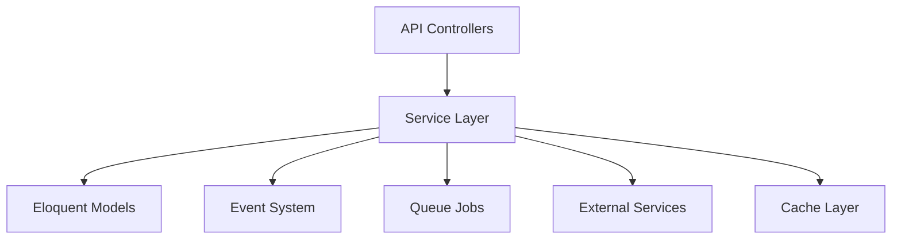
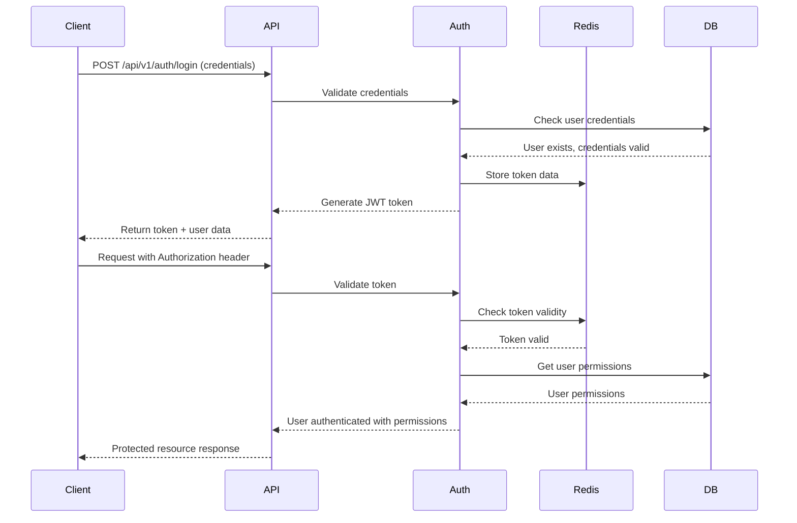
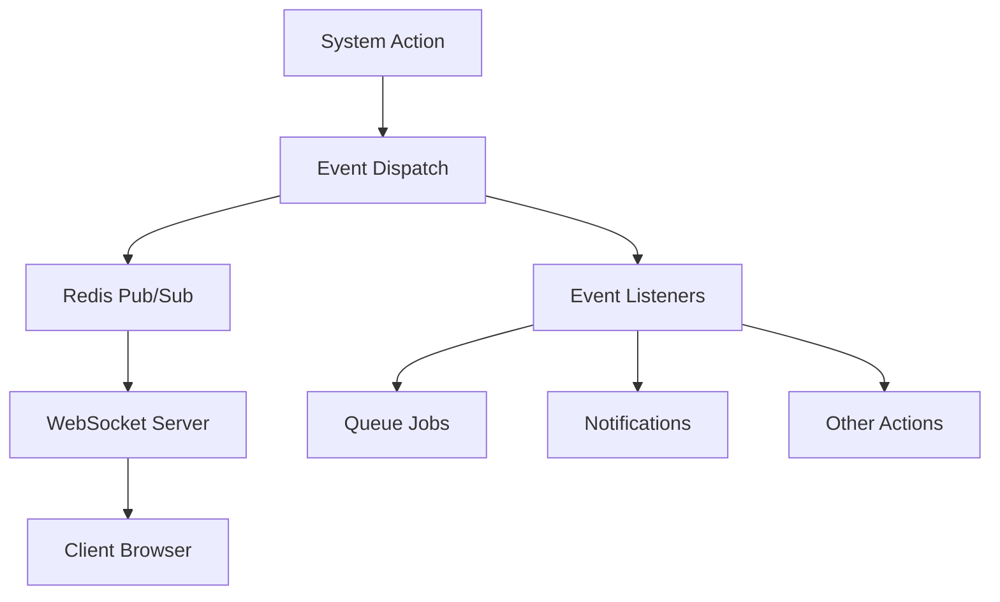
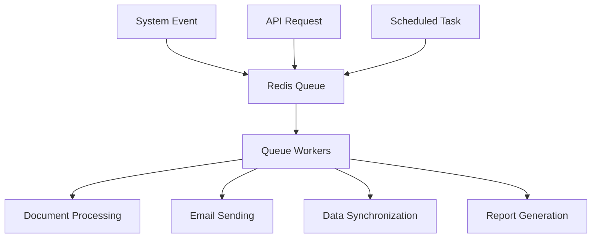
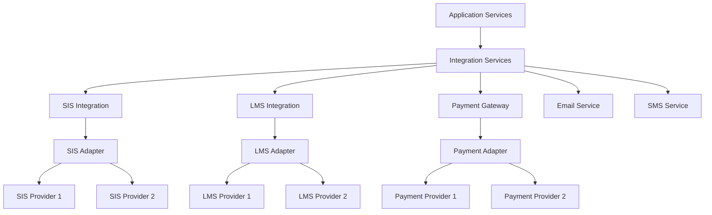
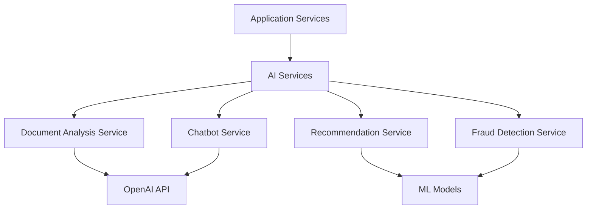

## 1. Introduction

This document provides a detailed description of the backend architecture for the Student Admissions Enrollment Platform. It covers the Laravel-based implementation, including the service layer design, API structure, event system, and integration patterns.

### 1.1 Purpose

The purpose of this document is to provide developers, architects, and other technical stakeholders with a comprehensive understanding of the backend architecture. It serves as a reference for development, maintenance, and future enhancements of the platform.

### 1.2 Scope

This document covers the following aspects of the backend architecture:

- Framework and technology stack
- Directory structure and organization
- Service layer design and implementation
- API design and controllers
- Authentication and authorization
- Event-driven architecture
- Background processing
- Integration patterns
- Error handling and logging
- Performance optimization

### 1.3 Related Documents

This document should be read in conjunction with the following related architecture documents:

- [Database Schema](database-schema.md): Database design and optimization
- [Integration Points](integration-points.md): External system integration details
- Workflow Architecture: The platform includes a workflow engine and editor implementation for managing admissions processes

## 2. Technology Stack

The backend of the Student Admissions Enrollment Platform is built using a modern PHP technology stack centered around the Laravel framework.

### 2.1 Core Technologies

| Technology | Version | Purpose |
| --- | --- | --- |
| PHP | 8.2+ | Primary programming language |
| Laravel | 10.x | Web application framework |
| MySQL | 8.0+ | Relational database |
| Redis | 7.0+ | Caching, queues, and session management |
| Composer | 2.x | Dependency management |

### 2.2 Laravel Packages

| Package | Purpose | Implementation |
| --- | --- | --- |
| Laravel Sanctum | API authentication | Token-based authentication with ability to revoke tokens |
| Laravel Horizon | Queue monitoring | Dashboard for monitoring Redis queues with real-time metrics |
| Laravel Echo | WebSockets | Real-time event broadcasting for notifications |
| Laravel Telescope | Debugging | Development tool for request monitoring (dev environment only) |

### 2.3 External Services

| Service | Purpose | Integration Method |
| --- | --- | --- |
| AWS S3 | Document storage | Laravel Storage facade with S3 driver |
| OpenAI API | AI document analysis | HTTP client with API key authentication |
| Stripe | Payment processing | Official Stripe PHP SDK |
| Mailgun | Email delivery | Laravel Mail with Mailgun driver |
| Twilio | SMS notifications | Official Twilio PHP SDK |

## 3. Directory Structure

The backend follows Laravel's directory structure with some customizations to support the service-oriented architecture.

### 3.1 Core Directories
```
src/backend/
├── app/                  # Application code
│   ├── Console/          # Console commands
│   ├── Events/           # Event classes
│   ├── Exceptions/       # Exception handlers
│   ├── Http/             # HTTP layer (controllers, middleware, requests)
│   ├── Jobs/             # Queue jobs
│   ├── Listeners/        # Event listeners
│   ├── Models/           # Eloquent models
│   ├── Providers/        # Service providers
│   └── Services/         # Service layer
├── bootstrap/            # Framework bootstrap files
├── config/               # Configuration files
├── database/             # Database migrations, seeds, factories
├── public/               # Public assets
├── resources/            # Views, language files, assets
├── routes/               # Route definitions
├── storage/              # Application storage
└── tests/                # Test files
```

### 3.2 Service Layer Organization

The `app/Services` directory is organized by domain and functionality:

```
app/Services/
├── AI/                  # AI-related services
│   ├── ChatbotService.php
│   ├── DocumentAnalysisService.php
│   ├── FraudDetectionService.php
│   └── RecommendationService.php
├── Integration/         # External system integrations
│   ├── EmailService.php
│   ├── LMSIntegrationService.php
│   ├── PaymentGatewayService.php
│   ├── SISIntegrationService.php
│   └── SMSService.php
├── ApplicationService.php
├── AuditService.php
├── AuthService.php
├── DocumentService.php
├── DocumentVerificationService.php
├── FinancialAidService.php
├── MessageService.php
├── NotificationService.php
├── PaymentService.php
├── StorageService.php
├── UserService.php
├── WorkflowEngineService.php
└── WorkflowService.php
```

### 3.3 API Controllers Organization

The API controllers are versioned and organized by resource:

```
app/Http/Controllers/Api/
└── V1/
    ├── Admin/
    │   ├── ApplicationReviewController.php
    │   ├── ReportingController.php
    │   ├── RolePermissionController.php
    │   ├── SystemSettingsController.php
    │   ├── UserManagementController.php
    │   └── WorkflowEditorController.php
    ├── ApplicationController.php
    ├── AuthController.php
    ├── DocumentController.php
    ├── FinancialAidController.php
    ├── MessageController.php
    ├── NotificationController.php
    ├── PaymentController.php
    ├── UserController.php
    └── WorkflowController.php
```

## 4. Service Layer Architecture

The service layer is the core of the backend architecture, implementing the business logic and orchestrating operations across the system.

### 4.1 Service Layer Design

The service layer follows these design principles:

- **Single Responsibility**: Each service focuses on a specific domain or functionality
- **Dependency Injection**: Services receive their dependencies through constructor injection
- **Interface Segregation**: Services expose only the methods needed by their clients
- **Encapsulation**: Business logic is encapsulated within services, not exposed in controllers
- **Testability**: Services are designed to be easily testable in isolation



### 4.2 Core Services

| Service | Responsibility | Key Dependencies |
| --- | --- | --- |
| ApplicationService | Manage application lifecycle | DocumentService, WorkflowEngineService, NotificationService |
| DocumentService | Handle document operations | StorageService, AI DocumentAnalysisService |
| WorkflowEngineService | Execute workflow processes | WorkflowService, NotificationService |
| AuthService | Manage authentication and authorization | User model, Redis |
| NotificationService | Send multi-channel communications | EmailService, SMSService, Redis |
| PaymentService | Process payments | PaymentGatewayService, AuditService |

### 4.3 Service Implementation Pattern

Services follow a consistent implementation pattern:

```php
class ApplicationService
{
    protected $documentService;
    protected $workflowEngine;
    protected $notificationService;
    protected $auditService;

    public function __construct(
        DocumentService $documentService,
        WorkflowEngineService $workflowEngine,
        NotificationService $notificationService,
        AuditService $auditService
    ) {
        $this->documentService = $documentService;
        $this->workflowEngine = $workflowEngine;
        $this->notificationService = $notificationService;
        $this->auditService = $auditService;
    }

    public function createApplication(int $userId, string $applicationType, string $academicTerm, string $academicYear, array $applicationData): Application
    {
        // Business logic implementation
    }

    // Other public methods...
}
```

### 4.4 Service Registration

Services are registered in the Laravel service container through service providers:

```php
// AppServiceProvider.php
public function register()
{
    $this->app->singleton(ApplicationService::class, function ($app) {
        return new ApplicationService(
            $app->make(DocumentService::class),
            $app->make(WorkflowEngineService::class),
            $app->make(NotificationService::class),
            $app->make(AuditService::class)
        );
    });
    
    // Other service registrations...
}
```

## 5. API Architecture

The API follows RESTful principles with resource-oriented endpoints, consistent naming conventions, and appropriate HTTP methods.

### 5.1 API Design Principles

The API is designed according to the following principles:

- **Versioned API**: All endpoints are prefixed with `/api/v1/` to support future versioning
- **Resource-Based Structure**: Endpoints are organized around core resources (applications, documents, users)
- **HTTP Methods**: Standard HTTP methods (GET, POST, PUT, DELETE) for CRUD operations
- **Status Codes**: Appropriate HTTP status codes for different responses
- **Consistent Response Format**: Standardized JSON structure for all responses
- **Pagination**: Consistent pagination for collection endpoints
- **Filtering and Sorting**: Query parameters for filtering and sorting collections
- **Relationship Loading**: Parameters for including related resources

### 5.2 Controller Implementation Pattern

Controllers follow a consistent implementation pattern:

```php
class ApplicationController extends Controller
{
    protected $applicationService;

    public function __construct(ApplicationService $applicationService)
    {
        $this->applicationService = $applicationService;
    }

    public function index(Request $request)
    {
        $userId = Auth::id();
        $filters = $request->only(['type', 'term', 'year', 'status']);
        
        $applications = $this->applicationService->getUserApplications($userId, $filters);
        
        return response()->json([
            'success' => true,
            'data' => ApplicationResource::collection($applications),
        ]);
    }

    // Other controller methods...
}
```

### 5.3 Request Validation

Request validation is implemented using Laravel's Form Request Validation:

```php
class ApplicationStoreRequest extends FormRequest
{
    public function authorize()
    {
        return true; // Authorization is handled by middleware
    }

    public function rules()
    {
        return [
            'application_type' => 'required|string|in:undergraduate,graduate,transfer',
            'academic_term' => 'required|string|in:fall,spring,summer',
            'academic_year' => 'required|string|regex:/^\d{4}-\d{4}$/',
            'application_data' => 'required|array',
            'application_data.personal_information' => 'required|array',
            // Additional validation rules...
        ];
    }
}
```

### 5.4 Resource Transformations

API responses are transformed using Laravel's API Resources:

```php
class ApplicationResource extends JsonResource
{
    public function toArray($request)
    {
        return [
            'id' => $this->id,
            'application_type' => $this->application_type,
            'academic_term' => $this->academic_term,
            'academic_year' => $this->academic_year,
            'status' => [
                'id' => $this->current_status_id,
                'name' => $this->currentStatus->status ?? null,
                'updated_at' => $this->currentStatus->created_at ?? null,
            ],
            'is_submitted' => (bool) $this->is_submitted,
            'submitted_at' => $this->submitted_at,
            'created_at' => $this->created_at,
            'updated_at' => $this->updated_at,
            // Conditional relationships
            'user' => $this->when($this->relationLoaded('user'), new UserResource($this->user)),
            'documents' => $this->when($this->relationLoaded('documents'), DocumentResource::collection($this->documents)),
            'statuses' => $this->when($this->relationLoaded('statuses'), ApplicationStatusResource::collection($this->statuses)),
        ];
    }
}
```

### 5.5 API Response Format

All API responses follow a consistent structure:

```json
{
  "success": true,
  "data": {
    // Resource data or collection
  },
  "meta": {
    "pagination": {
      "total": 100,
      "per_page": 15,
      "current_page": 1,
      "last_page": 7,
      "from": 1,
      "to": 15
    }
  },
  "message": "Optional success message"
}
```

Error responses:

```json
{
  "success": false,
  "error": {
    "code": "ERROR_CODE",
    "message": "Human-readable error message",
    "details": {
      // Optional detailed error information
      "field_name": ["Validation error message"]
    }
  }
}
```

## 6. Authentication and Authorization

The platform implements a comprehensive authentication and authorization system to secure access to resources and functionality.

### 6.1 Authentication Implementation

Authentication is implemented using Laravel Sanctum for token-based API authentication:



Key authentication features:
- JWT tokens with Redis storage for revocation capability
- Token expiration and refresh mechanism
- Multi-factor authentication support
- Session management with Redis

### 6.2 Authorization Framework

Authorization is implemented using a role-based access control (RBAC) system with permission granularity:

```php
// CheckPermission middleware
public function handle($request, Closure $next, $permission)
{
    if (!$request->user()->hasPermission($permission)) {
        return response()->json([
            'success' => false,
            'error' => [
                'code' => 'PERMISSION_DENIED',
                'message' => 'You do not have permission to access this resource.'
            ]
        ], 403);
    }

    return $next($request);
}

// Route definition with permission check
Route::get('/applications/{id}', 'ApplicationController@show')
    ->middleware('auth:sanctum', 'permission:applications.view');
```

The authorization system includes:
- Hierarchical roles with inheritance
- Granular permissions for specific actions
- Permission checking at the controller and service levels
- Resource ownership verification

### 6.3 User Model Implementation

The User model implements authentication and authorization methods:

```php
class User extends Authenticatable
{
    use HasApiTokens, Notifiable;

    // Relationships
    public function roles()
    {
        return $this->belongsToMany(Role::class, 'user_roles');
    }

    public function profile()
    {
        return $this->hasOne(UserProfile::class);
    }

    // Authorization methods
    public function hasRole($role)
    {
        return $this->roles()->where('name', $role)->exists();
    }

    public function hasPermission($permission)
    {
        return $this->roles()
            ->whereHas('permissions', function ($query) use ($permission) {
                $query->where('name', $permission);
            })
            ->exists();
    }
}
```

### 6.4 Security Middleware

The application includes several security-related middleware:

| Middleware | Purpose | Implementation |
| --- | --- | --- |
| Authenticate | Verify API tokens | Laravel Sanctum authentication |
| CheckRole | Verify user roles | Custom middleware for role checks |
| CheckPermission | Verify user permissions | Custom middleware for permission checks |
| RateLimiter | Prevent abuse | Request throttling based on user or IP |
| SecurityHeaders | Add security headers | Custom middleware for security headers |

## 7. Event-Driven Architecture

The platform implements an event-driven architecture for handling system events and notifications.

### 7.1 Event System Design

The event system uses Laravel's event broadcasting system with Redis:



### 7.2 Key Events

| Event | Description | Listeners |
| --- | --- | --- |
| ApplicationSubmittedEvent | Fired when an application is submitted | SendApplicationConfirmationListener, ProcessDocumentVerificationListener |
| ApplicationStatusChangedEvent | Fired when an application status changes | NotifyAboutApplicationStatusChangeListener, TriggerWorkflowTransitionListener |
| DocumentUploadedEvent | Fired when a document is uploaded | ProcessDocumentVerificationListener |
| DocumentVerifiedEvent | Fired when a document is verified | UpdateApplicationStatusListener |
| PaymentCompletedEvent | Fired when a payment is completed | GeneratePaymentReceiptListener, UpdateApplicationStatusListener |
| WorkflowStageCompletedEvent | Fired when a workflow stage is completed | NotifyAboutStageCompletionListener, CheckAutomaticTransitionsListener |

### 7.3 Event Implementation

Events are implemented as Laravel event classes:

```php
class ApplicationStatusChangedEvent
{
    use Dispatchable, InteractsWithSockets, SerializesModels;

    public $application;
    public $newStatus;
    public $previousStatus;

    public function __construct(Application $application, ApplicationStatus $newStatus, ?ApplicationStatus $previousStatus)
    {
        $this->application = $application;
        $this->newStatus = $newStatus;
        $this->previousStatus = $previousStatus;
    }

    public function broadcastOn()
    {
        return new PrivateChannel('application.' . $this->application->id);
    }
}
```

### 7.4 Listener Implementation

Event listeners handle specific actions in response to events:

```php
class NotifyAboutApplicationStatusChangeListener
{
    protected $notificationService;

    public function __construct(NotificationService $notificationService)
    {
        $this->notificationService = $notificationService;
    }

    public function handle(ApplicationStatusChangedEvent $event)
    {
        $application = $event->application;
        $user = $application->user;
        $status = $event->newStatus;

        $this->notificationService->sendFromTemplate(
            'application_status_changed',
            $user->id,
            [
                'application_id' => $application->id,
                'status' => $status->status,
                'updated_at' => $status->created_at->format('Y-m-d H:i:s')
            ]
        );
    }
}
```

### 7.5 Real-time Updates

Real-time updates are implemented using Laravel Echo and WebSockets:

```php
// Broadcasting event to WebSocket
public function broadcastOn()
{
    return new PrivateChannel('application.' . $this->application->id);
}

// Client-side subscription
Echo.private(`application.${applicationId}`)
    .listen('ApplicationStatusChangedEvent', (e) => {
        // Update UI with new status
        updateApplicationStatus(e.newStatus);
    });
```

Authentication for private channels is handled by the Laravel Echo Server with Redis.

## 8. Background Processing

The platform uses a queue-based approach for background processing of time-consuming or asynchronous tasks.

### 8.1 Queue Architecture

Background processing is implemented using Laravel's queue system with Redis:



### 8.2 Queue Configuration

The queue system is configured with multiple queues for different types of jobs:

```php
// config/queue.php
'redis' => [
    'driver' => 'redis',
    'connection' => 'default',
    'queue' => env('REDIS_QUEUE', 'default'),
    'retry_after' => 90,
    'block_for' => null,
],

// Queue priorities and assignments
'queues' => [
    'high' => ['notifications', 'payments'],
    'default' => ['processing', 'sync'],
    'low' => ['reports', 'cleanup']
],
```

### 8.3 Job Implementation

Background jobs are implemented as Laravel job classes:

```php
class ProcessDocumentVerification implements ShouldQueue
{
    use Dispatchable, InteractsWithQueue, Queueable, SerializesModels;

    protected $document;

    public function __construct(Document $document)
    {
        $this->document = $document;
    }

    public function handle(DocumentVerificationService $verificationService, AIService $aiService)
    {
        try {
            // Process document verification
            $result = $aiService->analyzeDocument($this->document);
            $verificationService->processVerificationResult($this->document, $result);
        } catch (Exception $e) {
            // Handle failure and determine if job should be retried
            if ($this->attempts() < 3) {
                $this->release(60 * $this->attempts()); // Exponential backoff
            } else {
                $this->fail($e);
            }
        }
    }
}
```

### 8.4 Scheduled Tasks

Recurring tasks are scheduled using Laravel's task scheduler:

```php
// app/Console/Kernel.php
protected function schedule(Schedule $schedule)
{
    // Daily tasks
    $schedule->command('cleanup:temp-files')->daily();
    $schedule->command('generate:sitemap')->daily();
    
    // Hourly tasks
    $schedule->command('send:reminder-notifications')->hourly();
    
    // Custom schedule
    $schedule->job(new SyncWithSIS)->dailyAt('01:00');
    $schedule->job(new SyncWithLMS)->dailyAt('02:00');
    
    // Frequent tasks
    $schedule->command('queue:prune-failed')->everyFifteenMinutes();
}
```

### 8.5 Queue Monitoring

Queue monitoring is implemented using Laravel Horizon:

```php
// config/horizon.php
'environments' => [
    'production' => [
        'supervisor-1' => [
            'connection' => 'redis',
            'queue' => ['high', 'default'],
            'balance' => 'auto',
            'processes' => 10,
            'tries' => 3,
        ],
        'supervisor-2' => [
            'connection' => 'redis',
            'queue' => ['low'],
            'balance' => 'auto',
            'processes' => 3,
            'tries' => 3,
        ],
    ],
],
```

Horizon provides a dashboard for monitoring queue metrics, job completion, and failure rates.

## 9. Integration Architecture

The platform integrates with several external systems through a dedicated integration layer.

### 9.1 Integration Layer Design

The integration layer follows an adapter pattern to abstract external system details:



### 9.2 Integration Service Implementation

Integration services are implemented as dedicated service classes:

```php
class SISIntegrationService
{
    protected $integration;
    protected $config;
    protected $apiUrl;
    protected $apiKey;
    protected $apiSecret;
    // Other properties...

    public function __construct()
    {
        $this->initialize();
    }

    protected function initialize()
    {
        // Load configuration and set up service
    }

    public function createStudent(User $user, Application $application): array
    {
        // Prepare student data
        // Map to SIS fields
        // Send to SIS
    }

    // Other methods...
}
```

### 9.3 Error Handling and Retry Logic

Integration services implement robust error handling and retry logic:

```php
protected function sendApiRequest(string $method, string $endpoint, array $data = [], array $headers = []): array
{
    $attempts = 0;
    $maxAttempts = $this->retryAttempts;
    $delay = $this->retryDelay;

    while ($attempts < $maxAttempts) {
        try {
            $response = Http::withHeaders($headers)
                ->timeout($this->timeout)
                ->$method($this->apiUrl . '/' . $endpoint, $data);

            if ($response->successful()) {
                return $response->json();
            }

            // Handle API errors
            // Determine if retry is appropriate
            // Wait before retrying
        } catch (Exception $e) {
            // Handle connection errors
            // Determine if retry is appropriate
            // Wait before retrying
        }
    }

    throw new Exception('SIS API request failed after multiple attempts');
}
```

### 9.4 Integration Logging

All integration activities are logged for auditing and troubleshooting:

```php
public function logActivity(string $operation, string $status, ?array $requestData = null, ?array $responseData = null, ?string $errorMessage = null): IntegrationLog
{
    // Sanitize sensitive data
    // Create log entry
    // Save log entry
}
```

Integration logs are stored in the database for historical tracking and analysis.

### 9.5 Webhook Handling

The platform supports webhook integration for receiving updates from external systems:

```php
public function handleWebhook(array $payload): bool
{
    // Validate webhook signature
    // Determine event type
    // Process based on event type
    // Update local data
}
```

## 10. AI Components

The platform includes AI-powered features implemented through dedicated AI services.

### 10.1 AI Service Architecture

AI services are organized in a dedicated namespace with service-specific implementations:



### 10.2 Document Analysis Implementation

The document analysis service uses the OpenAI API for document processing:

```php
class DocumentAnalysisService
{
    protected $openAIClient;
    protected $model;
    protected $confidenceThreshold;
    // Other properties...

    public function __construct(OpenAI $openAIClient)
    {
        $this->openAIClient = $openAIClient;
        $this->model = config('ai.document_analysis.model', 'gpt-4-vision-preview');
        $this->confidenceThreshold = config('ai.document_analysis.confidence_threshold', 0.85);
        // Initialize other properties...
    }

    public function analyzeDocument(Document $document): array
    {
        // Validate document is supported
        // Prepare document for analysis
        // Call OpenAI API
        // Parse response
        // Store results for future reference
    }

    // Other methods...
}
```

### 10.3 Chatbot Implementation

The chatbot service provides conversational AI capabilities:

```php
class ChatbotService
{
    protected $openAIClient;
    protected $model;
    protected $contextWindow;
    // Other properties...

    public function __construct(OpenAI $openAIClient)
    {
        $this->openAIClient = $openAIClient;
        $this->model = config('ai.chatbot.model', 'gpt-4');
        $this->contextWindow = config('ai.chatbot.context_window', 10);
        // Initialize other properties...
    }

    public function generateResponse(string $userMessage, array $conversationHistory = [], array $contextData = []): string
    {
        // Prepare conversation history
        // Add user message
        // Add context data if available
        // Call OpenAI API
        // Extract and return response
    }

    // Other methods...
}
```

### 10.4 AI Service Registration

AI services are registered through a dedicated service provider:

```php
class AIServiceProvider extends ServiceProvider
{
    public function register()
    {
        // Register OpenAI client
        $this->app->singleton(OpenAI::class, function ($app) {
            return OpenAI::client(config('ai.openai.api_key'));
        });
        
        // Register AI services
        $this->app->singleton(DocumentAnalysisService::class, function ($app) {
            return new DocumentAnalysisService($app->make(OpenAI::class));
        });
        
        $this->app->singleton(ChatbotService::class, function ($app) {
            return new ChatbotService($app->make(OpenAI::class));
        });
        
        // Register other AI services...
    }
}
```

### 10.5 AI Feature Configuration

AI features are configured through a dedicated configuration file:

```php
// config/ai.php
return [
    'openai' => [
        'api_key' => env('OPENAI_API_KEY'),
        'organization' => env('OPENAI_ORGANIZATION'),
    ],
    
    'document_analysis' => [
        'enabled' => env('AI_DOCUMENT_ANALYSIS_ENABLED', true),
        'model' => env('AI_DOCUMENT_ANALYSIS_MODEL', 'gpt-4-vision-preview'),
        'confidence_threshold' => env('AI_DOCUMENT_ANALYSIS_CONFIDENCE', 0.85),
        'tampering_detection_enabled' => env('AI_TAMPERING_DETECTION_ENABLED', true),
        'supported_document_types' => [
            'transcript',
            'identification',
            'recommendation_letter',
            'personal_statement',
            'financial_statement',
        ],
    ],
    
    'chatbot' => [
        'enabled' => env('AI_CHATBOT_ENABLED', true),
        'model' => env('AI_CHATBOT_MODEL', 'gpt-4'),
        'context_window' => env('AI_CHATBOT_CONTEXT_WINDOW', 10),
        'human_handoff_threshold' => env('AI_CHATBOT_HANDOFF_THRESHOLD', 0.4),
    ],
    
    // Other AI feature configurations...
];
```

## 11. Error Handling and Logging

The platform implements a comprehensive error handling and logging system.

### 11.1 Exception Handling

Custom exceptions are defined for different error scenarios:

```php
class ApplicationValidationException extends Exception
{
    protected $errors;

    public function __construct(string $message, array $errors = [], int $code = 0, Throwable $previous = null)
    {
        parent::__construct($message, $code, $previous);
        $this->errors = $errors;
    }

    public function getErrors(): array
    {
        return $this->errors;
    }

    public static function createFromValidationErrors(array $errors): self
    {
        return new self('Application validation failed', $errors);
    }
}
```

Exceptions are handled by a custom exception handler:

```php
class Handler extends ExceptionHandler
{
    // Exception handling methods...
    
    protected function renderApiException($request, Throwable $exception)
    {
        $statusCode = 500;
        $errorCode = 'SERVER_ERROR';
        $message = 'An unexpected error occurred';
        $details = null;

        if ($exception instanceof HttpException) {
            $statusCode = $exception->getStatusCode();
            $errorCode = 'HTTP_ERROR';
            $message = $exception->getMessage() ?: 'HTTP error occurred';
        } elseif ($exception instanceof ValidationException) {
            $statusCode = 422;
            $errorCode = 'VALIDATION_ERROR';
            $message = 'The given data was invalid';
            $details = $exception->errors();
        } elseif ($exception instanceof ApplicationValidationException) {
            $statusCode = 422;
            $errorCode = 'APPLICATION_VALIDATION_ERROR';
            $message = $exception->getMessage();
            $details = $exception->getErrors();
        } elseif ($exception instanceof DocumentProcessingException) {
            $statusCode = 422;
            $errorCode = 'DOCUMENT_PROCESSING_ERROR';
            $message = $exception->getMessage();
        } elseif ($exception instanceof IntegrationException) {
            $statusCode = 503;
            $errorCode = 'INTEGRATION_ERROR';
            $message = $exception->getMessage();
        }
        // Other exception types...

        return response()->json([
            'success' => false,
            'error' => [
                'code' => $errorCode,
                'message' => $message,
                'details' => $details,
            ]
        ], $statusCode);
    }
}
```

### 11.2 Logging Strategy

The platform uses a structured logging approach: