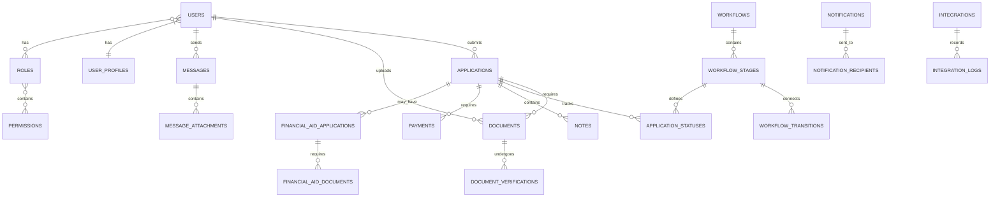

# Database Schema Documentation

## Introduction

This document provides a comprehensive overview of the database schema for the Student Admissions Enrollment Platform. The platform uses MySQL 8.0 as its primary relational database management system, with a normalized design approach and strategic denormalization for performance optimization. The schema is designed to support the entire student admissions lifecycle, from initial application to enrollment confirmation.

## Entity Relationship Diagram

The following entity relationship diagram illustrates the core tables and their relationships in the Student Admissions Enrollment Platform database:

## Core Table Structures

The database schema is organized into logical groups of tables that support different aspects of the application. Each table is designed with appropriate indexes, foreign keys, and constraints to ensure data integrity and query performance.

### User Management Tables

These tables manage user identity, authentication, authorization, and profile information.

#### users

Stores core user authentication data including credentials and account status.

| Column | Type | Nullable | Description |
|--------|------|----------|-------------|
| id | bigint unsigned | No | Primary key |
| email | varchar(255) | No | User's email address, must be unique |
| password | varchar(255) | No | Bcrypt-hashed password |
| remember_token | varchar(100) | Yes | Token for 'remember me' functionality |
| email_verified_at | timestamp | Yes | When the email was verified |
| is_active | boolean | No | Whether the account is active (default: true) |
| created_at | timestamp | Yes | Creation timestamp |
| updated_at | timestamp | Yes | Last update timestamp |
| last_login_at | timestamp | Yes | Last login timestamp |
| mfa_secret | varchar(100) | Yes | Secret for multi-factor authentication |

**Indexes:**
- `users_email_unique` (unique): `email`
- `users_is_active_index`: `is_active`

#### user_profiles

Stores detailed personal information about users.

| Column | Type | Nullable | Description |
|--------|------|----------|-------------|
| id | bigint unsigned | No | Primary key |
| user_id | bigint unsigned | No | Foreign key to users table |
| first_name | varchar(100) | No | User's first name |
| last_name | varchar(100) | No | User's last name |
| date_of_birth | date | Yes | User's date of birth |
| phone_number | varchar(20) | Yes | User's phone number |
| address_line1 | varchar(255) | Yes | First line of address |
| address_line2 | varchar(255) | Yes | Second line of address |
| city | varchar(100) | Yes | City |
| state | varchar(100) | Yes | State/province |
| postal_code | varchar(20) | Yes | Postal/ZIP code |
| country | varchar(100) | Yes | Country |
| notification_preferences | json | Yes | JSON object with notification preferences |
| created_at | timestamp | Yes | Creation timestamp |
| updated_at | timestamp | Yes | Last update timestamp |

**Indexes:**
- `user_profiles_user_id_index`: `user_id`
- `user_profiles_name_index`: `last_name, first_name`

**Foreign Keys:**
- `user_profiles_user_id_foreign`: `user_id` references `users(id)` (on delete: cascade)

#### roles

Defines user roles for role-based access control.

| Column | Type | Nullable | Description |
|--------|------|----------|-------------|
| id | bigint unsigned | No | Primary key |
| name | varchar(100) | No | Role name, must be unique |
| description | text | Yes | Role description |
| is_system_role | boolean | No | Whether this is a system-defined role (default: false) |
| created_at | timestamp | Yes | Creation timestamp |
| updated_at | timestamp | Yes | Last update timestamp |

**Indexes:**
- `roles_name_unique` (unique): `name`
- `roles_is_system_role_index`: `is_system_role`

#### permissions

Defines granular permissions for access control.

| Column | Type | Nullable | Description |
|--------|------|----------|-------------|
| id | bigint unsigned | No | Primary key |
| name | varchar(100) | No | Permission name, must be unique |
| description | text | Yes | Permission description |
| resource | varchar(100) | No | Resource the permission applies to |
| action | varchar(100) | No | Action allowed on the resource |
| created_at | timestamp | Yes | Creation timestamp |
| updated_at | timestamp | Yes | Last update timestamp |

**Indexes:**
- `permissions_name_unique` (unique): `name`
- `permissions_resource_action_index`: `resource, action`

#### role_permissions

Junction table linking roles to permissions.

| Column | Type | Nullable | Description |
|--------|------|----------|-------------|
| role_id | bigint unsigned | No | Foreign key to roles table |
| permission_id | bigint unsigned | No | Foreign key to permissions table |
| created_at | timestamp | Yes | Creation timestamp |
| updated_at | timestamp | Yes | Last update timestamp |

**Indexes:**
- Primary key: `role_id, permission_id`

**Foreign Keys:**
- `role_permissions_role_id_foreign`: `role_id` references `roles(id)` (on delete: cascade)
- `role_permissions_permission_id_foreign`: `permission_id` references `permissions(id)` (on delete: cascade)

#### user_roles

Junction table assigning roles to users.

| Column | Type | Nullable | Description |
|--------|------|----------|-------------|
| user_id | bigint unsigned | No | Foreign key to users table |
| role_id | bigint unsigned | No | Foreign key to roles table |
| created_at | timestamp | Yes | Creation timestamp |
| updated_at | timestamp | Yes | Last update timestamp |

**Indexes:**
- Primary key: `user_id, role_id`
- `user_roles_user_id_index`: `user_id`

**Foreign Keys:**
- `user_roles_user_id_foreign`: `user_id` references `users(id)` (on delete: cascade)
- `user_roles_role_id_foreign`: `role_id` references `roles(id)` (on delete: cascade)

### Application Management Tables

These tables manage the core application submission and tracking process.

#### applications

Stores application submissions and their current status.

| Column | Type | Nullable | Description |
|--------|------|----------|-------------|
| id | bigint unsigned | No | Primary key |
| user_id | bigint unsigned | No | Foreign key to users table |
| application_type | varchar(50) | No | Type of application (undergraduate, graduate, transfer, etc.) |
| academic_term | varchar(50) | No | Academic term (Fall, Spring, Summer) |
| academic_year | varchar(9) | No | Academic year (e.g., 2023-2024) |
| current_status_id | bigint unsigned | Yes | Foreign key to application_statuses table |
| application_data | json | No | JSON data containing application form responses |
| is_submitted | boolean | No | Whether the application has been submitted (default: false) |
| submitted_at | timestamp | Yes | When the application was submitted |
| created_at | timestamp | Yes | Creation timestamp |
| updated_at | timestamp | Yes | Last update timestamp |

**Indexes:**
- `applications_user_id_index`: `user_id`
- `applications_type_term_year_index`: `application_type, academic_term, academic_year`
- `applications_current_status_id_index`: `current_status_id`
- `applications_is_submitted_submitted_at_index`: `is_submitted, submitted_at`

**Foreign Keys:**
- `applications_user_id_foreign`: `user_id` references `users(id)` (on delete: cascade)
- `applications_current_status_id_foreign`: `current_status_id` references `application_statuses(id)` (on delete: set null)

#### application_statuses

Tracks the history of status changes for applications.

| Column | Type | Nullable | Description |
|--------|------|----------|-------------|
| id | bigint unsigned | No | Primary key |
| application_id | bigint unsigned | No | Foreign key to applications table |
| workflow_stage_id | bigint unsigned | Yes | Foreign key to workflow_stages table |
| status | varchar(50) | No | Status value (e.g., 'submitted', 'under_review', 'accepted') |
| notes | text | Yes | Optional notes about the status change |
| created_by_user_id | bigint unsigned | No | Foreign key to users table, who created this status |
| created_at | timestamp | No | When the status was created |

**Indexes:**
- `application_statuses_application_id_index`: `application_id`
- `application_statuses_workflow_stage_id_index`: `workflow_stage_id`
- `application_statuses_created_at_index`: `created_at`

**Foreign Keys:**
- `application_statuses_application_id_foreign`: `application_id` references `applications(id)` (on delete: cascade)
- `application_statuses_workflow_stage_id_foreign`: `workflow_stage_id` references `workflow_stages(id)` (on delete: set null)
- `application_statuses_created_by_user_id_foreign`: `created_by_user_id` references `users(id)` (on delete: restrict)

**Partitioning:**
- Type: RANGE
- Expression: `UNIX_TIMESTAMP(created_at)`
- Partitions:
  - `p0`: < `UNIX_TIMESTAMP('2023-01-01')`
  - `p1`: < `UNIX_TIMESTAMP('2023-07-01')`
  - `p2`: < `UNIX_TIMESTAMP('2024-01-01')`
  - `p_future`: < `MAXVALUE`

#### notes

Stores notes and comments on applications.

| Column | Type | Nullable | Description |
|--------|------|----------|-------------|
| id | bigint unsigned | No | Primary key |
| application_id | bigint unsigned | No | Foreign key to applications table |
| user_id | bigint unsigned | No | Foreign key to users table, who created the note |
| content | text | No | Note content |
| is_internal | boolean | No | Whether the note is internal (staff-only) or visible to the applicant (default: false) |
| created_at | timestamp | Yes | Creation timestamp |
| updated_at | timestamp | Yes | Last update timestamp |

**Indexes:**
- `notes_application_id_index`: `application_id`
- `notes_user_id_index`: `user_id`
- `notes_is_internal_index`: `is_internal`

**Foreign Keys:**
- `notes_application_id_foreign`: `application_id` references `applications(id)` (on delete: cascade)
- `notes_user_id_foreign`: `user_id` references `users(id)` (on delete: cascade)

### Document Management Tables

These tables manage document uploads, storage, and verification.

#### documents

Stores metadata for uploaded documents.

| Column | Type | Nullable | Description |
|--------|------|----------|-------------|
| id | bigint unsigned | No | Primary key |
| user_id | bigint unsigned | No | Foreign key to users table |
| application_id | bigint unsigned | No | Foreign key to applications table |
| document_type | varchar(50) | No | Type of document (transcript, ID, recommendation, etc.) |
| file_name | varchar(255) | No | Original filename |
| file_path | varchar(255) | No | Path to the file in storage |
| mime_type | varchar(100) | No | MIME type of the file |
| file_size | bigint unsigned | No | File size in bytes |
| is_verified | boolean | No | Whether the document has been verified (default: false) |
| verified_at | timestamp | Yes | When the document was verified |
| verified_by_user_id | bigint unsigned | Yes | Foreign key to users table, who verified the document |
| created_at | timestamp | Yes | Creation timestamp |
| updated_at | timestamp | Yes | Last update timestamp |

**Indexes:**
- `documents_user_id_index`: `user_id`
- `documents_application_id_index`: `application_id`
- `documents_document_type_index`: `document_type`
- `documents_is_verified_index`: `is_verified`

**Foreign Keys:**
- `documents_user_id_foreign`: `user_id` references `users(id)` (on delete: cascade)
- `documents_application_id_foreign`: `application_id` references `applications(id)` (on delete: cascade)
- `documents_verified_by_user_id_foreign`: `verified_by_user_id` references `users(id)` (on delete: set null)

**Partitioning:**
- Type: LIST
- Expression: `document_type`
- Partitions:
  - `p_transcripts`: IN ('transcript', 'academic_record')
  - `p_identification`: IN ('passport', 'drivers_license', 'id_card')
  - `p_financial`: IN ('financial_statement', 'tax_return', 'scholarship')
  - `p_other`: IN ('recommendation', 'personal_statement', 'resume', 'other')

#### document_verifications

Stores verification records for documents.

| Column | Type | Nullable | Description |
|--------|------|----------|-------------|
| id | bigint unsigned | No | Primary key |
| document_id | bigint unsigned | No | Foreign key to documents table |
| verification_method | varchar(50) | No | Method used for verification (ai, manual, external) |
| verification_status | varchar(50) | No | Status of verification (verified, rejected, pending) |
| verification_data | json | Yes | JSON data with verification details and extracted information |
| confidence_score | float | Yes | Confidence score for AI verification (0.0 to 1.0) |
| notes | text | Yes | Notes about the verification |
| verified_by_user_id | bigint unsigned | Yes | Foreign key to users table, who performed the verification |
| created_at | timestamp | Yes | Creation timestamp |

**Indexes:**
- `document_verifications_document_id_index`: `document_id`
- `document_verifications_verification_method_index`: `verification_method`
- `document_verifications_verification_status_index`: `verification_status`

**Foreign Keys:**
- `document_verifications_document_id_foreign`: `document_id` references `documents(id)` (on delete: cascade)
- `document_verifications_verified_by_user_id_foreign`: `verified_by_user_id` references `users(id)` (on delete: set null)

### Workflow Management Tables

These tables define the admissions workflow process with customizable stages and transitions.

#### workflows

Defines workflow templates for different application types.

| Column | Type | Nullable | Description |
|--------|------|----------|-------------|
| id | bigint unsigned | No | Primary key |
| name | varchar(100) | No | Workflow name |
| description | text | Yes | Workflow description |
| application_type | varchar(50) | No | Type of application this workflow applies to |
| is_active | boolean | No | Whether this workflow is active (default: false) |
| created_by_user_id | bigint unsigned | No | Foreign key to users table, who created this workflow |
| created_at | timestamp | Yes | Creation timestamp |
| updated_at | timestamp | Yes | Last update timestamp |

**Indexes:**
- `workflows_application_type_index`: `application_type`
- `workflows_is_active_index`: `is_active`
- `workflows_application_type_is_active_index`: `application_type, is_active`

**Foreign Keys:**
- `workflows_created_by_user_id_foreign`: `created_by_user_id` references `users(id)` (on delete: restrict)

#### workflow_stages

Defines stages within workflows.

| Column | Type | Nullable | Description |
|--------|------|----------|-------------|
| id | bigint unsigned | No | Primary key |
| workflow_id | bigint unsigned | No | Foreign key to workflows table |
| name | varchar(100) | No | Stage name |
| description | text | Yes | Stage description |
| sequence | int | No | Order of the stage within the workflow |
| required_documents | json | Yes | JSON array of required document types |
| required_actions | json | Yes | JSON array of required actions |
| notification_triggers | json | Yes | JSON configuration for notifications |
| assigned_role_id | bigint unsigned | Yes | Foreign key to roles table |
| created_at | timestamp | Yes | Creation timestamp |
| updated_at | timestamp | Yes | Last update timestamp |

**Indexes:**
- `workflow_stages_workflow_id_index`: `workflow_id`
- `workflow_stages_sequence_index`: `sequence`
- `workflow_stages_assigned_role_id_index`: `assigned_role_id`

**Foreign Keys:**
- `workflow_stages_workflow_id_foreign`: `workflow_id` references `workflows(id)` (on delete: cascade)
- `workflow_stages_assigned_role_id_foreign`: `assigned_role_id` references `roles(id)` (on delete: set null)

#### workflow_transitions

Defines possible transitions between workflow stages.

| Column | Type | Nullable | Description |
|--------|------|----------|-------------|
| id | bigint unsigned | No | Primary key |
| source_stage_id | bigint unsigned | No | Foreign key to workflow_stages table (from stage) |
| target_stage_id | bigint unsigned | No | Foreign key to workflow_stages table (to stage) |
| name | varchar(100) | No | Transition name |
| description | text | Yes | Transition description |
| transition_conditions | json | Yes | JSON conditions that must be met for transition |
| required_permissions | json | Yes | JSON array of permissions required to trigger transition |
| is_automatic | boolean | No | Whether transition happens automatically when conditions are met (default: false) |
| created_at | timestamp | Yes | Creation timestamp |
| updated_at | timestamp | Yes | Last update timestamp |

**Indexes:**
- `workflow_transitions_source_stage_id_index`: `source_stage_id`
- `workflow_transitions_target_stage_id_index`: `target_stage_id`
- `workflow_transitions_is_automatic_index`: `is_automatic`

**Foreign Keys:**
- `workflow_transitions_source_stage_id_foreign`: `source_stage_id` references `workflow_stages(id)` (on delete: cascade)
- `workflow_transitions_target_stage_id_foreign`: `target_stage_id` references `workflow_stages(id)` (on delete: cascade)

### Communication Tables

These tables manage messaging and notifications within the platform.

#### messages

Stores in-app messages between users.

| Column | Type | Nullable | Description |
|--------|------|----------|-------------|
| id | bigint unsigned | No | Primary key |
| sender_user_id | bigint unsigned | No | Foreign key to users table (sender) |
| recipient_user_id | bigint unsigned | No | Foreign key to users table (recipient) |
| application_id | bigint unsigned | Yes | Foreign key to applications table (optional) |
| subject | varchar(255) | No | Message subject |
| message_body | text | No | Message content |
| is_read | boolean | No | Whether the message has been read (default: false) |
| read_at | timestamp | Yes | When the message was read |
| created_at | timestamp | Yes | Creation timestamp |
| updated_at | timestamp | Yes | Last update timestamp |

**Indexes:**
- `messages_sender_user_id_index`: `sender_user_id`
- `messages_recipient_user_id_index`: `recipient_user_id`
- `messages_application_id_index`: `application_id`
- `messages_is_read_index`: `is_read`
- `messages_content_fulltext` (fulltext): `subject, message_body`

**Foreign Keys:**
- `messages_sender_user_id_foreign`: `sender_user_id` references `users(id)` (on delete: cascade)
- `messages_recipient_user_id_foreign`: `recipient_user_id` references `users(id)` (on delete: cascade)
- `messages_application_id_foreign`: `application_id` references `applications(id)` (on delete: set null)

**Partitioning:**
- Type: RANGE
- Expression: `UNIX_TIMESTAMP(created_at)`
- Partitions:
  - `p0`: < `UNIX_TIMESTAMP('2023-01-01')`
  - `p1`: < `UNIX_TIMESTAMP('2023-04-01')`
  - `p2`: < `UNIX_TIMESTAMP('2023-07-01')`
  - `p3`: < `UNIX_TIMESTAMP('2023-10-01')`
  - `p4`: < `UNIX_TIMESTAMP('2024-01-01')`
  - `p_future`: < `MAXVALUE`

#### message_attachments

Stores files attached to messages.

| Column | Type | Nullable | Description |
|--------|------|----------|-------------|
| id | bigint unsigned | No | Primary key |
| message_id | bigint unsigned | No | Foreign key to messages table |
| file_name | varchar(255) | No | Original filename |
| file_path | varchar(255) | No | Path to the file in storage |
| mime_type | varchar(100) | No | MIME type of the file |
| file_size | bigint unsigned | No | File size in bytes |
| created_at | timestamp | Yes | Creation timestamp |

**Indexes:**
- `message_attachments_message_id_index`: `message_id`

**Foreign Keys:**
- `message_attachments_message_id_foreign`: `message_id` references `messages(id)` (on delete: cascade)

#### notifications

Stores system notifications.

| Column | Type | Nullable | Description |
|--------|------|----------|-------------|
| id | bigint unsigned | No | Primary key |
| type | varchar(50) | No | Notification type |
| channel | varchar(50) | No | Delivery channel (in-app, email, sms) |
| subject | varchar(255) | No | Notification subject |
| content | text | No | Notification content |
| data | json | Yes | Additional JSON data for the notification |
| created_at | timestamp | Yes | Creation timestamp |

**Indexes:**
- `notifications_type_index`: `type`
- `notifications_channel_index`: `channel`
- `notifications_created_at_index`: `created_at`

#### notification_recipients

Links notifications to recipients and tracks delivery status.

| Column | Type | Nullable | Description |
|--------|------|----------|-------------|
| id | bigint unsigned | No | Primary key |
| notification_id | bigint unsigned | No | Foreign key to notifications table |
| user_id | bigint unsigned | No | Foreign key to users table |
| is_sent | boolean | No | Whether the notification has been sent (default: false) |
| is_read | boolean | No | Whether the notification has been read (default: false) |
| sent_at | timestamp | Yes | When the notification was sent |
| read_at | timestamp | Yes | When the notification was read |
| created_at | timestamp | Yes | Creation timestamp |

**Indexes:**
- `notification_recipients_notification_id_index`: `notification_id`
- `notification_recipients_user_id_index`: `user_id`
- `notification_recipients_is_sent_index`: `is_sent`
- `notification_recipients_is_read_index`: `is_read`

**Foreign Keys:**
- `notification_recipients_notification_id_foreign`: `notification_id` references `notifications(id)` (on delete: cascade)
- `notification_recipients_user_id_foreign`: `user_id` references `users(id)` (on delete: cascade)

### Financial Management Tables

These tables manage payments and financial aid applications.

#### payments

Stores payment transactions.

| Column | Type | Nullable | Description |
|--------|------|----------|-------------|
| id | bigint unsigned | No | Primary key |
| user_id | bigint unsigned | No | Foreign key to users table |
| application_id | bigint unsigned | Yes | Foreign key to applications table (optional) |
| payment_type | varchar(50) | No | Type of payment (application_fee, enrollment_deposit, etc.) |
| amount | decimal(10,2) | No | Payment amount |
| currency | varchar(3) | No | Currency code (default: USD) |
| payment_method | varchar(50) | No | Payment method (credit_card, bank_transfer, etc.) |
| transaction_id | varchar(100) | Yes | External transaction ID from payment processor |
| status | varchar(50) | No | Payment status (pending, completed, failed, refunded) |
| payment_data | json | Yes | Additional JSON data about the payment |
| paid_at | timestamp | Yes | When the payment was completed |
| created_at | timestamp | Yes | Creation timestamp |
| updated_at | timestamp | Yes | Last update timestamp |

**Indexes:**
- `payments_user_id_index`: `user_id`
- `payments_application_id_index`: `application_id`
- `payments_payment_type_index`: `payment_type`
- `payments_status_index`: `status`
- `payments_paid_at_index`: `paid_at`

**Foreign Keys:**
- `payments_user_id_foreign`: `user_id` references `users(id)` (on delete: cascade)
- `payments_application_id_foreign`: `application_id` references `applications(id)` (on delete: set null)

#### financial_aid_applications

Stores financial aid applications.

| Column | Type | Nullable | Description |
|--------|------|----------|-------------|
| id | bigint unsigned | No | Primary key |
| user_id | bigint unsigned | No | Foreign key to users table |
| application_id | bigint unsigned | No | Foreign key to applications table |
| aid_type | varchar(50) | No | Type of financial aid (need_based, merit_based, etc.) |
| financial_data | json | No | JSON data with financial information |
| status | varchar(50) | No | Status of the financial aid application (default: submitted) |
| submitted_at | timestamp | Yes | When the financial aid application was submitted |
| reviewed_at | timestamp | Yes | When the financial aid application was reviewed |
| reviewed_by_user_id | bigint unsigned | Yes | Foreign key to users table, who reviewed the application |
| created_at | timestamp | Yes | Creation timestamp |
| updated_at | timestamp | Yes | Last update timestamp |

**Indexes:**
- `financial_aid_applications_user_id_index`: `user_id`
- `financial_aid_applications_application_id_index`: `application_id`
- `financial_aid_applications_aid_type_index`: `aid_type`
- `financial_aid_applications_status_index`: `status`

**Foreign Keys:**
- `financial_aid_applications_user_id_foreign`: `user_id` references `users(id)` (on delete: cascade)
- `financial_aid_applications_application_id_foreign`: `application_id` references `applications(id)` (on delete: cascade)
- `financial_aid_applications_reviewed_by_user_id_foreign`: `reviewed_by_user_id` references `users(id)` (on delete: set null)

#### financial_aid_documents

Stores documents for financial aid applications.

| Column | Type | Nullable | Description |
|--------|------|----------|-------------|
| id | bigint unsigned | No | Primary key |
| financial_aid_application_id | bigint unsigned | No | Foreign key to financial_aid_applications table |
| document_type | varchar(50) | No | Type of document |
| file_name | varchar(255) | No | Original filename |
| file_path | varchar(255) | No | Path to the file in storage |
| mime_type | varchar(100) | No | MIME type of the file |
| file_size | bigint unsigned | No | File size in bytes |
| is_verified | boolean | No | Whether the document has been verified (default: false) |
| verified_at | timestamp | Yes | When the document was verified |
| created_at | timestamp | Yes | Creation timestamp |
| updated_at | timestamp | Yes | Last update timestamp |

**Indexes:**
- `financial_aid_documents_application_id_index`: `financial_aid_application_id`
- `financial_aid_documents_document_type_index`: `document_type`
- `financial_aid_documents_is_verified_index`: `is_verified`

**Foreign Keys:**
- `financial_aid_documents_application_id_foreign`: `financial_aid_application_id` references `financial_aid_applications(id)` (on delete: cascade)

### Integration and Audit Tables

These tables manage external system integrations and audit logging.

#### integrations

Stores configuration for external system integrations.

| Column | Type | Nullable | Description |
|--------|------|----------|-------------|
| id | bigint unsigned | No | Primary key |
| system_name | varchar(100) | No | Name of the external system |
| integration_type | varchar(50) | No | Type of integration (sis, lms, payment, etc.) |
| configuration | json | No | JSON configuration for the integration |
| is_active | boolean | No | Whether the integration is active (default: true) |
| last_sync_at | timestamp | Yes | When the integration was last synchronized |
| created_at | timestamp | Yes | Creation timestamp |
| updated_at | timestamp | Yes | Last update timestamp |

**Indexes:**
- `integrations_system_name_index`: `system_name`
- `integrations_integration_type_index`: `integration_type`
- `integrations_is_active_index`: `is_active`

#### integration_logs

Logs integration activities and errors.

| Column | Type | Nullable | Description |
|--------|------|----------|-------------|
| id | bigint unsigned | No | Primary key |
| integration_id | bigint unsigned | No | Foreign key to integrations table |
| operation | varchar(100) | No | Operation performed |
| status | varchar(50) | No | Status of the operation (success, error, warning) |
| request_data | json | Yes | JSON data sent in the request |
| response_data | json | Yes | JSON data received in the response |
| error_message | text | Yes | Error message if the operation failed |
| created_at | timestamp | Yes | Creation timestamp |

**Indexes:**
- `integration_logs_integration_id_index`: `integration_id`
- `integration_logs_operation_index`: `operation`
- `integration_logs_status_index`: `status`
- `integration_logs_created_at_index`: `created_at`

**Foreign Keys:**
- `integration_logs_integration_id_foreign`: `integration_id` references `integrations(id)` (on delete: cascade)

#### audit_logs

Comprehensive audit trail of system actions.

| Column | Type | Nullable | Description |
|--------|------|----------|-------------|
| id | bigint unsigned | No | Primary key |
| user_id | bigint unsigned | Yes | Foreign key to users table (null for system actions) |
| action | varchar(100) | No | Action performed |
| resource_type | varchar(100) | No | Type of resource affected |
| resource_id | bigint unsigned | No | ID of the resource affected |
| old_values | json | Yes | JSON data with previous values |
| new_values | json | Yes | JSON data with new values |
| ip_address | varchar(45) | Yes | IP address of the user |
| user_agent | text | Yes | User agent string |
| created_at | timestamp | Yes | Creation timestamp |

**Indexes:**
- `audit_logs_user_id_index`: `user_id`
- `audit_logs_action_index`: `action`
- `audit_logs_resource_index`: `resource_type, resource_id`
- `audit_logs_created_at_index`: `created_at`

**Foreign Keys:**
- `audit_logs_user_id_foreign`: `user_id` references `users(id)` (on delete: set null)

**Partitioning:**
- Type: RANGE
- Expression: `UNIX_TIMESTAMP(created_at)`
- Partitions:
  - `p0`: < `UNIX_TIMESTAMP('2023-01-01')`
  - `p1`: < `UNIX_TIMESTAMP('2023-04-01')`
  - `p2`: < `UNIX_TIMESTAMP('2023-07-01')`
  - `p3`: < `UNIX_TIMESTAMP('2023-10-01')`
  - `p4`: < `UNIX_TIMESTAMP('2024-01-01')`
  - `p_future`: < `MAXVALUE`

## Database Design Considerations

The database schema is designed with several key considerations to ensure optimal performance, scalability, and data integrity.

### Normalization Strategy

The database follows Third Normal Form (3NF) principles with strategic denormalization for performance optimization:

- **Normalized Core Entities**: Users, applications, documents, and workflows are fully normalized to minimize redundancy and ensure data integrity.
- **JSON Data Storage**: Application-specific data, workflow conditions, and notification preferences use JSON columns for flexibility while maintaining a structured schema for core fields.
- **Audit Trail**: Changes to critical entities are tracked in the audit_logs table, preserving historical data without cluttering primary tables.

### Indexing Strategy

The database employs a comprehensive indexing strategy to optimize query performance:

- **Primary Keys**: Auto-incrementing bigint IDs for all tables to ensure unique identification.
- **Foreign Keys**: All foreign keys are indexed to optimize join operations.
- **Composite Indexes**: Strategic composite indexes for frequently filtered or sorted column combinations.
- **Full-Text Indexes**: Applied to message content and application data for efficient text searching.
- **Covering Indexes**: Designed to include all columns needed for common queries to minimize table lookups.

### Data Partitioning

Several high-volume tables are partitioned to improve query performance and maintenance operations:

- **application_statuses**: Partitioned by month to optimize historical status queries.
- **documents**: Partitioned by document type to improve document retrieval performance.
- **messages**: Partitioned by creation date for efficient access to recent communications.
- **audit_logs**: Partitioned by month for efficient log retention and querying.

### Data Integrity Constraints

The database implements several mechanisms to ensure data integrity:

- **Foreign Key Constraints**: Enforced for all relationships with appropriate ON DELETE actions.
- **Check Constraints**: Applied to status fields, payment amounts, and other bounded values.
- **Unique Constraints**: Implemented for email addresses, role names, and other unique identifiers.
- **Default Values**: Provided for boolean flags, timestamps, and status fields to ensure consistency.

## Data Management

The Student Admissions Enrollment Platform implements robust data management practices to ensure data integrity, versioning, and efficient storage and retrieval.

### Migration Procedures

Database migrations follow a structured approach to ensure consistency and reliability:

- **Schema Changes**: Managed through Laravel's migration system with version control.
- **Data Migrations**: Implemented as separate migration files or custom commands.
- **Large-scale Changes**: Implemented using blue-green deployment approach for zero downtime.
- **Rollback Procedures**: Each migration includes a down method for reverting changes if needed.

### Versioning Strategy

The database schema employs semantic versioning to track changes:

- **Major Version**: Incompatible schema changes that require application updates.
- **Minor Version**: Backward-compatible additions like new tables or columns.
- **Patch Version**: Bug fixes and small changes that don't affect the schema structure.

Version tracking is implemented through a schema_versions table that records all applied migrations.

### Archival Policies

Data archival follows a tiered approach based on data type and usage patterns:

- **Completed Applications**: Retained in active database for current + 1 year, then archived.
- **Messages & Communications**: Retained for 1 year, then archived to separate storage.
- **System Logs**: Retained for 30 days in active database, then archived to cold storage.
- **Financial Records**: Retained for 7 years to comply with financial regulations.

Archival process includes data compression, verification, and metadata preservation for retrieval if needed.

### Data Storage and Retrieval Mechanisms

The system employs specialized storage mechanisms for different data types:

- **Structured Application Data**: Stored in MySQL tables with appropriate indexing.
- **Document Files**: Stored in S3 object storage with metadata in MySQL.
- **Large Text Content**: Stored as compressed MySQL columns with lazy loading.
- **Binary Data**: Stored in S3 with content-type metadata for direct streaming.

## Performance Optimization

The database is optimized for performance through several techniques and strategies.

### Query Optimization Patterns

The database employs several query optimization techniques:

- **Query Analysis**: Regular EXPLAIN plan review to identify inefficient queries.
- **Index Optimization**: Covering indexes for common queries to reduce disk I/O.
- **Denormalization**: Strategic redundancy for read-heavy data to reduce join complexity.
- **Query Rewriting**: Optimization of complex queries to improve execution plans.

### Caching Strategy

The system leverages Redis for a multi-tiered caching approach:

- **Query Cache**: Cache frequent query results with time-based and explicit invalidation.
- **Object Cache**: Cache hydrated model instances with key-based invalidation on update.
- **Aggregate Cache**: Cache computed values with event-based invalidation on related changes.
- **Metadata Cache**: Cache schema and configuration with admin action-based invalidation.

### Connection Pooling

The system implements database connection pooling to optimize resource usage:

- **Pool Size**: Configured with minimum 10, maximum 50 connections.
- **Connection Lifetime**: Limited to 1 hour to prevent connection leaks.
- **Idle Timeout**: Set to 10 minutes to release unused connections.
- **Connection Validation**: Performed before use to ensure connections are valid.

### Read/Write Splitting

The system implements read/write splitting to optimize database performance:

- **Write Operations**: Directed to the primary database to ensure consistency.
- **Read-only Queries**: Load-balanced across read replicas.
- **Transaction Reads**: Directed to the primary database to ensure consistency within transactions.
- **Report Generation**: Directed to dedicated replicas to isolate resource-intensive operations.

### Batch Processing Approach

The system implements batch processing for high-volume operations:

- **Bulk Imports**: Processed in configurable chunks to manage memory usage.
- **Mass Updates**: Implemented as queued background jobs distributed across workers.
- **Report Generation**: Processed incrementally to avoid resource contention.
- **Data Exports**: Implemented with streaming responses to avoid memory issues.

## Compliance and Security

The database design incorporates several features to ensure compliance with regulations and security best practices.

### Data Retention Rules

The system implements data retention policies aligned with educational regulations:

- **Student Records**: Permanent retention for core academic records.
- **Application Data**: 5-year retention after graduation or last activity.
- **Financial Information**: 7-year retention to comply with tax regulations.
- **Communication Records**: 3-year retention for support and reference purposes.

### Data Protection Measures

The database implements several data protection measures:

- **Encryption at Rest**: Sensitive fields are encrypted using AES-256.
- **Column-level Encryption**: PII and financial data use additional encryption.
- **Data Masking**: Dynamic masking based on user role and context.
- **Access Controls**: Row-level security for multi-tenant isolation.

### Audit Mechanisms

The system implements comprehensive audit logging for compliance and security:

- **Data Modifications**: All CRUD operations on sensitive data are logged.
- **Authentication Events**: Login attempts and password changes are recorded.
- **Authorization Events**: Permission changes and access attempts are tracked.
- **Administrative Actions**: Schema changes and user management are audited.

## Conclusion

The database schema for the Student Admissions Enrollment Platform is designed to provide a robust, scalable, and secure foundation for the application. By following best practices in normalization, indexing, partitioning, and data management, the schema supports the complex requirements of the admissions process while ensuring optimal performance and data integrity.