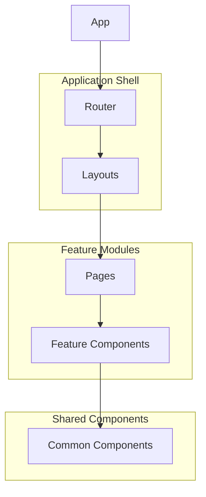
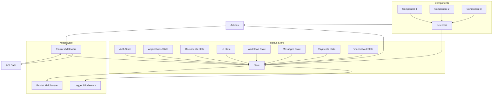
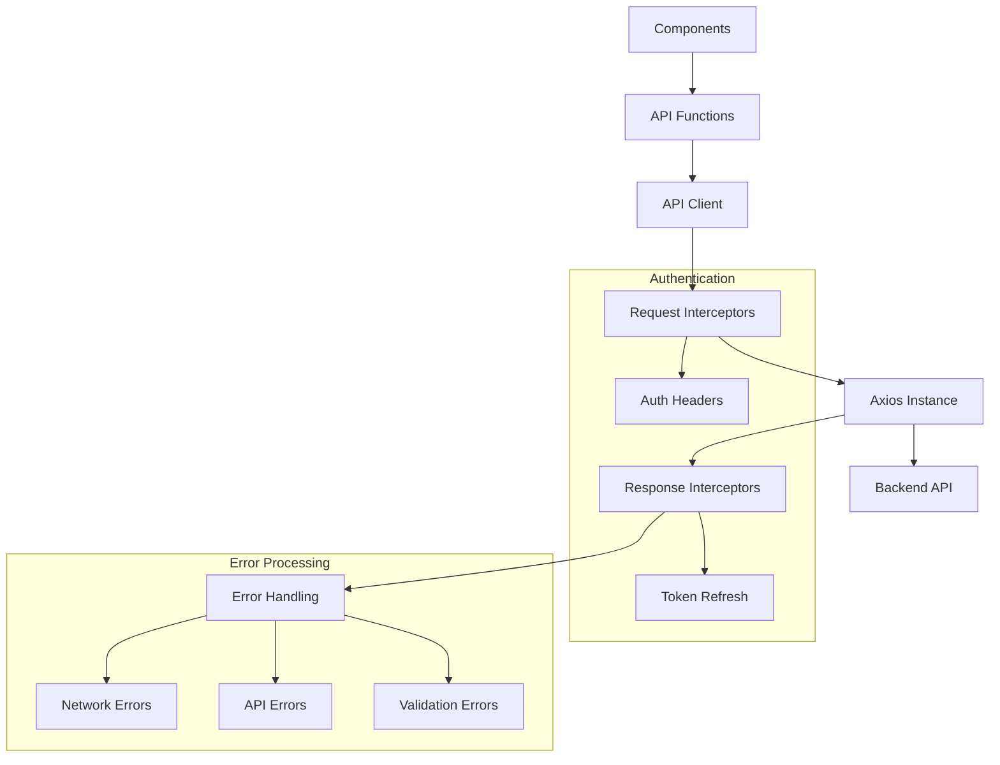

## 1. Introduction

This document provides a detailed overview of the frontend architecture for the Student Admissions Enrollment Platform. The frontend is implemented as a single-page application (SPA) using React, TypeScript, and Redux, following modern best practices for scalable and maintainable web applications.

### 1.1 Purpose

The purpose of this document is to provide developers, architects, and other stakeholders with a comprehensive understanding of the frontend architecture, including its component structure, state management approach, and integration with the backend API. This document serves as a reference for development, maintenance, and future enhancements of the frontend application.

### 1.2 Scope

This document covers the following aspects of the frontend architecture:

- Technology stack and key libraries
- Application structure and organization
- Component hierarchy and design patterns
- State management with Redux
- API integration and data flow
- Routing and navigation
- Authentication and authorization
- Performance optimization strategies
- Testing approach

This document focuses specifically on the frontend architecture, while related aspects of the system can be found in other architecture documentation.

### 1.3 Technology Stack

The frontend application is built using the following core technologies:

- **React 18.x**: Component-based UI library for building the user interface
- **TypeScript 4.9+**: Typed superset of JavaScript for improved developer experience and code quality
- **Redux Toolkit**: State management library with simplified Redux configuration
- **React Router 6.x**: Client-side routing for navigation
- **Material-UI 5.x**: Component library for consistent UI design
- **Axios**: HTTP client for API communication
- **React Query**: Data fetching, caching, and state synchronization
- **Emotion**: CSS-in-JS styling solution
- **Jest and React Testing Library**: Testing framework for unit and integration tests
- **Cypress**: End-to-end testing framework

## 2. Application Structure

The frontend application follows a feature-based organization with shared components and services. This structure promotes modularity, reusability, and maintainability.

### 2.1 Directory Structure

The application is organized into the following directory structure:

```
src/
├── api/                # API client and service functions
├── components/         # React components organized by feature
│   ├── Common/         # Shared UI components
│   ├── Admin/          # Admin-specific components
│   ├── Applications/   # Application management components
│   ├── Auth/           # Authentication components
│   ├── Dashboard/      # Dashboard components
│   ├── Documents/      # Document management components
│   ├── Messages/       # Messaging components
│   ├── Payments/       # Payment processing components
│   ├── WorkflowEditor/ # Workflow editor components
│   └── AppShell/       # Application shell components
├── contexts/           # React context providers
├── hooks/              # Custom React hooks
├── layouts/            # Page layout components
├── pages/              # Page components that compose features
├── redux/              # Redux state management
│   ├── slices/         # Redux Toolkit slices
│   ├── rootReducer.ts  # Combined reducer
│   └── store.ts        # Redux store configuration
├── services/           # Business logic services
├── styles/             # Global styles and theme
├── types/              # TypeScript type definitions
├── utils/              # Utility functions
├── App.tsx             # Main application component
└── index.tsx          # Application entry point
```

This structure separates concerns and organizes code by feature, making it easier to locate and maintain related code.

### 2.2 Code Organization Principles

The frontend codebase follows these key organizational principles:

1. **Feature-based Organization**: Components are grouped by feature or domain rather than by type, making it easier to locate related code.

2. **Separation of Concerns**: Clear separation between UI components, business logic, and data management.

3. **Component Composition**: Complex UI is built by composing smaller, focused components.

4. **Reusability**: Common components and utilities are shared across features.

5. **Encapsulation**: Features are self-contained with minimal dependencies on other features.

6. **Consistent Patterns**: Consistent naming, file structure, and coding patterns throughout the codebase.

### 2.3 Build and Bundling

The application uses Create React App with custom configuration through CRACO (Create React App Configuration Override) for building and bundling. Key build features include:

- **Code Splitting**: Route-based and component-based code splitting to reduce initial load time
- **Tree Shaking**: Elimination of unused code to reduce bundle size
- **Asset Optimization**: Optimization of images and other assets
- **Environment Configuration**: Environment-specific configuration for development, testing, and production
- **Bundle Analysis**: Visualization of bundle size and composition for optimization

## 3. Component Architecture

The frontend application follows a component-based architecture with a clear hierarchy and composition model.

### 3.1 Component Hierarchy



The component hierarchy follows these levels:

1. **App**: The root component that sets up providers and routing
2. **Layouts**: Page layout components that define the structure of different sections
3. **Pages**: Components that represent complete pages and compose feature components
4. **Feature Components**: Domain-specific components that implement business functionality
5. **Common Components**: Reusable UI components shared across features

### 3.2 Component Types

The application uses several types of components with different responsibilities:

1. **Container Components**: Manage state, data fetching, and business logic
2. **Presentational Components**: Focus on rendering UI based on props
3. **Layout Components**: Define page structure and composition
4. **Form Components**: Handle user input, validation, and submission
5. **HOCs (Higher-Order Components)**: Enhance components with additional functionality
6. **Render Props Components**: Share behavior through render props pattern
7. **Hooks-based Components**: Use React hooks for state and effects

Most components in the application are functional components using React hooks for state management and side effects.

### 3.3 Component Design Patterns

The application employs several design patterns for component implementation:

1. **Composition over Inheritance**: Building complex components by composing smaller ones
2. **Prop Drilling Avoidance**: Using context or state management for deeply nested components
3. **Controlled Components**: Managing form input state through props and callbacks
4. **Render Props**: Sharing component logic through render functions
5. **Custom Hooks**: Extracting and reusing stateful logic across components
6. **Compound Components**: Creating related components that work together
7. **Error Boundaries**: Catching and handling errors in component trees

### 3.4 Component Communication

Components communicate through several mechanisms:

1. **Props**: Parent-to-child communication through component properties
2. **Callbacks**: Child-to-parent communication through function props
3. **Context**: Sharing state across component trees without prop drilling
4. **Redux**: Global state management for application-wide data
5. **Events**: Custom events for cross-component communication
6. **URL Parameters**: Communication through route parameters

The choice of communication method depends on the relationship between components and the scope of the shared data.

### 3.5 Key Components

The application includes several key component groups:

1. **Application Shell**: Header, footer, navigation, and layout components
2. **Authentication Components**: Login, registration, and password reset forms
3. **Dashboard Components**: Overview, status cards, and activity feeds
4. **Application Form**: Multi-step form for application submission
5. **Document Management**: Upload, viewing, and verification components
6. **Workflow Editor**: Visual editor for creating and editing workflows
7. **Messaging Components**: Inbox, message composition, and conversation views
8. **Payment Processing**: Payment forms and receipt components

Each component group is designed to be cohesive, focusing on a specific feature area while maintaining consistency with the overall application design.

## 4. State Management

The application uses Redux for global state management, with Redux Toolkit for simplified configuration and React Query for server state management.

### 4.1 Redux Architecture



The Redux architecture follows these principles:

1. **Single Source of Truth**: All application state is stored in a single Redux store
2. **State is Read-Only**: State can only be changed by dispatching actions
3. **Changes are Made with Pure Functions**: Reducers are pure functions that specify state changes
4. **Slices for Feature State**: State is organized into feature-specific slices
5. **Thunks for Async Logic**: Asynchronous operations are handled with Redux Thunks
6. **Selectors for Data Access**: Components access state through selector functions

### 4.2 Redux Store Structure

The Redux store is organized into feature-specific slices:

1. **auth**: Authentication state (user data, tokens, login status)
2. **applications**: Application management state (forms, statuses, tracking)
3. **documents**: Document management state (uploads, verification, status)
4. **ui**: UI state (theme, sidebar, modals, notifications)
5. **workflows**: Workflow state (stages, transitions, editor state)
6. **messages**: Messaging state (conversations, notifications, unread counts)
7. **payments**: Payment processing state (transactions, history, methods)
8. **financialAid**: Financial aid state (applications, documents, status)

Each slice is implemented using Redux Toolkit's `createSlice` function, which generates actions and reducers with minimal boilerplate.

### 4.3 Redux Middleware

The Redux store is configured with several middleware components:

1. **Redux Thunk**: Enables asynchronous action creators for API calls and other side effects
2. **Redux Logger**: Provides detailed logging of actions and state changes (development only)
3. **Redux Persist**: Persists and rehydrates selected parts of the state across page reloads
4. **Serializable State Checker**: Ensures state is serializable for proper functioning

Middleware configuration is centralized in the store.ts file, with environment-specific settings for development and production.

### 4.4 State Persistence

Redux Persist is used to maintain state across browser sessions. The persistence configuration includes:

1. **Persisted Slices**: auth, ui (maintain authentication and user preferences)
2. **Storage Engine**: localStorage for persistent storage
3. **Rehydration**: Automatic state rehydration on application startup
4. **Serialization**: JSON serialization with special handling for non-serializable data

This approach ensures that users remain authenticated across page reloads and their preferences are maintained.

### 4.5 Local Component State

While Redux is used for global application state, local component state is managed using React's built-in state management:

1. **useState**: For simple state management within components
2. **useReducer**: For more complex local state with reducer-like logic
3. **useContext**: For sharing state within a component tree

The decision between local state and Redux state is based on the scope and sharing requirements of the data.

### 4.6 Server State Management

React Query is used for managing server state, providing:

1. **Data Fetching**: Declarative API for fetching data from the backend
2. **Caching**: Automatic caching of query results with configurable invalidation
3. **Background Updates**: Automatic refetching of data in the background
4. **Loading and Error States**: Built-in handling of loading and error states
5. **Pagination and Infinite Scrolling**: Support for paginated and infinite data
6. **Mutations**: Simplified API for data mutations with optimistic updates

This approach separates server state from client state, providing a more efficient and maintainable solution for data fetching and synchronization.

## 5. API Integration

The frontend communicates with the backend API through a centralized API client that handles requests, authentication, and error management.

### 5.1 API Client Architecture



The API integration follows these principles:

1. **Centralized Client**: All API communication goes through a single API client
2. **Feature-Specific Functions**: API functions are organized by feature
3. **Consistent Error Handling**: Standardized approach to error processing
4. **Automatic Authentication**: Request interceptors add authentication headers
5. **Response Transformation**: Response interceptors normalize API responses

### 5.2 Request and Response Handling

API requests and responses follow a consistent pattern:

1. **Request Formation**: API functions create requests with appropriate parameters
2. **Authentication**: Request interceptors add authentication headers from stored tokens
3. **Request Dispatch**: Axios sends the HTTP request to the backend
4. **Response Processing**: Response interceptors process and normalize responses
5. **Data Extraction**: API functions extract and return relevant data
6. **Error Handling**: Errors are caught and processed consistently

This approach ensures consistency across all API interactions and simplifies error handling.

### 5.3 Authentication Flow

The API client handles authentication through JWT tokens:

1. **Token Storage**: Authentication tokens are stored securely in localStorage
2. **Token Inclusion**: Request interceptors automatically add tokens to requests
3. **Token Refresh**: Response interceptors handle token expiration and refresh
4. **Unauthorized Handling**: Redirect to login when authentication fails

This approach ensures that authenticated requests are handled consistently across the application.

### 5.4 Error Handling Strategy

API errors are handled through a multi-layered approach:

1. **Network Errors**: Connectivity issues and timeouts
2. **API Errors**: Server-side errors with error codes and messages
3. **Validation Errors**: Field-specific validation failures
4. **Authentication Errors**: Unauthorized or forbidden access

Errors are processed consistently and presented to users in appropriate formats, such as form validation messages, toast notifications, or error pages.

### 5.5 API Function Organization

API functions are organized by feature area:

1. **auth.ts**: Authentication-related API functions
2. **applications.ts**: Application management API functions
3. **documents.ts**: Document management API functions
4. **messages.ts**: Messaging API functions
5. **payments.ts**: Payment processing API functions
6. **workflows.ts**: Workflow management API functions
7. **admin.ts**: Administrative API functions

Each module exports functions that handle specific API operations, abstracting the details of API communication from components.

### 5.6 Real-time Communication

In addition to RESTful API calls, the application uses WebSockets for real-time communication:

1. **Notification Delivery**: Real-time notifications for application updates
2. **Message Delivery**: Instant messaging between users
3. **Status Updates**: Live updates of application status changes

WebSocket communication is managed through Laravel Echo and Redis, with appropriate fallbacks for environments where WebSockets are not available.

## 6. Routing and Navigation

The application uses React Router for client-side routing and navigation management.

### 6.1 Route Structure

The application's routes are organized into several categories:

1. **Public Routes**: Accessible without authentication (login, registration, etc.)
2. **Protected Routes**: Require authentication (dashboard, applications, etc.)
3. **Role-Based Routes**: Require specific roles (admin routes)
4. **Nested Routes**: Hierarchical routes within features

Routes are defined centrally in the App component, with appropriate guards for authentication and authorization.

### 6.2 Route Guards

Route access is controlled through several guard mechanisms:

1. **Authentication Guard**: Redirects unauthenticated users to login
2. **Role Guard**: Restricts access based on user roles
3. **Permission Guard**: Checks specific permissions for route access

These guards ensure that users can only access routes appropriate to their authentication status and role.

### 6.3 Navigation Components

The application includes several navigation components:

1. **Header Navigation**: Main navigation in the application header
2. **Sidebar Navigation**: Expanded navigation in the sidebar
3. **Mobile Navigation**: Responsive navigation for mobile devices
4. **Breadcrumbs**: Hierarchical location indicators
5. **Tab Navigation**: Content tabs within pages

These components provide consistent navigation throughout the application, adapting to different screen sizes and user contexts.

### 6.4 Programmatic Navigation

In addition to link-based navigation, the application uses programmatic navigation for certain scenarios:

1. **Redirect After Action**: Navigating after form submission or operation completion
2. **Conditional Navigation**: Routing based on application state or user actions
3. **Wizard Navigation**: Guided navigation through multi-step processes

Programmatic navigation is implemented using React Router's navigation hooks and components.

## 7. Authentication and Authorization

The frontend implements a comprehensive authentication and authorization system integrated with the backend security framework.

### 7.1 Authentication Implementation

Authentication is implemented through several components:

1. **Auth Context**: Provides authentication state and functions to the application
2. **Auth Service**: Handles authentication operations and token management
3. **Auth Redux Slice**: Stores authentication state in Redux
4. **Protected Routes**: Restricts access to authenticated routes

The authentication flow includes login, registration, password reset, and multi-factor authentication when required.

### 7.2 Token Management

JWT tokens are used for authentication and managed through:

1. **Token Storage**: Secure storage in localStorage with appropriate precautions
2. **Token Inclusion**: Automatic inclusion in API requests
3. **Token Refresh**: Handling of token expiration and refresh
4. **Token Revocation**: Clearing tokens on logout or security events

This approach provides secure, stateless authentication while maintaining user sessions across page reloads.

### 7.3 Role-Based Authorization

Authorization is implemented through a role-based system:

1. **User Roles**: Roles assigned to users (student, staff, admin, etc.)
2. **Role Checking**: Components and routes check user roles for access control
3. **Permission-Based Controls**: Fine-grained permissions within roles
4. **UI Adaptation**: Interface elements adapt to user roles and permissions

This approach ensures that users can only access features and data appropriate to their role.

### 7.4 Security Considerations

The frontend implements several security measures:

1. **CSRF Protection**: Protection against cross-site request forgery
2. **XSS Prevention**: Escaping and sanitization to prevent cross-site scripting
3. **Secure Communication**: HTTPS for all API communication
4. **Input Validation**: Client-side validation of all user inputs
5. **Sensitive Data Handling**: Appropriate handling of sensitive information

These measures, combined with backend security controls, provide a comprehensive security approach.

## 8. Form Handling

The application includes numerous forms for data entry and submission, with a consistent approach to form management.

### 8.1 Form Management Approach

Forms are managed through a combination of:

1. **Custom useForm Hook**: Simplified form state management and validation
2. **Form Components**: Reusable form input components
3. **Validation Schemas**: Declarative validation rules
4. **Error Handling**: Consistent display of validation errors

This approach provides a consistent user experience across all forms while simplifying form implementation for developers.

### 8.2 Multi-Step Forms

Complex processes like application submission use multi-step forms:

1. **Step Management**: Navigation between form steps
2. **Progress Tracking**: Visual indication of completion progress
3. **Step Validation**: Validation of each step before proceeding
4. **Data Persistence**: Saving form data between steps

The ApplicationForm component demonstrates this approach, managing a complex multi-step application process with validation and progress tracking.

### 8.3 Form Submission

Form submission follows a consistent pattern:

1. **Validation**: Complete validation before submission
2. **Loading State**: Visual indication of submission progress
3. **Error Handling**: Display of submission errors
4. **Success Handling**: Confirmation and next steps after successful submission

This approach provides clear feedback to users throughout the submission process.

### 8.4 Form Components

The application includes several reusable form components:

1. **TextField**: Text input with validation and error display
2. **Select**: Dropdown selection with options
3. **Checkbox**: Boolean input with label
4. **RadioButton**: Option selection from a group
5. **DatePicker**: Date selection with calendar
6. **FileUploader**: File upload with preview and progress

These components provide consistent styling, behavior, and accessibility across all forms.

## 9. UI/UX Implementation

The frontend implements a consistent user interface and experience based on the design system.

### 9.1 Design System Integration

The application integrates with the design system through:

1. **Theme Configuration**: Customization of Material-UI theme
2. **Component Library**: Implementation of design system components
3. **Typography System**: Consistent text styling
4. **Color Palette**: Application of brand colors
5. **Spacing System**: Consistent layout spacing

This integration ensures visual consistency throughout the application while leveraging Material-UI's component library.

### 9.2 Responsive Design Implementation

The application is fully responsive, adapting to different screen sizes through:

1. **Responsive Layouts**: Fluid layouts that adapt to screen width
2. **Breakpoint System**: Consistent breakpoints for layout changes
3. **Mobile-First Approach**: Design starting from mobile and expanding to larger screens
4. **Component Adaptations**: Components that change behavior or appearance based on screen size

This approach ensures a good user experience across devices, from mobile phones to desktop computers.

### 9.3 Accessibility Implementation

The application follows WCAG 2.1 AA guidelines for accessibility:

1. **Semantic HTML**: Proper use of HTML elements for their intended purpose
2. **ARIA Attributes**: Additional accessibility information where needed
3. **Keyboard Navigation**: Full functionality without a mouse
4. **Focus Management**: Clear focus indicators and logical focus order
5. **Screen Reader Support**: Text alternatives and appropriate announcements
6. **Color Contrast**: Sufficient contrast for text and UI elements

Accessibility is integrated into the component library and verified through automated and manual testing.

### 9.4 Animation and Transitions

The application uses animations and transitions to enhance the user experience:

1. **Page Transitions**: Smooth transitions between pages
2. **Component Animations**: Subtle animations for component state changes
3. **Feedback Animations**: Visual feedback for user actions
4. **Loading Indicators**: Animated indicators for asynchronous operations

Animations are implemented with consideration for performance and accessibility, including respecting user preferences for reduced motion.

## 10. Performance Optimization

The frontend implements several strategies to optimize performance and user experience.

### 10.1 Code Optimization

Code is optimized through several techniques:

1. **Code Splitting**: Route-based and component-based splitting
2. **Lazy Loading**: Deferred loading of non-critical components
3. **Tree Shaking**: Elimination of unused code
4. **Bundle Analysis**: Regular analysis and optimization of bundle size

These techniques reduce the initial load time and improve the overall performance of the application.

### 10.2 Rendering Optimization

Rendering performance is optimized through:

1. **Memoization**: React.memo for expensive components
2. **useMemo and useCallback**: Memoization of values and callbacks
3. **Virtualization**: Efficient rendering of long lists
4. **Debouncing and Throttling**: Limiting frequent updates

These techniques reduce unnecessary re-renders and improve the responsiveness of the application.

### 10.3 Data Fetching Optimization

Data fetching is optimized through React Query:

1. **Caching**: Automatic caching of query results
2. **Deduplication**: Prevention of duplicate requests
3. **Background Fetching**: Updating data in the background
4. **Prefetching**: Loading data before it's needed
5. **Pagination and Infinite Scrolling**: Efficient loading of large datasets

These techniques reduce the number of API calls and improve the perceived performance of the application.

### 10.4 Asset Optimization

Assets are optimized through several techniques:

1. **Image Optimization**: Compression and appropriate formats
2. **Responsive Images**: Different sizes for different devices
3. **Font Optimization**: Efficient loading of web fonts
4. **Icon System**: SVG icons for scalability and performance

These techniques reduce the size of assets and improve loading performance.

## 11. Testing Strategy

The frontend implements a comprehensive testing strategy to ensure quality and reliability.

### 11.1 Testing Levels

The application is tested at several levels:

1. **Unit Tests**: Testing individual functions and components
2. **Integration Tests**: Testing interactions between components
3. **End-to-End Tests**: Testing complete user flows
4. **Visual Regression Tests**: Testing UI appearance

This multi-level approach ensures comprehensive test coverage while focusing on different aspects of the application.

### 11.2 Testing Tools

Testing is implemented using several tools:

1. **Jest**: Test runner and assertion library
2. **React Testing Library**: Component testing with user-centric approach
3. **Cypress**: End-to-end testing framework
4. **Mock Service Worker**: API mocking for tests
5. **Storybook**: Component documentation and visual testing

These tools provide a comprehensive testing environment for different testing needs.

### 11.3 Test Organization

Tests are organized following these principles:

1. **Co-location**: Tests are located near the code they test
2. **Naming Convention**: Clear and consistent test names
3. **Test Structure**: Arrange-Act-Assert pattern
4. **Test Isolation**: Independent tests without shared state

This organization makes tests easy to find, understand, and maintain.

### 11.4 Continuous Integration

Tests are integrated into the CI/CD pipeline:

1. **Automated Execution**: Tests run automatically on code changes
2. **Pull Request Validation**: Tests must pass before merging
3. **Coverage Reporting**: Tracking of test coverage
4. **Performance Benchmarking**: Monitoring of performance metrics

This integration ensures that tests are consistently run and that code quality is maintained throughout development.

## 12. Deployment and DevOps

The frontend is deployed and managed through a comprehensive DevOps approach.

### 12.1 Build Process

The build process includes several steps:

1. **Code Linting**: Static analysis for code quality
2. **Type Checking**: Verification of TypeScript types
3. **Unit Testing**: Execution of unit tests
4. **Bundle Creation**: Creation of optimized production bundles
5. **Asset Processing**: Optimization of images and other assets

This process ensures that only high-quality code is deployed to production.

### 12.2 Deployment Environments

The application is deployed to several environments:

1. **Development**: For ongoing development and testing
2. **Staging**: For pre-production validation
3. **Production**: For end users

Each environment has appropriate configuration and security settings.

### 12.3 Continuous Deployment

The application uses continuous deployment:

1. **Automated Builds**: Triggered by code changes
2. **Automated Testing**: Verification before deployment
3. **Automated Deployment**: Deployment to appropriate environment
4. **Deployment Verification**: Post-deployment testing

This approach ensures rapid, reliable deployment of new features and fixes.

### 12.4 Monitoring and Analytics

The application includes monitoring and analytics:

1. **Error Tracking**: Capturing and reporting of frontend errors
2. **Performance Monitoring**: Tracking of key performance metrics
3. **User Analytics**: Analysis of user behavior and interactions
4. **Feature Usage**: Tracking of feature adoption and usage

This information provides insights for ongoing improvement and optimization.

## 13. Future Considerations

Several areas are identified for future enhancement of the frontend architecture.

### 13.1 Progressive Web App

Enhancing the application as a Progressive Web App (PWA):

1. **Offline Support**: Functioning without an internet connection
2. **Installation**: Installation as a standalone application
3. **Push Notifications**: Native-like push notifications
4. **Background Sync**: Synchronization when connection is restored

These enhancements would provide a more app-like experience, especially for mobile users.

### 13.2 Advanced State Management

Potential enhancements to state management:

1. **Redux Toolkit Query**: Integration for simplified API interactions
2. **Recoil or Jotai**: Exploration of atom-based state management
3. **State Machines**: Implementation for complex state transitions

These approaches could simplify state management and improve maintainability.

### 13.3 Performance Enhancements

Additional performance optimizations:

1. **Web Workers**: Offloading heavy computation
2. **Service Workers**: Enhanced caching and offline support
3. **WebAssembly**: Performance-critical functionality
4. **Micro-Frontends**: Modular, independently deployable features

These enhancements would further improve application performance and scalability.

### 13.4 Accessibility Improvements

Ongoing accessibility enhancements:

1. **WCAG 2.2 Compliance**: Updating to latest guidelines
2. **Automated Testing**: Enhanced automated accessibility testing
3. **User Testing**: Testing with assistive technologies and users with disabilities

These improvements would ensure the application remains accessible to all users.

## 14. Conclusion

The frontend architecture of the Student Admissions Enrollment Platform provides a solid foundation for a scalable, maintainable, and user-friendly application. By leveraging modern technologies and best practices, the architecture supports the complex requirements of the admissions process while providing a seamless user experience.

Key strengths of the architecture include:

1. **Component-Based Design**: Modular, reusable components that promote consistency and maintainability
2. **Robust State Management**: Efficient handling of application state with Redux and React Query
3. **Responsive and Accessible UI**: A user interface that works well across devices and for all users
4. **Performance Optimization**: Multiple strategies to ensure fast loading and responsive interaction
5. **Comprehensive Testing**: A testing approach that ensures reliability and quality

This architecture provides a strong foundation for current functionality while allowing for future enhancements and evolution.