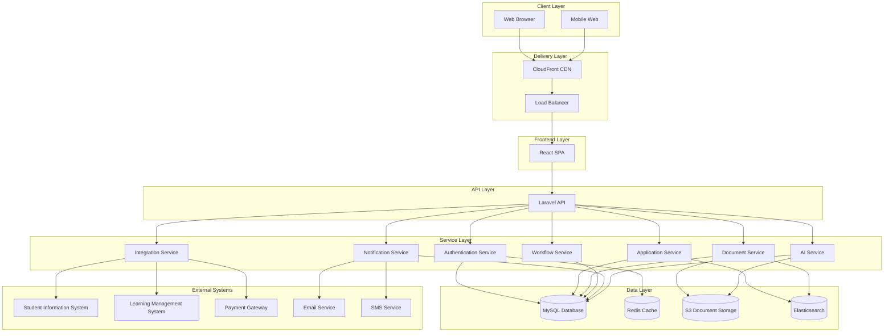
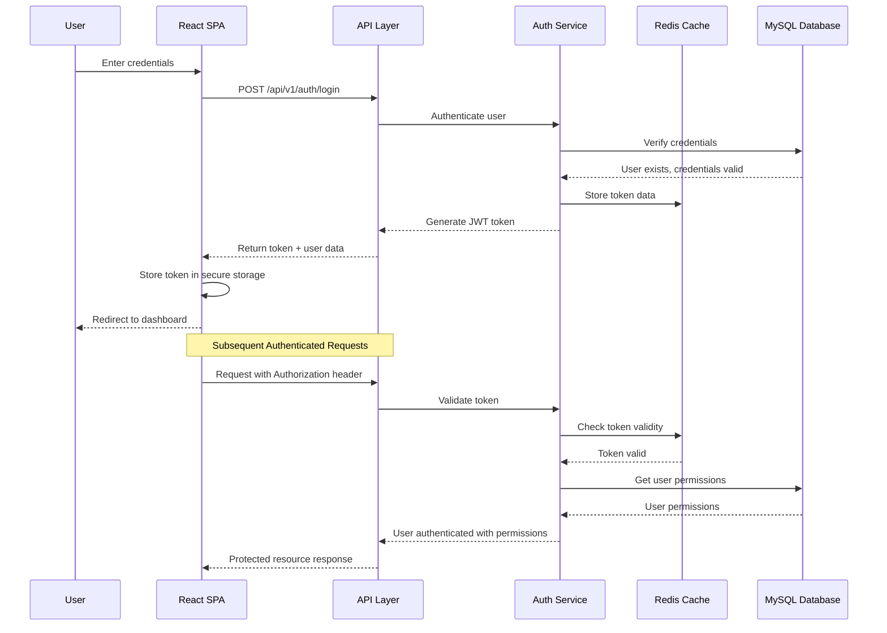
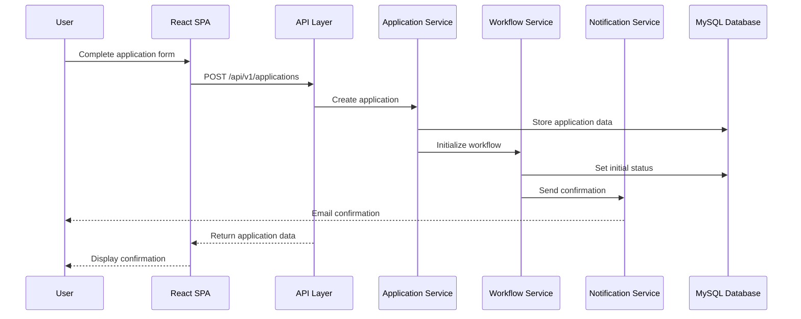
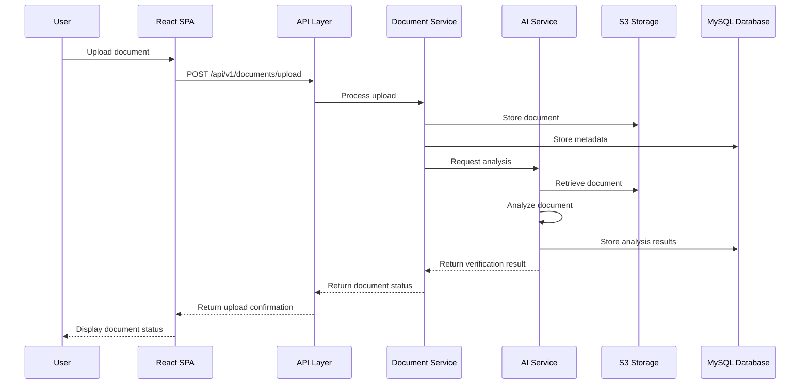
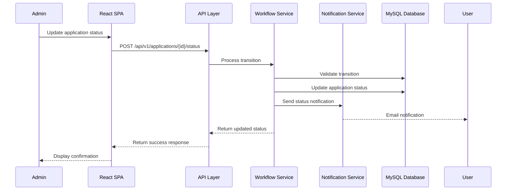
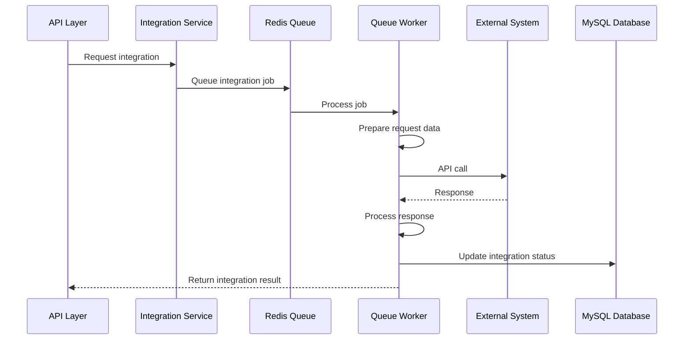
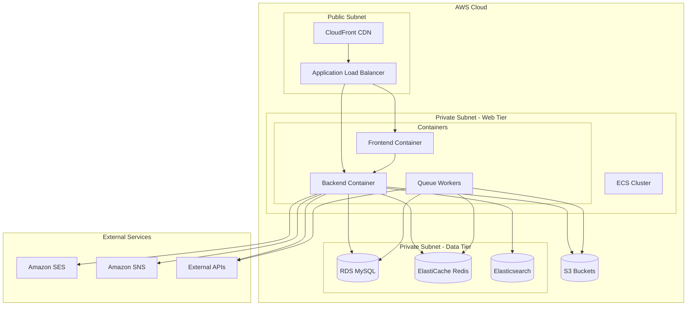

## 1. Introduction

This document provides a comprehensive overview of the Student Admissions Enrollment Platform architecture. It serves as the primary entry point for understanding the system design, key components, and how they interact to deliver the platform's functionality.

### 1.1 Purpose
The purpose of this document is to provide a high-level understanding of the system architecture for developers, architects, and other stakeholders. It describes the overall structure of the system, the key components, their responsibilities, and how they interact with each other.

### 1.2 Scope
This document covers the high-level architecture of the Student Admissions Enrollment Platform, including:

- Architectural approach and patterns
- Core system components and their responsibilities
- Data flow and communication patterns
- Integration with external systems
- Key technical decisions and their rationale

Detailed information about specific components is available in the referenced architecture documents.

### 1.3 Related Documents
This overview references the following detailed architecture documents:

- [Backend Architecture](backend.md): Details of the Laravel-based backend implementation
- [Frontend Architecture](frontend.md): Details of the React-based frontend implementation
- [Database Schema](database-schema.md): Comprehensive database design and optimization
- [Integration Points](integration-points.md): External system integration architecture
- [Workflow Architecture](workflows.md): Workflow engine and editor implementation

## 2. Architectural Approach

The Student Admissions Enrollment Platform follows a modern, layered architecture based on a service-oriented approach while maintaining the benefits of a monolithic deployment for simplicity and development efficiency.

### 2.1 Architectural Style
The system employs a **modular monolith** architecture with clear service boundaries. This approach provides:

- **Service Orientation**: Core business capabilities are organized as distinct services with well-defined boundaries
- **Deployment Simplicity**: Services share the same deployment unit, avoiding the complexity of a distributed microservices architecture
- **Clear Separation of Concerns**: Each component has a single responsibility and well-defined interfaces
- **Scalability**: Components can be scaled independently based on demand
- **Future Flexibility**: The modular design allows for potential migration to microservices if needed

### 2.2 Design Principles
The architecture is guided by the following design principles:

- **API-First Approach**: All interactions between frontend and backend components occur through RESTful APIs
- **Separation of Concerns**: Clear boundaries between presentation, business logic, and data access
- **Domain-Driven Design**: System organization around business domains and capabilities
- **Event-Driven Patterns**: Critical system events trigger notifications and workflow transitions
- **Security by Design**: Security considerations integrated throughout the architecture
- **Scalability**: Design for horizontal scaling of high-demand components
- **Observability**: Comprehensive logging, monitoring, and diagnostics

### 2.3 Technology Stack
The platform is built using a modern technology stack:

- **Backend**: Laravel 10.x (PHP 8.2+) for robust API development and business logic
- **Frontend**: React 18.x with TypeScript for a responsive single-page application
- **Database**: MySQL 8.0+ for relational data storage with strong ACID compliance
- **Caching**: Redis 7.0+ for high-performance caching and session management
- **Document Storage**: Amazon S3 for scalable document storage
- **Search**: Elasticsearch for advanced search capabilities
- **Deployment**: Docker containers orchestrated with Kubernetes or AWS ECS

## 3. System Components

The Student Admissions Enrollment Platform consists of several core components that work together to provide the complete system functionality.

### 3.1 High-Level Component Diagram

### 3.2 Frontend Components
The frontend is a React-based single-page application (SPA) with the following key components:

- **React Application**: Core SPA built with React 18 and TypeScript
- **Redux Store**: Centralized state management with Redux Toolkit
- **React Query**: Data fetching, caching, and synchronization with the backend API
- **React Router**: Client-side routing for navigation
- **Material UI**: Component library for consistent UI design
- **React Flow**: Interactive node-based editor for the workflow management

The frontend follows a feature-based organization with shared components and services. For detailed information, see [Frontend Architecture](frontend.md).

### 3.3 Backend Components
The backend is a Laravel-based API with the following key components:

- **API Controllers**: Handle HTTP requests and responses
- **Service Layer**: Implement business logic and orchestrate operations
- **Models**: Represent database entities and relationships
- **Repositories**: Abstract data access and persistence
- **Events & Listeners**: Implement event-driven architecture
- **Jobs & Queues**: Handle asynchronous processing
- **Middleware**: Implement cross-cutting concerns like authentication and rate limiting

The backend follows a service-oriented architecture with clear separation of concerns. For detailed information, see [Backend Architecture](backend.md).

### 3.4 Data Storage Components
The platform uses multiple data storage technologies optimized for different types of data:

- **MySQL Database**: Primary relational database for structured data
- **Redis Cache**: High-performance caching and session storage
- **S3 Document Storage**: Scalable object storage for documents and files
- **Elasticsearch**: Full-text search and advanced querying

The data model is designed for performance, scalability, and data integrity. For detailed information, see [Database Schema](database-schema.md).

### 3.5 Integration Components
The platform integrates with several external systems:

- **Student Information System (SIS)**: Bidirectional integration for student data
- **Learning Management System (LMS)**: Integration for course access and enrollment
- **Payment Gateway**: Secure payment processing
- **Email and SMS Services**: Multi-channel notifications
- **Document Verification Services**: External verification of uploaded documents

Integrations are implemented through dedicated service classes with provider abstraction. For detailed information, see [Integration Points](integration-points.md).

### 3.6 AI Components
The platform includes AI-powered features implemented through dedicated services:

- **Document Analysis**: AI-powered extraction and verification of document data
- **Chatbot Assistant**: Conversational AI for student support
- **Recommendation Engine**: Personalized guidance for applicants
- **Fraud Detection**: AI-assisted identification of potentially fraudulent applications

AI components are implemented as services that integrate with the core application components.

### 3.7 Workflow Engine
The workflow engine is a core component that manages the admissions process:

- **Workflow Definitions**: Configurable process flows for different application types
- **WYSIWYG Editor**: Visual editor for creating and modifying workflows
- **Stage Management**: Handling of application stages and transitions
- **Condition Evaluation**: Rules-based evaluation of transition conditions
- **Notification Triggers**: Event-based notifications at workflow stages

For detailed information, see [Workflow Architecture](workflows.md).

## 4. Data Flow Architecture

This section describes the key data flows within the system, illustrating how information moves between components.

### 4.1 User Authentication Flow

### 4.2 Application Submission Flow

### 4.3 Document Upload and Verification Flow

### 4.4 Workflow Transition Flow

### 4.5 Integration with External Systems

## 5. Deployment Architecture

This section describes how the system is deployed and scaled in production environments.

### 5.1 Deployment Model
The platform is deployed using a containerized approach with the following components:

- **Web Tier**: Containerized frontend and backend applications
- **Database Tier**: Managed MySQL database service with replication
- **Cache Tier**: Managed Redis cluster
- **Storage Tier**: S3 buckets for document storage
- **Search Tier**: Managed Elasticsearch service

The deployment leverages infrastructure as code (IaC) using Terraform for consistent environment provisioning.

### 5.2 Infrastructure Diagram

### 5.3 Scaling Strategy
The platform implements a multi-dimensional scaling strategy:

- **Horizontal Scaling**: Adding more container instances to handle increased load
- **Vertical Scaling**: Increasing resources (CPU, memory) for database and cache instances
- **Read/Write Splitting**: Database read replicas for read-heavy operations
- **Caching Strategy**: Multi-level caching to reduce database load
- **Asynchronous Processing**: Queue-based processing for resource-intensive operations

Scaling is managed through auto-scaling groups based on CPU utilization, request count, and queue depth metrics.

### 5.4 High Availability
The platform is designed for high availability with the following features:

- **Multi-AZ Deployment**: Components deployed across multiple availability zones
- **Database Replication**: Automated failover with minimal data loss
- **Load Balancing**: Distribution of traffic across multiple instances
- **Health Checks**: Automated detection and replacement of unhealthy instances
- **Graceful Degradation**: Non-critical features can be disabled during high load

The architecture targets 99.9% availability for the overall system.

### 5.5 Disaster Recovery
The disaster recovery strategy includes:

- **Regular Backups**: Daily full backups with point-in-time recovery
- **Cross-Region Replication**: Critical data replicated to a secondary region
- **Recovery Procedures**: Documented procedures for various failure scenarios
- **Recovery Testing**: Regular testing of recovery procedures

The recovery time objective (RTO) is 1 hour, and the recovery point objective (RPO) is 15 minutes for critical data.

## 6. Security Architecture

This section describes the security measures implemented throughout the system to protect data and ensure proper access control.

### 6.1 Security Layers
The platform implements security at multiple layers:

- **Network Security**: VPC, security groups, WAF protection
- **Application Security**: Input validation, output encoding, CSRF protection
- **Authentication**: Multi-factor authentication, secure session management
- **Authorization**: Role-based access control, permission verification
- **Data Protection**: Encryption at rest and in transit
- **Audit Logging**: Comprehensive logging of security events

### 6.2 Authentication and Authorization
The authentication and authorization system includes:

- **JWT-based Authentication**: Secure, stateless authentication for API requests
- **Redis Session Storage**: Secure, centralized session management
- **Role-Based Access Control**: Hierarchical roles with permission inheritance
- **Permission Verification**: Fine-grained permission checks at the API and service levels
- **Multi-factor Authentication**: Optional for students, required for staff and administrators

### 6.3 Data Protection
Data protection measures include:

- **Encryption at Rest**: AES-256 encryption for sensitive data in the database
- **Encryption in Transit**: TLS 1.3 for all communications
- **Field-level Encryption**: Additional encryption for highly sensitive fields
- **Data Masking**: Dynamic masking of sensitive data based on user role
- **Secure File Storage**: Encrypted document storage with access controls

### 6.4 Compliance Considerations
The platform is designed to comply with relevant regulations:

- **FERPA**: Protection of student educational records
- **GDPR**: Data protection and privacy controls
- **PCI DSS**: Secure payment processing
- **Accessibility**: WCAG 2.1 AA compliance

Compliance is maintained through regular audits, security testing, and ongoing monitoring.

## 7. Monitoring and Observability

This section describes how the system is monitored and observed in production.

### 7.1 Monitoring Strategy
The platform implements a comprehensive monitoring strategy:

- **Infrastructure Monitoring**: CPU, memory, disk, network metrics
- **Application Monitoring**: Request rates, response times, error rates
- **Database Monitoring**: Query performance, connection counts, replication lag
- **User Experience Monitoring**: Page load times, client-side errors
- **Business Metrics**: Application submissions, document verifications, conversion rates

### 7.2 Logging Architecture
The logging architecture includes:

- **Centralized Log Collection**: All logs sent to a central repository
- **Structured Logging**: JSON-formatted logs with consistent fields
- **Log Levels**: Different levels for different types of events
- **Correlation IDs**: Tracking requests across system components
- **Log Retention**: Tiered retention based on log importance

### 7.3 Alerting System
The alerting system includes:

- **Threshold-based Alerts**: Alerts triggered when metrics exceed thresholds
- **Anomaly Detection**: Alerts for unusual patterns or behaviors
- **Alert Routing**: Different alerts sent to different teams based on responsibility
- **Alert Aggregation**: Related alerts grouped to reduce noise
- **Escalation Policies**: Progressive escalation for unresolved issues

### 7.4 Performance Monitoring
Performance monitoring includes:

- **End-to-end Tracing**: Tracking requests through all system components
- **Database Query Analysis**: Identification of slow or inefficient queries
- **Cache Hit Rates**: Monitoring cache effectiveness
- **API Performance**: Response times for all API endpoints
- **Resource Utilization**: CPU, memory, and I/O usage across the system

## 8. Development and DevOps

This section describes the development processes and DevOps practices used to build and maintain the system.

### 8.1 Development Workflow
The development workflow follows a Git-based approach:

- **Feature Branches**: Development of new features in dedicated branches
- **Pull Requests**: Code review and approval process
- **Continuous Integration**: Automated testing of all code changes
- **Trunk-based Development**: Regular integration to the main branch

### 8.2 CI/CD Pipeline
The CI/CD pipeline automates the build, test, and deployment process:

- **Automated Testing**: Unit, integration, and end-to-end tests
- **Static Analysis**: Code quality and security scanning
- **Build Automation**: Creation of deployment artifacts
- **Deployment Automation**: Automated deployment to environments
- **Post-deployment Verification**: Smoke tests and health checks

### 8.3 Environment Management
The platform uses multiple environments for development and testing:

- **Development**: Local development environments
- **Testing**: Shared environment for integration testing
- **Staging**: Production-like environment for final validation
- **Production**: Live environment for end users

Environments are provisioned and configured using infrastructure as code (IaC) to ensure consistency.

### 8.4 Testing Strategy
The testing strategy includes multiple levels of testing:

- **Unit Testing**: Testing individual components in isolation
- **Integration Testing**: Testing interactions between components
- **End-to-End Testing**: Testing complete user journeys
- **Performance Testing**: Testing system performance under load
- **Security Testing**: Identifying security vulnerabilities

Tests are automated and integrated into the CI/CD pipeline.

## 9. Technical Decisions

This section explains key technical decisions made during the architecture design process.

### 9.1 Architecture Style Decision
| Decision Area | Selected Approach | Alternatives Considered | Rationale |
| --- | --- | --- | --- |
| Overall Architecture | Modular Monolith with Service Orientation | Microservices, Traditional Monolith | Balances development velocity with system organization; avoids distributed system complexity while maintaining service boundaries |
| Frontend Architecture | Single Page Application | Server-rendered, Multi-page | Provides rich interactive experience; leverages client-side processing; enables offline capabilities |
| API Design | RESTful with Resource Orientation | GraphQL, RPC | Industry standard with broad tooling support; simplifies integration; clear resource boundaries |
| Persistence Strategy | Polyglot Persistence | Single Database Solution | Optimizes storage for different data types; MySQL for relational data, Redis for caching, S3 for documents |

### 9.2 Technology Selection
| Component | Technology | Alternatives Considered | Rationale |
| --- | --- | --- | --- |
| Backend Framework | Laravel | Symfony, Express.js, Django | Robust ecosystem, excellent documentation, strong ORM, built-in security features |
| Frontend Framework | React | Vue.js, Angular | Component-based architecture, large ecosystem, strong TypeScript support |
| Database | MySQL | PostgreSQL, MongoDB | Strong ACID compliance, excellent performance, wide adoption in educational sector |
| Caching | Redis | Memcached, In-memory caching | Versatility beyond caching, pub/sub capabilities, persistence options |
| Search | Elasticsearch | Solr, MySQL full-text search | Superior full-text search, faceting capabilities, scalability |

### 9.3 Scalability Approach
| Aspect | Approach | Rationale |
| --- | --- | --- |
| Compute Scaling | Horizontal + Auto-scaling | Better fault tolerance, cost-effective scaling during peak periods |
| Database Scaling | Read replicas + Connection pooling | Optimize for read-heavy workload, maintain write consistency |
| Caching Strategy | Multi-level caching | Reduce database load, improve response times |
| Asynchronous Processing | Queue-based processing | Handle resource-intensive tasks without blocking user interactions |

### 9.4 Security Approach
| Security Aspect | Approach | Rationale |
| --- | --- | --- |
| Authentication | JWT + Redis session store | Stateless API authentication with centralized revocation capability |
| Authorization | Role-based with permission granularity | Balance between simplicity and fine-grained control |
| Data Protection | Field-level encryption for sensitive data | Protect PII even in case of database compromise |
| API Security | Rate limiting, input validation | Prevent abuse and injection attacks |

## 10. Future Considerations

This section outlines potential future enhancements and evolution of the architecture.

### 10.1 Architectural Evolution
Potential future architectural changes include:

- **Microservices Migration**: Selective extraction of services into independent microservices
- **GraphQL Adoption**: Implementation of GraphQL for more efficient data fetching
- **Event Sourcing**: Enhanced event-driven architecture for certain domains
- **Serverless Components**: Migration of suitable workloads to serverless architecture

### 10.2 Technology Roadmap
Planned technology upgrades include:

- **Progressive Web App**: Enhanced offline capabilities and mobile experience
- **Advanced AI Integration**: Deeper integration of AI throughout the platform
- **Real-time Collaboration**: Enhanced real-time features for collaborative workflows
- **Blockchain Verification**: Exploration of blockchain for secure document verification

### 10.3 Scalability Enhancements
Future scalability improvements include:

- **Global Distribution**: Multi-region deployment for global user base
- **Enhanced Caching**: More sophisticated caching strategies
- **Database Sharding**: Horizontal partitioning for extreme scale
- **Edge Computing**: Moving select processing closer to users

## 11. Conclusion

The Student Admissions Enrollment Platform architecture provides a robust, scalable, and secure foundation for the application. By leveraging modern architectural patterns and technologies, the system delivers a comprehensive solution for managing the entire student admissions lifecycle.

The modular design with clear service boundaries enables maintainability and future evolution, while the polyglot persistence approach optimizes data storage for different types of information. The security architecture ensures protection of sensitive student data, and the deployment architecture provides scalability and high availability.

This architectural overview serves as the starting point for understanding the system design, with detailed information available in the referenced architecture documents.