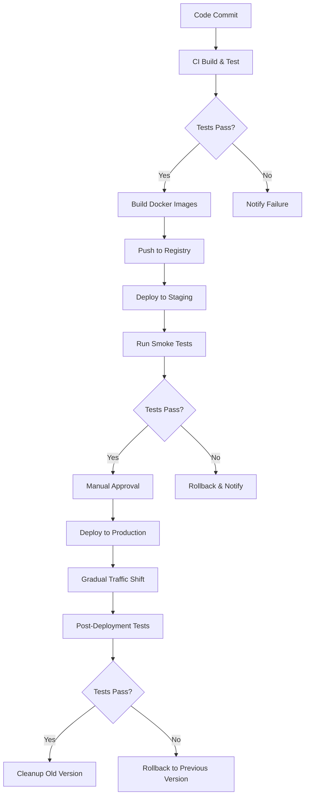
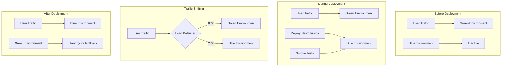
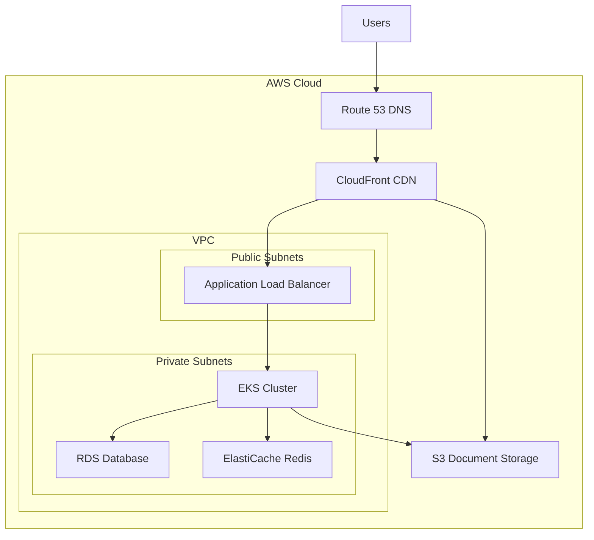

# Deployment Guide

## Introduction

This guide provides comprehensive instructions for deploying the Student Admissions Enrollment Platform to different environments. The platform uses a modern infrastructure approach with containerization, Infrastructure as Code (IaC), and automated CI/CD pipelines to ensure consistent, reliable, and secure deployments.

The Student Admissions Enrollment Platform consists of:
- Laravel backend API
- React frontend application
- MySQL database
- Redis for caching and queues
- Document storage using AWS S3
- Content delivery through CloudFront

This guide covers deployment to development, testing, staging, and production environments, with a focus on zero-downtime deployments using blue-green deployment strategies.

## Deployment Environments

The Student Admissions Enrollment Platform uses multiple environments to ensure a smooth progression from development to production.

### Development Environment

- **Purpose**: Local development and feature implementation
- **Infrastructure**: Docker Compose or local Kubernetes setup
- **Deployment Process**: Manual or automated local scripts
- **Data**: Sample data or anonymized development dataset
- **Access**: Restricted to developers
- **Deployment Trigger**: Manual or local git hooks

For setup instructions of the development environment, refer to the [Getting Started Guide](getting-started.md).

### Testing Environment

- **Purpose**: Integration testing, automated tests, and QA verification
- **Infrastructure**: AWS EKS with minimal resources
- **Deployment Process**: Automated via CI/CD pipeline
- **Data**: Generated test data with isolated database
- **Access**: Development team and QA
- **Deployment Trigger**: Pull request or merge to develop branch

Testing environment uses scaled-down infrastructure but mirrors the production configuration to ensure testing validity. For information on testing procedures, see the [Testing Guide](testing.md).

### Staging Environment

- **Purpose**: Pre-production validation, UAT, and release preparation
- **Infrastructure**: AWS EKS with production-like setup
- **Deployment Process**: Automated via CI/CD with blue/green deployment
- **Data**: Anonymized copy of production data
- **Access**: Limited to development, QA, and business stakeholders
- **Deployment Trigger**: Merge to main branch or manual promotion

Staging environment is nearly identical to production, allowing for final verification before production deployment.

### Production Environment

- **Purpose**: Live system for end users
- **Infrastructure**: AWS EKS with high availability across multiple availability zones
- **Deployment Process**: Automated via CI/CD with blue/green deployment and gradual traffic shifting
- **Data**: Production data with regular backups
- **Access**: Restricted access with multi-factor authentication
- **Deployment Trigger**: Manual approval after successful staging deployment

Production deployments follow a strict change management process with scheduled maintenance windows for major updates.

## Infrastructure Setup

The Student Admissions Enrollment Platform uses Infrastructure as Code (IaC) with Terraform to provision and manage cloud resources.

### AWS Resources

The platform uses the following AWS services:

- **EKS (Elastic Kubernetes Service)**: Container orchestration
- **RDS (Relational Database Service)**: MySQL database
- **ElastiCache**: Redis for caching and session management
- **S3**: Document storage
- **CloudFront**: Content delivery network
- **Route 53**: DNS management
- **ACM**: SSL certificate management
- **IAM**: Identity and access management
- **VPC**: Network isolation
- **CloudWatch**: Monitoring and logging
- **AWS Secrets Manager**: Secret management

### Terraform Configuration

The Terraform configuration is organized into modules for better maintainability:

```
infrastructure/terraform/
├── modules/
│   ├── vpc/
│   ├── eks/
│   ├── rds/
│   ├── elasticache/
│   ├── s3/
│   ├── cloudfront/
│   └── monitoring/
├── environments/
│   ├── testing/
│   ├── staging/
│   └── production/
└── variables/
    ├── testing.tfvars
    ├── staging.tfvars
    └── production.tfvars
```

To initialize and apply Terraform configuration:

```bash
cd infrastructure/terraform/environments/staging
terraform init
terraform plan -out=tfplan
terraform apply tfplan
```

### Kubernetes Cluster

The Kubernetes configuration uses a GitOps approach with Kustomize for environment-specific customization:

```
infrastructure/kubernetes/
├── base/
│   ├── backend/
│   │   ├── deployment.yaml
│   │   ├── service.yaml
│   │   └── kustomization.yaml
│   ├── frontend/
│   │   ├── deployment.yaml
│   │   ├── service.yaml
│   │   └── kustomization.yaml
│   ├── redis/
│   ├── ingress/
│   └── kustomization.yaml
└── overlays/
    ├── testing/
    │   ├── kustomization.yaml
    │   └── patches/
    ├── staging/
    │   ├── kustomization.yaml
    │   └── patches/
    └── production/
        ├── kustomization.yaml
        └── patches/
```

To apply Kubernetes configuration:

```bash
kubectl apply -k infrastructure/kubernetes/overlays/staging
```

### Database and Cache

Database and Redis cache are provisioned as managed services in AWS:

- **RDS MySQL**: Multi-AZ deployment for high availability
- **ElastiCache Redis**: Redis cluster with automatic failover

Database migrations are executed as part of the deployment process through the CI/CD pipeline.

### Storage and CDN

Document storage uses S3 with CloudFront distribution:

- S3 buckets are configured with appropriate lifecycle policies
- CloudFront provides edge caching with SSL termination
- Origin Access Identity ensures S3 content is only accessible through CloudFront

## CI/CD Pipeline

The CI/CD pipeline automates building, testing, and deploying the application to different environments.

### GitHub Actions Workflows

The platform uses GitHub Actions for CI/CD automation, with separate workflows for backend and frontend, and deployment to different environments.

```
.github/workflows/
├── backend-ci.yml
├── frontend-ci.yml
├── deploy-testing.yml
├── deploy-staging.yml
└── deploy-production.yml
```

### Build Pipeline

The build pipeline follows these steps:

1. Code checkout
2. Static code analysis
3. Unit and integration tests
4. Security scanning
5. Build Docker images
6. Push images to container registry
7. Tag release



Example of Docker image building:

```bash
docker build -t ghcr.io/your-org/student-admissions-platform/backend:latest -f src/backend/docker/Dockerfile src/backend
docker build -t ghcr.io/your-org/student-admissions-platform/frontend:latest -f src/web/Dockerfile src/web
```

### Deployment Pipeline

The deployment pipeline handles deploying the application to target environments:

1. Deploy to target environment
2. Run database migrations
3. Execute smoke tests
4. Switch traffic (for blue/green deployments)
5. Run post-deployment tests
6. Handle rollback if necessary

Example GitHub Actions workflow for staging deployment:

```yaml
name: Deploy to Staging

on:
  push:
    branches:
      - main
  workflow_dispatch:

jobs:
  deploy:
    runs-on: ubuntu-latest
    environment: staging
    
    steps:
      - name: Checkout code
        uses: actions/checkout@v3
        
      - name: Configure AWS credentials
        uses: aws-actions/configure-aws-credentials@v1
        with:
          aws-access-key-id: ${{ secrets.AWS_ACCESS_KEY_ID }}
          aws-secret-access-key: ${{ secrets.AWS_SECRET_ACCESS_KEY }}
          aws-region: ${{ secrets.AWS_REGION }}
          
      - name: Login to GitHub Container Registry
        uses: docker/login-action@v2
        with:
          registry: ghcr.io
          username: ${{ github.actor }}
          password: ${{ secrets.GITHUB_TOKEN }}
          
      - name: Set up kubectl
        uses: azure/setup-kubectl@v3
        with:
          version: 'latest'
          
      - name: Set up Kustomize
        run: |
          curl -s "https://raw.githubusercontent.com/kubernetes-sigs/kustomize/master/hack/install_kustomize.sh" | bash
          sudo mv kustomize /usr/local/bin/
          
      - name: Update Kubernetes manifests
        run: |
          cd infrastructure/kubernetes/overlays/staging
          kustomize edit set image ghcr.io/your-org/student-admissions-platform/backend:latest=ghcr.io/your-org/student-admissions-platform/backend:${{ github.sha }}
          kustomize edit set image ghcr.io/your-org/student-admissions-platform/frontend:latest=ghcr.io/your-org/student-admissions-platform/frontend:${{ github.sha }}
          
      - name: Deploy to staging
        run: |
          aws eks update-kubeconfig --name admissions-staging-cluster --region ${{ secrets.AWS_REGION }}
          kubectl apply -k infrastructure/kubernetes/overlays/staging
          
      - name: Run database migrations
        run: |
          kubectl create job --from=cronjob/migrations migrations-${{ github.sha }} -n admissions-staging
          kubectl wait --for=condition=complete job/migrations-${{ github.sha }} -n admissions-staging --timeout=300s
          
      - name: Run smoke tests
        run: |
          cd src/web
          npm run test:smoke-api -- --url=https://api.staging.admissions.example.edu
          npm run test:smoke-ui -- --url=https://staging.admissions.example.edu
          
      - name: Notify success
        if: success()
        uses: slackapi/slack-github-action@v1
        with:
          payload: |
            {
              "text": "✅ Staging deployment successful! ${{ github.repository }}@${{ github.sha }}"
            }
        env:
          SLACK_WEBHOOK_URL: ${{ secrets.SLACK_WEBHOOK_URL }}
          
      - name: Notify failure
        if: failure()
        uses: slackapi/slack-github-action@v1
        with:
          payload: |
            {
              "text": "❌ Staging deployment failed! ${{ github.repository }}@${{ github.sha }}"
            }
        env:
          SLACK_WEBHOOK_URL: ${{ secrets.SLACK_WEBHOOK_URL }}
```

### Artifact Management

The CI/CD pipeline manages artifacts using:

- GitHub Container Registry for Docker images
- Versioned tags based on Git SHA and semantic versioning
- Immutable artifacts to ensure consistency between environments

## Deployment Strategies

### Blue/Green Deployment

The platform uses blue/green deployment for zero-downtime updates:

1. Deploy new version alongside the existing version (blue environment)
2. Run tests against the new version
3. Gradually shift traffic from old (green) to new (blue)
4. Monitor for issues during traffic shifting
5. Fully cut over to new version once verified
6. Keep old version available for quick rollback if necessary



### Gradual Traffic Shifting

For production deployments, traffic is shifted gradually:

1. Deploy new version (blue)
2. Verify functionality with smoke tests
3. Shift 20% of traffic to blue environment
4. Monitor for errors and performance issues
5. Gradually increase traffic to 50%, then 100%
6. Remove old version (green) after successful transition

Manual traffic shifting command example:

```bash
# Shift 20% traffic to blue environment
kubectl apply -f infrastructure/kubernetes/overlays/production/traffic-shift-20.yaml

# Wait and monitor
sleep 300

# Shift 50% traffic to blue environment
kubectl apply -f infrastructure/kubernetes/overlays/production/traffic-shift-50.yaml

# Wait and monitor
sleep 300

# Shift 100% traffic to blue environment
kubectl apply -f infrastructure/kubernetes/overlays/production/traffic-shift-100.yaml
```

### Rollback Procedures

If issues are detected during deployment, rollback procedures are in place:

1. Automated rollback for failed smoke tests
2. Manual rollback capability for issues detected after deployment
3. Traffic shifting back to the previous stable version
4. Database migration rollback if necessary

Example rollback command:

```bash
# Shift traffic back to green environment
kubectl apply -f infrastructure/kubernetes/overlays/production/traffic-shift-green-100.yaml

# Verify rollback
kubectl get virtualservice -n admissions-production
```

## Environment Configuration

### Environment Variables

Each environment has its specific configuration stored as environment variables:

- Default values in `.env.example` files
- Environment-specific values in CI/CD secrets
- Sensitive values stored in AWS Secrets Manager
- Non-sensitive configuration in Kubernetes ConfigMaps

Example backend environment variables structure:

```
# Application
APP_NAME=Student Admissions Platform
APP_ENV=staging
APP_DEBUG=false
APP_URL=https://api.staging.admissions.example.edu

# Database
DB_CONNECTION=mysql
DB_HOST=${DB_HOST}
DB_PORT=3306
DB_DATABASE=${DB_DATABASE}
DB_USERNAME=${DB_USERNAME}
DB_PASSWORD=${DB_PASSWORD}

# Redis
REDIS_HOST=${REDIS_HOST}
REDIS_PASSWORD=${REDIS_PASSWORD}
REDIS_PORT=6379

# AWS
AWS_ACCESS_KEY_ID=${AWS_ACCESS_KEY_ID}
AWS_SECRET_ACCESS_KEY=${AWS_SECRET_ACCESS_KEY}
AWS_DEFAULT_REGION=us-west-2
AWS_BUCKET=${AWS_BUCKET}
AWS_URL=https://d123abcdef.cloudfront.net

# Queue
QUEUE_CONNECTION=redis
```

### Secrets Management

Sensitive configuration is managed securely:

- AWS Secrets Manager for database credentials, API keys, etc.
- Kubernetes Secrets for application-level secrets
- CI/CD pipeline secrets for deployment credentials

Example of creating a Kubernetes secret from AWS Secrets Manager:

```bash
aws secretsmanager get-secret-value --secret-id admissions-staging-db-credentials --query SecretString --output text | \
kubectl create secret generic db-credentials -n admissions-staging --from-file=credentials=/dev/stdin
```

### Configuration Files

Configuration for resources that don't support environment variables:

- Nginx configuration for web servers
- Redis configuration for cache settings
- Prometheus and Grafana for monitoring

## Deployment Verification

### Smoke Tests

After deployment, automated smoke tests verify core functionality:

- User authentication
- Application submission
- Document upload
- Basic navigation
- API health checks

Example of running smoke tests:

```bash
cd src/web
npm run test:smoke-api -- --url=https://api.staging.admissions.example.edu
npm run test:smoke-ui -- --url=https://staging.admissions.example.edu
```

### Integration Tests

Comprehensive integration tests validate end-to-end functionality:

- Full application process
- Document verification flow
- Workflow transitions
- Payment processing
- Admin functionality

These tests run in the CI/CD pipeline after deployment to testing or staging environments.

### Monitoring and Alerts

Deployment health is monitored with:

- CloudWatch metrics for infrastructure and application
- Prometheus and Grafana for application metrics
- Custom dashboards for key performance indicators
- Alerts for abnormal conditions after deployment

## Manual Deployment Procedures

While most deployments are automated, manual procedures may be required in certain situations.

### Staging Deployment

Manual deployment to staging environment:

1. Build and tag Docker images:
   ```bash
   docker build -t ghcr.io/your-org/student-admissions-platform/backend:$TAG -f src/backend/docker/Dockerfile src/backend
   docker build -t ghcr.io/your-org/student-admissions-platform/frontend:$TAG -f src/web/Dockerfile src/web
   
   docker push ghcr.io/your-org/student-admissions-platform/backend:$TAG
   docker push ghcr.io/your-org/student-admissions-platform/frontend:$TAG
   ```

2. Update Kubernetes manifests:
   ```bash
   cd infrastructure/kubernetes/overlays/staging
   kustomize edit set image ghcr.io/your-org/student-admissions-platform/backend:latest=ghcr.io/your-org/student-admissions-platform/backend:$TAG
   kustomize edit set image ghcr.io/your-org/student-admissions-platform/frontend:latest=ghcr.io/your-org/student-admissions-platform/frontend:$TAG
   ```

3. Apply Kubernetes configuration:
   ```bash
   kubectl apply -k infrastructure/kubernetes/overlays/staging
   ```

4. Run database migrations:
   ```bash
   kubectl create job --from=cronjob/migrations migrations-manual-$DATE -n admissions-staging
   kubectl wait --for=condition=complete job/migrations-manual-$DATE -n admissions-staging --timeout=300s
   ```

5. Verify deployment:
   ```bash
   kubectl get pods -n admissions-staging
   curl -I https://api.staging.admissions.example.edu/health
   ```

### Production Deployment

Manual deployment to production follows similar steps as staging but with additional approvals and gradual traffic shifting:

1. Follow steps 1-4 from staging deployment for production environment
2. Gradually shift traffic:
   ```bash
   kubectl apply -f infrastructure/kubernetes/overlays/production/traffic-shift-20.yaml
   # Monitor for 5 minutes
   kubectl apply -f infrastructure/kubernetes/overlays/production/traffic-shift-50.yaml
   # Monitor for 5 minutes
   kubectl apply -f infrastructure/kubernetes/overlays/production/traffic-shift-100.yaml
   ```
3. Verify production deployment with extended monitoring

### Emergency Hotfix Deployment

For critical hotfixes:

1. Create hotfix branch from production tag
2. Make minimal changes to fix the issue
3. Follow expedited testing process
4. Deploy using the same process as production deployment
5. Document the emergency change for post-mortem review

## Backup and Disaster Recovery

### Database Backups

- **Automated Backups**: Daily full backups with RDS automated backup
- **Transaction Logs**: Point-in-time recovery with 5-minute RPO
- **Manual Backups**: Before major changes or migrations
- **Backup Testing**: Monthly restoration testing to verify backup integrity
- **Retention Policy**: Daily backups retained for 30 days, weekly backups for 3 months, monthly backups for 1 year

### Document Storage Backups

- **Cross-Region Replication**: S3 buckets replicated to secondary region
- **Versioning**: S3 versioning enabled to protect against accidental deletion
- **Lifecycle Policies**: Transition to S3 Glacier for long-term storage
- **Backup Monitoring**: Regular verification of replication status

### Disaster Recovery Procedures

The system uses a warm standby approach for disaster recovery:

- Database replication to DR region
- S3 cross-region replication
- DNS failover with Route 53
- Regular DR testing to verify processes

Recovery Time Objective (RTO): 1 hour
Recovery Point Objective (RPO): 5 minutes

#### Recovery Process

1. Activate database replica in DR region
2. Scale up application instances in DR region
3. Update Route 53 DNS records to point to DR region
4. Verify application functionality in DR region
5. Notify users of temporary service interruption

## Security Considerations

### Access Control

- **Principle of Least Privilege**: Minimal permissions for deployment roles
- **Multi-Factor Authentication**: Required for production deployments
- **Role-Based Access**: Different roles for different environments
- **Audit Logging**: Comprehensive logs for all deployment actions

Example IAM policy for deployment role:

```json
{
    "Version": "2012-10-17",
    "Statement": [
        {
            "Effect": "Allow",
            "Action": [
                "eks:DescribeCluster",
                "eks:ListClusters"
            ],
            "Resource": "arn:aws:eks:us-west-2:*:cluster/admissions-*"
        },
        {
            "Effect": "Allow",
            "Action": [
                "eks:AccessKubernetesApi"
            ],
            "Resource": "arn:aws:eks:us-west-2:*:cluster/admissions-*",
            "Condition": {
                "StringEquals": {
                    "aws:ResourceTag/Environment": ["staging", "testing"]
                }
            }
        }
    ]
}
```

### Vulnerability Scanning

- **Container Scanning**: Trivy scanning in CI/CD pipeline
- **Dependency Scanning**: npm audit and composer audit
- **Infrastructure Scanning**: Terraform security scanning
- **Compliance Verification**: Automated compliance checks

### Compliance Checks

- **FERPA Compliance**: Data protection controls verification
- **PCI DSS**: Payment data handling validation
- **Data Residency**: Verification of data storage locations
- **Access Controls**: Periodic access review

## Troubleshooting

### Common Deployment Failures

| Issue | Possible Causes | Resolution |
| --- | --- | --- |
| Failed Database Migration | Schema conflicts, database connection issues | Check migration logs, verify database access, manually run migrations |
| Image Pull Errors | Registry authentication, network issues | Verify registry credentials, check network connectivity |
| Resource Constraints | Insufficient CPU or memory | Scale up resources, optimize resource usage |
| Configuration Errors | Invalid environment variables, missing secrets | Verify environment configuration, check secret existence |
| Health Check Failures | Application initialization issues | Check application logs, verify health check endpoint |

### Debugging Techniques

1. **Check Deployment Status**:
   ```bash
   kubectl get deployments -n admissions-staging
   kubectl rollout status deployment/backend -n admissions-staging
   ```

2. **View Pod Logs**:
   ```bash
   kubectl get pods -n admissions-staging
   kubectl logs deployment/backend -n admissions-staging
   ```

3. **Describe Resources**:
   ```bash
   kubectl describe deployment backend -n admissions-staging
   kubectl describe pod backend-abcd1234-xyz -n admissions-staging
   ```

4. **Check Application Health**:
   ```bash
   curl -I https://api.staging.admissions.example.edu/health
   ```

5. **Verify Database Connectivity**:
   ```bash
   kubectl exec -it deployment/backend -n admissions-staging -- php artisan db:monitor
   ```

### Support Resources

- **Deployment Documentation**: This guide and internal wiki
- **CI/CD Logs**: GitHub Actions logs
- **Monitoring Dashboards**: Grafana dashboards for application metrics
- **Infrastructure Logs**: CloudWatch Logs for AWS services
- **Support Contacts**: DevOps team contact information

## Infrastructure Architecture



---

## Related Documentation

- [Getting Started Guide](getting-started.md)
- [Testing Guide](testing.md)
- [Architecture Overview](../architecture/overview.md)

## Conclusion

Following these deployment procedures ensures reliable, secure, and consistent deployments across all environments. The combination of Infrastructure as Code, containerization, and automated CI/CD pipelines provides a robust foundation for managing the Student Admissions Enrollment Platform throughout its lifecycle.

For additional assistance or questions about deployment, contact the DevOps team.